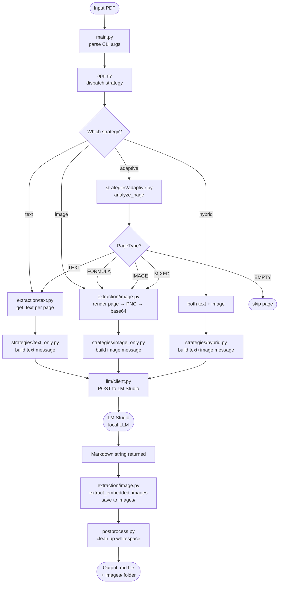

# Code Notes — PDF to Markdown Converter

A technical reference explaining what the system does, how the code is structured, and how the pieces fit together.

---

## What the system does

The system takes a PDF file as input and converts it into a structured Markdown file. It does this by sending each page through a large language model (LLM) running locally in LM Studio, which reads the page content and writes clean Markdown output.

The key idea is that **not all PDF pages are the same**. A page full of plain text needs a different approach than a page with a chart, a mathematical formula, or a scanned image. The system offers four strategies to handle this:

| Strategy | How it works |
|----------|-------------|
| `text` | Extracts raw text from the PDF, sends it to the LLM as plain text |
| `image` | Renders the whole page as a PNG, sends it to the LLM as an image |
| `hybrid` | Sends both the raw text AND the page image to the LLM together |
| `adaptive` | Analyses each page individually and automatically picks the best strategy |

The `adaptive` strategy is the **main thesis contribution** — it classifies each page before deciding how to process it, instead of applying one fixed approach to the whole document.

---

## System Architecture

```
┌─────────────────────────────────────────────────────────────────┐
│                        main.py (entry point)                    │
│  Parses CLI arguments → builds Config → calls app.run()         │
└────────────────────────────┬────────────────────────────────────┘
                             │
                             ▼
┌─────────────────────────────────────────────────────────────────┐
│                          app.py                                 │
│  Dispatches to the selected strategy for each page              │
│  After each page: extracts embedded images → saves to /images/  │
└──────┬──────────┬──────────┬───────────────┬────────────────────┘
       │          │          │               │
   "text"     "image"    "hybrid"       "adaptive"
       │          │          │               │
       ▼          ▼          ▼               ▼
┌──────────┐ ┌─────────┐ ┌────────┐  ┌─────────────────────────┐
│extraction│ │extraction│ │  both  │  │  strategies/adaptive.py │
│/text.py  │ │/image.py │ │        │  │                         │
│          │ │          │ │        │  │  analyze_page()         │
│get_text()│ │get_pixmap│ │        │  │  ├─ count images        │
│→ str     │ │→ base64  │ │        │  │  ├─ count vector paths  │
└────┬─────┘ └────┬─────┘ └───┬────┘  │  ├─ detect math symbols│
     │            │           │       │  └─ classify PageType   │
     └────────────┴───────────┘       │                         │
                  │                   │  TEXT   → text_strategy │
                  ▼                   │  FORMULA→ image_strategy│
     ┌────────────────────────┐       │  IMAGE  → image_strategy│
     │   strategies/          │◄──────│  MIXED  → image_strategy│
     │   text_only.py         │       │  EMPTY  → skip          │
     │   image_only.py        │       └─────────────────────────┘
     │   hybrid.py            │
     └────────────┬───────────┘
                  │  builds messages[] with text and/or base64 image
                  ▼
     ┌────────────────────────┐
     │   llm/client.py        │
     │                        │
     │  POST /chat/completions│──────► LM Studio (localhost:1234)
     │  ← Markdown string     │◄──────  (Qwen, Gemma, etc.)
     └────────────┬───────────┘
                  │
                  ▼
     ┌────────────────────────┐
     │   postprocess.py       │
     │   • fix line endings   │
     │   • collapse blank     │
     │     lines              │
     └────────────┬───────────┘
                  │
                  ▼
          output file .md
          images/ folder
```

---

## Full Pipeline — Step by Step



---

## File-by-File Reference

### Entry Points

#### `main.py`
The starting point. Reads the command-line arguments via `cli.py`, builds a `Config` object, and calls `app.run()`.

```
python main.py -i input.pdf -o output.md -s adaptive -n 10
```

#### `cli.py`
Defines all CLI flags:
- `-i` / `--input` — path to the PDF
- `-o` / `--output` — where to write the Markdown
- `-s` / `--strategy` — one of `text`, `image`, `hybrid`, `adaptive`
- `-n` / `--max-pages` — how many pages to process
- `-m` / `--model` — which LLM to use in LM Studio
- `-t` / `--temperature` — controls how creative/deterministic the LLM is (0.0 = deterministic)

---

### Core Orchestration

#### `app.py`
The main dispatcher. Runs the selected strategy for every page, then calls `extract_embedded_images()` to save any figures found on that page to disk as `images/page_XX_img_YY.png` and appends Markdown image links to the output. Once all pages are processed, calls `postprocess_markdown()` and writes the final file.

#### `config.py`
A simple `Config` dataclass holding all runtime settings (input path, output path, model, strategy, temperature, etc.). Also defines the `ADAPTIVE_*` threshold constants used by the page classifier.

#### `postprocess.py`
Cleans up the combined Markdown before saving: normalises line endings and collapses more than two consecutive blank lines.

---

### Extraction Layer (`extraction/`)

#### `extraction/text.py` — `extract_pages_from_pdf()`
Uses PyMuPDF's `page.get_text("text")` to pull the raw text layer from each page. Returns a list of strings, one per page. Fast and free (no LLM needed). Works well on digitally-born PDFs; produces garbage on scanned documents.

#### `extraction/image.py` — `extract_pages_from_pdf()`
Renders each page as a 2× zoom PNG using `page.get_pixmap()` and encodes it as a base64 string. This is what gets sent to the vision LLM for the `image`, `hybrid`, and `adaptive` strategies.

#### `extraction/image.py` — `extract_embedded_images()`
Separately extracts images that are *embedded* inside the PDF (figures, photos, charts) using `page.get_images()` and `doc.extract_image()`. Saves each one to `images/page_XX_img_YY.png` and returns Markdown links like ``. This runs for every strategy so images are always linked in the output.

---

### Strategy Layer (`strategies/`)

Each strategy function takes the extracted content and calls the LLM. They all return a Markdown string.

#### `strategies/text_only.py` — `text_strategy()`
Builds a simple chat message: `system prompt + user message containing the raw page text`. Sends to LM Studio. Best for clean text-heavy pages — fast and cheap.

#### `strategies/image_only.py` — `image_strategy()`
Builds a multimodal message with one or more base64 PNG images as `image_url` content blocks. No text layer is sent. Best for scanned pages, diagrams, and tables where the text layer is missing or unreliable.

#### `strategies/hybrid.py` — `hybrid_strategy()`
Combines both: sends the raw text AND the page image in the same message. The LLM can use the image for layout context and the text for accurate content. Generally the most accurate — but also the most expensive per page.

#### `strategies/adaptive.py` — `analyze_page()` + `adaptive_strategy()`

The core thesis contribution. `analyze_page()` inspects a `fitz.Page` object and returns a `PageAnalysis` with a `PageType` classification:

| PageType | Condition | Strategy used |
|----------|-----------|---------------|
| `TEXT` | ≥50 chars of text, no images, no formulas | `text_strategy` with `"text"` prompt |
| `FORMULA` | Math symbols / many short vector paths detected | `image_strategy` with `"formula"` prompt |
| `IMAGE` | More than 3 embedded images | `image_strategy` with `"diagram"` prompt |
| `MIXED` | Has images or formulas but not dominant | `image_strategy` with `"default"` prompt |
| `EMPTY` | <10 chars, no images, <5 vector paths | Skipped |

Detection heuristics used by `analyze_page()`:
- **Images**: `page.get_images()` count
- **Formulas**: count of short vector paths (`width < 20px`) via `page.get_drawings()` + regex scan for Unicode math symbols (∑ ∫ √ …) and LaTeX patterns (`\frac`, `_{...}`, `^{...}`)
- **Text length**: `page.get_text("text")` character count

---

### LLM Layer (`llm/`)

#### `llm/client.py` — `call_llm()`
A thin wrapper around `requests.post()`. Sends the message list to LM Studio's `/chat/completions` endpoint and returns `choices[0].message.content`.

#### `llm/prompts.py`
Stores all system prompts as a dictionary keyed by variant name. The adaptive strategy picks the right variant per page type:

| Variant | Used for | Key instructions |
|---------|----------|-----------------|
| `"default"` | text, image, hybrid strategies | General structure + formatting rules |
| `"text"` | Adaptive TEXT pages | Focus on re-joining split lines, recovering heading hierarchy |
| `"formula"` | Adaptive FORMULA pages | Convert all math to LaTeX (`$...$` / `$$...$$`) |
| `"diagram"` | Adaptive IMAGE pages | Describe diagram type + extract all labels and annotations |

---

### Evaluation Framework (`evaluation/`)

Used to run systematic experiments and compare the four strategies scientifically.

#### `evaluation/metrics.py`
Defines all comparison metrics between a reference Markdown (ground truth) and a candidate Markdown (LLM output):

| Metric | What it measures |
|--------|-----------------|
| `text_similarity` | SequenceMatcher ratio on normalised text |
| `heading_structure` | Match of heading counts per level (H1–H6) |
| `list_structure` | Match of bullet + numbered list item counts |
| `table_structure` | Match of Markdown table separator counts |
| `code_block_score` | Match of fenced code block counts |
| `paragraph_structure` | Match of paragraph counts (20% tolerance) |
| `word_overlap` | Jaccard similarity on word sets |

#### `evaluation/compare.py` — `run_experiment()`
The experiment runner. Takes a config (defined in a JSON file) that specifies which strategies, models, prompt variants, and temperatures to test. Runs every combination across every page and records an `EvaluationResult` (metrics + timing) for each run.

#### `evaluation/report.py` — `generate_full_report()`
Reads the results JSON and generates a Markdown report with:
- Strategy comparison table
- Model comparison table
- Strategy × Model matrix
- Per-page breakdown

---

### Reference Markdowns (`references/`)

Manually written "gold standard" Markdown files for pages 1–6, used as ground truth by the evaluation framework. Each file is named `page_001.md`, `page_002.md`, etc.

---

### Experiments (`experiments/`)

JSON configs for running experiments. Example (`sample.json`):

```json
{
  "name": "Sample Experiment",
  "input_pdf": "test.pdf",
  "reference_dir": "references",
  "strategies": ["text", "image", "hybrid", "adaptive"],
  "models": ["gemma-3-4b"],
  "prompt_variants": ["default"],
  "temperatures": [0.0, 0.2, 0.5],
  "max_pages": 6
}
```

Run with:
```bash
python evaluation/compare.py -c experiments/sample.json -o results.json
python evaluation/report.py -i results.json -o report.md
```

---

## How the Thesis Research Questions Map to the Code

| Research Question | Answered by |
|-------------------|-------------|
| RQ1 — Does adaptive outperform fixed strategies? | `strategies/adaptive.py` vs `text_only/image_only/hybrid` in `evaluation/compare.py` |
| RQ2 — How do the three fixed strategies compare? | `evaluation/compare.py` with `strategies: [text, image, hybrid]` |
| RQ3 — What are the computational costs? | `timing_ms` field in `EvaluationResult`; reported in `evaluation/report.py` |
| RQ4 — How to evaluate structured output quality? | `evaluation/metrics.py` — structural metrics beyond BLEU/ROUGE |
| RQ5 — Do results vary by document type? | Run experiments on different PDF categories, compare `by_page` in report |
