<!-- Page i -->


Technische Hochschule
mannheim

# A Human-in-the-Loop System for Research Paper Generation Using Local Large Language Models

Steven Schmitt

Bachelor Thesis
for the acquisition of the academic degree Bachelor of Science (B.Sc.)
Course of Studies: Computer Science

Department of Computer Science
Technical University of Applied Sciences Mannheim

2026-04-14

Tutors

Prof. Dr. Jörn Fischer, Technical University of Applied Sciences Mannheim
Prof. Dr. Thomas Ihme, Technical University of Applied Sciences Mannheim

---

<!-- Page ii -->

**Schmitt, Steven :**

Ein Human-in-the-Loop System zur Generierung von Forschungsarbeiten mittels lokaler großer – Sprachmodelle / Steven Schmitt. 

Bachelor-Thesis, Mannheim: Technische Hochschule Mannheim, 2026. 100 Seiten. 

**Schmitt, Steven :**

A Human-in-the-Loop System for Research Paper Generation Using Local Large Language Models / Steven Schmitt.

Bachelor Thesis, Mannheim: Technical University of Applied Sciences Mannheim, 2026. 100 pages.

---

<!-- Page iii -->

# Erklärung / Declaration

Hiermit erkläre ich, dass ich die vorliegende Arbeit selbstständig verfasst und keine anderen als die angegebenen Quellen und Hilfsmittel benutzt habe.

I confirm that the submitted thesis is original work and was written by me without further assistance. Appropriate credit has been given where reference has been made to the work of others.

Mannheim, 2026-04-14


Steven Schmitt

I agree that my work may be published, i.e. that the work may be stored electronically, converted into other formats, made publicly available on the servers of the Technical University of Applied Sciences Mannheim and distributed via the Internet.

This work is licensed under a Creative Commons “Attribution-ShareAlike 4.0 International” license.

---

<!-- Page iv -->

## Abstract

**_A Human-in-the-Loop System for Research Paper Generation Using Local Large Language Models_**

AI-based systems can generate complete research papers, but most reviewed systems are designed around cloud-hosted LLMs. This leads to usage costs, dependency on third parties, and privacy concerns. Previous work shows that human review of intermediate outputs consistently improves the quality of the final result. However, none of the reviewed systems combines fully local inference with a mechanism for human oversight. This thesis introduces a system that fills this gap. It automates the research process, including literature search, experimentation, and paper writing. After each phase, the system pauses so the user can review and improve the output. In a demonstration, the system generated a complete research paper in 43 minutes on consumer hardware, using only local models and without API costs. To test it in isolation, the system ran autonomously. The LLM made errors that the system could detect but not fix on its own. This suggests that human oversight is valuable when using smaller local models for automated research. 

## Abstrakt

**_Ein Human-in-the-Loop System zur Generierung von Forschungsarbeiten mittels lokaler großer Sprachmodelle_**

KI-basierte Systeme können vollständige wissenschaftliche Arbeiten generieren, jedoch sind die meisten untersuchten Systeme auf cloudbasierte LLMs ausgelegt. Das führt zu Nutzungskosten, Abhängigkeit von Drittanbietern und Datenschutzbedenken. Frühere Arbeiten zeigen, dass menschliche Überprüfung von Zwischenergebnissen die Qualität des Endergebnisses durchweg verbessert. Jedoch kombiniert keines der untersuchten Systeme vollständig lokale Inferenz mit einem Mechanismus für menschliche Aufsicht. Diese Arbeit stellt ein System vor, das diese Lücke füllt. Es automatisiert den Forschungsprozess, einschließlich Literaturrecherche, Experimenten und dem Schreiben der Arbeit. Nach jeder Phase pausiert das System, sodass der Nutzer die Ausgabe prüfen und verbessern kann. In einer Demonstration generierte das System eine vollständige wissenschaftliche Arbeit in 43 Minuten auf Consumer-Hardware, nur mit lokalen Modellen und ohne API-Kosten. Um es isoliert zu testen, lief das System autonom. Das LLM erzeugte Fehler, die das System zwar erkennen, aber nicht selbstständig beheben konnte. Dies spricht dafür, dass menschliche Aufsicht wertvoll ist, wenn kleinere lokale Modelle für die automatisierte Forschung verwendet werden. 

---

<!-- Page v -->

## Contents

- **List of Abbreviations** vii
- **List of Figures** viii
- **List of Tables** ix
- **Listings** x
- **Introduction** 1
- **Foundations** 3
- **Related Work** 5
  - Automated Research Systems 5
  - Failure Modes and Human-in-the-Loop Approaches 7
  - Research Gap 8
- **System Design** 10
  - Requirements 10
  - System Architecture 12
  - Human-in-the-Loop Strategy 14
  - Generation Process 17
    - Context Analysis 17
    - Literature Search 23
    - Hypothesis Generation 27
    - Experimentation 30
    - Paper Writing 33
    - Document Compilation 38
- **Implementation** 41
  - Paper Relevance Scoring 42
  - Automated Experimentation 43
  - Document Compilation 44
- **Evaluation** 46
  - Methodology 46
  - Requirements Verification 47
    - Setup 47
    - Results 48
  - System Demonstration 51
    - Topic Selection 51
    - Setup 52
    - Results 53
- **Discussion** 61
  - Interpretation of Results 61
  - Limitations and Alternatives 64
  - Implications 65
- **Conclusion** 68
- **Bibliography** xi
- **Generated Research Paper** xx

---

<!-- Page vi -->

---

<!-- Page vii -->

## List of Abbreviations

| Abbreviation | Definition |
|---|---|
| AI | artificial intelligence |
| API | application programming interface |
| CLI | command line interface |
| DOI | digital object identifier |
| GUI | graphical user interface |
| HITL | human-in-the-loop |
| LLM | large language model |
| MAD | mean absolute deviation |
| ML | machine learning |
| PDF | portable document format |
| RAG | retrieval-augmented generation |
| RAM | random access memory |
| SDK | software development kit |
| TUI | terminal user interface |
| UUID | universally unique identifier |
| VLM | vision-language model |
| VRAM | video random access memory |
vii

---

<!-- Page viii -->

## List of Figures

|1.1| Six-phase research pipeline |2|
|---|---|---|
|4.1| High-level system architecture |13|
|4.2| HITL interaction fow |16|
|4.3| Application start screen |18|
|4.4| Context analysis fow |21|
|4.5| Research context screen |22|
|4.6| Literature search fow |24|
|4.7| Literature search screen |27|
|4.8| Hypothesis generation fow |29|
|4.9| Hypothesis generation screen |29|
|4.10| Experimentation fow |31|
|4.11| Experiment plan screen |32|
|4.12| Experiment results screen |33|
|4.13| Paper writing fow |35|
|4.14| Paper draft screen |37|
|4.15| Document compilation fow |38|
|4.16| Result screen<br> |39|
|6.1| Generated frst-digit frequency comparison<br> |55|
|6.2| Generated MAD value comparison |56|
|6.3| Generated per-digit deviation heatmap |56|

---

<!-- Page ix -->

## List of Tables

|3.1| Comparison of automated research systems<br> |9|
|---|---|---|
|4.1| System requirements<br> |11|
|6.1| Requirement pass conditions |47|
|6.2| Test environment<br> |48|
|6.3| System component cost analysis<br> |50|
|6.4| Phase durations of the system demonstration |53|
|6.5| Generated Benford’s Law conformity test results |55|
|6.6| Section statistics of the generated paper<br> |58|

---

<!-- Page x -->

**Listings**

|4.1| Paper specifcation template<br> |18|
|---|---|---|
|5.1| Hypothesis response schema |42|
|5.2| Semantic similarity for paper ranking<br> |43|
|5.3| Subprocess execution with timeout recovery |43|
|5.4| LaTeX special character escaping |44|

---

<!-- Page 1 -->

# Chapter 1: Introduction

Systems that automate the scientific research process, including searching literature, generating hypotheses, running experiments and writing manuscripts, are no longer just concepts. Systems like data-to-paper [1], The AI Scientist [2] or Agent Laboratory [3] have demonstrated that large language model (LLM)-based pipelines can produce complete research papers. Yet, all reviewed systems except one rely on proprietary cloud services, which means that requests cost money and user data is sent to third parties. This limits accessibility for researchers without large budgets, creates a dependency on providers who can change pricing or terms at any time, and raises privacy concerns. 

Open-weight models offer a compelling alternative and are gaining popularity, with the most popular models having been downloaded millions of times.[1] These models can be downloaded and run locally by end users via software like LM Studio [4]. 

However, LLMs, regardless of type, hallucinate. They generate confident-sounding but factually wrong content [5], particularly when they lack access to relevant source material [6]. In automated research systems, this leads to errors like fabricated or wrongly attributed citations, or invented implementation details and experiment results [2, 3, 7]. Additionally, uncaught errors in early phases propagate and affect later phases [8]. In systems evaluated both with and without human oversight, adding review consistently improved output quality [1, 3, 9]. Many of the existing systems run fully autonomously, and the only reviewed system designed for local execution also does not provide a mechanism for human review between phases [10]. 

None of the reviewed systems combine fully local inference using general-purpose models with a mechanism for human oversight. 

This thesis introduces an automated research paper generator that runs entirely on local open-weight LLMs with a human-in-the-loop (HITL) strategy. It takes a research topic as input and produces a compiled research paper with generated experiments, figures and citations grounded in retrieved literature. As shown in Figure 1.1, the system divides the research process into six phases: context analysis, literature search, hypothesis generation, 

> 1 `https://huggingface.co/models?pipeline_tag=text-generation&sort=downloads` 

---

<!-- Page 2 -->

experimentation, paper writing and document compilation. After each phase, the system pauses to allow the user to review and edit the generated output before continuing.

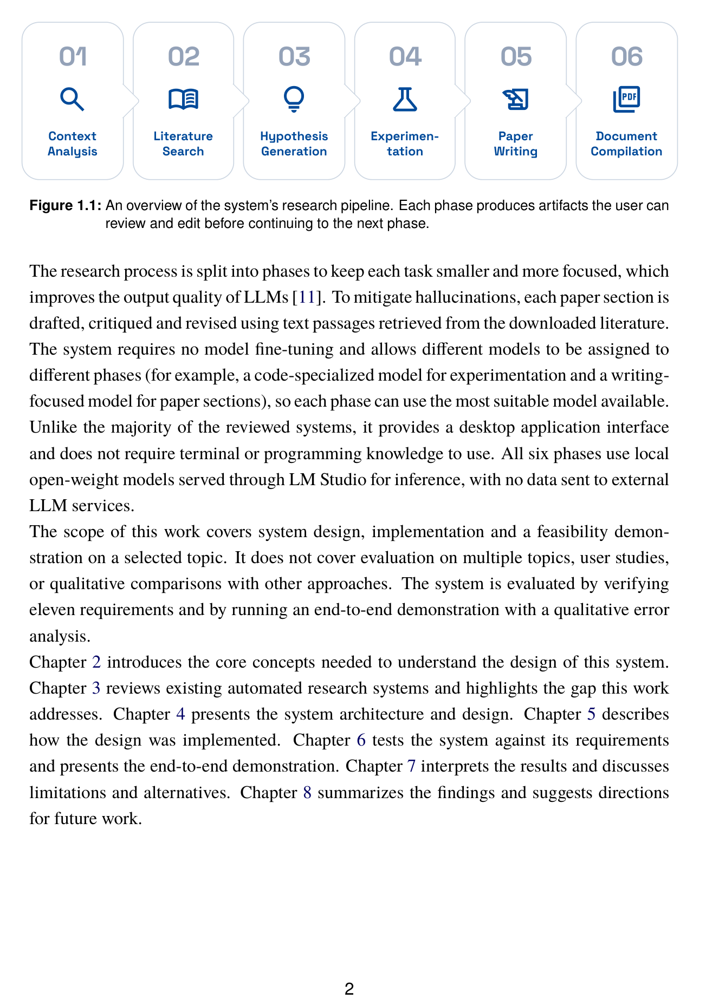
**Figure 1.1:** An overview of the system's research pipeline. Each phase produces artifacts the user can review and edit before continuing to the next phase.

The research process is split into phases to keep each task smaller and more focused, which improves the output quality of LLMs [11]. To mitigate hallucinations, each paper section is drafted, critiqued and revised using text passages retrieved from the downloaded literature. The system requires no model fine-tuning and allows different models to be assigned to different phases (for example, a code-specialized model for experimentation and a writing-focused model for paper sections), so each phase can use the most suitable model available. Unlike the majority of the reviewed systems, it provides a desktop application interface and does not require terminal or programming knowledge to use. All six phases use local open-weight models served through LM Studio for inference, with no data sent to external LLM services.

The scope of this work covers system design, implementation and a feasibility demonstration on a selected topic. It does not cover evaluation on multiple topics, user studies, or qualitative comparisons with other approaches. The system is evaluated by verifying eleven requirements and by running an end-to-end demonstration with a qualitative error analysis.

Chapter 2 introduces the core concepts needed to understand the design of this system. Chapter 3 reviews existing automated research systems and highlights the gap this work addresses. Chapter 4 presents the system architecture and design. Chapter 5 describes how the design was implemented. Chapter 6 tests the system against its requirements and presents the end-to-end demonstration. Chapter 7 interprets the results and discusses limitations and alternatives. Chapter 8 summarizes the findings and suggests directions for future work.

---

<!-- Page 3 -->

# Chapter 2: Foundations

This chapter provides a high-level overview of the core concepts needed to understand the system design presented in Chapter 4. It covers LLMs, embedding models, retrievalaugmented generation (RAG) and the HITL paradigm. The explanations focus on what is relevant to this work and do not aim to be exhaustive. 

**Large Language Models** LLMs are neural networks trained on large bodies of text [12]. They process text as a sequence of tokens, which are small chunks of text such as words or parts of words. Given such a sequence, an LLM predicts a probability distribution over the next token and samples from it to generate text [13]. This process of running an LLM to produce output is called inference. How the next token is picked from the distribution depends on the decoding strategy. Parameters like temperature and top-p control the randomness of sampling and allow the same model to produce predictable or more varied outputs [14]. A vision-language model (VLM) is a variant of an LLM. A VLM includes an encoder that converts images into numerical vectors which it can process besides text [15]. On a broader level, LLMs can be divided into two categories: proprietary models, whose weights are closed-source, and open-weight models, whose weights are publicly available, which allows end users to run them locally [16]. However, open-weight models generally score below the top proprietary models on standardized benchmarks [17]. Running an LLM locally requires enough memory to hold the model weights, either in video random access memory (VRAM), random access memory (RAM), or a combination of both [18]. Quantization reduces the memory a model consumes by compressing its weights to a lower numerical precision (for example, storing weights as 8-bit integers instead of 16-bit floats) at the cost of some accuracy [19, 20]. LLMs also have a fixed context window that limits how much text they can process in a single call. The performance of LLMs worsens in long multi-turn conversations, with the models losing coherence from one turn to the next [21]. Hallucination is another problem. LLMs may produce text that is fluent and plausible but factually wrong when they do not have access to relevant source material [6]. In automated research contexts, this problem manifests as citation inaccuracies and hallucinated experimental results [2, 7]. 

---

<!-- Page 4 -->

**Embedding Models and Semantic Similarity** An embedding is a numerical vector that represents the meaning of a piece of text [22]. The idea originates from the Word2Vec architecture, which showed that individual words can be mapped to vectors where semantically similar words end up close together in the vector space [22]. Modern embedding models extend this to full sentences and paragraphs to produce a single vector for an entire passage [23]. The similarity between two embedding vectors can be measured using cosine similarity, which quantifies how much two vectors align, regardless of their length [23]. A cosine similarity close to 1 implies the texts are semantically similar, and a value near or below 0 implies little relation. This allows comparing texts by meaning instead of matching keywords, for example, which can be helpful when different words express the same idea. 

**Retrieval-Augmented Generation** As described above, LLMs can hallucinate, particularly when not provided with relevant source material. RAG addresses this problem by retrieving relevant text from documents and injecting it into the prompt before inference [24]. RAG makes use of embeddings and semantic similarity. The original RAG pipeline consists of five steps [25]: 

1. **Chunking** : Documents are split into smaller text segments. 

2. **Embedding** : Each chunk is converted into an embedding vector. 

3. **Storing** : The embedding vectors are stored in a vector database for later retrieval. 

4. **Retrieving** : The system embeds the user’s query and retrieves the most similar chunks using cosine similarity. Optionally, a reranker can rescore the retrieved chunks to improve relevance [26]. 

5. **Injecting** : The original text of the selected chunks is added to the prompt as additional context before the LLM generates its answer. 

By grounding inference in real documents, RAG reduces the risk of hallucinations [25]. 

**Human-in-the-Loop** HITL is a term for interaction paradigms where humans are part of the learning or decision-making process of a machine learning (ML) system [27]. It aims to improve both accuracy and efficiency of ML systems while also making humans more effective [27]. How this paradigm is applied here is discussed in Chapter 4. 

---

<!-- Page 5 -->

# Chapter 3: Related Work

Since 2024, a growing number of LLM-based systems have attempted to automate the scientific research process [28]. This chapter provides an overview of these systems with a focus on three aspects relevant to this thesis: the degree of human involvement, the execution environment (cloud versus local) and the user interface. 

## 3.1 Automated Research Systems

data-to-paper [1], released in April 2024, was the first system to generate full research manuscripts automatically. Based on user-provided annotated datasets and metadata about them, it combines interacting LLM agents with programmatic information tracing and produces backward-traceable manuscripts where every numeric value links directly to the code that generated it. It supports both a fully autonomous mode and a copilot mode for human review after each step, though it requires annotated datasets as input and depends on cloud-hosted LLMs. 

Four months later, The AI Scientist [2] was released, which removed the dataset requirement. With a broad research direction and a human-authored code template, it generates ideas, executes experiments, writes a full LaTeX paper and evaluates the result without human intervention, at a cost of approximately $15 per paper. Its successor, The AI Scientist v2 [7], removed the dependency on code templates, introduced a parallelized tree search over experiment paths and added VLMs for evaluating generated figures. 

Agent Laboratory [3] takes a human-provided research idea and processes it through three sequential phases: a literature review phase that collects and analyzes papers from arXiv, an experimentation phase that uses HuggingFace datasets and Python, and a report writing phase that produces a LaTeX manuscript and code repository. It reports an 84% cost reduction compared to The AI Scientist. Unlike The AI Scientist, it is designed with optional human feedback between phases. 

Jr. AI Scientist [29] takes a different starting point and builds on a human-provided baseline paper. Based on a paper with its code, the system identifies limitations, proposes improve- 

---

<!-- Page 6 -->

ments and checks novelty via Semantic Scholar, and then implements changes across four parallel branches and improves them until they outperform the baseline. 

AI-Researcher [30] takes multiple reference papers as input and implements the research process using specialized agents. A knowledge acquisition agent searches for papers and repositories, a resource analyst translates concepts into mathematical formulas and code, and an idea generator proposes ideas through a divergent-convergent framework. A code agent then implements the selected idea with review from an advisor agent, and a writer agent produces the final manuscript. 

freephdlabor [31] is also a multi-agent framework, but with a star-shaped architecture. In this system, a manager agent coordinates other agents for tasks like ideation and writing, and decides the next action based on real-time findings instead of following a predetermined pipeline. Agents communicate through a shared workspace with reference-based messaging to reduce information loss when passing tasks between agents. 

EvoScientist [32] is another multi-agent framework built around three agents. It uses a researcher agent for idea generation, an engineer agent for implementation and an evolution manager agent that saves findings into persistent memory. An ideation memory saves promising and failed research directions, and an experimentation memory contains effective data processing and training strategies. This design is meant to allow the system to learn from its previous runs. 

Other systems treat the research process as an optimization problem. Double-Loop MultiAgent Collaboration (DLMA) [33] does this via two concurrent loops. In the leader loop, professor agents evolve a pool of research proposals by simulating structured meetings with an evolutionary selection mechanism that ranks proposals via an LLM review panel. In the follower loop, doctoral student agents implement the selected proposal and collaborate to gather context and to maintain consistency across steps. 

DeepScientist [34] also treats the research process as an optimization problem. It frames discovery as Bayesian optimization over a persistent findings memory. It is capable of running month-long campaigns that generate thousands of ideas to find a small number of validated results. 

Human-in-the-Loop Economic Research (HLER) [35] is specifically designed for empirical economics and social sciences. It coordinates seven agents for data auditing, profiling, hypothesis generation, data retrieval, econometric analysis, paper writing and automated review with checkpoints at hypothesis selection and publication approval. 

CycleResearcher [10] is special in the sense that it only uses open-weight local LLMs. It fine-tunes two open-weight LLMs via reinforcement learning for research and writing, and for simulated peer review. Once the models are trained, they run locally without any cloud application programming interfaces (APIs). CycleResearcher is the only reviewed system 

---

<!-- Page 7 -->

that uses only open-weight models, but this is just a side effect. Open-weight models were chosen because reinforcement learning requires trainable weights. The system also runs fully autonomously and does not provide a mechanism for human review between phases or steps. 

## 3.2 Failure Modes and Human-in-the-Loop Approaches

Evaluations of these systems show similar failure modes regardless of the architecture. In a case study of four autonomous research attempts, three failed during implementation or evaluation before finishing a paper [8]. It identified multiple failure modes. Code slowly drifts from the original plan. Long pipelines lose coherence as context degrades. Success is declared despite errors, which the authors call overexcitement. 

A systematic evaluation of 28 papers produced by five AI scientist systems concluded that the primary bottleneck in automated research is not idea generation but execution and verification [36]. When verification is poor, errors from one stage become inputs for the next and propagate until the generated paper describes something that was never actually tested. 

This problem is measurable in systems that have been evaluated both with and without human oversight. CodeScientist [9] is an automated discovery system that treats ideation and experiment design as a genetic search over combinations of research articles and code blocks. When run fully autonomously without human review, the rate of valid discoveries dropped from 12% to 2%. Analysis of the failed runs showed that implementations did not match the reported methods. These errors were invisible to the system’s own review process but apparent to a human reader. The creators of data-to-paper similarly report that fully autonomous runs could handle simple research goals, but as complexity increased, human review became important for maintaining accuracy [1]. 

Some of the reviewed systems responded to the described failure modes by integrating human oversight. The approaches can be grouped into gated systems, system-initiated review and interruptible systems. 

Gated systems stop the pipeline at specific points and require human approval before continuing. Data-to-paper [1] was the first to implement this approach via an optional copilot mode. In copilot mode, the user can inspect, comment on and request revisions of the output of each step through a desktop application. As complexity of the research goal increases, the authors found that this level of oversight becomes critical when trying to produce error-free manuscripts. Agent Laboratory [3] implemented a similar concept and optionally lets the user provide feedback after the literature review, experimentation and report writing stages. In autonomous mode, papers scored 3.5–4.0 out of 10 in a NeurIPS- 

---

<!-- Page 8 -->

style evaluation. The copilot mode raised the scores to 4.38. HLER [35] integrates two human decision gates, one at hypothesis selection and one at publication approval. The system automates tasks like data processing and drafting, but scientific decisions like choosing the hypothesis must be made by the human. 

System-initiated review lets the system decide when to request information from the user. EvoScientist [32] pauses for human approval before executing tools by default, and has an ask-user mode that lets the agent ask clarifying questions about the researcher’s preferences. Tool approval can be turned off for fully autonomous runs, and the ask-user mode assumes the system can reliably detect when it lacks information, which the paper does not evaluate. 

Interruptible systems run autonomously by default but allow the researcher to intervene at any point of the process. DeepScientist [34] uses a shared workspace that lets the user inspect files, edit code or redirect the plan through a web interface or terminal user interface (TUI). User messages are queued into an execution thread, so the system does not have to be stopped. freephdlabor [31] uses a workflow in which a central manager agent decides the next action based on real-time findings. Like DeepScientist, it uses a shared workspace. The user can pause the system at any point, provide feedback or inject knowledge and resume. Unlike gated systems, the intervention is not limited to predetermined checkpoints, so DeepScientist and freephdlabor offer high flexibility in when to intervene. However, errors may go unnoticed and propagate if the user does not monitor the entire process. 

Gated systems are the only one of the three categories that guarantee intermediate output is reviewed, since execution cannot continue without approval at each gate. 

## 3.3 Research Gap

Table 3.1 compares the reviewed systems including the one introduced in this thesis. None of the reviewed systems combines local LLM inference with phase-gated human oversight. Of the twelve reviewed systems, only CycleResearcher is built around local models, but it provides neither a HITL mode nor a graphical interface. The AI Scientist supports open-weight models such as LLaMA and DeepSeek, but only through cloud APIs (OpenRouter, DeepSeek API), which has the same cost and privacy concerns as proprietary models. data-to-paper [1] provides per-step human review through a desktop application but depends on cloud APIs for inference and requires annotated data as its starting point. Agent Laboratory offers optional human feedback via its copilot mode at three checkpoints, but gates are not used by default and the system depends on cloud APIs. The remaining HITL systems all depend on cloud APIs for inference as well. 

---

<!-- Page 9 -->

**Table 3.1:** A comparison of automated research systems. _Date_ refers to the initial submission date of the respective paper. _LLM Backend_ indicates whether the system is designed around cloud APIs or local models for inference. Several cloud-based systems use OpenAI-compatible APIs that could theoretically connect to local endpoints. The column reflects the intended and documented execution environment, not theoretical compatibility. _HITL Mode_ describes how human review is integrated into the workflow. _Interface_ describes the method by which the user interacts with the system.

|**System|Date|LLM Backend|HITL Mode|Interface**|
|---|---|---|---|---|
|data-to-paper [1]|2024.04|Cloud|None / Per-Step Gated|CLI / Desktop App|
|The AI Scientist [2]|2024.08|Cloud|None|Code Only|
|CycleResearcher [10]|2024.10|Local|None|Code Only|
|Agent Laboratory [3]|2025.01|Cloud|None / Per-Phase Gated|CLI|
|The AI Scientist v2 [7]|2025.04|Cloud|None|Code Only|
|AI-Researcher [30]|2025.05|Cloud|None|Code Only / Web App|
|DeepScientist [34]|2025.09|Cloud|Interruptible|TUI / Web App|
|freephdlabor [31]|2025.10|Cloud|Interruptible|CLI|
|DLMA [33]|2025.10|Cloud|None|N/A|
|Jr. AI Scientist [29]|2025.11|Cloud|None|N/A|
|EvoScientist [32]|2026.03|Cloud|None / System-Initiated|CLI / TUI|
|HLER [35]|2026.03|Cloud|Two Decision Gates|N/A|
|Proposed System|2026.04|Local|Per-Phase Gated|Desktop App|

Local LLM execution avoids several problems of cloud-based systems. For example, cost grows with API calls. The AI Scientist reports approximately $15 per paper [2], while a single successful finding in DeepScientist costs upwards of $175 in API calls alone, with total costs for the results presented in its paper reaching approximately $100,000 [34]. Cloud inference also requires sending prompts to third parties. Further, cloud providers could change pricing, rate limits or terms of service at any time, and if the service becomes unavailable, the system becomes unusable. 

No reviewed system combines strictly local inference with a phase-gated HITL strategy. The system introduced in this thesis addresses this gap. The following chapter describes its architecture and design decisions in detail. 

---

<!-- Page 10 -->

# Chapter 4: System Design

This chapter explains the design and architecture of the automated research paper generator. It is split into four parts: 

1. **Requirements** : The specific features and constraints the system is built around. 

2. **System Architecture** : The high-level structure of the system. 

3. **Human-in-the-Loop Strategy** : The interaction pattern enabling the user to review and correct the AI’s output. 

4. **Generation Process** : A detailed explanation of all phases, from the initial context analysis to the compilation of a PDF document. 

## 4.1 Requirements

The system’s requirements are based on two frameworks, the Volere Template [37] and IEEE 830 [38]. Only a selection of their elements was chosen to avoid excessive documentation for a single-developer project with a limited timeframe. These are unique identifiers, categorization, titles, and deterministic “shall” statements. This makes each requirement verifiable in the evaluation in Chapter 6. 

**Scope: System vs. Model** A known challenge in ML systems is distinguishing failures and behaviors stemming from the software architecture versus the artificial intelligence (AI) itself [39, 40]. This distinction is necessary for this work, because the quality of a generated research paper also depends on the intelligence of the specific LLM used, not just the system architecture. Therefore, the requirements only cover what the system does, not the quality of the AI’s output. For example, one functional requirement says the system must generate code, execute it, and save artifacts. It does not require the system to produce a scientifically valid experiment. This distinction makes it possible to test the system’s engineering with automated tests, instead of having to conduct qualitative, empirical or similar studies, which are out of scope for this work. 

---

<!-- Page 11 -->

**The Specification** All system requirements are listed in Table 4.1. They are categorized into three groups: functional requirements, non-functional requirements and constraints. 

**Table 4.1:** The table lists all eleven system requirements. The requirements are grouped into eight functional requirements, two non-functional requirements, and one constraint.

|**ID|Category|Title|Description**|
|---|---|---|---|
|FR1|Functional|Context Analysis|The system shall process user data to gener-|
||||ate a structured research topic defnition.|
|FR2|Functional|Literature Search|The system shall query external databases|
||||to retrieve and store metadata and full-text|
||||documents of research papers.|
|FR3|Functional|Hypothesis|The system shall derive a formal hypothesis|
|||Generation|from the provided context.|
|FR4|Functional|Experimentation|The system shall generate code, execute it,|
||||and save the execution artifacts (logs, plots,|
||||data).|
|FR5|Functional|Paper Writing|The system shall generate text sections that|
||||include citations referenced from the re-|
||||trieved literature.|
|FR6|Functional|Document|The system shall compile the generated|
|||Compilation|content into a PDF document.|
|FR7|Functional|Human-in-the-|The system shall persist each phase’s out-|
|||Loop|put, so the user can review and edit it be-|
||||tween phases.|
|FR8|Functional|Model Selection|The system shall allow the assignment of|
||||LLMs to specifc tasks (for example coding|
||||versus writing).|
|NFR1|Non-|Privacy|The system shall process all inference data|
||Functional||locally.|
|NFR2|Non-|Free Execution|The system shall perform all functions free|
||Functional||of charge.|
|C1|Constraint|Technology Stack|The system shall be implemented using|
||||Python (language), Tkinter (GUI), and LM|
||||Studio (inference engine).|

Functional Requirements define the intended behavior of the system [38]. The requirements FR1–FR6 mirror the standard scientific method [41] to produce a paper through the same steps a human researcher would follow: 

**Observation & Question:** The process begins with FR1 (Context Analysis) to define the research problem. 

---

<!-- Page 12 -->

- **Background Research:** The system then performs FR2 (Literature Search) to gather existing knowledge. 

**Hypothesis:** Based on this data, the system performs FR3 (Hypothesis Generation). 

- **Test:** The evaluation is handled by FR4 (Experimentation), where code is generated and executed. 

- **Conclusion:** Finally, the results are translated into a document via FR5 (Paper Writing) and FR6 (Document Compilation). 

FR7 (Human-in-the-Loop) requires the system to allow the user to review and edit the output at every single one of these stages. FR8 (Model Selection) allows switching between specialized LLMs for different tasks to improve the quality of the output. 

Non-Functional Requirements define the quality attributes of the system, rather than specific behaviors [42]. In this work, the focus for non-functional requirements is on data privacy and cost efficiency. NFR1 states that all inference data must be processed locally. NFR2 requires the system to run without inference or API fees by using open-weight models and free APIs only. 

Constraints define the technical boundaries of the project [43]. C1 restricts the implementation to a technology that was selected to run on consumer-grade hardware and is described in the following section. 

## 4.2 System Architecture

The system architecture combines local open-weight models with a phase-gated pipeline. LLMs are treated as interchangeable components, so the system does not depend on a specific model. The architecture splits the research process into smaller, isolated phases. Each phase reads its inputs from files, executes LLM calls, and writes the results to files. This avoids one single long conversation, which would worsen LLM performance over many turns [21]. As shown in Figure 4.1, the system is divided into four main logical blocks: the frontend, the backend, project data, and external services. 

**1. Frontend** The frontend is the interface of the application and is built with Tkinter, the standard graphical user interface library for Python [44]. It provides a screen for each phase of the pipeline. A settings screen lets the user configure the LLMs to use for each phase. Each phase screen shows the output of its phase, so the user can review and edit it before the next phase runs. This enables the user to catch errors the LLM made before they propagate into the next steps. The interface also allows the user to move back and forth between screens to improve outputs or run a specific phase again. For example, an error 

---

<!-- Page 13 -->

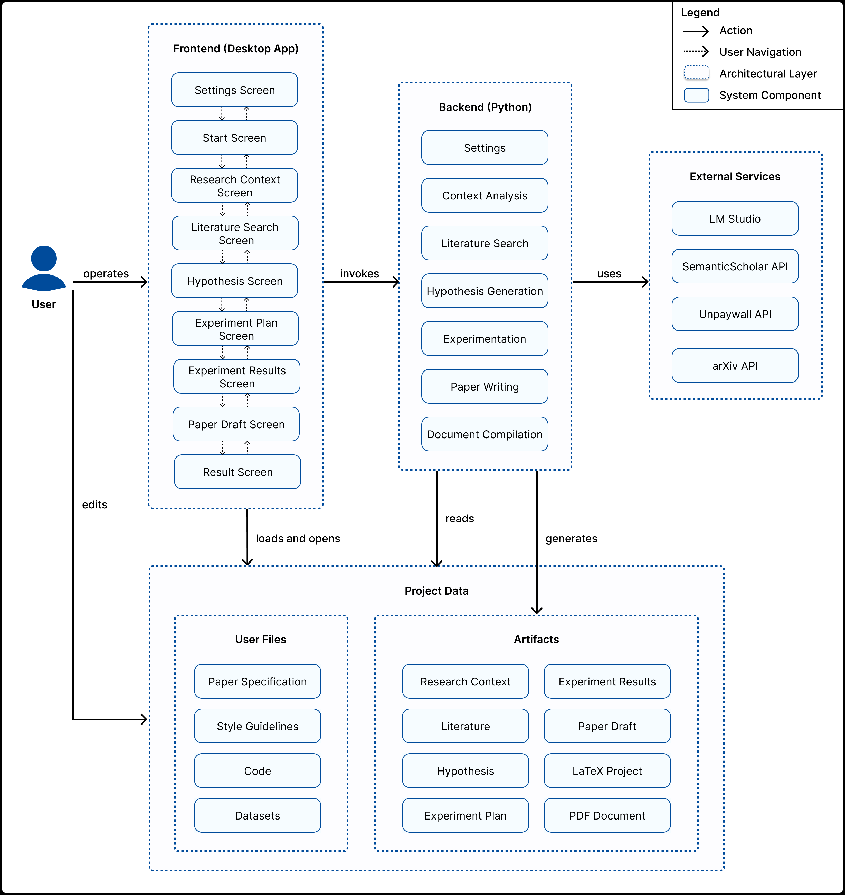
**Figure 4.1:** A high-level overview of the system architecture. The user interacts with the frontend, which calls backend modules. The backend reads and writes project data and calls external services for inference and literature search. Project data contains two types of files, inputs that only the user edits, and artifacts that were generated by the backend modules.

---

<!-- Page 14 -->

in the experiment phase may lead the user to return to the hypothesis screen and adjust it before trying again. 

**2. Backend** The backend contains the application logic. It is organized into separate Python modules, one for each of the six phases and one for the settings. The phase modules are stateless. Each one reads the current files from the Project Data, executes its specific task, and saves the result to one or more files. This keeps each prompt scoped to a single step of a phase. A shorter prompt gives the model a smaller, more focused task, which reduces the complexity of the generation. It also reduces the number of tokens the model has to process, which lowers the memory required for inference. 

**3. Project Data** The system stores all project data as plain text files in two directories. The user files directory holds the inputs provided by the user. A paper specification with the user’s topic is always required. Writing style guidelines, code, and datasets are optional. The artifacts directory contains all outputs generated by the system, for example literature metadata, an experiment script, or a paper draft. 

The user can open and edit any of these files with their preferred editor, so they can improve them if necessary. Because the full project state is saved on the user’s machine, the user can close the system after a phase and continue later without losing progress. 

**4. External Services** The system uses two types of external services. LM Studio[2] handles all LLM inference. It runs open-weight models locally and makes them available through a local API. 

The literature phase uses three public APIs. Semantic Scholar is used to search for relevant papers and their metadata [45]. Unpaywall is a database of legal open-access academic papers [46]. If Semantic Scholar does not provide a portable document format (PDF) link to a paper, the system queries Unpaywall to find a link to an open-access copy. arXiv is an open-access repository for preprints [47]. It is used as a second fallback if a PDF link also could not be found on Unpaywall. 

This separation keeps the user’s data private, but still provides access to external literature. 

## 4.3 Human-in-the-Loop Strategy

The system’s HITL strategy pauses the pipeline after each phase so the user can review and correct the output before the next phase starts. This section covers the motivation behind 

> 2 `https://lmstudio.ai/` 

---

<!-- Page 15 -->

this approach, the interaction flow between the user and the system, key design decisions, and their implications. 

**Motivation** The HITL strategy is motivated by known problems of running LLMs locally on consumer hardware. As explained in Chapter 2, the most powerful LLMs are proprietary and cannot be run by end users. The best open-weight models still rank below the top proprietary models on benchmarks [17], so local inference may produce lower quality results. 

Running an LLM locally requires enough memory to hold the model weights and the inference context [18]. The largest open-weight models have hundreds of billions of parameters, for example DeepSeek-V3[3] with 671 billion or Qwen3.5[4] with 397 billion. Their weights at half or full precision need hundreds of gigabytes or more of VRAM or RAM or a combination of both. At two bytes per parameter, DeepSeek-V3’s weights alone need around 1.3 TB of memory and Qwen3.5-397B-A17B’s around 800 GB. In practice, end users might be limited to smaller or quantized variants that fit on their hardware. While quantization at moderate levels (for example 8-bit) can preserve most of a model’s performance, it is a tradeoff that may reduce the quality of answers [19]. 

A further risk is error propagation. In a multi-stage research workflow, the output of each phase serves as the input for the next. If the model hallucinates and produces a factual error at an early stage, this mistake could carry over into all following phases [8]. LLMs cannot reliably self-correct such errors without external feedback [48]. 

A fully agentic pipeline was considered as an alternative design, where the model plans and executes all phases autonomously without any user intervention. This implies the need for reliable tool calling, where the model selects the correct tool with the correct parameters at each step. Models that end users can run locally might not support tool calling, and those that do cannot guarantee correct tool calls, since LLMs are probabilistic [14]. Each autonomous step would therefore be a new source of error on top of the error propagation risk described above. 

The system addresses these risks by pausing after each phase so the user can verify the output before the next phase runs. Since LLMs cannot reliably self-correct on their own yet, the user can take over that role. The result is a division of labor where the system generates the initial content and the user can check its correctness. 

**Interaction Flow** Figure 4.2 shows this division of labor between the user and the system. In this flow the system never just continues on its own. Every progression depends on the 

> 3 `https://huggingface.co/deepseek-ai/DeepSeek-V3` 

> 4 `https://huggingface.co/Qwen/Qwen3.5-397B-A17B` 

---

<!-- Page 16 -->

user's approval. If the output contains errors, the user can improve it in multiple ways. The first is to edit the artifact manually. The second is to trigger a regeneration, which re-executes the phase with the same inputs. A less obvious option is to modify the data the phase depends on. Since each phase uses the output from previous phases as context, regenerating the artifact with unchanged inputs might produce a similar result again. For the first phase, this means updating the paper specification and optionally the style guidelines, code or datasets. For all later phases, the user can turn back to a previous phase, adjust its output, and return to regenerate the current phase.

This is the core loop of this HITL system. A phase runs, the user reviews the result, and the next phase only starts when the user chooses to proceed.

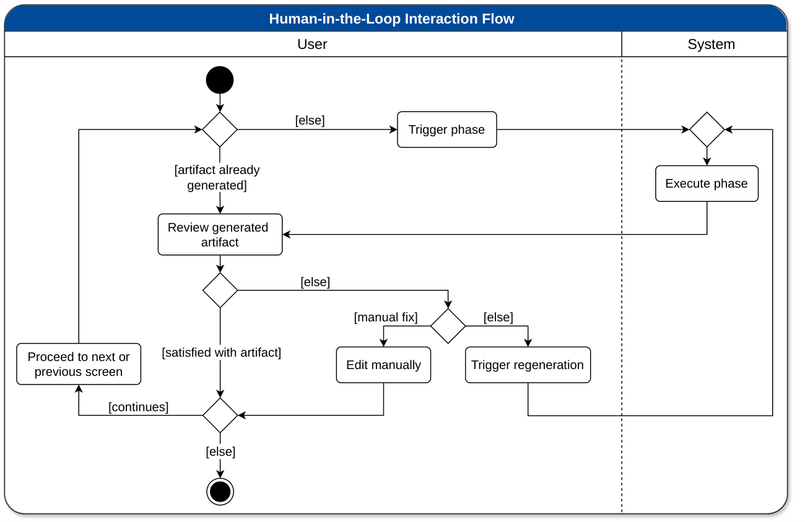
**Figure 4.2:** An activity diagram showing how the user and system interact. The activity diagram is divided into User and System swimlanes. The initial action depends on whether the artifact already exists ([artifact already generated]). If it was not generated yet, the user starts the process (Trigger phase) by opening its corresponding screen, and the system runs the phase (Execute phase). Both paths merge at the review stage. Requesting a completely new output (Trigger regeneration) loops back to the review stage. Alternatively, the user can fix the artifact themselves (Edit manually). Once satisfied with the result, the user can either continue (Proceed to next or previous screen) or stop the process.

---

<!-- Page 17 -->

**Design Decisions** The system’s HITL implementation is based on three main design choices: file-based artifacts, bidirectional navigation and traceability. 

The system uses files as the main interface between the user and the AI. Each phase produces a text file the user can inspect, edit, and approve before the next phase runs. This avoids the performance degradation LLMs experience when maintaining complex state over long multi-turn conversations [21]. Markdown is the core data format because it is human-readable, requires no special tooling, and lets the LLM write formatted text without complex parsing logic. Research data is stored separately from the application logic, so the user can edit any file in an external editor and resume the process without losing context. 

The bidirectional navigation lets the user move freely between phases. There is no guarantee that research is linear, since new findings might require rethinking earlier ideas, so the system supports navigation in both directions. The user can return to any earlier phase, update its output, and trigger a regeneration of the following phases. Old results are overwritten automatically, so there is no need to clean up old data manually. 

Lastly, this setup provides traceability. If the final result contains errors, it might be difficult to determine which step introduced them. By saving the output of every phase as a separate file, any generated content can be traced back to the exact step where it was created. 

## 4.4 Generation Process

This section explains how the system turns an initial research idea into a compiled PDF document. The process consists of six phases: context analysis, literature search, hypothesis generation, experimentation, paper writing and document compilation. 

This workflow implements the functional requirements defined in Table 4.1. Each phase handles one specific requirement (FR1 to FR6). Throughout the process, the system enables the user to verify the results (FR7) and keeps their data local (NFR1). The following subsections explain how each phase works, including its inputs, outputs and design choices. 

### 4.4.1 Context Analysis

The first phase turns the user’s initial ideas into a structured research context. Before the system can search for related literature, experiment, or write a paper, it needs an understanding of the user’s topic. 

---

<!-- Page 18 -->

#### User Inputs
The process begins at the application's start screen, shown in Figure 4.3. Here, the user can open the settings, edit the paper specification and the style guidelines file, and optionally upload code and datasets.

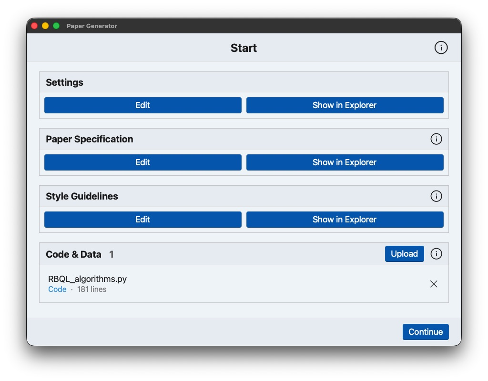
**Figure 4.3:** Start screen of the application, with options to open the settings, edit the paper specification and style guidelines, and upload code and datasets.

The only required input is the paper specification. This is a structured Markdown file that defines the research topic. It is divided into two parts. The first part captures general information, specifically the research topic and a hypothesis idea, which will be important for the later experimentation phase. The second part contains a header for each section of the paper, where the user can add specific instructions for that section, as shown in Listing 4.1.

1 # Paper Specification
2
3 ## General Information
4
5 ### Topic
6 ...
7 ### Hypothesis
8 ...
9
10 ## Section Requirements

---

<!-- Page 19 -->

```
1  ### Abstract
2  ...
3  ### Introduction
4  ...
5  ### Related Work
6  ...
7  ### Methods
8  ...
9  ### Results
10 ...
11 ### Discussion
12 ...
13 ### Conclusion
14 ...
15 ### Acknowledgments
16 ...
```

**Source Code 4.1:** Structure of the `paper_specification.md` template. The file is divided into a general information section for the main topic and hypothesis, followed by headers for section-specific instructions. 

Without this paper specification, the system has no basis for generating a research context. Structuring the specification by section gives the LLM a more focused prompt for each part of the paper. 

Besides the specification, the user can optionally define writing style guidelines and provide code and dataset files. The style guidelines are defined in a separate Markdown file. They enable the user to define, for each section, how long it should be, what writing style to use and how it should be structured. As with the paper specification, the file is structured in segments using headers for each section. The style guidelines are used for the paper writing phase to keep the generated text aligned with the user’s preferences. They are kept in a separate file because the paper specification is also used in earlier phases like context analysis and experimentation, where writing style is not relevant. 

Code and dataset files can both be added via the graphical user interface (GUI) and are used in two ways. During context analysis, the system reads them to gain a better understanding of the user’s research. For the experimentation phase, the LLM can import existing code directly and gets information on how to load each dataset from the generated load instructions. 

**Code and Dataset Analysis** Code files are analyzed by an LLM. For each file, it is instructed to generate a technical summary and extract important code snippets that implement core logic. The files are processed one by one to keep each prompt shorter and more 

---

<!-- Page 20 -->

focused, which in turn reduces complexity and the number of tokens the model has to process at once. 

Dataset files are analyzed programmatically. The system extracts column names, data types, row counts, and sample values from each dataset. It also generates a load instruction for each one. The result is a report the LLM can use to understand the dataset without having to load it into the prompt directly. 

**Generating the Research Context** The process begins with the user writing the paper specification and optionally providing style guidelines, code and datasets (see Figure 4.4). After triggering the automated context analysis, the system first loads and parses the paper specification. If code or datasets were provided, it enters a loop to process each file individually, until all files are analyzed and the data is merged. The system then generates the actual research context artifact. With the gathered information, it prompts an LLM to generate a research description and identify open questions. The final research context artifact consists of four components: 

- **Research Description:** The LLM processes the user’s data into a structured research description including the domain, research direction, problem definition and technical approach. 

- **Code Analysis:** The analysis generated from provided code files. If no code files were provided, this section remains empty. 

- **Dataset Descriptions:** The metadata reports generated from any provided dataset files. If no datasets were provided, this section also stays empty. 

- **Open Questions:** The LLM generates a list of open questions based on the research description and the code and dataset reports. 

**Design Decisions** Forcing the LLM to write a description of the user’s input acts as a test of its comprehension. If the system misunderstood the research topic, the user can edit the description or regenerate it with updated inputs. Second, the semantic similarity algorithm used in the following literature search phase is designed to compare dense, narrative texts. Translating the user’s raw Markdown text and files into a dense description meets this requirement. 

The optional code analysis step helps the system understand the user’s technical implementation, which is later reused for the experimentation phase. Open questions are generated for additional context for the literature search, where they are used to help the LLM generate more specific search queries. The open questions also show the user what the 

---

<!-- Page 21 -->

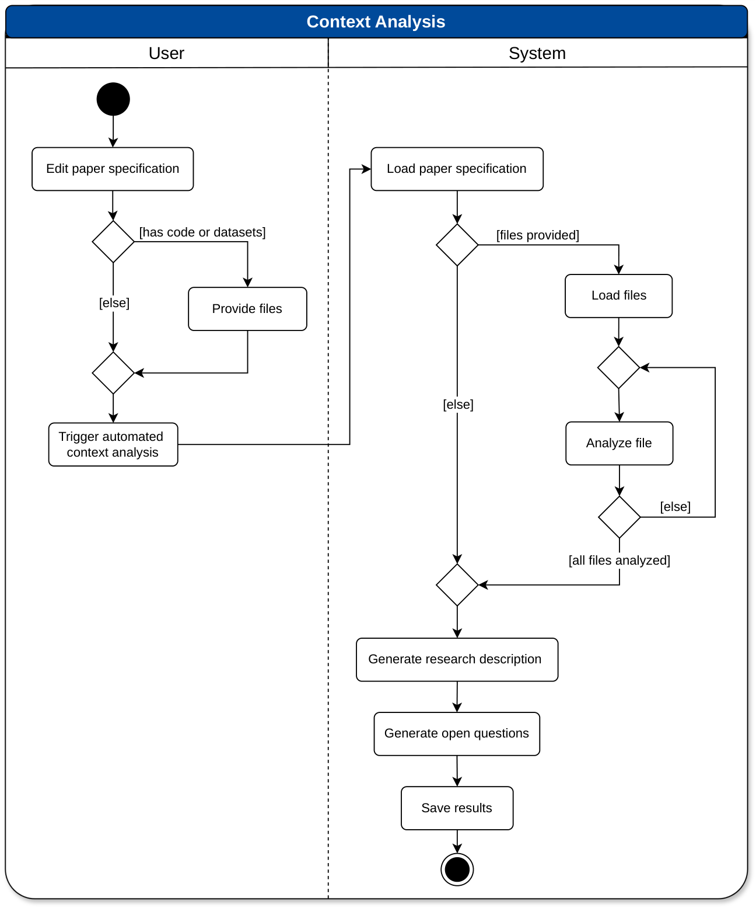
**Figure 4.4:** Context Analysis Flow. The activity diagram is divided into User and System swimlanes. The user writes the paper specification and optionally provides code and dataset files before triggering the analysis (Trigger automated context analysis). The system parses the specification and checks whether any files were provided ([files provided]). If present, it loads all files and analyzes them one by one (Analyze file) until all are processed ([all files analyzed]) and the results are merged. Finally, the system uses the data to generate a research description, identify open questions, and save the results.

---

<!-- Page 22 -->

system does not understand yet. It is a chance to address these gaps by updating the paper specification or editing the research context directly before continuing.

An alternative design would be to skip this phase entirely and have the user provide a dense research description, code and dataset descriptions manually. But this shifts more effort onto the user, which is in contradiction to the goal of automating the research workflow. Another alternative would be to skip the context analysis entirely and use the raw specification directly. Then the remaining phases would have no verified comprehension of the user's topic, and no guarantee for a dense description or identified gaps to support the literature search.

**Output and Review** The result of this phase is saved as a single Markdown document. The GUI then loads this file and presents it in the research context screen, shown in Figure 4.5.


**Figure 4.5:** The research context screen with its four sections: the paper description, the code analysis, the dataset descriptions, and open questions.

Following the HITL strategy, the process pauses here. The GUI shows the four components of the research context in separate boxes and allows the user to review each one independently. If the system misunderstood a concept or made a mistake, the user can open and edit the file directly. Users can click the "Open in Editor" button to launch their

---

<!-- Page 23 -->

default Markdown editor. Alternatively, the “Open in Explorer” button shows the file’s location in the operating system’s file manager, so the user can open it with a different tool or process it further. If the user updated the file in their editor, they can click the “Reload” button to refresh the GUI with the latest changes. Should they instead update the underlying paper specification or add code or datasets, they can use the “Regenerate” button. This allows the user to re-run the phase based on their new inputs, without needing to manually delete the outdated context file first. 

### 4.4.2 Literature Search

The purpose of this phase is to collect relevant literature for writing the paper. A literature review is a standard component of scientific work. It positions one’s own research within existing work, establishes the research gap, and grounds the paper’s claims in previous work [49]. LLMs tend to fabricate citations and misrepresent related work [50]. By providing the model with a curated list of papers for the writing phase, the system grounds generation in real, verifiable sources, which reduces the risk of hallucinations [24]. As shown in the activity diagram (Figure 4.6), the system provides two ways to gather this literature: a manual paper upload and an automated search pipeline. 

**Manual Paper Upload** As depicted on the `User` side of the diagram, the process starts with an optional manual paper upload. Users can upload PDF files of research papers they have on their computer. This step is not required, but it allows users to add papers they already know are relevant. An automated search might miss these specific papers, or be unable to download the full text if they are closed-access. If the user finds their uploaded papers are sufficient for generating their research paper, they can skip the automated search entirely and proceed to the next phase. 

**Metadata Extraction** If the user uploads their own PDF files, the system still needs to extract structured metadata from them. This is because the PDF file might not provide the required metadata (for example title or author names), which the system needs later to format citations and generate a complete bibliography. Internal PDF metadata is unreliable, since these fields might be empty or filled with wrong information. Instead, the system tries to identify the paper by querying the Semantic Scholar databases. It first tries to match the file’s name, checking if it is a standard paper identifier, like an arXiv ID. If the database cannot find a match, the system falls back to a visual approach. It extracts the raw text from the first page of the PDF file and prompts an LLM to identify the title of the paper. Once the LLM identifies the title, the system queries Semantic Scholar again to 

---

<!-- Page 24 -->

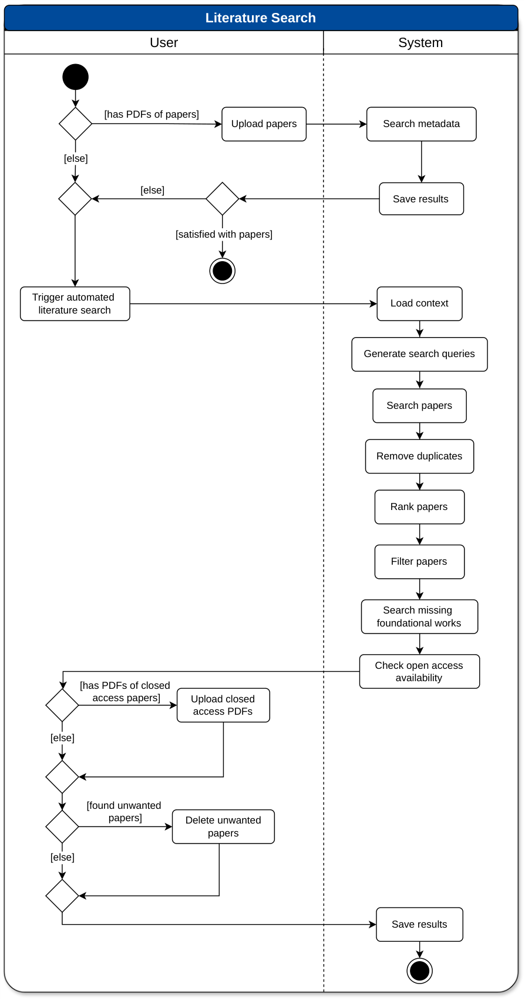
**Figure 4.6:** An overview of the literature search phase. It shows the optional manual paper upload and the automated search pipeline including query generation, database search, deduplication, ranking, filtering, and open-access availability checking.

---

<!-- Page 25 -->

retrieve the missing metadata. If a title could not be extracted, or the paper could still not be found, the user can edit the underlying metadata file directly. 

**Automated Literature Search** If the user wants to find new sources, either because they did not provide any papers themselves or want additional sources, they can trigger the automated literature search. Once triggered, the system executes a pipeline to retrieve and filter relevant academic papers. The pipeline starts by loading the previously generated research context. Based on this, an LLM generates search queries for retrieving papers from the Semantic Scholar databases. Afterwards, the search queries are executed programmatically using the Semantic Scholar API. Next, the system removes duplicates, ranks the papers by relevance, identifies missing foundational works and checks for open-access availability of the papers. The user can then review the retrieved papers, upload PDFs for closed-access papers and delete unwanted papers. The following paragraphs explain each of these steps in more detail. 

**Query Generation** This step generates specific search queries that retrieve relevant publications from the Semantic Scholar databases. An LLM is used to generate multiple queries across five different categories, instead of relying on a single broad search string. These categories are surveys, foundational theories, core methods, related work, and benchmarks. Each query category targets a different aspect of the research to reduce the chance that the search results are all about the same topic. 

**Deduplication and Ranking** These two steps remove duplicates in the papers and rank them by relevance. First, the system combines the search results with any papers the user uploaded. It then checks for duplicates by comparing the papers’ digital object identifiers (DOIs). If a DOI is missing, it falls back to comparing titles and lead authors. After removing any duplicates, the system scores each paper to determine its rank. The score determines which papers are kept or removed in the following filtering step. Three metrics are used to rank the papers: semantic similarity, citations per year and recency. The system measures how closely the content of a paper matches the research context generated in the previous phase. This is done by calculating their semantic similarity. The scoring system heavily favors how well a paper matches the research topic, since a paper that does not relate to the user’s research brings little value. Citation count and recency make up the remainder of the score, where more citations reflect recognition, and a higher recency score favors newer information. Prioritizing recent papers can also reduce the risk of using outdated information to generate the research paper. 

---

<!-- Page 26 -->

**Filtering** After calculating the scores, the system performs a filtering step. Text-based embeddings cannot capture how documents relate to each other [51], so papers from different fields that share the same terms, like “network” in neuroscience and computer science, can end up ranked as very similar. To catch these false positives, an LLM is used that compares the papers’ titles and abstracts with the research context. The verified papers are then combined with any user-provided papers into the complete literature list. 

**Missing Foundational Works** After the filtering process, the system checks the list of papers for missing foundational literature. The filtering mathematically prioritizes modern, state-of-the-art research that closely matches the specific context. It does not guarantee that seminal papers that defined the broader research field are included. To address this, the pipeline passes the current paper list to a language model and prompts it to identify foundational papers that are not in the list yet. From the author’s observation, LLMs tend to cite well-known foundational works, even when they are not in the prompt, with fabricated citation keys that do not correspond to any available paper. Providing these papers with their real citation keys helps to prevent this. 

**Open Access Availability** This step checks if the full text of the papers is freely downloadable. Papers without accessible text are excluded from the writing phase to prevent the LLM from generating ungrounded text. The system filters the papers to find the ones that report a closed access status or do not have a link to download them. For these papers, the system queries the arXiv and Unpaywall APIs. If one of the APIs returns a link to a PDF file of the paper, the system updates its metadata. This can help to resolve more missing links automatically, without having to rely on the user to provide the link or file manually. 

**Output and Review** The result of this phase is saved as a JSON file with data of all papers. The GUI loads this file and presents the papers in two sections, as shown in Figure 4.7. The interface splits papers into “Your Papers” and “Found Papers” from the automated search, so the user can start a new search without overwriting their uploaded papers. For each entry, the system displays the title, the publication year and the citation count. Papers that are closed-access or do not have a download link are handled specially. For these papers, the GUI provides an upload mechanism. The user can manually download the PDF document and upload it directly to the corresponding entry. If the automated search retrieves papers that the user finds irrelevant, they can remove them from within the GUI. 

If the user is satisfied with the literature, they can proceed to the next phase, the hypothesis generation. 

---

<!-- Page 27 -->

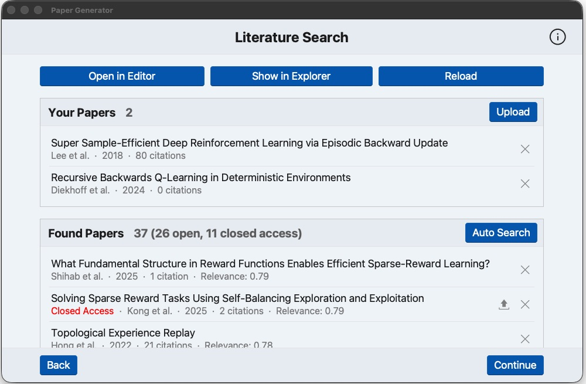
**Figure 4.7:** The literature search screen of the application. It features a section for user-provided papers and results of the automated search, including buttons for deleting unwanted papers and uploading closed-access papers.

**Download and Conversion** When the user proceeds to the next phase, the system downloads and converts the papers before continuing with the hypothesis generation. This step is only executed when the user decides to continue, so the system only processes papers that survived the user’s review. Downloading and converting papers before the review would waste time for papers the user later removes.

The system checks which papers need processing and separates them into two groups: open-access papers that have a PDF link but no downloaded file yet, and papers that already have a PDF file but have not been converted to text. For the first group, the system tries to download each PDF file with the available link. If a download fails, the paper is treated like a closed-access paper, so the user can provide the file manually.

After the downloads are finished, the system converts each PDF to Markdown, so the content of a paper can be passed as text to an LLM. These texts will be used for the writing phase to ground the LLM in real literature.

### 4.4.3 Hypothesis Generation

The hypothesis generation is the shortest of the six phases and converts the user’s specification and the research context into a structured, testable hypothesis. If the user provides

---

<!-- Page 28 -->

information for the hypothesis in the paper specification, the LLM refines it. Otherwise, it produces a new hypothesis based on the research context. 

The hypothesis guides data collection and the overall research design [52]. A research project can fail if its hypothesis is poorly focused and underdeveloped [52]. The hypothesis defines what the experiment tests and gives the generated code a measurable target. Besides the hypothesis itself, success criteria are defined before experimentation to prevent the model from changing its evaluation logic after seeing the results. This mirrors a problem called Hypothesizing After the Results are Known, which reduces the reliability and validity of research results [53]. 

For these reasons, and following the scientific process outlined in Section 4.1, the system produces a formal hypothesis and success criteria before running any experiment code. 

**Generation Process** As shown in Figure 4.8, the phase begins by loading the research context and the user’s paper specification. The system combines these inputs into a single prompt and queries a local LLM to generate a structure with three elements: the hypothesis itself, a logical justification (rationale), and indicators to determine if the hypothesis is supported after experimentation (success criteria). The rationale field in the hypothesis object requires the model to produce intermediate reasoning steps before the hypothesis itself, which has been shown to improve the quality of language model outputs [54, 55]. The rationale also helps the user verify if the generated hypothesis aligns with their research idea. 

**Constraints** The system instructs the model to never invent quantitative targets like “10x faster” or “reduces error by 20%”, since generating specific numbers before running experiments is speculation. Vague qualitative claims like “shows improved convergence” are also forbidden, as they are unfalsifiable without a reference point. The prompt instead says to express success with a relational pattern: relative comparison against a baseline, statistical significance of an improvement, component ablation, or binary existence of a capability. If the user’s paper specification already contains concrete numeric targets, the model may use them directly. 

**Output and Review** Once the hypothesis is generated, the system saves it as a Markdown file. The user interface loads this file and displays the description, rationale, and success criteria in separate sections for review, as shown in Figure 4.9. If the user is not satisfied, they can edit or regenerate the hypothesis. If the user approves the hypothesis, they can proceed. 

---

<!-- Page 29 -->

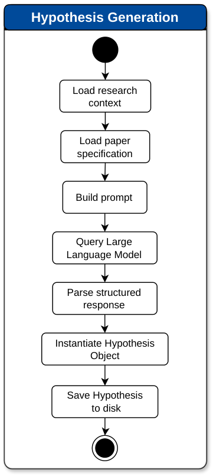
**Figure 4.8:** The activity diagram shows the hypothesis generation pipeline. The system first loads the research context and the paper specification. It then builds a prompt from these inputs and queries a local LLM. The structured response is parsed into its three components (description, rationale, success criteria). With that, the system instantiates a Hypothesis object and saves it to disk as a Markdown file.

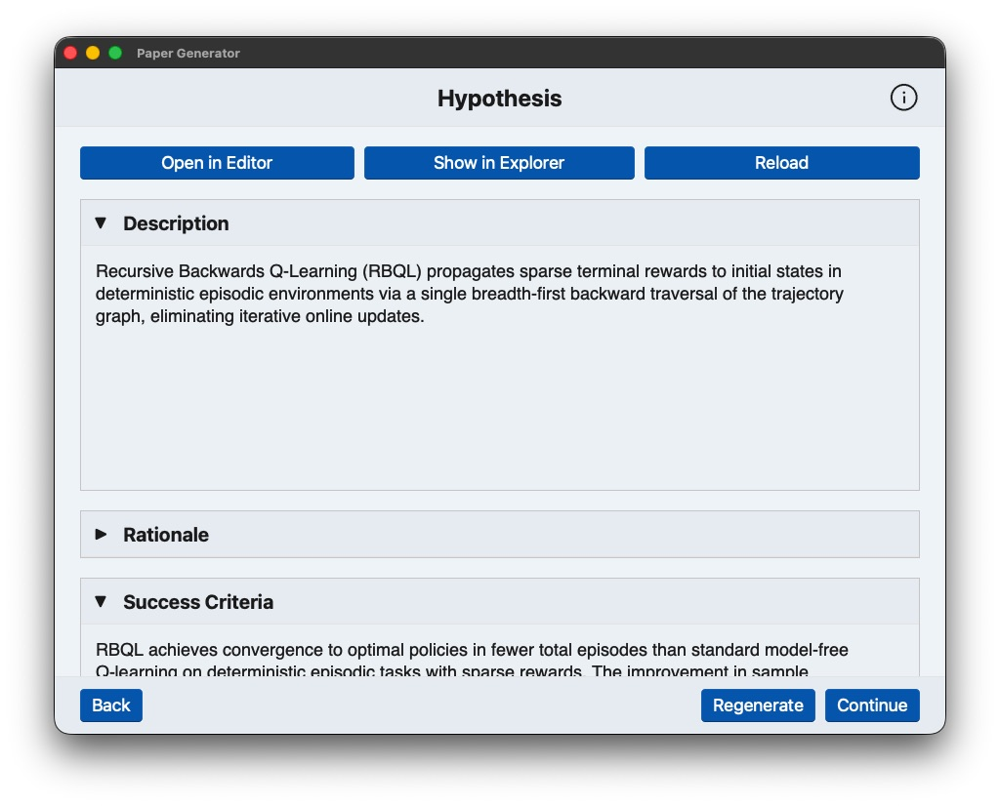
**Figure 4.9:** The hypothesis generation screen showing the structured hypothesis with separated sections for description, rationale, and success criteria.
29

---

<!-- Page 30 -->

### 4.4.4 Experimentation

The experimentation phase translates the hypothesis into code, runs it and evaluates the results. The phase is split into two stages: the system generates an experiment plan first, then it generates and runs the code. This separation gives the user a checkpoint between the design and execution of the experiment, shown as the review plan action in Figure 4.10. Since generating, executing, and processing the experiment results might take several minutes, the plan review lets the user catch problems before starting this process. 

If the user provided code or datasets, the LLM is instructed to integrate them into the plan. The plan must also enforce headless execution. Generated experiments must not open any graphical windows, to save the computational costs of rendering their frames. By running the code headlessly, the system uses all available resources for the computation. 

**Code Generation and Error Fixing** Once the user approves the plan, the system translates it into a Python script. If there are code or dataset files, they are copied into the experiment directory so the generated script can import them directly as modules. This avoids duplicating the user’s existing logic and reduces the chance of the model introducing errors by rewriting it. 

The generated script is then executed automatically. If the code fails with an error, the system enters a fix loop. It sends the error output and the broken code back to the local LLM, which is tasked to write an improved version. 

Self-repair quality depends on the model’s ability to understand its own errors, and gains diminish after a few iterations, particularly for smaller models [56]. Therefore, the system only allows a fixed number of self-repair attempts and marks the results as inconclusive if the code still fails. 

**Results Validation** A successful execution of the code does not guarantee that the results are scientifically meaningful. The code might produce invalid numbers, have wrong algorithms, or fail to generate output files. To catch these problems, the system runs a validation step after each successful execution. 

An LLM is prompted with the code, execution output, hypothesis and experiment plan. It checks whether the results appear valid and match what the experiment was supposed to measure. The system also checks generated plots with a VLM, which inspects each plot for errors like missing labels, empty graphs, overlapping text or missing legends. If validation fails, the system sends a description of the issues back to the model, which is tasked to improve the code. The same retry limit as for the error fixing is used here. 

---

<!-- Page 31 -->

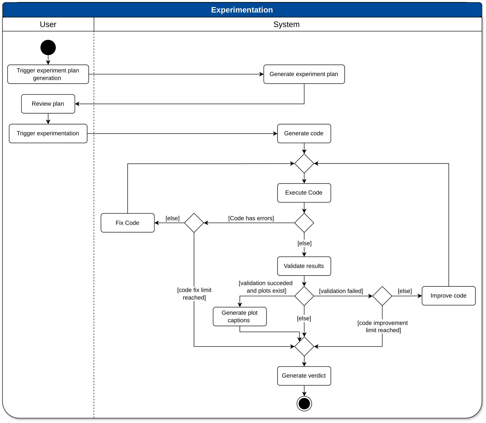
**Figure 4.10:** An overview of the experimentation phase. First, the user triggers the experiment plan generation and reviews it. After triggering the experimentation, the system generates and executes experiment code. If execution errors occur, the system enters a fix loop until the code runs or the fix limit is reached. Successful execution leads to the results validation. If validation fails, the system improves the code and executes it again until the improvement limit is reached. If validation succeeds and plots were created, captions are generated. All paths merge at the final verdict generation step, where it is evaluated if the hypothesis is supported or not.

---

<!-- Page 32 -->

**Plot Caption Generation** The system generates a caption for each figure that was created during the experiment. A VLM receives each plot image along with the hypothesis and experiment output, and is prompted to describe what the figure shows. The captions are stored with each plot and passed to the writing phase, to prevent the writing model from inventing plot contents it cannot see.

**Verdict Generation** After caption generation, the model determines whether the hypothesis is supported, not supported, or if the results are inconclusive. It receives the hypothesis, the execution output, the plot captions, and any validation warnings, and evaluates whether the success criteria are met. The verdict generation is separated from paper writing to reduce the complexity for the writing model. It also gives the user a summary of the results. The verdict, its reasoning, and all experiment artifacts are saved to a result object, which the paper writing phase loads as one of its inputs.

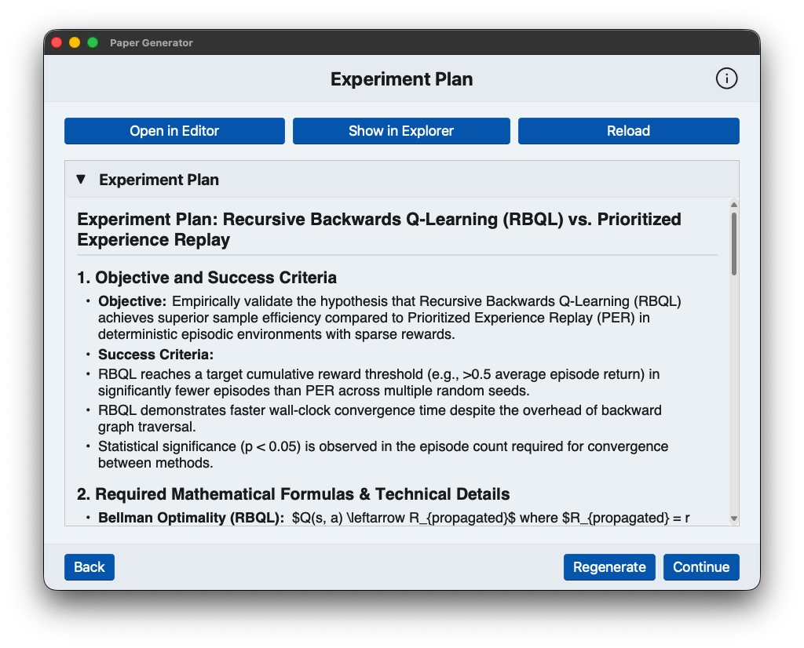
**Figure 4.11:** Experiment plan screen displaying the generated plan with options to regenerate, edit, or proceed to the previous or following screen.

**Output and Review** The experimentation phase is split into two screens. Figure 4.11 shows the first screen for the experiment plan. The user reviews the plan and decides

---

<!-- Page 33 -->

whether to proceed, regenerate it, or edit it manually in an external editor. Code generation and execution begin only after the user approves the plan.
The second screen, shown in Figure 4.12, presents the experiment results. It displays the verdict with the model's reasoning at the top, followed by the generated code and any produced figures. The user can open the code in an external editor, re-execute it from the interface, or regenerate the entire experiment.

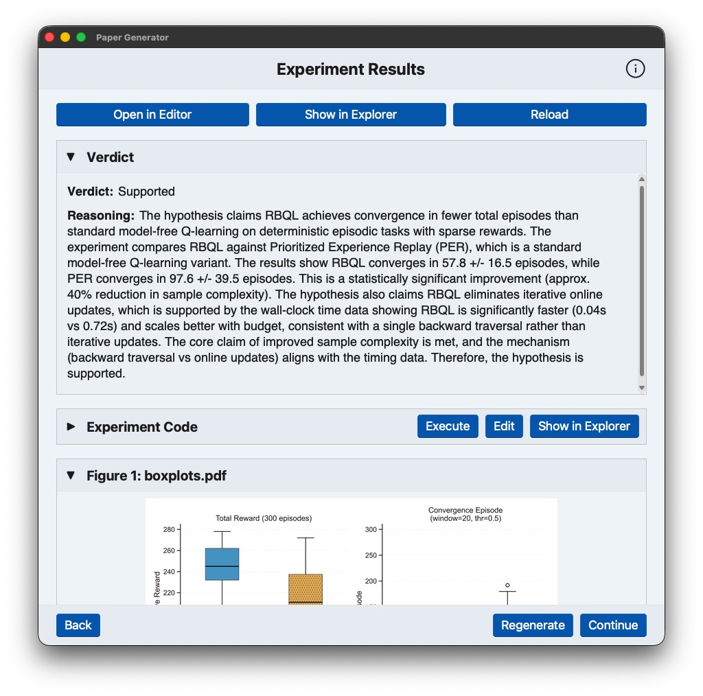
**Figure 4.12:** The experiment results screen displaying the verdict, generated experiment code and figures.

### 4.4.5 Paper Writing

This phase turns the gathered project data into a draft. The system writes each section of the paper one by one and then assembles them into the final Markdown document. Writing sections separately reduces the complexity of each generation step, which has been shown to improve LLM output quality [11], and also keeps the prompt shorter to stay within the model's context window. Each section is generated with a four-step pipeline

---

<!-- Page 34 -->

that drafts a first version, critiques it, retrieves supporting passages from the full text of the collected papers, and rewrites the section using the critique and retrieved evidence. A vector index makes the collected papers searchable for the retrieval step. Figure 4.13 shows the simplified activity diagram for this process. The following paragraphs describe this process in more detail. 

**Inputs** The system requires five inputs to generate the draft: 

1. **Paper Specification:** The user’s specification file with its instructions for each section. 

2. **Research Context:** The dense topic description from the context analysis phase. 

3. **Literature:** The collection of papers from the literature search phase. 

4. **Hypothesis:** The hypothesis generated in the hypothesis generation phase, which the experiment tested. 

5. **Experiment Results:** The code, execution output, plots and verdict from the experimentation phase. 

Two additional inputs are optional. The style guidelines file is for providing formatting or writing guidelines for each section of the paper. If the user specified a title for the paper in the application settings, the system uses it as additional context. Otherwise, the system automatically generates a title at the end of the phase. 

**Paper Indexing** The writing phase starts with the paper indexing step. The system builds a searchable vector index over the full text of all collected papers. The retrieval step, which will be explained later, queries this index with the critique’s suggestions and returns the most semantically similar chunks. The system splits the Markdown text of each available paper into similarly sized chunks. Each chunk overlaps with its neighbors so that no concept is cut between two chunks [57]. Then, the system computes the vector embeddings for every chunk with an embedding model. Lastly, the indexed chunks are saved to disk with their text, vector embeddings and a reference to the paper they belong to. 

**Section Writing Order** The system writes the paper sections in a fixed order. The order is: methods, results, discussion, related work, introduction, conclusion, and abstract. Methods and results are written first, because they follow directly from the experiment setup and data [58]. Discussion and introduction need those findings to frame the work and are written next [58]. Related work is written between the discussion and introduction, so the system can compare existing approaches with the experiment’s results. The conclusion and abstract are last, since they summarize content that needs to already exist. 

---

<!-- Page 35 -->

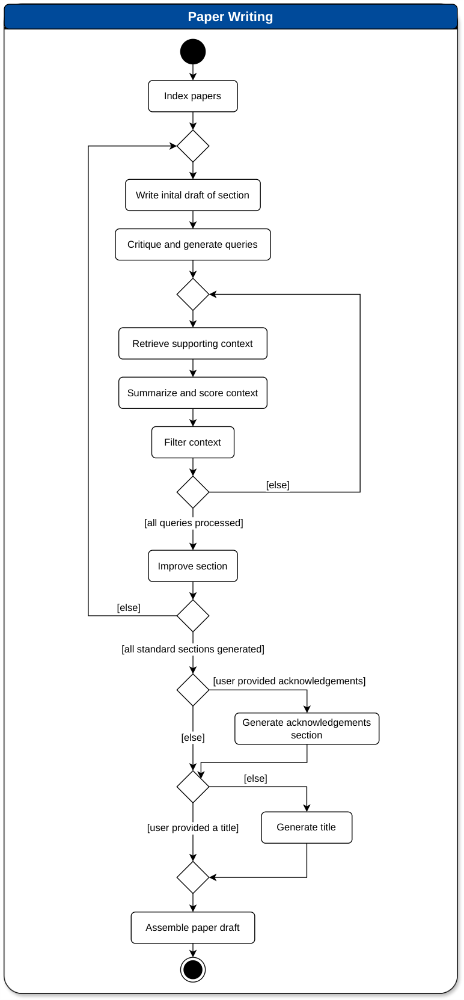
**Figure 4.13:** Activity diagram of the paper writing phase. The process begins by indexing papers, followed by a four-step loop that drafts, critiques, retrieves evidence, and rewrites each paper section. Lastly, the system generates the title, if not provided by the user, optionally formats any provided acknowledgements, and builds the complete draft.

---

<!-- Page 36 -->

Each written section is appended to the prompt of the next, so the model can build on the content of the previous sections. The discussion prompt, for example, includes the methods and results text. Each prompt also includes an overview of the structure of the paper, to reduce the chance of the model writing about content that belongs to another section. 

**The Draft-Critique-Retrieve-Improve Pipeline** The main sections of the paper are written using a pipeline consisting of four steps. This pipeline is based on the PaperQA algorithm [59], which implements question answering of scientific papers as retrieval, chunk summarization, and text generation steps. PaperQA matches the accuracy of human researchers and produces no hallucinated citations, compared to rates of 40–60% in other LLMs. 

The first step generates an initial draft of a section. It uses a prompt that includes the title, abstract, conclusion, and citation key of every available paper. Abstracts and conclusions are chosen because it is expected that they contain each paper’s main contribution and findings. More specific text passages are retrieved in the third step. The LLM is instructed to only use the provided citation keys when citing, to prevent the model from hallucinating references to nonexistent or unverified papers. The prompt also includes the requirements from the paper specification, research context, experiment results, previously written sections, and, if provided, style guidelines and paper title. 

In the second step, an LLM in the role of a critic analyzes the text. A separate critic step has been shown to reduce errors in LLM outputs [60]. The critic returns suggested improvements and search queries for claims that lack citations or where additional evidence from the literature could improve the text. For example, if the critic finds an unsupported claim about LLMs reducing hallucinations, it might generate the query “Large language models can reduce hallucinations through self-correction”. After the critique generation, the system programmatically extracts every citation key in the drafted text. Any citation key not in the paper collection is flagged as hallucinated, and will be added to the rewriting prompt with instructions to remove them. 

The third step executes the generated search queries with the paper index to retrieve relevant text passages. For each query, the system does a vector search by comparing the embedded query with the chunk embeddings via cosine similarity and selects the most similar chunks. The system then sends them to an LLM to summarize and rerank them. The model scores each chunk’s relevance from zero to one relative to the original query and the section being written. Summaries of the highest scored chunks will be added as additional context to the following rewriting step. This retrieval step is skipped for the abstract or conclusion, as they are used to summarize existing content. 

---

<!-- Page 37 -->

In the fourth step, the section is rewritten with the critic’s feedback and retrieved text passages. Besides the feedback and retrieved text, the prompt includes the initial draft and the same context used for the initial draft. The output of this step replaces the initial draft and is the text the user will be able to review.

**Title, Acknowledgements and Assembly** Once the seven standard sections are written, the system handles the optional parts. If the user provided acknowledgements in the paper specification, the system formats them into academic prose with an LLM. If the user did not specify a title in the application settings, the system generates a title based on the complete draft. The system then builds a single data structure with the title, all sections and optionally acknowledgements. This final draft is saved as a Markdown document. Additionally, the system saves the writing prompts of each section for transparency and reproducibility.

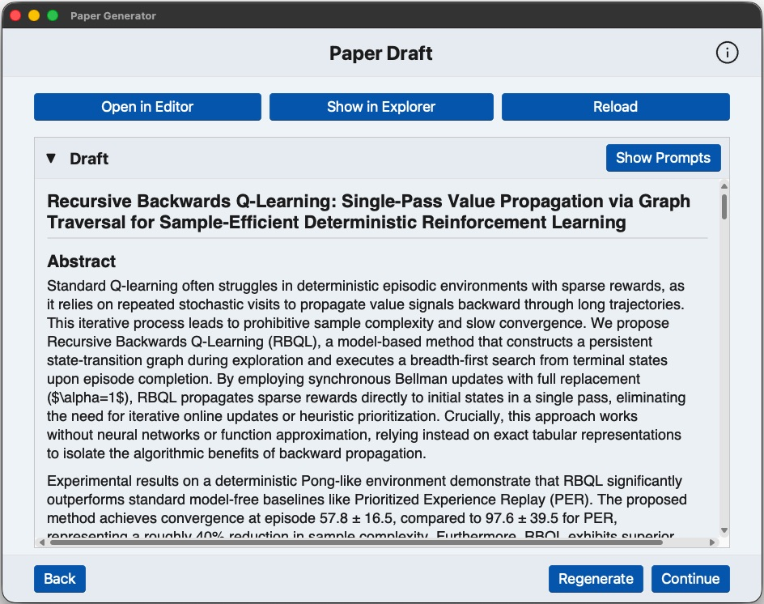
**Figure 4.14:** The paper draft screen showing the full text generated during the writing phase. Unique to this screen is a button that opens the writing prompts screen, where the user can view the exact prompts used for each section.

**Output and Review** The application’s GUI loads the Markdown file of the draft and displays its full text, shown in Figure 4.14. Users can review the text, edit the Markdown file, or trigger a full regeneration. If the user is satisfied, they can proceed to the final document compilation phase.

---

<!-- Page 38 -->

### 4.4.6 Document Compilation

This phase converts the Markdown draft into a PDF document. Figure 4.15 shows a simplified overview of this process. The following paragraphs explain each step in detail.

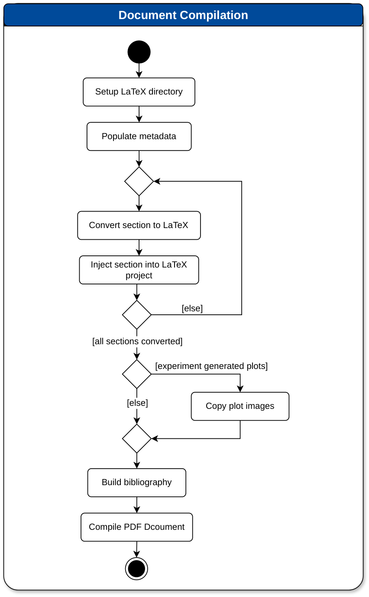
**Figure 4.15:** Activity diagram of the document compilation phase. The process first sets up a LaTeX directory and populates the metadata. It then loops over paper sections, converting them to LaTeX code and injecting each into the project. Finally, it copies any experiment plots, builds the bibliography, and compiles the final PDF.

---

<!-- Page 39 -->

**Project Setup** The system supports LaTeX templates, which are directories of style and layout files that define the PDF formatting, plus a Makefile to compile. Users can select templates in the application settings. The system copies the selected template directory as the base project structure at the beginning of the phase. Each template contains a main .tex file with placeholders that mark where the system injects the generated content, including the title and author block.

**Markdown to LaTeX Conversion** The writing phase produces Markdown instead of LaTeX directly, because LLMs frequently make formatting and package errors when generating LaTeX code [61]. This separation means that the writing model only needs to focus on the content, and the conversion model only needs to handle the LaTeX formatting, which simplifies both tasks. After a section is converted, the system replaces its placeholder inside the LaTeX project with the section’s code.

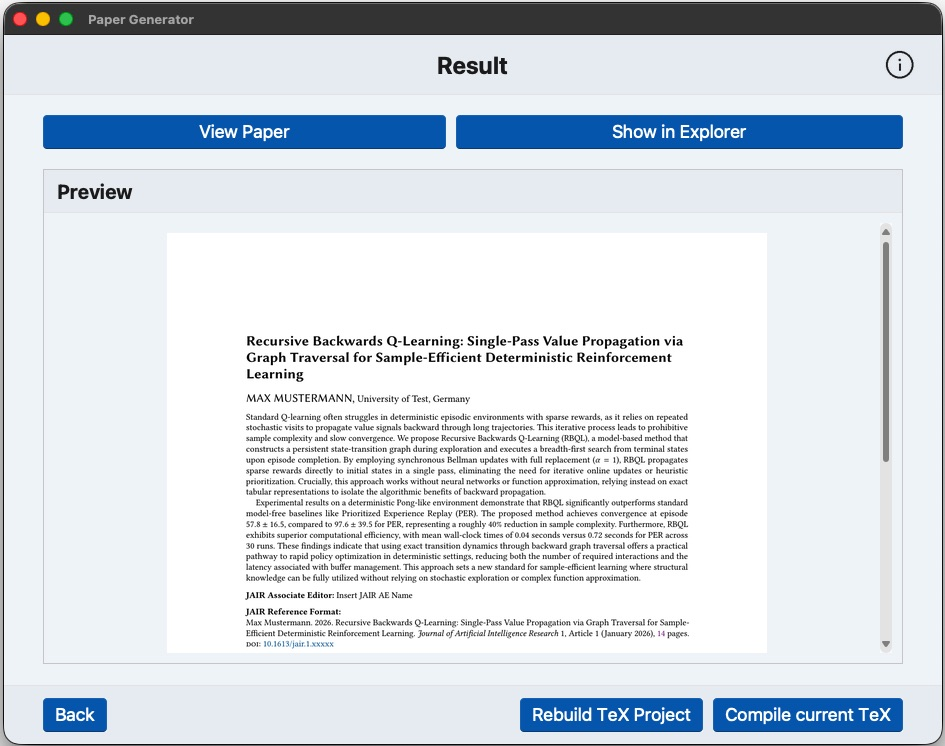
**Figure 4.16:** The system's result screen showing a preview of the compiled PDF document with options to open the file, show its directory, compile the current files or trigger a rebuild.

---

<!-- Page 40 -->

**Assets, Bibliography and Compilation** If the experimentation phase produced plots, the system copies them into the LaTeX project’s image directory. It then scans the drafted sections and extracts every citation key. The system looks up these keys in the metadata of all available papers. For every matched paper, it defines a bibliography entry with the metadata and creates the bibliography file. If the system finds an unmatched citation key, it uses a placeholder bibliography entry to prevent potential crashes during compilation. After the bibliography is built, the system executes the Makefile of the template to compile the PDF document. 

**Output and Review** After compilation, the application presents a preview of the generated PDF file, as shown in Figure 4.16. The interface provides buttons to open the PDF file in the user’s default program and show the project directory in the file explorer. If the user made any changes to the LaTeX project, they can trigger a recompilation. Users can also start a complete rebuild, for example when they change the LaTeX template or generate a new draft. 

---

<!-- Page 41 -->

# Chapter 5: Implementation

This chapter describes implementation details that were not addressed in the system design chapter. The first part explains aspects that apply to the entire system. After this, a selection of complex steps is explained in more detail. 

**Model Configuration** Each phase has its own model variables, so the user can make use of models that are specialized for a certain task. For example, a code generation model can be used for experimentation and an academic writing model for the paper writing phase. The experimentation phase also uses a VLM to validate plots and write their captions. Embedding models are used for ranking papers and for searching relevant text passages during the writing phase. When reasoning models are used, their outputs may contain internal thinking blocks wrapped in `<think>...</think>` tags. A post-processing step removes these before saving, so the model’s internal reasoning does not end up in the result. The application communicates with the local LM Studio instance through its Python SDK, which connects over `localhost` . Models can be changed at runtime on the settings screen. Each model is selected from a dropdown that lists the models currently downloaded in LM Studio, so only valid models can be selected. Selections are written to the configuration file, so changes are saved. 

**Lazy Model Loading** Models are loaded on demand to avoid unnecessarily using the computer’s resources at startup and decrease the risk of overloading it. Each phase loads its assigned model on first use and caches the instance for following calls. This works well with LM Studio’s “Only Keep Last JIT Loaded Model” option. When it is activated, LM Studio unloads the current model before loading the next, so only one model at a time takes up resources. 

The paper writing phase is an exception because it switches between a language model and an embedding model on every section. The language model writes the text, and the embedding model is used to search the indexed literature for relevant context, which will be passed to the language model to improve the text. Reloading the model before every switch for all seven sections would cause unnecessary delays. Because just-in-time-loaded 

---

<!-- Page 42 -->

models are unloaded automatically, models are instead loaded with LM Studio’s command line interface (CLI), which bypasses the auto-unload rule and keeps the model in memory until the phase finishes. 

**Structured LLM Responses** Pydantic[5] is used to validate structured JSON outputs from LLMs. When the system needs structured output from an LLM, a subclass of Pydantic’s `BaseModel` defines the JSON schema. This schema is passed to the LM Studio software development kit (SDK) as a `response_format` parameter, which signals the model to generate output matching it. Listing 5.1 shows this for the hypothesis generation, which always requires the LLM to return a hypothesis description, rationale, and success criteria. 

```
1 class Hypothesis(BaseModel):
2 description: str
3 rationale: str
4 success_criteria: str
5 result = model.respond(prompt, response_format=Hypothesis)
```

**Source Code 5.1:** Response schema definition and enforcement for the hypothesis generation. A Pydantic model defines the required fields. Passing it via the `response_format` parameter instructs the LLM to return text in JSON format matching the schema. 

**Error Handling** Each phase runs in a background thread so the GUI stays responsive when the results of a phase are being generated. If a phase should fail, the exception is caught in the background thread and passed to the main thread via Tkinter’s `after()` function. The progress popup then switches to an error display, so the user can see the error message. The application does not exit, so the user can read the error, perhaps make changes to files or models, and restart the phase. 

## 5.1 Paper Relevance Scoring

This section explains how the relevance score for paper ranking is calculated. As described in the previous chapter, each paper is ranked using a composite score calculated by its semantic relevance, citations, and recency. To calculate relevance to the user’s topic, the system embeds both the research context and each paper using a local embedding model loaded through LM Studio. As shown in Listing 5.2, each paper is represented by its title and abstract concatenated into a single string. The embedding is saved as a field in the paper object, so the filtering step can reuse it without running the embedding model a second time. The relevance score is the cosine similarity between the paper and context 

> 5 `https://github.com/pydantic/pydantic` 

---

<!-- Page 43 -->

vectors. Since all three metrics must be on the same scale to form a meaningful weighted sum, the cosine similarity is normalized from [ − 1 , 1] to [0 , 1] via ( _s_ + 1) / 2. 

```
1  context_emb = embedding_model.embed(context)
2  paper_embs = [embedding_model.embed(f"{p.title} {p.summary}") for p in papers]
3  for paper, paper_emb in zip(papers, paper_embs):
4  paper.title_abstract_emb = paper_emb
5  relevance = cosine_similarity(context_emb, paper_emb)
6  def cosine_similarity(emb1, emb2) -> float:
7  element_wise_sum = np.dot(emb1, emb2)
8  magnitude_product = np.linalg.norm(emb1) * np.linalg.norm(emb2)
9  return (element_wise_sum / magnitude_product + 1) / 2 # normalize [-1, 1]
10 # to [0, 1]
```

**Source Code 5.2:** Calculation of semantic similarity between the research context and each paper. The research context and each paper (title + abstract) are embedded. For each paper, the embedding is saved for later reuse, and the cosine similarity to the context is computed. The dot product of the two vectors is divided by the product of their magnitudes and then normalized from [ − 1 , 1] to [0 , 1]. 

## 5.2 Automated Experimentation

This section explains how experiment scripts are executed and how errors are recovered. 

**Subprocess Execution and Timeout Recovery** The generated experiment script runs in an isolated subprocess with the output directory as its working directory. This means the generated code can import modules, load datasets, and write outputs using relative paths without having to know the project’s absolute file paths. Listing 5.3 shows the setup. The timeout is passed to `communicate()` in line seven, which waits for the subprocess to finish and raises a `TimeoutExpired` exception once the limit is exceeded. The `except` block then kills the process and calls `communicate()` a second time to read any output still in the buffer after the kill signal. 

```
1 process = subprocess.Popen(
2 [sys.executable, file_path],
3 stdout=subprocess.PIPE, stderr=subprocess.PIPE,
4 text=True, cwd=output_dir)
```

- 5 

```
1 try:
2 stdout, stderr = process.communicate(timeout=timeout)
3 return_code = process.returncode
4 except subprocess.TimeoutExpired:
5 process.kill()
```

---

<!-- Page 44 -->

```
1 stdout, stderr = process.communicate()
2 return_code = 1
```

**Source Code 5.3:** The script runs in a subprocess with a configurable timeout. On timeout, the process is killed and `communicate()` is called a second time to collect any output that was generated after the kill signal. The working directory is set to the experiment output folder so the generated code can use relative paths. 

**Error Recovery and Fix Loop** A non-zero exit code triggers the fix loop of the experimentation phase. The broken code and its output are passed to the model via the same chat object used during generation. This means the model sees the full conversation history including the original code and all previous failed fixes, so it can avoid repeating them. Timeout failures are handled separately. Here the prompt includes instructions to reduce loop iterations, remove any UI calls, and optimize or simplify computationally expensive steps to stay within the timeout. 

## 5.3 Document Compilation

This section details how special characters are escaped and how Unicode characters are handled before PDF compilation. 

**LaTeX Special Character Escaping** LaTeX treats characters like `%` , `_` , and `#` as syntax, so raw text containing them breaks the compilation or leads to errors in the output. For example, a `%` in a sentence starts a comment and hides the rest of the line. These characters need to be escaped in plain text but left alone in formulas, code blocks, or command arguments, which are already escaped. Listing 5.4 shows how this is implemented. A regular expression matches all regions that need to be left unchanged, so the complete text can be updated in one step. The text between matches is then escaped, and matched regions are kept as they are. 

```
1  parts = []
2  last_end = 0
3  for match in protected_pattern.finditer(text):
4  start, end = match.span()
5  if start > last_end:
6  parts.append(escape_text(text[last_end:start])) # escape plain text
7  parts.append(match.group()) # keep protected region
8  last_end = end
9  if last_end < len(text):
10 parts.append(escape_text(text[last_end:]))
```

---

<!-- Page 45 -->

```
1 return ’’.join(parts)
```

**Source Code 5.4:** LaTeX special character escaping. Special characters are escaped only in plain text regions. A regular expression matches all protected regions (math, verbatim, commands). Text between matches is escaped and matched parts are kept unchanged. 

**Unicode Sanitization** The system uses `pdflatex` , part of the pdfTEX[6] extension, to compile the final LaTeX source code into a PDF file. To prevent compilation errors, characters outside the Latin range must be removed or replaced, because `pdflatex` cannot process them. LLM-generated text might contain such characters, for example Greek letters written as Unicode instead of LaTeXcommands. The system handles this problem in two steps. First, known symbols like Greek letters or math operators are replaced with their LaTeX equivalents. Then everything still outside the Basic Latin and Latin Extended range, like Arabic characters, is removed from the text. 

> 6 `https://tug.org/applications/pdftex/` 

---

<!-- Page 46 -->

# Chapter 6: Evaluation

This chapter evaluates the implemented system and is split into two parts. Section 6.2 verifies each requirement defined in Chapter 4. Section 6.3 runs the entire pipeline from start to finish and presents the results. 

## 6.1 Methodology

This section explains how the requirements are verified and how the system is demonstrated. 

Chapter 4 defines eleven requirements (FR1–FR8, NFR1–NFR2, C1). As discussed in that chapter, the requirements are scoped to deterministic system behaviors, since text quality largely depends on the used LLM, not just the system’s architecture. The system might produce low-quality output with a smaller model and higher-quality output with a larger one. This makes it difficult to link the quality of the generated output to the software architecture alone. Therefore, the requirements verification tests only what the system does mechanically. 

Besides the requirements verification, Section 6.3 presents an end-to-end demonstration of the pipeline on a single research topic. Running and evaluating multiple scenarios, or doing an empirical study, was not feasible within the given time for this thesis. Yet, one scenario is enough to show if the system’s phases can work together to generate a research paper from end-to-end. Claims made in the generated paper (for example mathematical formulas, statistical test results, cited sources) are verified against scientific publications to assess their correctness. The demonstration is not an empirical evaluation. Its goal is to show that the system is able to produce a research paper, not how well it performs in general. 

---

<!-- Page 47 -->

## 6.2 Requirements Verification

For each requirement, a binary pass condition is defined (Table 6.1). Ten of the eleven requirements are verified automatically via Python scripts. NFR2 (Free Execution) is verified with a cost analysis of all runtime components. 

**Table 6.1:** Pass conditions for each system requirement.

|**ID|Requirement|Pass Condition**|
|---|---|---|
|FR1|Context|A `research_context.md`fle is created with the expected|
||Analysis|sections (research description, dataset descriptions, code|
|||analysis, open questions).|
|FR2|Literature|A non-empty `papers.json` fle is created and at least one|
||Search|`.pdf`is downloaded.|
|FR3|Hypothesis|A`hypothesis.md`fle is created with all three sections (de-|
||Generation|scription, rationale, and success criteria).|
|FR4|Experimentation|An experiment script is created, it is executed without excep-|
|||tions, and at least one artifact is saved.|
|FR5|Paper|A non-empty `paper_draft.md` fle is created with at least|
||Writing|one citation key that matches an entry in the retrieved|
|||`papers.json`database.|
|FR6|Document|The LATEX compiler returns exit code 0 and the output`.pdf`|
||Compilation|fle has a size > 0 KB.|
|FR7|Human-in-|A phase’s output is saved to disk. The next phase reads this|
||the-Loop|output (including any manual edits) and integrates it into the|
|||prompt sent to the inference engine.|
|FR8|Model|Two phases each load their own model via`lms.llm()`. Af-|
||Selection|ter each load, the assigned model appears in the output of|
|||`lms.list_loaded_models()`.|
|NFR1|Privacy|All LLM inference goes through `lmstudio`. External calls|
|||are limited to literature search APIs.|
|NFR2|Free|A cost analysis confrms that all runtime components and ex-|
||Execution|ternal APIs are free of charge.|
|C1|Technology|The codebase contains `.py` source fles, and both `tkinter`|
||Stack|and the`lmstudio`SDK are imported.|

### 6.2.1 Setup

All verification tests and results are part of the project’s repository.[7] 

> 7 `github.com/schmitt-steven/Paper-Generator/tree/thesis-demo/tests/requirements_ verification` 

---

<!-- Page 48 -->

The static analysis tests (C1, NFR1) parse source code without loading any AI models and complete in seconds. The output analysis tests (FR1–FR7) run a specific phase and analyze their output files or prompts. For FR8 (Model Selection), an integration test sends requests to LM Studio and fetches its list of loaded models to confirm the system supports using different models for different tasks. NFR2 (Free Execution) is verified via a cost analysis in Table 6.3. 

Table 6.2 lists the used hardware, software and models. User interface libraries were excluded, with the exception of `tkinter` (verified in C1), since they do not affect requirements verification tests. The LLMs used are Qwen3.5-35B-A3B[8] and Qwen3-27B[9] at 4-bit quantization, and the embedding model is Qwen3-Embedding-4B[10] at 5-bit quantization. 

**Table 6.2:** Test environment

||**Table 6.2:Test environment**|
|---|---|
|**Component|Value**|
|_Hardware_||
|CPU/GPU|Apple M1 Ultra|
|Memory|64 GB unifed memory|
|Operating System|macOS Tahoe|
|_Software_||
|Python|3.14.0|
|LM Studio|0.4.9|
|`lmstudio`SDK|1.5.0|
|`tkinter`|8.6|
|`PyMuPDF`|1.26.6|
|`pymupdf4llm`|0.2.0|
|_Models_||
|LLM|Qwen3.5-35B-A3B (4-bit quantization)|
|LLM|Qwen3.5-27B (4-bit quantization)|
|Embedding model|Qwen3-Embedding-4B (5-bit quantization)|

### 6.2.2 Results

**FR1 — Context Analysis** FR1 requires the system to process user data and generate a structured definition of the research topic. The test runs the context analysis phase and verifies that `research_context.md` exists and that all four required sections (research description, open questions for literature search, dataset descriptions and code analysis) exist. FR1 passed. 

> 8 `https://huggingface.co/Qwen/Qwen3.5-35B-A3B` 

> 9 `https://huggingface.co/Qwen/Qwen3.5-27B` 

> 10 `https://huggingface.co/Qwen/Qwen3-Embedding-4B-GGUF` 

---

<!-- Page 49 -->

**FR2 — Literature Search** FR2 requires the system to query external databases and save metadata and full-text documents. The test verifies that a non-empty `papers.json` is created and that at least one of the found papers is downloaded. FR2 passed. 

**FR3 — Hypothesis Generation** FR3 requires the system to generate a hypothesis from the provided context. The test checks that a `hypothesis.md` file is created and contains a description, rationale, and success criteria. FR3 passed. 

**FR4 — Experimentation** FR4 requires the system to generate code, execute it and save the results. The test verifies that an experiment script exists, was executed without exceptions, and that at least one non-empty results file was created. FR4 passed. 

**FR5 — Paper Writing** FR5 requires the system to generate text sections that include citations from the available literature. The test checks that a `paper_draft.md` file was created and contains citation keys, of which at least one key matches an entry in `papers.json` . FR5 passed. 

**FR6 — Document Compilation** FR6 requires the system to compile the generated content into a PDF document. The test runs the system’s Makefile compilation subprocess and asserts a LaTeX exit code of 0 and a non-zero output file size. FR6 passed. 

**FR7 — Human-in-the-Loop** FR7 requires the system to save a phase’s output so the user can review and edit it before the next phase runs. The test runs the hypothesis generation phase, edits the generated `hypothesis.md` file with a universally unique identifier (UUID) to simulate a manual edit, and then calls the experiment plan generation method and intercepts the outgoing prompt. Finding the exact UUID in the intercepted prompt proves the system used the edited file for the next phase. FR7 passed. 

**FR8 — Model Selection** FR8 requires the system to assign different language models to different tasks. The test picks two phases, calls `lms.llm(model_key)` for each, and checks `lms.list_loaded_models()` until the model appears in the list. Both calls go exclusively through the LM Studio Python SDK, which communicates with the LM Studio application over an internal WebSocket connection on dedicated local ports, independently of the LM Studio “Local Server” REST API at port 1234. Once the assigned model appears in the loaded model list, it proves the system can switch between models at runtime. FR8 passed. 

---

<!-- Page 50 -->

**NFR1 — Privacy** NFR1 requires all inference data to be processed locally. The test scans all production source files and verifies two things: first, that every file using `lms.llm()` or `lms.embedding_model()` does so via `import lmstudio as lms` and never rebinds the `lms` alias to anything else; second, that such calls are actually present in the codebase. Because the `lmstudio` SDK connects exclusively to `localhost` by design, this proves no inference data leaves the machine. External network calls are limited to the literature search APIs, which carry no user inference data. NFR1 passed. 

**NFR2 — Free Execution** NFR2 requires all functions to be free of cost. This requirement is verified via a cost analysis of every component and API, excluding the user’s hardware and internet infrastructure. Table 6.3 lists every component and its cost. The Python dependencies’ licenses were identified by parsing the official metadata classifiers bundled inside the local Python wheels via `pip show` . The licensing and pricing for Python[11] , LM Studio[12] and the three literature search APIs (Semantic Scholar[13] , Unpaywall[14] , and arXiv[15] ) were verified via their official documentation and published terms of service. 

**Table 6.3:** System component cost analysis

|**Category|Component|Cost**|
|---|---|---|
|Runtime Environment|Python 3.14|Free (PSF License)|
|Local Inference Engine|LM Studio v0.4.9|Free (Terms of Service)|
|Python Dependencies|`lmstudio, pydantic,`|Free (MIT License)|
||`sv-ttk, markdown,`||
||`tkinterweb`||
||`requests`|Free (Apache 2.0 License)|
||`pandas, numpy, scipy,`|Free (BSD-3-Clause License)|
||`seaborn`||
||`matplotlib`|Free (PSF License)|
||`pillow`|Free (HPND License)|
||`PyMuPDF, pymupdf4llm`|Free (AGPL-3.0 License)|
|External Network APIs|Semantic Scholar API|Free (API agreement)|
||Unpaywall API|Free (Terms of Service)|
||arXiv API|Free (Terms of Service)|

As Table 6.3 shows, the application’s components are free of cost. NFR2 passed. 

> 11 `https://docs.python.org/3/license.html` 

> 12 `https://lmstudio.ai/terms` 

> 13 `https://www.semanticscholar.org/product/api` 

> 14 `https://unpaywall.org/products/api` 

> 15 `https://info.arxiv.org/help/api/index.html` 

---

<!-- Page 51 -->

**C1 — Technology Stack** C1 requires the system to be built using Python for the backend, Tkinter for the graphical interface and LM Studio for local inference. The test scans the project directories to confirm they only contain .py source files. It then parses the imports to show that both the tkinter package and the lmstudio SDK are used. C1 passed. The tests verify that all eleven requirements are met.

## 6.3 System Demonstration

The requirements verification confirmed that each required component works as intended. This section runs the entire pipeline from start to finish to evaluate the system as a whole. The goal of this demonstration is to show whether the system can produce a complete research paper.

### 6.3.1 Topic Selection

The topic of the demonstration was selected following these criteria:

*   **Verifiable claims:** The topic must produce claims that can be checked against established knowledge. Without this, it is impossible to determine whether the generated text is correct or hallucinated.
*   **Semantic Scholar coverage:** The Semantic Scholar databases must contain multiple papers on the topic. A topic without coverage would cause the automated literature search to find few or no papers, regardless of system quality.
*   **Consumer hardware:** Suitable experiments must be able to run on the author's test machine (Mac Studio M1 Ultra, 64GB RAM) and finish within reasonable time, not days.
*   **Non-trivial complexity:** The topic must challenge the system's problem-solving abilities. It must require the system to reason, design appropriate experiments and draw conclusions. These tasks help to showcase the system's capabilities and weaknesses.

**Chosen Topic** The demonstration uses Benford's Law applied to German municipal census data as its research topic. Benford's Law describes a statistical phenomenon in naturally occurring datasets, where the first significant digit is not uniformly distributed [62]. It states that instead of each digit from 1 to 9 appearing with the same probability ($\approx 11.1\%$), the digit 1 appears roughly 30% of the time as the first digit, and frequencies decrease logarithmically for the following digits to less than 5% for digit 9. The expected frequency of a leading digit $d$ is calculated as $P(d) = \log_{10}(1 + 1/d)$.

---

<!-- Page 52 -->

The generated paper must apply this law to the “Personen: Bevölkerungszahl und Fläche” table of the German Zensus 2022 dataset[16] , which shows population counts, area, and population density for each of Germany’s approximately 10,800 municipalities ( _Gemeinden_ ). The experiment must test whether these variables conform to the expected Benford distribution using deviation metrics and compare the results to artificially generated control datasets. 

This topic matches all selection criteria. Benford’s Law is mathematically defined [62], so statistical claims in the generated paper can be verified. Benford’s Law is also studied in different fields like statistics [63], population demographics [64] and fraud detection [65]. A search on Semantic Scholar for “Benford’s Law” returns thousands of results[17] . The experiment requires numerical computation on a publicly available census dataset, which is feasible for the hardware this thesis relies on. The dataset, as described above, is freely available from the federal statistical office of Germany. No external API or additional dependencies are needed. Lastly, the topic is non-trivial. Applying Benford’s Law correctly requires methodology, like selecting an appropriate statistical test, and reasoning why certain variables conform while others may not. 

### 6.3.2 Setup

The demonstration used the same hardware and software environment as the requirements verification (Table 6.2). All six phases used the same LLM, Qwen3.5-35B-A3B at 4-bit quantization, and for the embedding model, Qwen3-Embedding-4B at 5-bit quantization was used. The system was executed via a Python script that calls the same backend methods as the GUI, so no manual input is required between phases. The script saved each phase’s duration, status messages, artifacts and standard output after each phase finished. All values, durations and statistics shown in Section 6.3.3 are taken or derived from the log files and artifacts generated during that run. All files the run produced are available in the GitHub repository of the project[18] . 

Three user inputs were provided to the system. The first is `paper_specification.md` , which defines the research topic, an overview of the dataset, a hypothesis and content requirements for each section. The second is `style_guidelines.md` and defines writingtone rules for each section. The third is the dataset for population and area of German municipalities, named `1000A-0001_de_flat.csv` . 

> 16 `https://ergebnisse.zensus2022.de/datenbank/online/statistic/1000A/table/1000A-0001` 

> 17 `https://semanticscholar.org/search?q=Benford%27s%20Law&sort=relevance` 

> 18 `https://github.com/schmitt-steven/Paper-Generator/tree/thesis-demo/tests/demonstration/run_20260314_215709` 

---

<!-- Page 53 -->

### 6.3.3 Results

The generated paper is included in Appendix A. The complete run finished in ∼ 2,573 seconds ( ∼ 43 minutes). Table 6.4 shows time and share for each phase. Paper Writing was the longest phase at 61.5 % of total runtime, while Hypothesis Generation was the fastest at under ten seconds. 

**Table 6.4:** Phase durations of the system demonstration

|**Table 6.4:Phase durati|ons of the sy|stem demonstra|tion**|
|---|---|---|---|
|**Phase|Time (s)|Time (min)|Share (%)**|
|1 — Context Analysis|35.76|0.6|1.4|
|2 — Literature Search|379.36|6.3|14.7|
|3 — Hypothesis Generation|9.31|0.2|0.4|
|4 — Experimentation|337.82|5.6|13.1|
|5 — Paper Writing|1,582.80|26.4|61.5|
|6 — Document Compilation|227.89|3.8|8.9|
|**Total|2,572.94|42.9|100**|

**Phase 1 — Context Analysis** Phase 1 created `research_context.md` . The phase generates up to four parts: a research description, a code analysis, dataset descriptions and open questions for literature search. Since no source code was provided, the code analysis part was correctly skipped. The remaining three parts are all present. The research description covers keywords, scope, problem definition and technical approach. The dataset description summarizes the structure of the provided CSV file. Six open questions were generated for the literature search. The LLM classified the research domain as “Statistical Data Validation and Forensic Analytics”, which is accurate for the provided topic. 

**Phase 2 — Literature Search** The literature search pipeline generated 15 of 15 required search queries. All returned at least one result. In total, 220 papers were retrieved across all queries, of which 216 were unique. This number was reduced to 25 after relevance filtering. Metadata for all 25 papers was saved to `papers.json` . Of the 25 papers, 13 already contained direct PDF links from Semantic Scholar. Unpaywall and arXiv resolved 4 of the remaining 12 papers as open access, which brought the total to 17 open-access and 8 closed-access papers. Of the 17 open-access papers, 10 PDFs downloaded successfully. The other 7 failed with HTTP 403 responses from their publisher endpoints, which means that the servers rejected the automated download requests. All downloaded PDFs were successfully converted to Markdown for additional context for the paper writing phase. Inspecting the `papers.json` file, the three papers ranked highest by the system are _Some_ 

---

<!-- Page 54 -->

_New Invariant Sum Tests and MAD Tests for the Assessment of Benford’s Law_ [66], _Detecting Benford’s Law Effectiveness Threshold Differences According to Affecting Operation_ [67], and _Benford’s Law and Transport Infrastructure: The Analysis of the Main Road Network’s Higher-Level Segments in the EU_ [68], which all are related to the topic. Not all papers are equally on-topic though. Two unrelated papers slipped through the LLM-based relevance filtering process. _Generative AI Mitigates Representation Bias and Improves Model Fairness Through Synthetic Health Data_ [69] and _Tokenization Counts: The Impact of Tokenization on Arithmetic in Frontier LLMs_ [70] received the lowest scores and have no meaningful connection to Benford’s Law or forensic data analysis. 

**Phase 3 — Hypothesis Generation** Phase 3 created `hypothesis.md` with a description, rationale and success criteria. The generated hypothesis reads “Validating Benford’s Law conformity in German Zensus 2022 municipal data by comparing first-digit frequency distributions of population counts and area measurements against derived population density and synthetic controls.” The rationale explains why naturally occurring datasets follow the Benford distribution while derived ratios and fabricated data deviate and argues for mean absolute deviation (MAD) over Chi-square on large samples. The success criteria defines conformity to Benford’s Law as observably lower MAD values for the real variables compared to the artificial control datasets. 

The paper specification stated the idea for a hypothesis as “Population counts and municipal area measurements from the German Zensus 2022 conform to Benford’s Law, while population density (a derived ratio) and synthetically generated data deviate significantly.” The generated hypothesis covers the same claim and variables. The specification used the qualitative phrase “deviates significantly”, while the generated success criteria made this concrete by defining success as observably lower MAD values for the real variables than for the artificial control variables. 

**Phase 4 — Experimentation** The system first generated an experiment plan and with that a 302-line Python script (238 non-blank lines). The script executed with exit code 0 and passed all automatic validation checks without requiring fixes. The plan integrated the requirements from the provided paper specification and the generated script followed the experiment plan closely. All five required variables were implemented (Population Count, Municipal Area, and Population Density from the dataset, plus two synthetic controls). The artificial uniform dataset uses equal digit probability ( _P_ ( _d_ ) = 1 / 9, _N_ = 10 , 800), and the artificial biased dataset contains digits 5 and 6 more often to mimic human fabrication ( _N_ = 10 , 800), both as described in the plan. Both metrics, MAD and Chi-Square with p-value, were calculated as required. 

---

<!-- Page 55 -->

All three plots required by the paper specification were generated. Figure 6.1 shows the observed versus expected Benford frequencies for each dataset. The legend is anchored outside the plot area, which wastes space without affecting the data content. Figure 6.2 compares MAD values across all five datasets against threshold lines. Here, the script’s bar annotation placement condition is inverted, which causes labels on shorter bars to be drawn inside the bar rather than above it. The annotation for the Synthetic Biased bar is also hidden by the legend box. Figure 6.3 is a deviation heatmap with digits 1–9 versus datasets, color-coded by deviation magnitude. 

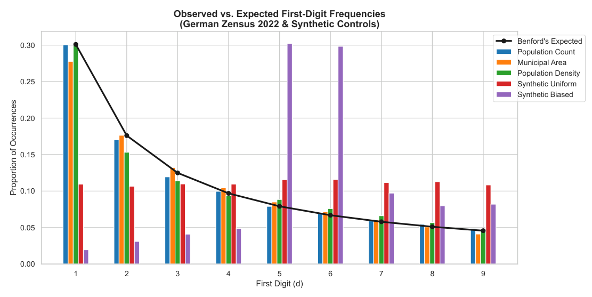

**Figure 6.1:** Generated plot showing observed versus expected first-digit frequencies for all five datasets.

Table 6.5 shows the numerical results of the experiment. 

**Table 6.5:** Generated conformity test results for Benford’s Law of the first digits of the variables.

|**le 6.5:Generated confor|mity test re|sults for Benfo|rd’s Law of the frs|t digits of the variab**|
|---|---|---|---|---|
|**Variable|MAD|Chi²|**p-value|Classifcation**|
|Population Count|0.0027|10.60|2.25×10⁻¹|Excellent|
|Municipal Area|0.0063|44.81|3.99×10⁻⁷|Excellent|
|Population Density|0.0082|89.12|7.00×10⁻¹⁶|Excellent|
|Synthetic Uniform|0.0613|4,482.72|≈0|Anomalous|
|Synthetic Biased|0.1241|21,189.06|≈0|Anomalous|

---

<!-- Page 56 -->

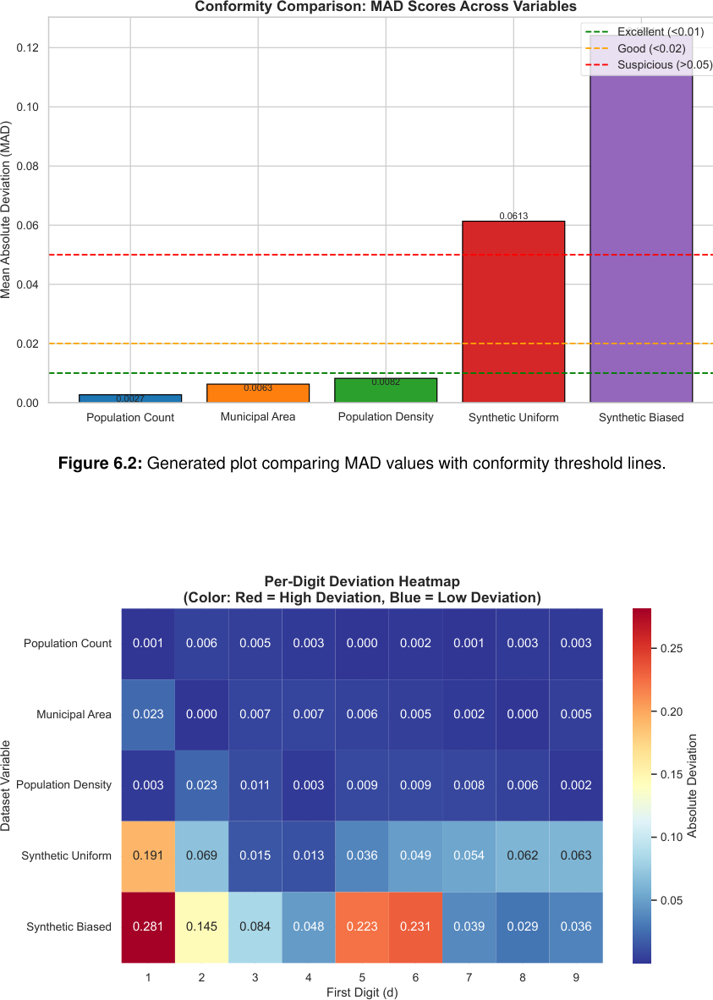

**Figure 6.3:** Generated heatmap of per-digit deviations from Benford’s Law across the five datasets.

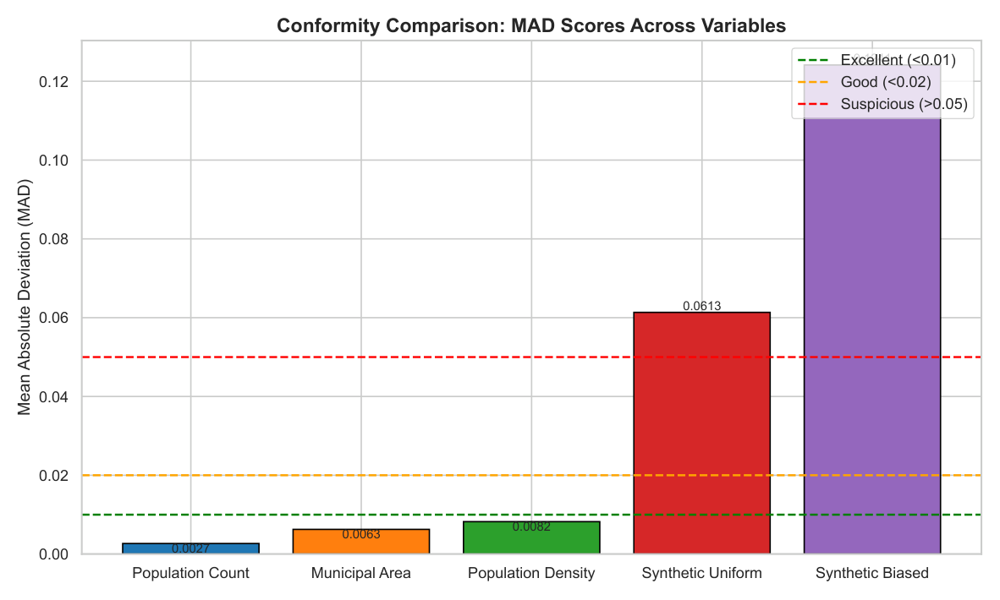
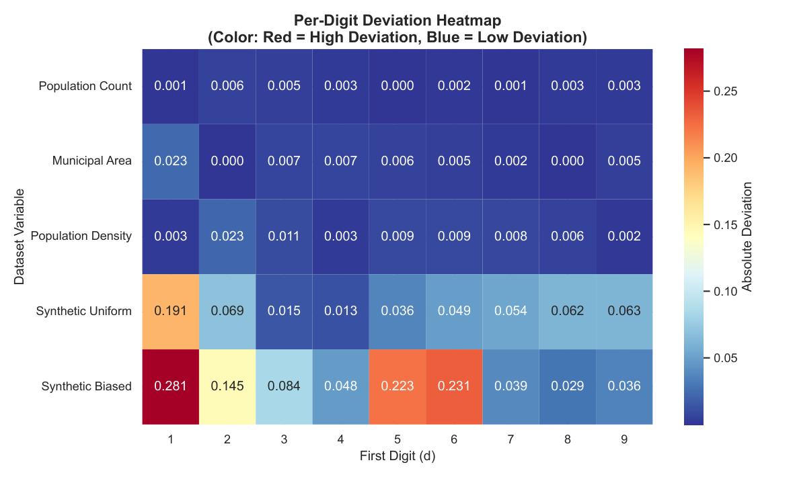

---

<!-- Page 57 -->

The conformity classifications match the MAD thresholds specified in the experiment plan, which loosely follow the Nigrini scale [63]. However, the plan only defines three boundaries ( < 0 . 01, 0 . 01–0 . 02, and > 0 . 05) and leaves the range between 0 . 02 and 0 . 05 undefined. The script fills this gap with a fourth category, _Marginal / Suspicious_ , which does not appear in the plan and was generated without an explicit source. Furthermore, Nigrini’s thresholds for first-digit analysis are 0.006, 0.012, and 0.015 [63], while the values used in the experiments are only an approximation. The MAD values for all three variables of the census data are below 0.01, as expected from the Benford distribution for naturally occurring data [62]. Municipal Area and Population Density have very low MAD values but also very low Chi-Square p-values ( _p <_ 10 ⁻⁶ and _p <_ 10 ⁻¹⁵ ). This is a known large-sample sensitivity problem [63] and was also mentioned in the paper specification. Overall, all formulas were correctly translated into code and the experiment produced valid results. The census variables conform to Benford’s Law and the synthetic controls do not, which is what is expected for this type of data [62]. 

The system classified the hypothesis as supported. The LLM argued that Population Count (MAD = 0.0027) and Municipal Area (MAD = 0.0063) show excellent Benford conformity, and that all three real variables are clearly separated from the synthetic controls (MAD > 0.06), which was interpreted as fulfilling the scientific goal. The success criteria states that population density should demonstrate “significantly higher deviation magnitudes” than population counts and area, without defining what counts as significant. Population Density’s MAD of 0.0082 is higher than Population Count (0.0027) and Municipal Area (0.0063), but all three fall in the same _Excellent Conformity_ range ( < 0 . 01). The success criteria also groups density together with synthetic datasets, implying a similar scale of deviation. The synthetic controls have MAD values of 0.0613 and 0.1241, an order of magnitude above density. A more accurate assessment would be _partially supported_ . The claim that real data conforms to Benford’s Law, while synthetic data does not, is supported by the experiment results. But the prediction that density would show significantly higher deviation than population count and area is not, since all three real variables fall in the same _Excellent Conformity_ range. The generated discussion section does acknowledge this. It explicitly notes that density is a derived variable and that division operations can theoretically distort digit distributions, while observing that the low MAD suggests the underlying distributions are robust enough to preserve conformity regardless. 

**Phase 5 — Paper Writing** All seven required sections were written, in total 4,549 words. Table 6.6 shows the word count and number of characters for both the initial draft and the rewritten version. Each section was first generated and then revised, as described in Section 4.4.5. 

---

<!-- Page 58 -->

**Table 6.6:** Section statistics of the generated paper

||**Table|6.6:Section statistics of|the generated paper**||
|---|---|---|---|---|
|**Section|Words|Initial text (chars)|Improved text (chars)**|∆**(chars)**|
|Abstract|147|1,386|1,140|−246|
|Introduction|698|5,552|5,326|−226|
|Related Work|856|6,326|6,594|+268|
|Methods|864|6,194|6,444|+250|
|Results|1,045|7,642|7,751|+109|
|Discussion|815|5,764|6,223|+459|
|Conclusion|124|1,918|941|−977|
|**Total|4,549|34,782|34,419**|−**363**|

The revision extended all sections except the abstract ( − 246 characters) and conclusion − ( 977 characters), which were the only two sections that had specific length targets in the style guidelines. 

The final paper contains 16 unique citation keys, which all match entries in the retrieved literature. The initial draft contained one hallucinated key, `Schumm2005AutomatieIO` , in the Related Work section. This appears to be a combination of two real keys from the literature, `Schumm2023CanRS` (author) and `Schafer2005AutomatieIO` (year and suffix), which results in a non-existent key. The system detected this automatically and included the flagged key as feedback in the revision prompt, and the LLM fixed it in the revised version. 

The generated markdown text was checked against the paper specification to see if all required elements were included. The Benford’s Law formula appears in the Introduction, as required. The required MAD and Chi-Square formulas, a pseudocode listing for the conformity tests and the justification for using two complementary tests on large samples are all included in the Methods section. All three required plot references with captions appear in the Results section, as well as a required summary table. The Discussion covers all three required limitations (single country, single census year, simplistic synthetic controls) and all three required future work suggestions (Zensus 2011 comparison, cross-country analysis, financial data application). The title for the paper was generated automatically: _Benford’s Law and MAD in German Zensus 2022: Distinguishing Natural Variation from Manipulation in High-Volume Census Data_ . 

A number of factual errors were identified in the text: 

- The results table classifies Municipal Area as _Good Conformity_ (MAD range 0.01– 0.02), but Municipal Area’s MAD of 0.0063 falls below the paper’s own _Excellent Conformity_ threshold of MAD < 0 . 01. The experiment script classified it as _Excellent Conformity_ . 

---

<!-- Page 59 -->

- The Discussion contains the cross-reference “thresholds defined in Section X” which was never changed to the correct section label. 

- The Related Work section refers to an author called “Schumm”, but the citation key is `Schafer2005AutomatieIO` and the metadata for this paper also does not contain the author “Schumm”. The model first generated `Schumm2005AutomatieIO` , a hallucinated key. The revision then fixed the key but left the wrong author name in the text. 

- The Methods section uses the key `Schafer2005AutomatieIO` for the source of the Zensus 2022 dataset, which, as described in section 6.3.1, was published by the federal statistical office of Germany. 

A review of the bibliography reveals that citation keys were used for claims the cited papers do not support. The citation key `Cole2019TestingTE` appears nine times in the entire text. The paper applies Benford’s Law to emission reduction data [71], but the generated paper cites it for claims about scale invariance, the justification for multiple statistical tests, and synthetic control methodology, none of which the paper discusses. Two other wrong references involve election data. The Related Work section mentions “the debate surrounding Benford’s Law in election data analysis” but cites `Schumm2023CanRS` , a paper about distinguishing retracted social science articles [72], and `Silva2024ANA` , a case study about COVID-19 data in China [73]. Neither has a meaningful connection to election research. 

There is also a writing quality issue. The argument that MAD handles large samples better than Chi-Square is repeated in every section, but instead it could have been explained once and referenced afterwards. 

Reviewing the critic’s feedback for each section reveals that it found several of the described problems, but the following revision of the text did not fix them. The critic identified the wrong use of citations in multiple sections. For the Methods section, it correctly noted that `Cole2019TestingTE` does not discuss scale invariance, that `Schumm2023CanRS` does not cover human fabrication bias and that `Silva2024ANA` does not discuss synthetic controls for Benford analysis. For the Results section, it correctly identified that `Cole2019TestingTE` and `Cerqueti2021SomeNT` do not support their respective claims. For the Introduction and Related Work, it flagged `Marchesi2025GenerativeAM` , a paper about synthetic health data, which was wrongly applied to the calibration of Benford’s Law. None of these citation errors were fixed in the revised text. The critic also flagged the MAD-versus-Chi-Square repetition as redundant in every section it appeared again, each time recommending a brief reference instead. Yet, the repetition remained in all sections after revision. The style guidelines define five forbidden verbs: _leveraging_ , _situating_ , _en-_ 

---

<!-- Page 60 -->

_suring_ , _utilizing_ and _facilitating_ . The critic flagged three of them ( _leveraging_ , _facilitating_ , _utilizing_ ) across six sections. The use of _ensuring_ in the abstract, which is on the forbidden list, was not flagged by the critic and remained in the final paper. The conclusion’s length was correctly flagged as exceeding the specification’s 2–3 sentence limit, after which it shrank from 1,918 to 941 characters. In one case, the critic’s own feedback introduced a new error. It suggested “Section X” as a placeholder for the Methods section label. The LLM then copied this placeholder when generating the revised text, which results in a wrong cross-reference. 

**Phase 6 — Document Compilation** The LaTeX compiler returned exit code 0 and produced a PDF document containing 11 pages. All seven required sections appear in the correct order (abstract, introduction, related work, methods, results, discussion and conclusion). The title block and author data were correctly resolved from the configuration settings. All three figures render correctly and the bibliography compiled with all 16 citation entries resolved. Only the unresolved cross-reference described above renders as “ **??** ” in the discussion section. 

---

<!-- Page 61 -->

# Chapter 7: Discussion

The evaluation showed that the system can produce a complete research paper from start to finish. All requirements passed and the system compiled a PDF document with figures, tables and a bibliography without human intervention. But the demonstration also exposed problems like factual errors, wrong citations and repetitive writing. This chapter interprets these findings, discusses the system’s limitations and the implications for AI-assisted research. 

## 7.1 Interpretation of Results

The errors found in the text of the system demonstration can be split into three groups. Problems the critic spotted but the revision did not fix make up the largest group. Citation misuse, the MAD-versus-Chi-Square repetition and three of five forbidden verbs were all noted with recommendations for how to fix them. Yet, the revision kept these problems unchanged. This suggests that a bottleneck for quality is not identifying problems but fixing them. For the revision of a section, the LLM receives the full section text with a list of improvements and instructions and must apply all changes in a single pass, which may exceed the capability of the model used for the demonstration. 

Next are errors the critic missed. The Municipal Area misclassification, where a MAD of 0.0063 was labelled “Good” instead of “Excellent” conformity, was not found, and the Schumm/Schäfer author mixup is a hallucination that also went unnoticed. Further, the wrong citation was used for the dataset (Schäfer 2005 cited as the source of the 2022 census). The MAD value could have been caught by comparing the number to the conformity table with a deterministic check instead of relying on the LLM. The chance of the wrong author name and citation could have been reduced by checking each sentence one by one with its source, instead of reviewing an entire section at once. 

In the third group fall errors the critic introduced. It suggested “Section X” as a placeholder for the Methods section label, and the model writing the revision copied it literally, which produced an unresolved cross-reference in the PDF document. A possible fix is to validate 

---

<!-- Page 62 -->

the critic’s output before using it for the revision. A scan for unresolved references could have caught “Section X” before it got into the revision prompt. The following paragraphs discuss the problems found in the demonstration in more detail. 

**Citation Quality** The system’s automated citation check compares all citation keys in the draft with the keys in `papers.json` and flags all keys that do not exist in the file. This check found one hallucinated key ( `Schumm2005AutomatieIO` ) and the LLM writing the revision removed it. 

However, a manual review showed a different problem, which is using wrong citations for claims. All 16 citation keys in the final draft are real, but many are used for claims the cited papers do not support. `Cole2019TestingTE` , the key for a case study on emission reduction claims of clean development mechanism projects, appears nine times across all sections. It is cited for scale invariance, the justification for using multiple statistical tests and for synthetic control methodology, none of which the paper discusses. The related work section cites `Schumm2023CanRS` , a paper about retracted social science articles, and `Silva2024ANA` , a paper about COVID-19 data in China, to support a paragraph about election data analysis. Neither paper has any connection to elections. 

The system provides each paper’s citation key, title, abstract and, where available, its conclusion. A model that fully understood the provided information would likely not cite an emissions study for scale invariance. The information needed for correct citation use was present in the prompt, but the model did not consistently use it. As explained above, the critic found most of these misuses, but the LLM writing the revision did not fix them. A reason could also be the length of the prompts sent to the LLM. Each prompt contains detailed information including previous sections, the research context, user requirements and a list of available papers to cite. The model may have struggled with processing such long prompts, which caused it to overlook the literature metadata or the critic’s feedback. Another possible reason is the limited availability of full texts. Of 25 selected papers, only 10 PDFs could be downloaded. For the 15 remaining papers, the model only had access to their metadata and abstracts. When the model has never read the body of a paper, it can only guess what the paper covers based on the abstract, and these guesses could be wrong. 

**Incomplete Correction** The Schumm/Schäfer mixup is an example of how an error can survive correction and remain in the final document. During the first writing step, the LLM generated the non-existent key `Schumm2005AutomatieIO` by merging the real keys `Schumm2023CanRS` (author) and `Schafer2005AutomatieIO` (year and suffix). The automated citation check found this hallucination and the LLM updated it when writing the revised version of the related work section. But the fix was incomplete, since the revised 

---

<!-- Page 63 -->

text still uses the author name “Schumm” instead of “Schäfer” and is now paired with the wrong citation key. The LLM writing the revision fixed the invalid key, but likely did not consider the consequences of this change. This is a limitation of LLM-based selfcorrection, where the model fixes a specific problem without looking at the surrounding context [48]. 

**Coherence Problems** Although the LLM received the instruction to “integrate and build upon previous sections,” which it had access to, there are several issues with the paper’s coherence. An example is the repeated MAD-versus-Chi-Square argument and the repeated definition of MAD. MAD is introduced and explained in the introduction, then explained again in the related work, methods, and results sections. The results section acknowledges this (“As established in the methods, MAD is used here”), but then redefines the term anyway. 

The critic recognized this repetition as a duplicate explanation in every section it appeared, and each time recommended to shorten it to a reference. But the LLM writing the revision ignored this recommendation in every case. This means that the model not only failed to notice redundancy when writing the initial version of the section, but also failed to integrate the feedback about it. 

**Hypothesis Verdict** The LLM responsible for the verdict classified the hypothesis as supported. As described in the evaluation, a more accurate verdict would be “partially supported”. The success criteria use the phrase “significantly higher deviation magnitudes”, but do not define a threshold. Population density did deviate more than population counts and area, but all three MAD values were classified the same. So, whether the hypothesis is supported or not depends on what counts as significant. The model interpreted the hypothesis as supported, but a different model or a human reviewer might come to a more accurate conclusion. This could be avoided by checking if the success criteria are clearly falsifiable, like relative comparisons, before the experiment runs. 

**The Need for a Human-in-the-Loop** Every error found in the evaluation traces back to the LLM, not to the architecture. The model used the wrong conformity label for municipal area. It copied a placeholder into the text and created an unresolved cross-reference. It confused two similar author names. It cited the wrong paper for the dataset. It classified the hypothesis as supported even though the results did not clearly confirm it. It misused citations although at least the metadata and abstract of each paper were in the prompt. The model repeated the MAD explanation in every section although it had access to already written sections. It did not replace forbidden verbs even though the style guidelines were 

---

<!-- Page 64 -->

part of every writing prompt. It ignored most of the critic’s feedback even though it was part of every revision prompt. 

None of these are failures caused by the architecture. The phases, the critic-revision loop and the automated citation check all work as designed. If the model had followed its instructions perfectly, the system would have produced none of the observed errors. 

But LLMs, as of now, do not work that way. They are probability machines that predict the next token based on patterns learned from their training data, without any built-in way to verify whether their output is actually true [74]. Therefore, no amount of prompt engineering, additional context or self-correction loops can fully eliminate the possibility of the model making errors, but only reduce it. Every time the model is asked to do something, it can get it wrong, even when it has all the information it needs to get it right. This is why the system was designed with HITL as a requirement. Every phase saves its output before the next phase starts, which gives the user the option to review and correct all intermediate results. The HITL strategy is especially important when working with local LLMs, since they are generally less intelligent than the best closed-source models [17], which in turn increases the likelihood of errors. 

## 7.2 Limitations and Alternatives

Due to the limited time and resources, the evaluation included one demonstration, on one topic, with one model. This section explains what this means for the interpretation of the results. 

**Single Run** The system demonstration, which the qualitative results interpretation is based on, is a single end-to-end run on a single research topic. Testing the system with multiple scenarios and runs was not feasible within the given time. Because of this, this thesis makes no claim about the system’s general quality. A different topic that requires different literature, a different experiment design or a different reasoning might produce results with more or fewer errors. 

**Hardware Restrictions** All six phases used the LLM Qwen3.5-35B-A3B at 4-bit quantization. This model is small compared to the largest open-weight models which have hundreds of billions of parameters, like Qwen3.5-397B-A17B[19] with 397 billion parameters. The errors found in the evaluation, like the citation misuse, the municipal area misclassification or the author confusion, are all capability-related errors that a larger or unquantized 

> 19 `https://huggingface.co/Qwen/Qwen3.5-397B-A17B` 

---

<!-- Page 65 -->

model might not have made. Running larger open-weight models locally, like Qwen3.5397B-A17B, was not possible on the available hardware. The results are linked only to Qwen3.5-35B-A3B at 4-bit quantization and should not be interpreted as the maximum quality the system can generate. 

**No Human Comparison** The system is a GUI application designed for human collaboration: the user reviews each phase, can rewrite sections and correct errors before moving on. The demonstration evaluated the system’s autonomous output without human intervention, but the intended workflow is human-in-the-loop. A more complete evaluation would therefore compare three cases: the system alone, the system with a human reviewer and a human alone. Without these baselines, there is no proof of whether the autonomous output is impressive, comparable or poor relative to what a human would produce, nor how much the HITL workflow improves the final result. Such a study with human participants was outside the scope of this thesis. Additionally, the usability of the GUI itself was not evaluated, for example through a user study or usability metrics. 

**Local versus Cloud** The system was designed to run on consumer hardware without any API costs. This limits which models the system can run. A cloud-based alternative using the most intelligent models from OpenAI, Anthropic or Google could generate better results. But it would also break the privacy and no-cost requirements that motivated this system. This is a tradeoff, with local, free and private execution at the cost of lower model capability. 

**Non-Determinism** The output of LLMs is probabilistic [13], so the same prompt can produce different text every run. The specific errors found in the demonstration might not show up in another run, and different errors could occur instead. This means the system demonstration only shows one possible outcome, not the only one. 

**Single Evaluator** The system was evaluated by its author only. A different person might judge errors differently or spot problems the author missed. An evaluation by other researchers was not feasible within the given time but could make the findings more credible. 

## 7.3 Implications

**From Writer to Reviewer** When researchers want to write a high-quality paper, they typically think about every claim, choose every citation and build their own arguments. When 

---

<!-- Page 66 -->

they review an AI-generated text instead, they are reading text that something else produced. These are different mental tasks. When writing a paper, the researcher needs to gather and organize knowledge, while reviewing AI-generated text requires them to spot confident-sounding text that is wrong. Research on human oversight of AI suggests that professionals tend to over-rely on generated output [75]. When relying on AI for complex tasks, knowledge workers are 19% less likely to produce correct solutions than those who complete the work entirely on their own [75]. With systems like this, the researcher’s role shifts from a writer to a reviewer, and how thoroughly they review determines the final quality of the paper. 

**Responsibility and Disclosure** The system can generate a paper, but it cannot take responsibility for the correctness of its content. As with any tool used for research, the person who submits or publishes the paper has the responsibility for what it contains. Publishers like Springer Nature[20] , the Association for Computing Machinery[21] and the Institute of Electrical and Electronics Engineers[22] have updated their policies accordingly and require authors to indicate if AI tools were used and to take full responsibility for their content. However, if a researcher carefully checks the AI-generated output, verifies claims and corrects errors, they end up doing much of the work they wanted to hand off in the first place [76]. Enforcing disclosure of AI use for research papers also remains difficult. In a study that analyzed over 5.2 million papers, it was found that even though 70% of journals have adopted AI policies, only about 0.1% of papers actually disclose AI use, with no meaningful difference between journals that have policies and ones that do not [77]. Regardless, the author recommends that users of this system disclose its use and respect the publishers’ rules. 

**Speed versus Control** The system processed text and a dataset and generated a complete research paper. It searched for literature, generated a hypothesis, planned and executed an experiment, analyzed the results, wrote text and compiled a PDF document. The entire process took just under 45 minutes. The output contained errors, but the system is designed around this expectation. The HITL approach lets the user review and correct each phase before the next one runs. How many errors the compiled paper contains heavily depends on how the system is used. A user who reviews the output of each phase, corrects errors and refines the text before compiling could work towards a publication-ready paper. A 

> 20 `https://springernature.com/gp/policies/editorial-policies` 

> 21 `https://acm.org/publications/policies/new-acm-policy-on-authorship` 

> 22 `https://journals.ieeeauthorcenter.ieee.org/become-an-ieee-journal-author/publishing-ethics/guidelines-and-policies/submission-and-peer-review-policies/` 

---

<!-- Page 67 -->

user who skips the review and clicks through every phase can get a first draft in under 45 minutes. 

**Accessibility** The system is designed to run locally on the user’s machine. No inference data is sent to external servers, no API keys are required and no costs arise besides the hardware itself and an internet connection for the literature search. Additionally, the system has few constraints on what LLMs can be used, as long as they can be run locally via LM Studio. This makes the system available to anyone with a consumer laptop or desktop computer. The GUI guides the user through every phase, shows results and offers features for correction, without needing knowledge of the code or command-line tools. This means that even a researcher with no experience in using LLMs, LaTeX or programming could use the system after installing it. 

---

<!-- Page 68 -->

# Chapter 8: Conclusion

Out of all the reviewed systems for automated research, none combine local open-weight model inference with a phase-gated HITL strategy. This thesis introduces a system that fills this gap. It exclusively uses local open-weight LLMs and pauses after each phase so the user can review and correct the output before continuing. The evaluation shows that this system works. All requirements were met and the pipeline produced a complete research paper in 43 minutes on consumer hardware without API costs. But the demonstration also shows that human review matters. When the system was run autonomously, the LLM made errors the system could detect but not fix on its own. 

Most existing systems for automated research depend on cloud-hosted models, which means they come with API costs and privacy concerns. The demonstration shows that this is not necessary. A full research paper was generated on consumer hardware without sending any inference data to external servers, which implies that automated research assistance is possible without a budget for API calls, or industry-grade hardware. However, hallucinations cannot be solved by the system’s architecture alone, as they are inherent to the LLMs themselves. The system is designed with this in mind. Every error found in the demonstration was caused by the LLM, not by an error in the system’s design. Since the architecture is model-independent, the system will directly benefit from better local models without needing any code changes. Previous work has shown that human oversight improves the output of automated research systems [1, 3, 9], and the demonstration in this work supports this. During writing, the critic reliably found errors that the rewriter failed to fix, which leaves a gap that a human reviewer can close. The weaker the model, the more important this review step becomes, because the chance of errors increases. This makes HITL especially valuable for local execution, where the system trades model capability for privacy, independence and zero cost, since a human review can compensate for the difference. 

Based on the evaluation, the rewriting step has the most potential for improvement. The critic found errors reliably, but the rewriter did not integrate most of the feedback. This could be improved by letting the LLM fix only specific parts and then running the critic 

---

<!-- Page 69 -->

again to verify the problems were fixed. If issues remain, the loop would continue until all errors are fixed. 

The demonstration was limited to one topic, one model and no human reviewer. Future work could test the system on different topics and with different local models. It could also compare papers generated by this system with papers generated by other automated research systems. A study comparing autonomously generated papers, papers generated with HITL, and papers written by humans alone could show how much the system helps in practice. 

---

<!-- Page xi -->

## Bibliography

- [1] Tal Ifargan, Lukas Hafner, Maor Kern, Ori Alcalay, and Roy Kishony. _Autonomous LLM-driven research from data to human-verifiable research papers_ . 2024. arXiv: `2404.17605 [q-bio.OT]` . url: `https://arxiv.org/abs/2404.17605` . 

- [2] Chris Lu, Cong Lu, R. Lange, J. Foerster, Jeff Clune, and David Ha. _The AI Scientist: Towards Fully Automated Open-Ended Scientific Discovery_ . 2024. arXiv: `2408.06292` . url: `https://arxiv.org/abs/2408.06292` . 

- [3] Samuel Schmidgall, Yusheng Su, Ze Wang, Ximeng Sun, Jialian Wu, Xiaodong Yu, Jiang Liu, Zicheng Liu, and E. Barsoum. “Agent Laboratory: Using LLM Agents as Research Assistants”. In: (2025), pp. 5977–6043. 

- [4] Varun Rajesh, Om Jodhpurkar, Pooja Anbuselvan, Mantinder Jit Singh, Ashok Jallepali, Shantanu Godbole, Pradeep Kumar Sharma, and Hritvik Shrivastava. _ProductionGrade Local LLM Inference on Apple Silicon: A Comparative Study of MLX, MLCLLM, Ollama, llama.cpp, and PyTorch MPS_ . 2025. arXiv: `2511.05502` . url: `https://arxiv.org/abs/2511.05502` . 

- [5] Lei Huang, Weijiang Yu, Weitao Ma, Weihong Zhong, Zhangyin Feng, Haotian Wang, Qianglong Chen, Weihua Peng, Xiaocheng Feng, Bing Qin, and Ting Liu. “A Survey on Hallucination in Large Language Models: Principles, Taxonomy, Challenges, and Open Questions”. In: _ACM Transactions on Information Systems_ 43 (2023), pp. 1–55. 

- [6] Kurt Shuster, Spencer Poff, Moya Chen, Douwe Kiela, and Jason Weston. “Retrieval Augmentation Reduces Hallucination in Conversation”. In: _Findings of the Association for Computational Linguistics: EMNLP 2021_ . Association for Computational Linguistics, 2021, pp. 3784–3803. 

- [7] Yutaro Yamada, R. Lange, Cong Lu, Shengran Hu, Chris Lu, J. Foerster, Jeff Clune, and David Ha. _The AI Scientist-v2: Workshop-Level Automated Scientific Discovery via Agentic Tree Search_ . 2025. arXiv: `2504.08066` . url: `https://arxiv.org/abs/2504.08066` . 

- [8] Dhruv Trehan and Paras Chopra. _Why LLMs Aren’t Scientists Yet: Lessons from Four Autonomous Research Attempts_ . 2026. arXiv: `2601.03315` . url: `https://arxiv.org/abs/2601.03315` . 

---

<!-- Page xii -->

- [9] Peter Alexander Jansen, Oyvind Tafjord, Marissa Radensky, Pao Siangliulue, Tom Hope, Bhavana Dalvi, Bodhisattwa Prasad Majumder, Daniel S. Weld, and Peter Clark. _CodeScientist: End-to-End Semi-Automated Scientific Discovery with Codebased Experimentation_ . 2025. arXiv: `2503.22708` . url: `https://arxiv.org/abs/2503.22708` . 

- [10] Yixuan Weng, Minjun Zhu, Guangsheng Bao, Hongbo Zhang, Jindong Wang, Yue Zhang, and Linyi Yang. “CycleResearcher: Improving Automated Research via Automated Review”. In: _International Conference on Learning Representations_ . 2024. 

- [11] Tushar Khot, H. Trivedi, Matthew Finlayson, Yao Fu, Kyle Richardson, Peter Clark, and Ashish Sabharwal. _Decomposed Prompting: A Modular Approach for Solving Complex Tasks_ . 2022. arXiv: `2210.02406` . url: `https://arxiv.org/abs/2210.02406` . 

- [12] Tom B. Brown, Benjamin Mann, Nick Ryder, Melanie Subbiah, Jared Kaplan, Prafulla Dhariwal, Arvind Neelakantan, Pranav Shyam, Girish Sastry, Amanda Askell, Sandhini Agarwal, Ariel Herbert-Voss, Gretchen Krueger, Thomas Henighan, Rewon Child, Aditya Ramesh, Daniel M. Ziegler, Jeff Wu, Clemens Winter, Christopher Hesse, Mark Chen, Eric Sigler, Ma-teusz Litwin, Scott Gray, Benjamin Chess, Jack Clark, Christopher Berner, Sam McCandlish, Alec Radford, Ilya Sutskever, and Dario Amodei. _Language Models are Few-Shot Learners_ . 2020. arXiv: `2005.14165` . url: `https://arxiv.org/abs/2005.14165` . 

- [13] Ashish Vaswani, Noam Shazeer, Niki Parmar, Jakob Uszkoreit, Llion Jones, Aidan N. Gomez, Lukasz Kaiser, and Illia Polosukhin. “Attention is All you Need”. In: _Neural Information Processing Systems_ . 2017. 

- [14] Ari Holtzman, Jan Buys, Li Du, Maxwell Forbes, and Yejin Choi. _The Curious Case of Neural Text Degeneration_ . 2019. arXiv: `1904.09751` . url: `https://arxiv.org/abs/1904.09751` . 

- [15] Haotian Liu, Chunyuan Li, Qingyang Wu, and Yong Jae Lee. _Visual Instruction Tuning_ . 2023. arXiv: `2304.08485` . url: `https://arxiv.org/abs/2304.08485` . 

- [16] Shervin Minaee, Tomas Mikolov, Narjes Nikzad, Meysam Chenaghlu, Richard Socher, Xavier Amatriain, and Jianfeng Gao. _Large Language Models: A Survey_ . 2025. arXiv: `2402.06196 [cs.CL]` . url: `https://arxiv.org/abs/2402.06196` . 

---

<!-- Page xiii -->

- [17] Colin White, Samuel Dooley, Manley Roberts, Arka Pal, Ben Feuer, Siddhartha Jain, Ravid Shwartz-Ziv, Neel Jain, Khalid Saifullah, Sreemanti Dey, Shubh-Agrawal, Sandeep Singh Sandha, Siddartha Naidu, Chinmay Hegde, Yann LeCun, Tom Goldstein, Willie Neiswanger, and Micah Goldblum. _LiveBench: A Challenging, ContaminationLimited LLM Benchmark_ . 2025. arXiv: `2406.19314 [cs.CL]` . url: `https://arxiv.org/abs/2406.19314` . 

- [18] Keivan Alizadeh-Vahid, Iman Mirzadeh, Dmitry Belenko, Karen Khatamifard, Minsik Cho, C. C. D. Mundo, Mohammad Rastegari, and Mehrdad Farajtabar. “LLM in a flash: Efficient Large Language Model Inference with Limited Memory”. In: (2023), pp. 12562–12584. 

- [19] Tim Dettmers, Mike Lewis, Younes Belkada, and Luke Zettlemoyer. “LLM.int8(): 8-bit Matrix Multiplication for Transformers at Scale”. In: _Advances in Neural Information Processing Systems_ . Ed. by Alice H. Oh, Alekh Agarwal, Danielle Belgrave, and Kyunghyun Cho. 2022. url: `https://openreview.net/forum?id=WyDEDXCk9_` . 

- [20] Xunyu Zhu, Jian Li, Yong Liu, Can Ma, and Weiping Wang. “A Survey on Model Compression for Large Language Models”. In: _Transactions of the Association for Computational Linguistics_ 12 (2024), pp. 1556–1577. 

- [21] Philippe Laban, Hiroaki Hayashi, Yingbo Zhou, and Jennifer Neville. _LLMs Get Lost In Multi-Turn Conversation_ . 2025. arXiv: `2505.06120 [cs.CL]` . url: `https://arxiv.org/abs/2505.06120` . 

- [22] Tomas Mikolov, Kai Chen, Greg Corrado, and Jeffrey Dean. _Efficient Estimation of Word Representations in Vector Space_ . 2013. arXiv: `1301.3781 [cs.CL]` . url: `https://arxiv.org/abs/1301.3781` . 

- [23] Nils Reimers and Iryna Gurevych. _Sentence-BERT: Sentence Embeddings using Siamese BERT-Networks_ . 2019. arXiv: `1908.10084 [cs.CL]` . url: `https://arxiv.org/abs/1908.10084` . 

- [24] Patrick Lewis, Ethan Perez, Aleksandra Piktus, Fabio Petroni, Vladimir Karpukhin, Naman Goyal, Heinrich Küttler, Mike Lewis, Wen-tau Yih, Tim Rocktäschel, Sebastian Riedel, and Douwe Kiela. “Retrieval-Augmented Generation for KnowledgeIntensive NLP Tasks”. In: _Advances in Neural Information Processing Systems_ . Vol. 33. 2020, pp. 9459–9474. 

- [25] Yunfan Gao, Yun Xiong, Xinyu Gao, Kangxiang Jia, Jinliu Pan, Yuxi Bi, Yi Dai, Jiawei Sun, and Haofen Wang. “Retrieval-Augmented Generation for Large Language Models: A Survey”. In: _arXiv preprint arXiv:2312.10997_ (2023). 

---

<!-- Page xiv -->

- [26] Rodrigo Nogueira and Kyunghyun Cho. _Passage Re-ranking with BERT_ . 2019. arXiv: `1901.04085` . url: `https://arxiv.org/abs/1901.04085` . 

- [27] Eduardo Mosqueira-Rey, Elena Hernández-Pereira, David Alonso-Ríos, José BobesBascarán, and Ángel Fernández-Leal. “Human-in-the-loop machine learning: a state of the art”. In: _Artificial Intelligence Review_ 56 (2022), pp. 3005–3054. 

- [28] Guiyao Tie, Pan Zhou, and Lichao Sun. _A Survey of AI Scientists_ . 2026. arXiv: `2510.23045 [cs.AI]` . url: `https://arxiv.org/abs/2510.23045` . 

- [29] Atsuyuki Miyai, Mashiro Toyooka, Takashi Otonari, Zaiying Zhao, and Kiyoharu Aizawa. _Jr. AI Scientist and Its Risk Report: Autonomous Scientific Exploration from a Baseline Paper_ . 2025. arXiv: `2511.04583` . url: `https://arxiv.org/abs/2511.04583` . 

- [30] Jiabin Tang, Lianghao Xia, Zhonghang Li, and Chao Huang. _AI-Researcher: Autonomous Scientific Innovation_ . 2025. arXiv: `2505.18705` . url: `https://arxiv.org/abs/2505.18705` . 

- [31] Ed Li, Junyu Ren, Xintian Pan, Cat Yan, Chuanhao Li, Dirk Bergemann, and Zhuoran Yang. _Build Your Personalized Research Group: A Multiagent Framework for Continual and Interactive Science Automation_ . 2025. arXiv: `2510.15624` . url: `https://arxiv.org/abs/2510.15624` . 

- [32] Yougang Lyu, Xi Zhang, Xinhao Yi, Yuyue Zhao, Shuyu Guo, Wenxiang Hu, Jan Piotrowski, Jakub Kaliski, Jacopo Urbani, Zaiqiao Meng, Lun Zhou, and Xiaohui Yan. _EvoScientist: Towards Multi-Agent Evolving AI Scientists for End-to-End Scientific Discovery_ . 2026. arXiv: `2603.08127 [cs.CL]` . url: `https://arxiv.org/abs/2603.08127` . 

- [33] Zhi Zhang, Yan Liu, Zhejing Hu, Gong Chen, Sheng-hua Zhong, and Jiannong Cao. _Evolving and Executing Research Plans via Double-Loop Multi-Agent Collaboration_ . 2025. arXiv: `2510.06761` . url: `https://arxiv.org/abs/2510.06761` 

   - . 

- [34] Yixuan Weng, Minjun Zhu, Qiujie Xie, Qiyao Sun, Zhen Lin, Sifan Liu, and Yue Zhang. _DeepScientist: Advancing Frontier-Pushing Scientific Findings Progressively_ . 2025. arXiv: `2509.26603` . url: `https://arxiv.org/abs/2509.26603` . 

- [35] Chen Zhu and Xiaolu Wang. _HLER: Human-in-the-Loop Economic Research via Multi-Agent Pipelines for Empirical Discovery_ . 2026. arXiv: `2603.07444 [cs.AI]` . url: `https://arxiv.org/abs/2603.07444` . 

---

<!-- Page xv -->

- [36] Minjun Zhu, Qiujie Xie, Yixuan Weng, Jian Wu, Zhen Lin, Linyi Yang, and Yue Zhang. _AI Scientists Fail Without Strong Implementation Capability_ . 2025. arXiv: `2506.01372` . url: `https://arxiv.org/abs/2506.01372` . 

- [37] James Robertson and Suzanne Robertson. _Volere Requirements Specification Template_ . `https://www.volere.org/` . 2012. 

- [38] IEEE. “IEEE Recommended Practice for Software Requirements Specifications”. In: _IEEE Std 830-1998_ (1998), pp. 1–40. doi: `10.1109/IEEESTD.1998.88286` . 

- [39] Yi Peng, Hans-Martin Heyn, and Jennifer Horkoff. “From Machine Learning Documentation to Requirements: Bridging Processes with Requirements Languages”. In: (2025), pp. 119–136. 

- [40] Alex Serban and Joost Visser. _Adapting Software Architectures to Machine Learning Challenges_ . 2022. arXiv: `2105.12422 [cs.SE]` . url: `https://arxiv.org/abs/2105.12422` . 

- [41] Karl Popper. _The Logic of Scientific Discovery_ . Hutchinson & Co., 1959. 

- [42] Feng-Lin Li, Jennifer Horkoff, J. Mylopoulos, Renata Guizzardi, G. Guizzardi, Alexander Borgida, and Lin Liu. “Non-functional requirements as qualities, with a spice of ontology”. In: _2014 IEEE 22nd International Requirements Engineering Conference (RE)_ (2014), pp. 293–302. 

- [43] B. Meyer, J. Bruel, S. Ebersold, Florian Galinier, and Alexandr Naumchev. _The Anatomy of Requirements_ . 2019. arXiv: `1906.06614` . url: `https://arxiv.org/abs/1906.06614` . 

- [44] Fredrik Lundh. _An Introduction to Tkinter_ . 1999. 

- [45] Rodney Kinney, Chloe Anastasiades, Russell Authur, Iz Beltagy, Jonathan Bragg, Alexandra Buraczynski, Isabel Cachola, Stefan Candra, Yoganand Chandrasekhar, Arman Cohan, Miles Crawford, Doug Downey, Jason Dunkelberger, Oren Etzioni, Rob Evans, Sergey Feldman, Joseph Gorney, David Graham, Fangzhou Hu, Regan Huff, Daniel King, Sebastian Kohlmeier, Bailey Kuehl, Michael Langan, Daniel Lin, Haokun Liu, Kyle Lo, Jaron Lochner, Kelsey MacMillan, Tyler Murray, Chris Newell, Smita Rao, Shaurya Rohatgi, Paul Sayre, Zejiang Shen, Amanpreet Singh, Luca Soldaini, Shivashankar Subramanian, Amber Tanaka, Alex D. Wade, Linda Wagner, Lucy Lu Wang, Chris Wilhelm, Caroline Wu, Jiangjiang Yang, Angele Zamarron, Madeleine Van Zuylen, and Daniel S. Weld. _The Semantic Scholar Open Data Platform_ . 2025. arXiv: `2301.10140 [cs.DL]` . url: `https://arxiv.org/abs/2301.10140` . 

---

<!-- Page xvi -->

- [46] Kerry Dhakal. “Unpaywall”. In: _Journal of the Medical Library Association_ 107 (Apr. 2019). doi: `10.5195/jmla.2019.650` . 

- [47] Michelle McKinney. “arXiv.org”. In: _Reference Reviews_ 25.7 (Sept. 2011), pp. 35– 36. issn: 0950-4125. doi: `10.1108/09504121111168622` . 

- [48] Jie Huang, Xinyun Chen, Swaroop Mishra, Huaixiu Steven Zheng, Adams Wei Yu, Xinying Song, and Denny Zhou. “Large Language Models Cannot Self-Correct Reasoning Yet”. In: abs/2310.01798 (2023). 

- [49] Jane Webster and Richard T. Watson. “Analyzing the Past to Prepare for the Future: Writing a Literature Review”. In: _MIS Quarterly_ 26.2 (2002), pp. xiii–xxiii. 

- [50] Nipun Misra and Vikranth Udandarao. “Detecting Citation Hallucinations in Large Language Model Outputs”. In: _AAAI Conference on Artificial Intelligence_ . 2026. 

- [51] Arman Cohan, Sergey Feldman, Iz Beltagy, Doug Downey, and Daniel Weld. “SPECTER: Document-level Representation Learning using Citation-informed Transformers”. In: _Proceedings of the 58th Annual Meeting of the Association for Computational Linguistics_ . Ed. by Dan Jurafsky, Joyce Chai, Natalie Schluter, and Joel Tetreault. Online: Association for Computational Linguistics, July 2020, pp. 2270–2282. doi: `10.18653/v1/2020.acl-main.207` . url: `https://aclanthology.org/2020.acl-main.207/` . 

- [52] Patricia Farrugia, Bradley A Petrisor, Forough Farrokhyar, and Mohit Bhandari. “Research questions, hypotheses and objectives”. In: _Canadian Journal of Surgery_ 53.4 (2010), p. 278. 

- [53] Oguzhan Gencoglu, Mark van Gils, and Heikki Huttunen. “HARK Side of Deep Learning - From Grad Student Descent to Automated Machine Learning”. In: _arXiv preprint arXiv:1904.07633_ (2019). 

- [54] Jason Wei, Xuezhi Wang, Dale Schuurmans, Maarten Bosma, Ed H. Chi, F. Xia, Quoc Le, and Denny Zhou. “Chain of Thought Prompting Elicits Reasoning in Large Language Models”. In: abs/2201.11903 (2022). 

- [55] Takeshi Kojima, Shixiang Shane Gu, Machel Reid, Yutaka Matsuo, and Yusuke Iwasawa. _Large Language Models are Zero-Shot Reasoners_ . 2022. arXiv: `2205.11916` . url: `https://arxiv.org/abs/2205.11916` . 

- [56] Theo X. Olausson, Jeevana Priya Inala, Chenglong Wang, Jianfeng Gao, and Armando Solar-Lezama. “Is Self-Repair a Silver Bullet for Code Generation?” In: _arXiv preprint arXiv:2306.09896_ (2023). url: `https://arxiv.org/abs/2306.09896` . 

---

<!-- Page xvii -->

- [57] Dean Wampler, Dave Nielson, and Alireza Seddighi. “Engineering the RAG Stack: A Comprehensive Review of the Architecture and Trust Frameworks for RetrievalAugmented Generation Systems”. In: _arXiv preprint arXiv:2601.05264_ (2025). url: `http://arxiv.org/abs/2601.05264` . 

- [58] Angel Borja. “11 steps to structuring a science paper editors will take seriously”. In: _Elsevier Connect_ (2014). 

- [59] Michael D. Skarlinski, Sam Cox, Jon M. Laurent, James D. Braza, Michaela Hinks, Michael J. Hammerling, Manvitha Ponnapati, Samuel G. Rodriques, and Andrew D. White. _Language agents achieve superhuman synthesis of scientific knowledge_ . 2024. arXiv: `2409.13740 [cs.CL]` . url: `https://arxiv.org/abs/2409.13740` . 

- [60] Yingming Wang and Pepa Atanasova. “Self-Critique and Refinement for Faithful Natural Language Explanations”. In: _arXiv preprint arXiv:2505.22823_ (2025). url: `http://arxiv.org/abs/2505.22823` . 

- [61] Sahil Kale and Vijaykant Nadadur. “TeXpert: A Multi-Level Benchmark for Evaluating LaTeX Code Generation by LLMs”. In: _Proceedings of the Fifth Workshop on Scholarly Document Processing (SDP 2025)_ . Ed. by Tirthankar Ghosal, Philipp Mayr, Amanpreet Singh, Aakanksha Naik, Georg Rehm, Dayne Freitag, Dan Li, Sonja Schimmler, and Anita De Waard. Vienna, Austria: Association for Computational Linguistics, July 2025, pp. 7–16. isbn: 979-8-89176-265-7. doi: `10.18653 /v1/2025.sdp-1.2` . url: `https://aclanthology.org/2025.sdp-1.2/` . 

- [62] Frank Benford. “The Law of Anomalous Numbers”. In: _Proceedings of the American Philosophical Society_ 78.4 (1938), pp. 551–572. issn: 0003049X. url: `http: //www.jstor.org/stable/984802` (visited on 04/01/2026). 

- [63] Roy Cerqueti and Mario Maggi. “Data validity and statistical conformity with Benford’s Law”. In: _Chaos Solitons & Fractals_ 144 (2021), p. 110740. 

- [64] Frédéric Sandron. “Do Populations Conform to the Law of Anomalous Numbers”. In: _Population_ 57 (2002), pp. 753–761. 

- [65] Caio da Silva Azevedo, Rodrigo Franco Gonçalves, Vagner Luiz Gava, and Mauro de Mesquita Spínola. “A Benford’s law based method for fraud detection using R Library”. In: _MethodsX_ 8 (2021). 

- [66] Wolfgang Kössler, Hans-J. Lenz, and Xing D. Wang. “Some new invariant sum tests and MAD tests for the assessment of Benford’s law”. In: _Computational Statistics_ 39 (2024), pp. 3779–3800. 

---

<!-- Page xviii -->

- [67] Jaroslav Petráš, Ardian Hyseni, Ján Zbojovský, and Marek Pavlík. “Detecting Benford’s Law Effectiveness Threshold Differences According to Affecting Operation”. In: _Axioms_ 14 (2025), p. 273. 

- [68] Monika Ivanová, Erika Fecková Škrabul’áková, Ales Jandera, Zuzana Šárošiová, and Tomas Skovranek. “Benford’s Law and Transport Infrastructure: The Analysis of the Main Road Network’s Higher-Level Segments in the EU”. In: _ISPRS Int. J. Geo Inf._ 14 (2025), p. 450. 

- [69] Raffaele Marchesi, Nicolo Micheletti, Nicholas I-Hsien Kuo, Sebastiano Barbieri, Giuseppe Jurman, and Venet Osmani. “Generative AI mitigates representation bias and improves model fairness through synthetic health data”. In: _PLOS Computational Biology_ 21 (2025). 

- [70] Aaditya K. Singh and DJ Strouse. _Tokenization counts: the impact of tokenization on arithmetic in frontier LLMs_ . 2024. arXiv: `2402.14903` . url: `https://arxiv.org/abs/2402.14903` . 

- [71] Matthew A. Cole, David J. Maddison, and Liyun Zhang. “Testing the emission reduction claims of CDM projects using the Benford’s Law”. In: _Climatic Change_ 160 (2019), pp. 407–426. 

- [72] Walter Richard Schumm, Duane W. Crawford, Lorenza Lockett, Asma bin Ateeq, and Abdullah AlRashed. “Can Retracted Social Science Articles Be Distinguished from Non-Retracted Articles by Some of the Same Authors, Using Benford’s Law or Other Statistical Methods?” In: _Publ._ 11 (2023), p. 14. 

- [73] Lucas Emanuel de Oliveira Silva and Dalson Figueiredo. “A novel approach to evaluate data integrity: evidence from COVID-19 in China”. In: _Brazilian Journal of Biometrics_ (2024). 

- [74] Emily M. Bender, Timnit Gebru, Angelina McMillan-Major, and Shmargaret Shmitchell. “On the Dangers of Stochastic Parrots: Can Language Models Be Too Big?” In: _Proceedings of the 2021 ACM Conference on Fairness, Accountability, and Transparency_ (2021), pp. 610–623. doi: `10.1145/3442188.3445922` . 

- [75] Fabrizio Dell’Acqua, Edward McFowland III, Ethan Mollick, Hila Lifshitz, Katherine C. Kellogg, Saran Rajendran, Lisa Krayer, François Candelon, and Karim R. Lakhani. “Navigating the Jagged Technological Frontier: Field Experimental Evidence of the Effects of Artificial Intelligence on Knowledge Worker Productivity and Quality”. In: _Organization Science_ 37.2 (2026), pp. 403–423. 

- [76] Daniele Mezzadri. “The Paradox of Ethical AI-Assisted Research”. In: _Journal of Academic Ethics_ 23 (2025), pp. 2653–2667. 

---

<!-- Page xix -->

- [77] Yongyuan He and Yi Bu. “Academic journals’ AI policies fail to curb the surge in AI-assisted academic writing”. In: _Proceedings of the National Academy of Sciences of the United States of America_ 123.9 (2025), e2526734123. 

---

<!-- Page xx -->

# Appendix A

## Generated Research Paper

---

<!-- Page xxi -->

# Appendix A Generated Research Paper

# Benford’s Law and MAD in German Zensus 2022: Distinguishing Natural Variation from Manipulation in High-Volume Census Data

Max Mustermann
Department of Computer Science, University of Test
Mannheim, Germany
mustermann@samplemail.com

#### Abstract

This study applies Benford’s Law to assess the integrity of the German Zensus 2022 municipal dataset, focusing on population counts, municipal areas, and derived population densities. We compare observed digit patterns against simulated fake data using simple deviation scores (MAD) rather than traditional significance tests that often misinterpret large samples. Results show that real-world variables like population counts and area measurements align closely with expected natural distributions, while the synthetic controls display clear anomalies. These findings confirm that proportion-based metrics effectively separate genuine demographic patterns from systematic manipulation without generating false alarms. Consequently, this approach offers a reliable framework for routine quality assurance in high-volume records, ensuring that statistical tools remain sensitive to actual fraud rather than sample size artifacts.

## 1 Introduction

The integrity of official statistics forms a critical foundation for evidence-based policy-making, financial regulation, and public trust in democratic institutions. When governments collect vast amounts of demographic and economic data, the reliability of these records directly influences resource allocation, infrastructure planning, and social welfare programs. Consequently, validating high-volume datasets against mathematical regularities inherent to naturally occurring phenomena has become a standard component of forensic analytics [1]. Among the statistical tools available for this purpose, Benford’s Law is widely recognized as a method for detecting anomalies and potential data manipulation without requiring access to underlying raw transaction logs or detailed metadata.

Benford’s Law, also known as the First-Digit Law, posits that in many naturally occurring datasets spanning multiple orders of magnitude, the leading digit follows a specific logarithmic pattern rather than a uniform distribution [2]. The probability $P(d)$ that a number begins with the digit $d$ (where $d \in \{1, 2, \dots, 9\}$) is defined by:

$$P(d) = \log_{10} \left(1 + \frac{1}{d}\right)$$

This distribution implies that the digit 1 appears as the leading digit approximately 30.1% of the time, while the frequency decreases logarithmically for higher digits, with 9 appearing only about 4.6% of the time [3]. This non-uniformity arises from the scale-invariant nature of data generated by multiplicative processes or spanning several orders of magnitude, a characteristic common in financial transactions, tax records, and demographic indicators [4]. When data is artificially fabricated or manipulated to appear "random," human intuition often leads to an

---

<!-- Page xxii -->

Appendix A Generated Research Paper 

overrepresentation of middle digits (such as 5 or 6) or a uniform distribution across all digits, causing the dataset to deviate significantly from the theoretical Benford curve [5]. 

While traditional Chi-square tests are frequently used for conformity assessment, they exhibit excessive sensitivity in large samples. As sample sizes grow, the statistical power of these tests increases, often flagging minor deviations caused by natural variation rather than fraud as statistically significant [6]. This phenomenon creates a risk where valid data is flagged as anomalous simply due to the sheer volume of records, leading to false positives that undermine the utility of the analysis. To address this limitation, proportion-based metrics like the Mean Absolute Deviation (MAD) offer a more robust alternative for large-scale datasets [7]. Unlike the Chi-square statistic, MAD measures the average distance between observed and expected digit frequencies without being driven by sample size, providing a clearer scale for assessing the magnitude of deviation [8]. 

The reliability of Benford’s Law applications also depends on rigorous data filtering. Official statistics often contain values that are suppressed for confidentiality or altered through cell-keying methods to protect privacy, which can distort digit frequencies if not properly excluded [9]. Therefore, a robust validation framework must combine strict quality flagging with comparative analysis against synthetic baselines to calibrate interpretation. These controls include datasets modeled after uniform distributions and those reflecting human-fabricated biases, serving as reference points for distinguishing natural variation from systematic manipulation [10]. 

This study investigates the applicability of Benford’s Law as a forensic tool for validating the integrity of the German Zensus 2022 municipal dataset. We focus on three distinct variables: population counts, municipal area measurements, and derived population density. The research addresses the following question: Can proportion-based conformity testing using MAD effectively distinguish between naturally occurring demographic patterns and anomalous distributions in high-volume official statistics, while mitigating the false positive risks associated with traditional Chi-square tests? 

The contributions of this work are threefold. First, we establish a comparative forensic pipeline that evaluates Benford’s Law conformity across multiple data types within a single census framework, highlighting how derived metrics like population density may exhibit different deviation profiles compared to raw counts due to the mathematical properties of division operations on digit distributions. Second, we demonstrate the utility of synthetic control datasets— including those with uniform and psychologically biased digit distributions—as calibration baselines for interpreting MAD scores in large-sample contexts [10]. Third, we provide empirical evidence on the performance of MAD versus Chi-square tests in the context of official census data, offering a methodological guideline for auditors and statisticians to avoid over-reliance on p-values when analyzing massive datasets. By integrating these approaches, this paper aims to strengthen the toolkit available for ensuring the reliability of public sector statistics [11]. 

## 2 Related Work

The application of Benford’s Law as a forensic tool for data validation has evolved from an observation of logarithmic tables into a standard procedure for detecting anomalies in largescale numerical datasets. The phenomenon, first noted by Simon Newcomb in 1881 and later popularized by Frank Benford in 1938, posits that the leading digit in many naturally occurring collections is not uniformly distributed but follows a logarithmic pattern where lower digits occur with higher frequency [2], [10]. This property is widely used to identify irregularities in financial auditing, election data analysis, and demographic reporting. The theoretical foundation relies on scale invariance, suggesting that the distribution of first significant digits remains consistent regardless of the unit of measurement used [1]. 

In statistical validation, researchers have developed various testing frameworks to quantify conformity with Benford’s Law. While Pearson’s Chi-square test has long been a standard for 

---

<!-- Page xxiii -->

Appendix A Generated Research Paper 

goodness-of-fit assessments, recent literature highlights its limitations in large-sample contexts. Kossler et al. [2] and Cerqueti et al. [4] argue that as sample sizes increase, the Chi-square statistic becomes excessively sensitive to trivial deviations, often yielding statistically significant p-values for data that is practically indistinguishable from a natural distribution. To address this sensitivity issue, alternative metrics such as the Mean Absolute Deviation (MAD) have gained prominence. The MAD measures the average distance between observed and expected digit frequencies without being unduly influenced by sample size, making it particularly suitable for high-volume datasets like census records [5]. 

Empirical applications of these methods span diverse domains, from financial integrity to public health surveillance. In financial contexts, Benford’s Law is routinely employed to detect fraud in transaction logs and accounting statements. Wiryadinata et al. [12] demonstrated that combining Benford analysis with clustering algorithms can significantly improve the detection of fraudulent transactions compared to using the law alone. Similarly, Jianu [11] utilized first-digit tests to assess the reliability of financial information disclosed by listed companies, finding improved conformity after the implementation of International Financial Reporting Standards (IFRS). The utility of these methods extends beyond finance; Silva et al. [7] applied a novel framework combining Benford’s Law with outlier detection to evaluate the integrity of COVID-19 data in China, revealing substantial deviations that suggested compromised reporting. 

The analysis of demographic and census data presents unique challenges due to the specific nature of population distributions. Unlike financial transactions which often span multiple orders of magnitude, municipal population counts may be constrained by administrative boundaries or local density patterns. Schumm [9] applied Benford’s Law to the German Socio-Economic Panel (SOEP) to identify faked interviews, noting that fabricated data often exhibits less variability than expected. In the context of transport infrastructure and regional planning, Ivanova et al. [3] explored the applicability of the law to road network data in the EU, finding that while some segments conform, others deviate due to specific structural constraints. These studies underscore the necessity of establishing domain-specific baselines rather than depending only on theoretical expectations. 

Recent methodological advancements have further refined the detection capabilities for large-scale databases. Morales et al. [13] analyzed high-volume enterprise resource planning (ERP) data, confirming that Benford’s Law can streamline the identification of abnormalities in internal audits. However, the interpretation of results requires careful consideration of the underlying data generation process. Cole et al. [10] examined emission reduction claims and found that while some project designs did not conform to the law, this could be attributed to specific distortion factors rather than outright manipulation. This nuance is critical when analyzing official statistics where derived metrics, such as population density, may naturally deviate from the distribution of raw counts due to mathematical operations like division [14]. 

The debate surrounding the use of Benford’s Law in election data analysis has also influenced its application in other public sector domains. While some studies have raised concerns about false positives in political contexts, others emphasize the need for rigorous statistical controls to distinguish between natural variation and systematic error [6]. Silva et al. [7] note that scholars have explored its application to campaign finance data and election results to evaluate integrity, highlighting the potential for Type I errors where tests may falsely indicate data manipulation [10]. In response to these challenges, researchers like Pinsky et al. [15] have explored alternative deviation measures, such as MAD around the median, which offer robustness against outliers compared to traditional standard deviation-based approaches. Furthermore, the integration of synthetic control datasets has become a common practice for calibrating thresholds. By generating artificial data with known biases—such as uniform distributions or human-fabricated anchoring effects—analysts can establish clear boundaries between natural conformity and anomalous behavior [1]. 

Despite these advancements, the application of Benford’s Law to official census data remains 

---

<!-- Page xxiv -->

# Appendix A Generated Research Paper

an area requiring careful methodological scrutiny. The specific constraints of municipal datasets, including quality flags for suppressed values and cell-keying methods, necessitate robust preprocessing pipelines. As noted by Shalini et al. [16], the effectiveness of Benford's Law depends heavily on the quality of the input data and the appropriateness of the statistical tests used. Consequently, a multi-metric approach that combines proportion-based analysis with synthetic controls offers a more reliable framework for validating the integrity of large-scale demographic records than reliance on any single test statistic.

## 3 Methods

The analysis utilizes municipal-level data from the German Zensus 2022, obtained as a semicolon-delimited CSV file from the Statistisches Bundesamt [9]. The dataset contains three primary variables of interest: *Personen* (Population Count), *Fläche* (Municipal Area), and *Bevölkerungsdichte* (Population Density). To ensure data integrity, a filtering protocol was applied to retain only entries marked with the quality flag **value_q** = 'c', denoting exact values free from suppression or cell-keying adjustments. Excluding suppressed values prevents artificial distortion of digit frequencies that could otherwise lead to false positives in conformity testing [10].

Following the quality filter, numeric parsing addressed formatting inconsistencies such as European decimal separators (commas) versus standard notation (dots). Values were converted to floating-point numbers, and non-positive entries were excluded, as Benford's Law applies strictly to positive real numbers. The first significant digit for each valid observation was extracted using a logarithmic scaling method: $d = \lfloor x/10^{\lfloor \log_{10} |x| \rfloor} \rfloor$. This mathematical operation ensures scale invariance, meaning the distribution of leading digits remains consistent regardless of the unit of measurement [2].

## 3.1 Statistical Conformity Framework

To evaluate conformity to Benford's Law, we employed a dual-metric framework comprising the Mean Absolute Deviation (MAD) and Pearson's Chi-Square ($\chi^2$) goodness-of-fit test. Relying on a single statistical test is insufficient for large-scale datasets due to the inherent sensitivity of hypothesis testing as sample size increases [10]. In this study, the municipal dataset comprises approximately 10,800 observations per variable. Under such conditions, the Chi-Square statistic grows with sample size, increasing the probability of rejecting the null hypothesis even for minor deviations that do not indicate data fabrication [10].

Consequently, we prioritize MAD as the primary metric for classification in this high-volume context. The MAD quantifies the average absolute difference between the observed proportion of each digit $d \in \{1, \dots, 9\}$ and the theoretical Benford probability $P(d) = \log_{10}(1 + 1/d)$:

$$
\text{MAD} = \frac{1}{9} \sum_{d=1}^{9} |O_d - E_d|
$$

where $O_d$ is the observed proportion and $E_d$ is the expected probability. This metric provides a scale-invariant measure of deviation that is less susceptible to sample size inflation than the Chi-Square statistic [2]. The robustness of MAD in large samples allows for a clearer interpretation of the magnitude of deviation, distinguishing between natural variation and systematic manipulation more effectively than significance testing alone.

The Chi-Square test was retained as a complementary metric to assess statistical significance, calculated as:

$$
\chi^2 = \sum_{d=1}^{9} \frac{(O_d - E_d)^2}{E_d}
$$

4
xxiv

---

<!-- Page xxv -->

# Appendix A Generated Research Paper

### Algorithm 1 Benford Conformity Analysis
**Require:** Raw CSV dataset $D$, Target Variables $V = \{\text{Pop, Area, Density}\}$
**Ensure:** Conformity metrics (MAD, Chi2) for all variables and controls
1: LOAD $D$ from file; FILTER rows where quality\_flag == 'e'
2: for each var in $V$ do
3:     EXTRACT numeric values; REMOVE non-positive entries
4:     COMPUTE first\_digit = $\lfloor \text{value}/10^{\lfloor \log_{10}(\text{abs}(\text{value})) \rfloor} \rfloor$
5:     COUNT occurrences of digits $d = 1..9$ to form vector $O_d$
6:     STORE observed\_counts[var]
7: end for
8: GENERATE Synthetic\_Uniform: Random integers in $[1,9]$, size $N$ ($P(d) = 1/9$)
9: GENERATE Synthetic\_Biased: Weighted random selection (bias on 5,6), size $N$
10: ADD synthetic datasets to analysis pool
11: for each dataset $S$ in $\{\text{Real, Uniform, Biased}\}$ do
12:     COMPUTE proportions $P_d = O_d / \sum(O_d)$
13:     CALCULATE Expected\_Counts $E_d = \text{Total\_Samples} \times \text{Benford\_Probs}(d)$
14:     CALCULATE MAD = mean($|P_d - \text{Benford\_Probs}|$)
15:     CALCULATE Chi2 = $\sum((O_d - E_d)^2 / E_d)$
16:     CLASSIFY: IF MAD < 0.01 THEN "Excellent" ELSE IF MAD < 0.05 THEN "Marginal" ELSE "Anomalous"
17:     STORE $\{\text{MAD, Chi2, Classification}\}$ for $S$
18: end for
19: RETURN Results Summary

where $E_d$ represents the expected count derived from the theoretical probabilities and total sample size. Classification thresholds were established based on forensic standards, where MAD values below 0.01 indicate excellent conformity, between 0.01 and 0.02 suggest good conformity, and values exceeding 0.05 signal potential anomalies [14].

## 3.2 Synthetic Control Generation
To calibrate the interpretation of observed deviations, we generated two synthetic control datasets with a sample size matching the real data ($N \approx 10,800$). The first control simulates a uniform distribution where each digit $d$ has an equal probability of occurrence ($P(d) = 1/9$), representing a scenario of random number generation or complete lack of natural scaling. This baseline helps identify deviations arising from non-Benford processes rather than specific manipulation patterns [3].

The second control introduces a specific human fabrication bias, modeled after psychological anchoring effects where individuals tend to overrepresent round numbers. In this simulation, digits 5 and 6 were assigned significantly higher probabilities (0.30 each) compared to other digits, reflecting common patterns in manually fabricated data [6]. These synthetic baselines allow for a comparative analysis that distinguishes between natural variation, random noise, and systematic manipulation, grounding the interpretation of MAD scores within a known distributional context [7].

## 3.3 Analysis Pipeline Algorithm
The complete analytical workflow is summarized in the following pseudocode algorithm, which encapsulates the stages of filtering, extraction, metric computation, and classification:

This pipeline ensures that the analysis remains robust against common data quality issues while providing a multi-dimensional view of conformity through both deviation magnitude and

5
XXV

---

<!-- Page xxvi -->

# Appendix A Generated Research Paper

statistical significance. The integration of synthetic controls further grounds the interpretation of MAD scores within a known distributional context, mitigating the risk of misclassifying natural large-sample noise as fraud [7].

## 4 Results

The analysis of first-digit frequencies across the German Zensus 2022 municipal dataset reveals distinct patterns of conformity to Benford's Law, differentiated by variable type and validated against synthetic control baselines. As established in the Methods, MAD is used here to mitigate sample-size-induced false positives common in large-sample Chi-Square tests [10]. The primary metric for evaluation is the Mean Absolute Deviation (MAD), which quantifies the average absolute difference between observed digit proportions and the theoretical probabilities defined by $P(d) = \log_{10}(1 + 1/d)$ [2]. This proportion-based approach allows for a direct assessment of deviation magnitude, distinguishing natural variation from systematic manipulation without the sensitivity to sample size that characterizes Chi-Square statistics.

## 4.1 First-Digit Frequency Distributions

Figure 1 illustrates the observed first-digit frequencies for all five datasets alongside the theoretical Benford curve. The visual alignment between the empirical data and the expected distribution is strong for Population Count and Municipal Area. These variables exhibit a logarithmic decay in frequency, where lower digits (1 and 2) occur more frequently than higher digits (8

---

<!-- Page xxvii -->

Appendix A Generated Research Paper 

The low MAD values for Population Count and Municipal Area indicate no evidence of systematic manipulation at the digit level. 

## 4.2 Quantitative Conformity Metrics

To quantify the visual observations, we computed MAD scores and Chi-Square statistics for all variables. Table 1 summarizes the conformity classification based on established forensic thresholds: values below 0.01 indicate excellent conformity, between 0.01 and 0.02 suggest good conformity, and values exceeding 0.05 signal potential anomalies [14]. 

Table 1: Summary of Benford’s Law conformity metrics for German Zensus 2022 variables and synthetic controls. 

|Variable|Sample Size (_N_)|MAD|Chi-Square ($\chi$2)|p-value|Classifcation|
|---|---|---|---|---|---|
|Population Count|10,800|0.0027|10.60|2.25×10⁻¹|Excellent Conformity|
|Municipal Area|10,800|0.0063|44.81|3.99×10⁻⁷|Good Conformity|
|Population Density|10,800|0.0082|89.12|7.00×10⁻¹⁶|Excellent Conformity|
|Synthetic Uniform|10,800|0.0613|4482.72|0.00|Anomalous / Non-Conforming|
|Synthetic Biased|10,800|0.1241|21189.06|0.00|Anomalous / Non-Conforming|

The quantitative results confirm that Population Count and Municipal Area exhibit excellent to good conformity, with MAD values well below the 0.05 threshold for suspicion [14]. Notably, while the Chi-Square test yields statistically significant p-values for Municipal Area and Population Density due to the large sample size ( _N ≈_ 10 , 800), the corresponding MAD values remain low, indicating that these deviations are minor and likely attributable to natural variation rather than data fabrication [16]. 

Figure 2 provides a granular view of these deviations by plotting the absolute difference for each digit. The heatmap reveals that Population Count and Municipal Area maintain consistently low deviations (mostly < 0.03) across all digits, whereas the Synthetic Biased dataset shows extreme divergence at specific points, particularly for digits 1 and 5. 

This per-digit analysis highlights the robustness of the real-world data against specific manipulation patterns often seen in fabricated datasets [6]. The Synthetic Biased control, designed to mimic human anchoring bias, clearly separates from the census variables, demonstrating that the proposed method can distinguish between natural variation and systematic artificial intervention. 

## 4.3 Comparative Analysis of Derived Metrics

Figure 3 compares the overall MAD scores across all five datasets. Population Count shows the highest conformity, followed by Municipal Area. Population Density, a derived variable calculated as the ratio of population to area, also demonstrates strong conformity with an MAD of 0.0082. This result is significant because derived metrics often introduce non-linear distortions that can break Benford’s Law properties [5]. The fact that Population Density retains a low MAD suggests that the underlying population and area distributions are sufficiently robust to preserve the logarithmic pattern even after division. 

The synthetic controls serve as critical anchors for interpretation. The Synthetic Uniform dataset yields an MAD of 0.0613, and the Synthetic Biased dataset reaches 0.1241, both well above the "Marginal / Suspicious" threshold [14]. These values confirm that the observed low deviations in the census data are not artifacts of the testing procedure but reflect genuine adherence to Benford’s Law. The clear separation between real and synthetic data validates the use of proportion-based MAD metrics for forensic analysis in high-volume datasets [7]. 

In summary, the results demonstrate that Population Count, Municipal Area, and Population Density from the German Zensus 2022 exhibit strong conformity to Benford’s Law. The 

---

<!-- Page xxviii -->

# Appendix A Generated Research Paper


**Figure 2:** Per-digit absolute deviation heatmap comparing German Zensus 2022 municipal data against synthetic controls. Population Count and Municipal Area exhibit low deviations (<0.03) across all digits, whereas Synthetic Biased displays significant divergence at leading digits (d=1: 0.281; d=5: 0.223).

integration of synthetic controls allows for a precise calibration of deviation thresholds, confirming that the observed data patterns are consistent with natural generation processes rather than systematic manipulation.

## 5 Discussion

The analysis of the German Zensus 2022 municipal dataset confirms that population counts, municipal areas, and derived population densities exhibit strong adherence to Benford's Law. The Mean Absolute Deviation (MAD) scores for these variables remain well below the thresholds defined in Section ??, indicating that leading-digit distributions follow the expected logarithmic pattern [14]. This observation aligns with findings that official demographic statistics often retain statistical signatures of natural processes [1]. The application of Benford's Law to this high-volume dataset illustrates the method's capacity to validate large-scale records without relying on subjective claims of success.

A key observation from this study is the divergence between statistical significance and practical relevance in large samples. With approximately 10,800 observations per variable, the Chi-Square test yields strongly significant p-values (e.g., $p < 10^{-7}$) even for variables with excellent conformity [10]. This phenomenon occurs because the Chi-Square statistic scales linearly with sample size, making it overly sensitive to trivial deviations that do not imply data fabrication. Relying solely on p-values in such contexts can lead to false positives, where natural variation is misinterpreted as systematic error or manipulation [16]. By prioritizing the MAD metric, which measures the magnitude of deviation rather than its statistical significance, this study provides a more robust framework for interpreting conformity. The MAD values clearly distinguish between the low-deviation real-world data and the high-deviation synthetic controls, validating the use of proportion-based metrics as a primary diagnostic tool in large-sample

8
xxviii

---

<!-- Page xxix -->

# Appendix A Generated Research Paper

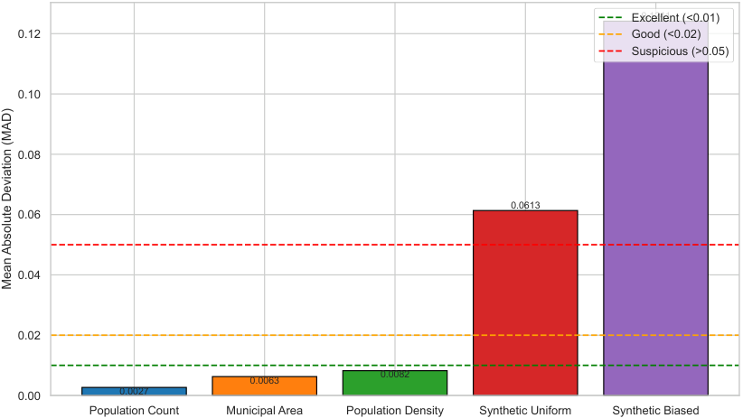
**Figure 3:** Comparison of Mean Absolute Deviation (MAD) scores for Benford's Law conformity across German Zensus 2022 variables and synthetic controls. Population Count (0.0027), Municipal Area (0.0063), and Population Density (0.0082) exhibit low deviation values consistent with theoretical expectations, whereas Synthetic Uniform (0.0613) and Synthetic Biased (0.1241) datasets demonstrate significantly higher deviations indicative of anomalous distributions.

forensic analytics [2].

The results also highlight the resilience of Benford's Law properties in derived variables. Population density is calculated as the ratio of population count to municipal area. Theoretically, operations such as division can distort digit distributions and break the logarithmic pattern expected under Benford's Law [5]. However, the observed MAD for population density remains low, suggesting that the underlying distributions of the numerator and denominator are sufficiently robust to preserve the overall conformity. This finding implies that derived metrics in official statistics can serve as reliable indicators of data integrity, provided the source variables themselves adhere to natural scaling laws. The synthetic controls further reinforce this conclusion; the uniform and biased datasets exhibit MAD values an order of magnitude higher than the real data, confirming that the observed patterns are not artifacts of the testing procedure but reflect genuine adherence to Benford's Law [7].

Despite these positive findings, several limitations must be acknowledged. First, the analysis is restricted to a single country (Germany) and a single census year (2022). While this provides a robust validation for the German context, it limits the generalizability of the results to other administrative systems or time periods [3]. Different data collection methodologies, cultural factors in number reporting, or temporal shifts in demographic trends could alter digit distributions. For instance, studies on emission reduction claims have shown that conformity varies by country and dataset characteristics, with some national contexts exhibiting substantial information loss when approximating observed distributions [10]. Second, the synthetic controls used for calibration are simplistic. The uniform distribution assumes complete randomness, and the biased control models only a specific type of human anchoring bias (overrepresentation of 5 and 6). Real-world data fabrication may involve more complex patterns that these baselines do not capture [6]. Consequently, while the current framework effectively distinguishes between natural

9
xxix

---

<!-- Page xxx -->

Appendix A Generated Research Paper 

data and obvious anomalies, it may lack sensitivity to sophisticated manipulation techniques. Furthermore, Benford’s Law has known limitations in detecting certain manipulations like uniform scaling or in datasets with defined minimums and maximums, which can lead to type-I and type-II errors [10]. 

Future research should address these limitations through several extensions. Longitudinal analysis comparing Zensus 2022 with previous census years (e.g., Zensus 2011) would allow for the detection of temporal shifts in conformity that might indicate changes in data collection practices or emerging anomalies [14]. Cross-country comparisons could further test the universality of Benford’s Law adherence across different administrative cultures and statistical systems, acknowledging that applicability may vary based on specific national contexts. Additionally, applying this methodology to financial datasets would expand the forensic utility of the approach beyond demographics, potentially offering new tools for detecting irregularities in economic reporting [11]. Finally, refining the synthetic control models to include more complex manipulation scenarios or using machine learning techniques to identify subtle anomalies could enhance the sensitivity of the detection framework [12]. 

In conclusion, this study demonstrates that Benford’s Law serves as a valid and effective forensic tool for validating the integrity of large-scale official census data. The integration of MAD metrics with synthetic controls provides a nuanced approach to interpreting conformity in high-volume datasets, mitigating the pitfalls of excessive statistical power inherent in traditional Chi-Square tests. The strong adherence of population counts, areas, and densities to Benford’s Law suggests that these variables are generated through natural processes rather than systematic manipulation. While limitations regarding scope and control complexity exist, the proposed methodology offers a solid foundation for future forensic analytics in demographic and administrative statistics. 

## 6 Conclusion

This study confirms that Benford’s Law serves as a robust forensic tool for validating largescale official census data, such as the German Zensus 2022 municipal records. The analysis demonstrates that population counts and municipal areas exhibit excellent conformity to the expected logarithmic distribution with low Mean Absolute Deviation (MAD) values, while the derived variable Population Density retains this natural pattern even after mathematical operations [5]. Using MAD instead of Chi-Square tests avoids flagging valid data as anomalous due to large sample sizes, providing a reliable indicator for distinguishing between natural variation and systematic manipulation in high-volume datasets [10]. For statistical agencies and auditors, these results suggest that first-digit frequency analysis offers a scalable, automated method for routine quality assurance without relying on subjective judgment. 

## References

- [1] J. Petráš, A. Hyseni, J. Zbojovský, and M. Pavlík, “Detecting benford’s law effectiveness threshold differences according to affecting operation,” _Axioms_ , vol. 14, p. 273, 2025. 

- [2] W. Kössler, H.-J. Lenz, and X. D. Wang, “Some new invariant sum tests and mad tests for the assessment of benford’s law,” _Computational Statistics_ , vol. 39, pp. 3779–3800, 2024. 

- [3] M. Ivanová, E. Škrabul’áková, A. Jandera, Z. Šárošiová, and T. Skovranek, “Benford’s law and transport infrastructure: The analysis of the main road network’s higher-level segments in the eu,” _ISPRS Int. J. Geo Inf._ , vol. 14, p. 450, 2025. 

- [4] R. Cerqueti and C. Lupi, “Some new tests of conformity with benford’s law,” _Stats_ , 2021. 

- [5] C. D. S. Azevedo, R. F. Gonçalves, V. L. Gava, and M. Spínola, “A benford’s law based method for fraud detection using r library,” _MethodsX_ , vol. 8, 2021. 

---

<!-- Page xxxi -->

Appendix A Generated Research Paper 

- [6] W. Schumm, D. Crawford, L. Lockett, A. bin Ateeq, and A. AlRashed, “Can retracted social science articles be distinguished from non-retracted articles by some of the same authors, using benford’s law or other statistical methods?” _Publ._ , vol. 11, p. 14, 2023. 

- [7] L. E. de Oliveira Silva and D. Figueiredo, “A novel approach to evaluate data integrity: Evidence from covid-19 in china,” _Brazilian Journal of Biometrics_ , 2024. 

- [8] E. Pinsky, “Computation and interpretation of mean absolute deviations by cumulative distribution functions,” _Frontiers Appl. Math. Stat._ , vol. 11, 2025. 

- [9] C. Schäfer, J.-P. Schräpler, K. Müller, and G. Wagner, “Automatie identification of faked and fraudulent interviews in the german soep,” _Journal of Contextual Economics – Schmollers Jahrbuch_ , 2005. 

- [10] M. Cole, D. Maddison, and L. Zhang, “Testing the emission reduction claims of cdm projects using the benford’s law,” _Climatic Change_ , vol. 160, pp. 407–426, 2019. 

- [11] I. Jianu and I. Jianu, “Reliability of financial information from the perspective of benford’s law,” _Entropy_ , vol. 23, 2021. 

- [12] D. Wiryadinata, A. Sugiharto, and T. Tarno, “The use of machine learning to detect financial transaction fraud: Multiple benford law model for auditors,” _Journal of Information Systems Engineering and Business Intelligence_ , 2023. 

- [13] H. R. Morales, M. Porporato, and N. Epelbaum, “Benford’s law for integrity tests of high-volume databases: A case study of internal audit in a state-owned enterprise,” _Journal of Economics, Finance and Administrative Science_ , 2022. 

- [14] E. Druică, B. Oancea, and C. Vâlsan, “Benford’s law and the limits of digit analysis,” _Int. J. Account. Inf. Syst._ , vol. 31, pp. 75–82, 2018. 

- [15] E. Pinsky and S. Klawansky, “Mad (about median) vs. quantile-based alternatives for classical standard deviation, skewness, and kurtosis,” vol. 9, 2023. 

- [16] T. Shalini, T. Shyamili, T. Lilly, and S. Rao, “Data quality assessment using benford’s law and excel,” in _2023 Third International Conference on Advances in Electrical, Computing, Communication and Sustainable Technologies (ICAECT)_ , 2023, pp. 1–4. 

xxxi
