<!-- Page 1 -->


hochschule mannheim

# Influence of Hyper-Parameter and pipeline tuning for supervised machine classification and semi-supervised clustering in the field of Sentiment Analysis

Sven Köhler

Bachelor Thesis
for the acquisition of the academic degree Bachelor of Science (B.Sc.)
Course of Studies: Computer Science

Department of Computer Science
University of Applied Sciences Mannheim

31.08.2017

**Tutors**
- Prof. Dr. Jörn Fischer, Hochschule Mannheim
- Dr. Hoang-Vu Nguyen, SAP SE

---

<!-- Page i -->

**Köhler, Sven :**

Influence of Hyper-Parameter and pipeline tuning for supervised machine classification and – semi-supervised clustering in the field of Sentiment Analysis / Sven Köhler. Bachelor Thesis, Mannheim : University of Applied Sciences Mannheim, 2017. 90 pages. 

**Köhler, Sven :**

Einfluss von Hyper-Parameter und Pipeline-Tuning für überwachtes, maschinelles Lernen – und teilweise unüberwachtes Clustern von stimmungsabhängigen Texten / Sven Köhler. Bachelor Thesis, Mannheim : Hochschule Mannheim, 2017. 90 Seiten.

---

<!-- Page i -->

## Erklärung

Hiermit erkläre ich, dass ich die vorliegende Arbeit selbstständig verfasst und keine anderen als die angegebenen Quellen und Hilfsmittel benutzt habe. 

Ich bin damit einverstanden, dass meine Arbeit veröffentlicht wird, d. h. dass die Arbeit elektronisch gespeichert, in andere Formate konvertiert, auf den Servern der Hochschule Mannheim öffentlich zugänglich gemacht und über das Internet verbreitet werden darf. 

Mannheim, 31.08.2017 

Sven Köhler

---

<!-- Page ii -->

*[Empty page — skipped]*

---

<!-- Page iii -->

## Abstract

**_Influence of Hyper-Parameter and pipeline tuning for supervised machine classification and semi-supervised clustering in the field of Sentiment Analysis_**

This thesis deals with the machine learning task of text classification. Three approaches are implemented, hyper-parameter optimized and then compared. Furthermore the whole machine learning pipeline including the cleaning, preprocessing, vectorisation, feature selection and classification steps are compared and optimized in extensive grid searches. The selected approaches are from the area of classical probability theory (Naive Bayes), the area of mathematical models (support vector machines) and from the field of deep learning (Convolutional Networks). Based on the interim results from the first section, the most significant sentiment related dimensions are searched, determined, extracted and clustered. By using this filtering, the accuracy of the subsequent classification can be partially increased. At the same time, a new way is shown how documents can be clustered and visualized in an semi-unsupervised manner. In this step, the extracted features are compressed by more than 99%. This considerably reduces the complexity of the data without much loss of information. 

**_Einfluss von Hyper-Parameter und Pipeline-Tuning für überwachtes, maschinelles Lernen und teilweise unüberwachtes Clustern von stimmungsabhängigen Texten_**

Diese Arbeit befasst sich mit dem maschinellen Klassifizieren von Text. Dabei wurden drei Ansätze implementiert, mittels Hyperparameter-Tuning und Raster-Suchen optimiert und anschließend verglichen. Die ausgewählten Ansätze sind aus dem Bereich der klassischen Wahrscheinlichkeitsrechnung (Naive Bayes), dem Bereich mathematischer Modelle (Support Vector Machines) und aus dem Gebiet des Deep Learnings (Convolutional Networks). Aufbauend auf den Zwischenergebnissen aus dem ersten Abschnitt werden die signifikantesten Stimmungs-Dimensionen in den numerischen Rezensions-Repräsentationen gesucht, bestimmt, extrahiert und geclustert. Durch diese Filterung kann die Genauigkeit der nachfolgenden Klassifikation teilweise erhöht werden. Gleichzeitig wird ein neuer Weg gezeigt, wie Dokumente semi-supervised geclustert und visualisiert werden können. In diesem Schritt werden die extrahierten Features um mehr als 99% verdichtet was die Komplexität der Daten erheblich verringert ohne das der Informationsgehalt stark nachlässt. 

---

<!-- Page iv -->

*[Empty page — skipped]*

---

<!-- Page v -->

## Contents

- **Introduction** 1
  - Motivation - Is it just a wish? 1
  - Outline of this document 3
  - Surrounding 4
- **Execution plan** 5
  - Research, paper studies and goal definition 5
  - Dataset research 6
    - Aclimdb Movie Reviews 8
    - Polarity Movie Reviews 9
    - Kaggle Movie Reviews 9
    - Sentiment word lists 9
  - Prototyping 10
    - Python Developing 10
    - Text processing with NLTK 10
    - Scikit-Learn as ML-Framework 11
    - Tensorflow as ML Framework 11
  - Evaluation 11
- **Related work** 13
  - Text classification 13
  - Sentiment analysis 14
  - Vectorization of text 16
  - Hyper-parameter tuning for machine learning 17
- **Base and definition of sentiment analysis** 19
  - Derivation of Sentiment Analysis (SA) 19
    - Natural Language Processing (NLP) 20
    - Document classification 20
    - Sentiment Analysis 21
  - Sentiment Analysis (SA) steps 22
    - Pre-processing 22
    - Vectorizing 24
    - Classification 30
    - Evaluation and visualization 33
    - Convolutional Networks 37
- **Experimental setup** 41
  - Naive Bayes 41
    - Train the model 42
    - Inference step 42
    - Optimization 43
  - Support vector machines 45
    - Train the Model 46
    - Inference step 47
    - Optimization 48
  - Convolutional network 54
    - Train the model 55
    - Inference step 57
    - Optimization 57
- **Results** 59
  - Accuracy 59
    - Naive Bayes 59
    - SVM 62
    - CNN 68
  - Visualization and semi-supervised clustering 69
    - Word vectors 70
    - Document vectors 76
    - Improvements 81
- **Conclusion** 85
  - Outcome 86
    - Naive Bayes 86
    - SVM 86
    - CNN 87
  - Further work 87
  - Own Opinion 89
- **List of Abbreviations** vii
- **List of Tables** ix
- **List of Figures** xi
- **Bibliography** xvii

---

<!-- Page vi -->

---

<!-- Page 1 -->

# Chapter 1: Introduction

## 1.1 Motivation - Is it just a wish?

**Busy-Reader:** 'Can you please summarize this document for me, I would like to read a conclusion and whether others liked it.'

**Machine-Learning-Guy:** 'Sure I summarized all words with a word cloud in fig. 1.1. It seems that the topic of this thesis is sentiment related, but I do not know if this representation still contains all informations.'

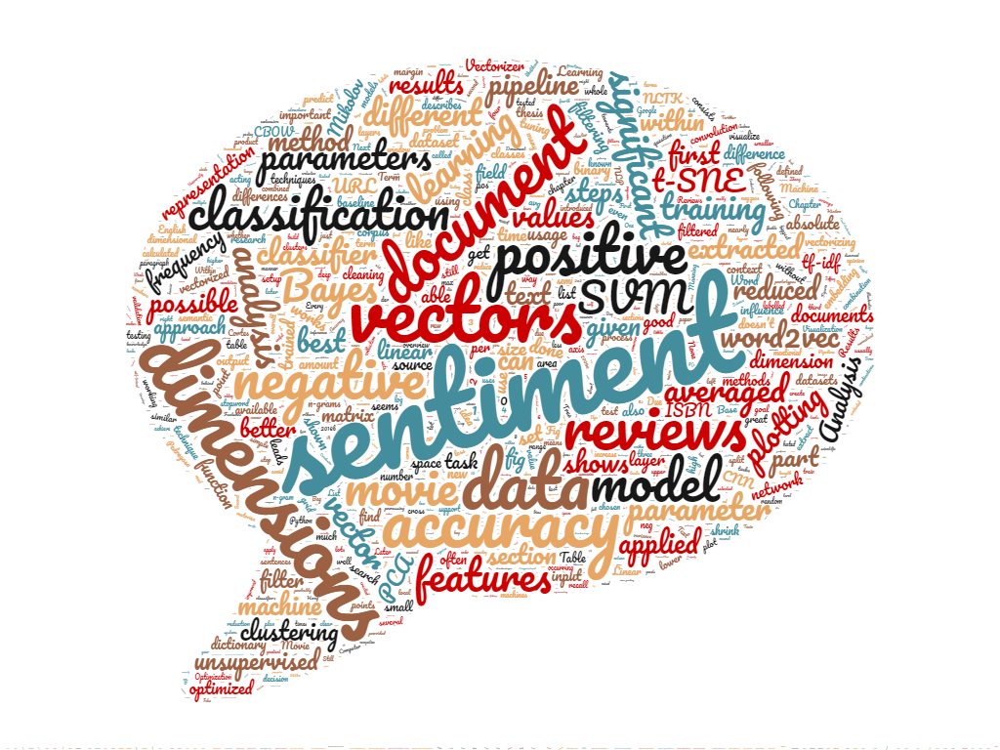
**Figure 1.1:** What is this Thesis about?

**Busy-Reader:** 'Hmm that looks great, but what’s about the context of these words, and did others liked the content?!?'

---

<!-- Page 2 -->

Why is it nowadays so important to summarize data? 

According to EMC² 1,7 MB of new information is created for every human on the planet - every second of every day. This leads to the point that the amount of data available is doubling every two years. By this we will get a 50-fold growth from the beginning of 2010 to the end of 2020. With the growth of the available data, the amount of texts available online has increased exponentially. What is this information about? And are we still able to access this amount of data in a meaningful timely manner? 

Most people will agree, buying a new printer often leads in endless hours of reviewreading research evenings. The overall driving question for this extensive work is mostly quite easy: ’What’s the opinion of other customers about this product/ this movie/ this topic?’. The expressed opinion of one user influences the decision of others in a way we would not have imagined a few years ago. Often it’s not possible to read through all the available text resources manually. According to this fact people started to develop machine based classification systems. 

Nowadays lots of companies are researching and even whole professional fields are searching for better solutions for this topic (fig. 2.1). The field of sentiment analysis is related to the overall topic of text classification. While information extraction techniques have been evolved to deal with the ever growing amount of texts available, sentiment analysis is still not generally possible. 

With this background this work will try to answer the following questions: How do Sentiment Analysis work? Which method is working best so far, and why? How do newer, neuronal network based approaches change the field of sentiment analysis? 

Humans are able to predict the sentiment of a given text only by reading a document word by word. From this we know that the sentiment should be encoded within the document. But how to visualize our data source? Is it possible to extract and visualize only the sentiment of a given text? Maybe one can compress a document by filtering the sentiment related informations and skip the rest. 

---

<!-- Page 3 -->

## 1.2 Outline of this document

This section grants a short outline for this document. This document describes the path and outcome of a sentiment classification research. The document is split into seven chapters. 

**Chapter 1 - Introduction**

This part illustrates the overall motivation for this work and the outline of this document. 

**Chapter 2 - Execution plan**

Within this chapter there is a description of the general procedure plan during the bachelor thesis. 

**Chapter 3 - Related Work**

This section will place the researches of this thesis in the scientific field of sentiment 

**Chapter 4 - Base and definitions**

In this chapter there are two sections, the first one will derive the field of sentiment analysis in the huge field of machine learning. In the second section the basic ideas and math behind the machine learning steps will be explained. 

**Chapter 5 - Experimental setup**

Within this part the machine learning steps and parameters implemented for the defined pipelines will be explained in more detail. At the same time the methods will be mapped to real data. 

**Chapter 6 - Results**

This chapter is divided into two sections. The first section grants an insight of the best working supervised machine learning pipelines and parameter values from the extensive grid searches. The second part shows the unsupervised clustering results and weather it is possible to extract only the sentiment related features from a given text document. 

**Chapter 7 - Conclusion**

In this part the outcome from chapter six will be summarized and interpreted. At the same time it grants a perspective for possible further questions and researches based on this work. This chapter ends with a short statement about the writers own opinion. 

---

<!-- Page 4 -->

## 1.3 Surrounding

This investigation is part of the bachelor thesis. The research, implementation and written part should be done within three months. The bachelor thesis is part of the computer science studies at the University of Applied Sciences Mannheim. 

**Company**

The thesis takes place at the Innovation Center Networks area of the SAP SE. SAP SE is a German multinational software corporation that makes enterprise software to manage business operations and customer relations. SAP is headquartered in Walldorf, Baden-Wuerttemberg, Germany, with regional offices in 130 countries. The company has over 293,500 customers in 190 countries. The company is a component of the Euro Stoxx 50 stock market index. 

**Department**

The department of execution is part of the machine learning Platform Foundation. The task of this department is providing functional machine learning services through the cloud. 

**Hochschule**

The first computer science course at the Hochschule Mannheim was introduced back in 1974. This made the university to one of the first in Germany that gave this scientific discipline an academic status. The bachelor and master courses on offer in Mannheim concentrate mainly on software development in the field of practical and applied computer technology. 

---

<!-- Page 5 -->

# Chapter 2: Execution plan

The overall procedure of this thesis is separated in four steps, research and paper studies, dataset research, prototyping and evaluation. The following sections explains these steps more closely. 

Sentiment analysis is a data driven approach. To get an understanding of what has to be done, lots of papers, books and blogs are worked through at the beginning. After this the work started with data collection, data preparation and data cleaning to decide which machine learning techniques later can be used. Afterwards the possible approaches has to be explored by lots of prototypes to decide the usage of concrete methods and frameworks. As last step the explored methods will be improved and compared on a deeper level to make a clear outcome of this research. 

## 2.1 Research, paper studies and goal definition

Due to the point that sentiment analysis was a new thing for the author of this thesis, the question "how is sentiment analysis done nowadays?" has to be discovered. This has been done by reading several up-to-date papers and completing some small tutorials. In parallel a small mind map was created to visualize and remember the topics and gained experience. Building on this initial knowledge a smart goal definition was set to provide a focus for the further research. 

- S (specific) 

   - ⇒ Develop an operational sentiment analysis service for movie reviews with usage of at least one machine-learning-frameworks. 

---

<!-- Page 6 -->

- M (measurable) 

   - ⇒ Compare at least three different approaches which achieve an accuracy higher than 80%. 

- A (achievable) 

   - ⇒ Start with the statistical methods and increase the complexity step by step up to the usage of modern neuronal networks. 

- R (results-focused) 

   - ⇒ Improve the accuracy of every method by optimizing the preprocessing, vectorizing or classification step. 

- T (time related) 

   - ⇒ Create a timeline with interim goals for each stage of this thesis. 

During the first prototypes the decision was made to compare different SA approaches instead of creating one shippable Rest-full SA-service. 

Focused on the goal definition the question comes up: "Do deep learning approaches outperform statistical methods in the task of sentiment analysis and which method does perform the best?" 

## 2.2 Dataset research

For the SA research done in this thesis labelled data sets were needed. This section describes the used datasets and explains the decision process for this datasets. At first the department asked to search for German or maybe multilingual, labelled, commercially available datasets. This leads to the question which document types are available online, sentiment related and big enough to avoid over-fitting. Most papers about sentiment analysis uses Twitter feeds, product reviews, movie reviews or sentiment related dictionaries as data source. According to Dashtipour u. a. [2016b] one of the main problems in multilingual sentiment analysis is a significant lack of resources. Thus, sentiment analysis in other languages than in English is often addressed by transferring knowledge from resource-rich to resource-poor languages, because there are less resources available in other languages. Fig. 2.1 and fig 2.2 shows the gap between English and multilingual related scientific publications. There are only very few SA publications in other languages and by this there are very less or even no datasets available. 

---

<!-- Page 7 -->

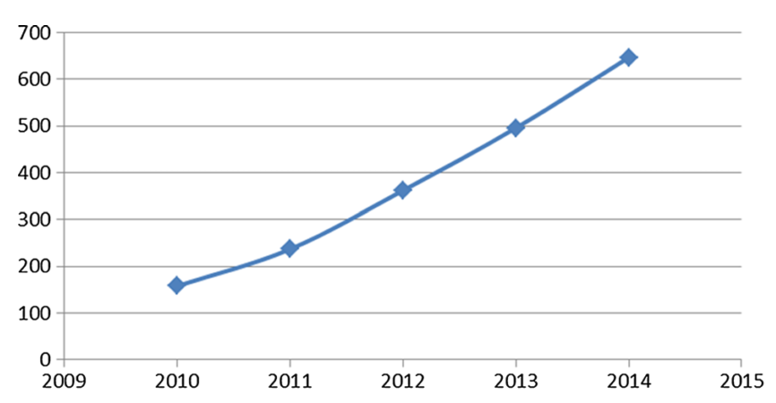
**Figure 2.1:** Number of publications on English sentiment analysis, per year Dashtipour u. a. [2016b]

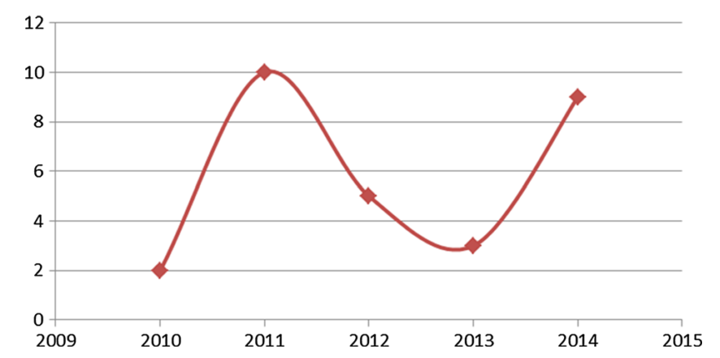
**Figure 2.2:** Number of publications on multilingual sentiment analysis, per year Dashtipour u. a. [2016b]
Thereby the majority of multilingual sentiment analysis employ English lexical resources such as SentiWordNet or machine translation to translate texts into other languages.

There are some German datasets related to the sentiment analysis topic. Most of them are either only dictionary based or very small and not commercially available. Due to the lack of free available German or multilingual datasets two possibilities have been tried.

The first possibility oriented on the idea of the multilingual approaches. It was tried to translate existing datasets into other languages. To achieve this, a translation script based on the Google Cloud Translation API was implemented. Unfortunately Google limits the amount of automatic translations. Besides that, the quality of automatic translated texts is sometimes very poor. Especially sentiment related doc-

---

<!-- Page 8 -->

uments which are often ironically or slang based texts often looses their sentiment direction by automatic translation. 

The second idea was to create an own Twitter-based dataset. For this idea a Twitter crawler was build. Actually Twitter offers a search where language and the possible sentiment can be chosen. This search is accessible by the developer search-API. Unfortunately the sentiment property is not available for automatic requests. Unfortunately the legal situation is not clear and the clarification will probably take a long time. 

Most of the German SA papers are based on datasets from the Interest Group on German Sentiment Analysis (IGGSA). The datasets provided are mostly dictionary based. Due to the point that this research should not only build on dictionary based approaches, the decision was made to work with English datasets. Otherwise the focus of this work would have been changed towards the field of pure data science and data generation. 

Most of the English papers about SA worked with labelled Twitter feeds, Amazon product reviews or Movie Reviews. Twitter feeds are often barely objective and even humans are not able to tell the sentiment. The Amazon product review dataset seemed to be to computationally expensive. It consists of around 35 million reviews from Amazon from the last 18 years. This led to the decision to use movie reviews. To reduce the complexity only binary labelled movie reviews were used. To achieve a better generalization three different movie review sources were mixed. Every data source has a different average review length. The mixed dataset is balanced with the number of positive and negative reviews. The following sections explains them in more detail. For the visualization part a English word list from the University of Illinois was added. 

### 2.2.1 Aclimdb Movie Reviews

This dataset from the Stanford University Maas u. a. [2011] contains 50,000 reviews split evenly into 25k train and 25k test sets. The overall distribution of labels is balanced (25k pos and 25k neg). The dataset also includes additional 50,000 unlabelled documents for unsupervised learning. 

In the entire collection, no more than 30 reviews are allowed for any given movie because reviews for the same movie tend to have correlated ratings. Further, the train and test sets contain a disjoint set of movies, so no significant performance is 

---

<!-- Page 9 -->

obtained by memorizing movie-unique terms and their association with observed labels. In the labelled train/test sets, a negative review has a score <= 4 out of 10, and a positive review has a score >= 7 out of 10. Thus reviews with more neutral ratings are not included in the train/test sets. In the unsupervised set, reviews of any rating are included and there are an even number of reviews > 5 and <= 5. 

### 2.2.2 Polarity Movie Reviews

The polarity dataset comes from the Cornells University Pang und Lee [2004]. This data consists of unprocessed, unlabelled html files from the IMDb archive. The files used for this work represent a processed subset of these files. It consists of 1000 positive and 1000 negative processed reviews. 

The decision weather a review is positive or negative is based on the following rules. With a five-star system (or compatible number systems): three-and-a-half stars and up are considered positive, two stars and below are considered negative. With a four-star system (or compatible number system): three stars and up are considered positive, one-and-a-half stars and below are considered negative. With a letter grade system: B or above is considered positive, C- or below is considered negative. 

### 2.2.3 Kaggle Movie Reviews

The third dataset used for this work is taken from a Sentiment Classification Task provided by Kaggle. The original data comes from opinmind.com (which is no longer active). It consists of 3995 positive and 3091 negative related reviews. Kaggle gives no further informations about this dataset. 

### 2.2.4 Sentiment word lists

A list of English positive and negative opinion words or sentiment words (around 6800 words). This list was compiled over many years starting from this first paper Hu u. a. [2004]. 

---

<!-- Page 10 -->

## 2.3 Prototyping

For this work lots of standalone prototypes and a small testing framework are created. Most of the machine learning steps are grouped by their responsibility and encapsulated into small classes to loose the dependencies. All prototypes are written with Python 3.5.0. The next sections gives a short overview about the used libraries. For this prototypes classes were build around every classifier, vectorizer and preprocessing step to abstract the used library and to create flexible and replaceable modules. Most of the computational work is done on the local machine. Heavy calculations, extensive grid searchs and all tests with the Convolutional Network (CNN) has been done on a GPU cluster. This cluster has 8 x Tesla P100, with 16GB RAM on each. 

### 2.3.1 Python Developing

Python is an interpreted, object-oriented programming language similar to PERL. It is designed by Guido van Rossum. Python is an open source software and supports multiple programming paradigms, including object-oriented, imperative, functional programming and procedural styles. Python comes with a huge and comprehensive standard library. For this project Python 3.5.2 was used. All dependencies, libraries and further frameworks are defined in a requirements file and portable due to virtual environment. The source code itself is stored in a SAP owned Github-repository. 

### 2.3.2 Text processing with NLTK

According to nltk.org NLTK is a leading platform for building Python programs to work with human language data. It provides easy-to-use interfaces to over 50 corporal and lexical resources such as WordNet, along with a suite of text processing libraries for classification, tokenization, stemming, tagging, parsing, and semantic reasoning, wrappers for industrial-strength NLP libraries and an active discussion forum. For this thesis NLTK 3.2.3 was used. [Loper und Bird] 

---

<!-- Page 11 -->

### 2.3.3 Scikit-Learn as ML-Framework

Scikit-learn is a Python module for machine learning built on top of SciPy and distributed under the 3-Clause BSD license. For this work scikit-learn 0.18.2 was used. [Pedregosa u. a., 2011] 

### 2.3.4 Tensorflow as ML Framework

TensorFlow is an open source software library for numerical computation using data flow graphs. Nodes in the graph represent mathematical operations, while the graph edges represent the multidimensional data arrays (tensors) communicated between them. The flexible architecture allows you to deploy computation to one or more CPUs or GPUs in a desktop, server, or mobile device with a single API. TensorFlow was originally developed by researchers and engineers working on the Google Brain Team within Google’s Machine Intelligence research organization for the purposes of conducting machine learning and deep neural networks research, but the system is general enough to be applicable in a wide variety of other domains as well. For this work tensorflow 1.0 was used. [Abadi u. a., 2015b] 

## 2.4 Evaluation

After all prototypes were build up, evolved and improved, the Accuracy of each model was evaluated. The naive Bayes approach was used as baseline for this step. To improve the accuracy a deep understanding of where does the sentiment comes from was required. Investigating in this topic, the evaluation process evolved to a search for the representation of the sentiment in our text. During the evaluation phase once recognized that it is not always just the accuracy of a model that counts. Sometimes it is more important to search for the reason why one approach works. 

---

<!-- Page 12 -->

*[Empty page — skipped]*

---

<!-- Page 13 -->

# Chapter 3: Related work

This section splits the related work into related areas. The following part gives an 

## 3.1 Text classification

Automatic document classification means assigning a document to one ore more classes. This field consists of two sub-areas: Content based and request based. This thesis is related to the field of supervised, content based document classification. A very popular method for this task is the probabilistic based Naive Bayes approach. For this method there is no explicit feature extraction necessary. A. McCallum and K. Nigam compared different models for this approach to find out whether Bernoulli or Bayesian based models works better for document classification. [McCallum und Nigam, 1998] 

Most text classification systems works with supervised classification models combined with numerous variants of data preprocessing and feature vectorizing steps before to extracting the most important features of a text. [Baccianella u. a., 2010], [Hu u. a., 2004], [Manning u. a., 2009a] 

The deep learning approaches integrated the feature extraction step into their first layers to create an embedding matrix as input to their hidden layers, combined with pooling, dropout and normalization layers. The fully connected last layer assigns the extracted document features to some output classes with an activation function. [Kim, 2014], [Hong] 

---

<!-- Page 14 -->

## 3.2 Sentiment analysis

Sentiment analysis systems can be classified into phrase or lexicon based approaches, unsupervised corpus- based and supervised corpus-based approaches. The last field again is separated into traditional and deep learning based techniques. All fields have their individual use cases, advantages and disadvantages. 

Phrase based is a technique where one determines first whether an phrase is neutral or polar. Afterwards the polarity of the polar expression is evaluated with the help of sentiment related dictionaries. In these lexicons, entries are tagged with their out of context polarity. Some dictionaries label their word and phrases binary others are divided in fine labels or represents the sentiment with floating points. One of the largest binary labelled lexicons is the WordStat sentiment Dictionary mentioned by [Loughran und McDonald, 2011]. Bing Liu distributes a sentiment lexicon which includes mis-spellings, morphological variants, slang and social-media mark-up [Liu, 2012]. SentiWordNet is a lexical resource that assigns WordNet synsets to three categories: positive, negative and neutral, using numerical scores ranging from 0.0 to 1.0 to indicate the category of this word. [Baccianella u. a., 2010] In the current time there are several sentiment related lexicons public available with lots of papers applying these for the task of sentiment analysis. 

Unsupervised approaches to sentiment classification can solve the problem of domain dependency and reduce the need for annotated training data. Turney applied a specific unsupervised learning technique. In this paper, the semantic orientation of a phrase is calculated as the mutual information between the given phrase and the word “excellent” minus the mutual information between the given phrase and the word “poor”.[Turney, 2002] Zagibalov and Carrol described a method of automatic seed word selection for unsupervised sentiment classification of product reviews in Chinese. [Zagibalov u. a., 2008] Rothfels and Tibshirani applied this unsupervised method to German movie reviews. The intuition behind their approach is that “positive sentiment seeds” can be extracted from text on the basis of occurring frequently after negation, but more frequently without negation. A “positive sentiment seed” is defined as a sequence of characters. [Rothfels und Tibshirani, 2010] 

The majority of practical machine learning uses supervised training methods. They can be split into traditional and deep learning approaches. 

Some of the traditional approaches are the probabilistic based Naive Bayes (NB) classifiers which are often used as baseline [Pang und Lee, 2005], the still extremely 

---

<!-- Page 15 -->

powerful Support Vector Machine (SVM) [Cortes und Vapnik, 1995] which are very flexible due to the possibility of changeable kernels. K. Dashtipour and his colleagues created a really great paper [Dashtipour u. a., 2016b] describing the use of SVMs with numerous combinations for multilingual sentiment approaches. The experimental setup from K. Dashtipour influenced this work to include SVMs into our tests. NB and SVM are linear kernels which makes them really fast and robust even for small datasets. By this it is possible to run thousands of different pipelines within an acceptable time. Ensemble learning techniques, which uses multiple learning algorithms instances to obtain better accuracies. Zhou and Feng shortly described an deep forest approach as alternative to deep neural networks [Zhou und Feng]. There are lots of different traditional ways for sentiment classifications, some are mixed with traditional vectorizing methods and others are mixed with modern unsupervised feature extractions. 

Nowadays there are more and more deep learning approaches applied to the field of sentiment classification tasks. J. Hong and M. Fang reported a short and really nice paper in which they compared the usage of LSTMs and Deep recursive Neural Networks with features from T. Mikolovs and Q. Le’s [Mikolov u. a., 2013b], [Le und Mikolov, 2014] word and paragraph vectors. Y. Kim reports of the results using a CNN on top of pretrained word vectors for the task of sentiment analysis. He included some hyper parameter tuning techniques and modified the architecture a little to use static and non-static vectors [Kim, 2014]. This approach is very similar to the CNN tests done within this thesis. 

A. Radford and his colleagues works on the topic of generating new Reviews and discovered a sentiment neuron within their byte-level recurrent language model. In their approach they first trained a multiplicative Long Short Term Memory (LSTM) with 4096 units on a corpus of 82 million Amazon reviews to predict the next character in a chunk of text. The training took one month on their NVIDIA Pascal GPUs. Next they turned the model into a sentiment classifier by taking a linear combination of these units, learning the weights of the combination via the available supervised data. While training the linear model with L1-regularization they noticed that this classifier uses only a few of the learned units. Later they realized there is one ’sentiment neuron’ that’s highly predictive of the sentiment value. [Radford u. a., 2016] By fixing the value of this neuron they are able to create only positive or negative reviews. 

---

<!-- Page 16 -->

## 3.3 Vectorization of text

In the area of text analysing the raw data, a sequence of symbols cannot be fed directly to the algorithms themselves as most of them expect numerical feature vectors with a fixed size rather than the raw text documents with variable length. Vectorizing is the general process of turning a collection of text documents into numerical feature vectors [Pedregosa u. a., 2011]. This area can be split into traditional techniques and deep learning techniques. 

The first field is related to bag of words or bag of n-gram based vectorizing steps [Harris, 1954] [Sivic und Zisserman, 2009]. In this field each word/n-gram occurring in the corpora represents a dimension of the feature vector. Depending on the task this features can be represented binary, frequency based or weighted. This approach was then evolved to weight the term frequency in respect to the document frequency. By the usage of tf-idf weighted features it is possible to reflect importance of a feature to a document within a collection of documents which is well explained in [Manning u. a., 2009a, p.118ff], [Rajaraman und Ullman, 2011]. The traditional vectorizing steps had the disadvantages to lose a lot of semantic and syntactic informations of their features. 

T.Mikolov and his colleagues introduced 2013 two Word2Vec architectures [Mikolov u. a., 2013b] of unsupervised feature learning. The continuous bag of words learns to predict the words occurring before and after a given word. The output layer of this neuronal network returns a n-dimensional feature vector which reflects the context in which this word usually occurs. The other architecture is known as skip-gram where the neuronal network learns to predict the context for a given word. This field is called embedding learning and is used by lots of current researches [Hong], [Manning u. a., 2009a] For document representation this word vectors are usually averaged. By this we lose the sequence of our words. 

To keep this information the Doc2Vec model was introduced. More precisely, it concatenates the paragraph vector with several word vectors from a paragraph and predicts the following word in the given context. Both word vectors and paragraph vectors are trained by the stochastic gradient descent and back-propagation [Le und Mikolov, 2014]. 

Character level based embeddings for text classifications are at the beginning of their scientific path. While almost all classification techniques nowadays are based on words or n-grams combined with simple statistics to design the best features. 

---

<!-- Page 17 -->

This approach performs morphological analysis at character level. They show that networks do not require the knowledge of words or semantic and syntactic structure of a language [Zhang u. a., 2015] [Cao und Rei, 2016]. 

## 3.4 Hyper-parameter tuning for machine learning

Hyper-parameter tuning means in the field of machine learning means to find the best working machine learning pipeline by optimizing all indirectly learned parameters within the estimator. 

One way of optimizing the parameters can be to investigate the role of preprocessing, stopword removal, tokenization, stemming, POS-tagging [Haddi u. a., 2013] [Kotsiantis u. a., 2006] [Copestack, 2004] [Das und Balabantaray, 2014] [Manning u. a., 2009a] [Ghag, 2014] . 

Another approach is to find the best working overall architecture of the neural network or machine learning pipeline for a specific task. This leads to the question whether one should use Doc2Vec, Word2Vec or Char2Vec as vector space model [ Reh˚uˇrek[ˇ] und Sojka, 2010], a CBOW or Skipgram-based architecture for the embedding part [Mikolov u. a., 2013a] [Mikolov u. a., 2013b]. Optimization by better generalisation through dropout-layers [Srivastava u. a., 2014] or better accuracies through deeper layers and new network architectures or classification approaches [Szegedy u. a., 2016a] [Szegedy u. a., 2016b], [LeCun u. a., 1998] [Cortes und Vapnik, 1995]. 

Last but not least each parameter itself can be optimized. This could concern the vectorizing, feature weighting, feature selection, normalization and classification modules. Instead of doing these parameter tuning in a brute force way, there are approaches like the Bayesian Optimization. In this work, J. Snoek considered the automatic tuning problem within the framework of Bayesian optimization, in which a learning algorithm’s generalization performance is modelled as a sample from a Gaussian process [Snoek u. a., 2012] . Others have developed random search or gradient based optimization techniques [Pedregosa u. a., 2011] [Bergstra JAMESBERGSTRA und Yoshua Bengio YOSHUABENGIO, 2012] [Abadi u. a., 2015a] [Chapelle u. a., 2002]. 

---

<!-- Page 18 -->

*[Empty page — skipped]*

---

<!-- Page 19 -->

# Chapter 4: Base and definition of sentiment analysis

This chapter describes the machine learning basics used for this thesis. Furthermore it explains the main steps within a sentiment analysis task. 

## 4.1 Derivation of Sentiment Analysis (SA)

There are different problems which can be solved by machine learning algorithms. This subsection places the sentiment analysis into the huge field of machine learning. 

There are different ways an algorithm can model a problem based on its interaction with the experience or environment or whatever we want to call the input data. Machine learning can be separated by different point of views. One is to split them by learning style: Supervised Learning, Unsupervised Learning and Semi-Supervised Learning. 

The following list grants a short overview of common problems and their approach for this area: Clustering (Unsupervised), Two-class and multi-class classification (Supervised), Regression: Univariate, Multivariate, etc. (Supervised), Anomaly detection (Unsupervised and Supervised), Recommendation systems, Supervised Two-class and Multi-class Classification, Logistic regression and multinomial regression, Artificial Neural networks, Decision tree, forest, and jungles, SVM (support vector machine), Perceptron methods, Bayesian classifiers (e.g., Naive Bayes) and Nearest neighbour methods (e.g., k-NN or k-Nearest Neighbour). 

---

<!-- Page 20 -->

The core of this work is about supervised binary classification and semi-Supervised clustering of text documents. Working with text in the field of computer science is often called natural language processing or NLP. 

### 4.1.1 Natural Language Processing (NLP)

According to Copestack [2004] NLP can be defined as the automatic (or semiautomatic) processing of human language. The term ’NLP’ is sometimes used rather more narrowly than that. Often excluding information retrieval and sometimes even excluding machine translation. NLP is sometimes compared with ‘computational linguistics’. Nowadays, alternative terms are often preferred, like ‘Language Technology’ or ’Language Engineering’. 

Some of the typical NLP-tasks are: 

- Spelling and grammar checking 

- Optical character recognition (OCR) 

- Information retrieval 

- Machine translating 

- 

- Document clustering 

### 4.1.2 Document classification

1964 the fabulist Jorg Luis Borges imagined classifying animals into: 

(a) those that belong to the Emperor, (b) embalmed ones, (c) those that are trained, (d) suckling pigs, (e) mermaids, (f) fabulous ones, (g) stray dogs, (h) those that are included in this classification, (i) those that tremble as if they were mad, (j) innumerable ones, (k) those drawn with a very fine camel’s hair brush, (l) others, (m) those that have just broken a flower vase, (n) those that resemble flies from a distance. 

This sounds rule-based and very complex. Luckily our classes are easier to define. Many language processing tasks are tasks of classification weather this text is part of one class or not. We focus on one common document classification task, sen- 

---

<!-- Page 21 -->

timent analysis, the extraction of sentiment. Which means extracting the positive or negative orientation that a writer expresses towards some object and within a document. Oxford dictionary defined sentiment analysis this way:

> The process of computationally identifying and categorizing opinions expressed in a piece of text, especially in order to determine whether the writer’s attitude towards a particular topic, product, etc. is positive, negative, or neutral.

This thesis works with the sentiment expressed within movie reviews.

### 4.1.3 Sentiment Analysis

Nowadays there are several topics like big data, intelligent solutions and opinion mining relating to sentiment analysis. But why is Sentiment Analysis so important? All the topics mentioned above are important due to the growth of web content. The amount of online available data has been tripled within in the last ten years (Fig. 4.1).


**Figure 4.1:** Growth of global data - trend

Especially sentiment related text document, like product reviews, Twitter feeds or social media data, have increased (fig. 4.2). People express their opinion and share reviews with all other users. Their opinions about different subjects have a signif-

---

<!-- Page 22 -->

# 4 Base and definition of sentiment analysis

icant influence on each other's decisions. The sentiment towards a brand on the internet is important for any company concerned about the quality of its product, which makes it crucial for companies to understand people's sentiments towards products and services. [Dashtipour u. a., 2016a, p. 1]


**Figure 4.2:** Growth of global data - sources source : practicalanalytics.co

There are two common variants for SA. One of them is the binary classification of a text at the document-, sentence- or feature aspect. The goal of this method is to classify a phrase as positive or negative. Amazon defined the binary classification task very well on their online documentation. The other is called a fine-grained classification which are often used by product reviews where the sentiment is split into a scale from e.g. 0-5 (0 = very negative, ... 5 = very positive). Because sentiment is always a little bit subjective, it is very difficult to correctly label and train with fine grained datasets.

## 4.2 Sentiment Analysis (SA) steps

Typically every SA method consists of very similar steps. For a better understanding of the whole process this steps will be explained in the following sections.

### 4.2.1 Pre-processing

Data pre-processing is a very well known field in the natural language processing field. The idea behind this part is, that you get garbage out of your estimator if you

---

<!-- Page 23 -->

put garbage in. Real data, which later will be used as input for sentiment analysis is dirty. This means data can be incomplete, noisy and inconsistent. Data preprocessing includes data cleaning, normalization, transformation, feature extraction and selection. The result of this step is the final training and testing data set. [Kotsiantis u. a., 2006] 

**Tokenization**

Tokenizers are used to divide strings into lists of substrings. There are many NLP tools which provides the sentence or word tokenize functionality, for this project the NLTK sentence Tokenizer was used. It supports 17 European languages. The problem of sentence tokenizers is to decide weather a dot separates a sentence or not. The NLTK-Tokenizer uses an instance of PunktSentenceTokenizer from the NLTK tokenize.punkt module. This instance has already been trained and works well for many European languages. So it knows what punctuation and characters mark the end of a sentence and the beginning of a new sentence. The NLTK Library uses the TreebankWordTokenizer to split all words within a sentence in a list of words. [Manning u. a., 2009a] [Loper und Bird] 

**Stemming**

For grammatical reasons, documents are going to use different forms of a word, such as organize, organizes, and organizing. Additionally, there are families of derivationally related words with similar meanings, such as democracy, democratic, and democratization. In the case of sentimental studies, it seems that it would be useful to reduce diversity of words. There are different algorithms doing this, in this work the porter stemmer from Martin Porter was used. 

The goal of both stemming and lemmatization is to reduce inflectional forms and sometimes derivationally related forms of a word to a common base form. 

_am, are, is ⇒ be_ ; _car, cars, car[′] s, cars[′] ⇒ car_ 

**Lemmatization**

Lemmatization is closely related to stemming. The difference is that a stemmer operates on a single word without knowledge of the context, and therefore it cannot discriminate between words which have different meanings depending on part of speech. For example: The word "better" has "good" as its lemma. This link is missed by stemming, as it requires a dictionary look-up. Stemming usually refers to a crude heuristic process that chops off the ends of words in the hope of achieving 

---

<!-- Page 24 -->

this goal correctly most of the time, and often includes the removal of derivational affixes. Lemmatization usually refers to doing things properly with the use of a vocabulary and morphological analysis of words, normally aiming to remove inflectional endings only and to return the base or dictionary form of a word, which is known as the lemma. [Manning u. a., 2009a] 

## Part of Speech (POS)-Tagging

This process is often used in the traditional dictionary based sentiment-analysis approaches described in this paper [Das und Balabantaray, 2014]. POS is the process of tagging every word of a corpus with its word category based on the the word itself and the context. 

**Stopword-filtering**

A popular procedure to reduce the noise of textual data is to remove stopwords by using pre-compiled stopword lists or more sophisticated methods for dynamic stopword identification. There are different stopword lists for research available. Within this work the integrated word lists from NLTK and [Pedregosa u. a., 2011] are used. Stopword filtering could also be doine by counting the occurrence of all words and ignore words which appears in more than e.g. 80% of the documents. This technique is more flexible to changing stopwords or different derivations. 

**Corpus**

A Corpus in the area of machine learning is meant to be a huge collection of texts. Corpus analysis provide lexical information, morphosyntactic information, semantic information and pragmatic information. 

A more detailed description of each step is provided by Manning u. a. [2009a]. 

### 4.2.2 Vectorizing

Text analysis is a major application field for machine learning algorithms. However the raw data, a sequence of symbols cannot be fed directly to the algorithms themselves, as most of them expect numerical feature vectors with a fixed size rather than the raw text documents with variable length, that’s why we need a numerical representation of our text corpus. From tasks like object or speech recognition we know that all the information required to successfully perform the predictive tasks is encoded in the data itself. Due to the point that people can read a movie review and afterwards predict the sentiment of this review, shows that the information about the sentiment must be included in the text itself. By knowing this we need a method to 

---

<!-- Page 25 -->

represent our text in a way that all semantic, syntactic and especially the sentiment related informations are included within this representation. 

_Bag of Words_
Bag Of Word (BOW) is a very simple representation method. It represents all words and their frequency. But it is not able to capture the order of the words. By this the semantic and syntactic correlations will be lost. Assuming we have the following labelled movie reviews from table 4.1 as given labelled training set. 

|**ID|document|sentiment**|
|---|---|---|
|1<br>2<br>3<br>4<br>5|i loved the movie<br>i hated the movie<br>a great movie. good movie<br>poor acting<br>great acting. a good movie|positive<br>negative<br>positive<br>negative<br>positive|

**Table 4.1:** Example sentences

According to that training set our target classes will look like: Target classes _C_ = { + _, −}_ with _Cj ∈ C_ and _|C|_ = 2. Now we need to vectorize the training data with Bag Of Word (BOW) and calculate the frequency tables. 

We do not care about the word order, we just create a set of unique words which looks like this: dict = {i, loved, the, movie, hated, a, great, good, poor, acting} with _|dict|_ = 10. 

This dictionary or BOW is later used as a feature vector to present every single training or testing document. Every word of our dictionary represents one dimension in our feature vector. 

|**ID|i<br>loved<br>the<br>movie<br>hated<br>a<br>great<br>good<br>poor<br>acting|sentiment**|
|---|---|---|
|1<br>2<br>3<br>4<br>5|1<br>1<br>1<br>1<br>0<br>0<br>0<br>0<br>0<br>0<br>1<br>0<br>1<br>1<br>1<br>0<br>0<br>0<br>0<br>0<br>0<br>0<br>0<br>2<br>0<br>1<br>1<br>1<br>0<br>0<br>1<br>1<br>1<br>1<br>0<br>0<br>0<br>0<br>1<br>1<br>0<br>0<br>0<br>1<br>0<br>1<br>1<br>1<br>0<br>1|positive<br>negative<br>positive<br>negative<br>positive|

**Table 4.2:** Example sentences uni-gram vectorized

In this approach the algorithm gos through the complete corpora and remembers every token. In the next step each document response is modelled. Therefore every 

---

<!-- Page 26 -->

word appearing in this document will be counted. The response is a vector with the fixed length of the dictionary. 

A corpus of documents can thus be represented by a matrix with one row per document and one column per token occurring in the corpus. Typically this matrices are very sparse. To avoid memory leaks the data will be stored in a special sparse format. 

_Bag of n-grams_
This vectorizing method is equivalent to bag of words, where "words" are n-grams instead of unigrams. Instead of splitting every sentence from our example sentences (fig. 4.1) into single word based vectors, we can create a dictionary including every n-gram occurring in our document. For bigrams this will lead to the following dictionary: dict = {i loved, loved the, the movie, i hated, hated the, a great, great movie, movie good, good movie, poor acting, great acting, acting a, a good} With a larger _n_ more context of our document related phrases can be stored. Based on this dictionary we are able to create a document matrix similar to BOW (table 4.3). 

|**ID|i loved<br>loved the<br>the movie<br>_· · ·_<br>great acting<br>actinga<br>agood|sentiment**|
|---|---|---|
|1<br>2<br>3<br>4<br>5|1<br>1<br>1<br>_· · ·_<br>0<br>0<br>0<br>0<br>0<br>1<br>_· · ·_<br>0<br>0<br>0<br>_· · ·_<br>_· · ·_<br>0<br>0<br>0<br>_· · ·_<br>1<br>1<br>1|positive<br>negative<br>positive|

**Table 4.3:** Example sentences bi-gram vectorized

_Term frequency–inverse document frequency (tf-idf)_
In contrast to the BOW model which simply counts the frequency of a word the tf-idf model reflects the importance of a word for a document in a given corpus. There are two ideas behind tf-idf which are very useful for the sentiment analysis part. First, in a large corpus some words might appear very often (e.g. "the", "a", "is" in the English language) but they are carrying very little meaningful information about the content of the actual document. To achieve better results and to speed up the training step we want to filter them from our corpus. Secondly we are interested in the most meaningful features of our corpus. Both is possible with the tf-idf model. 

---

<!-- Page 27 -->

**Definition:** Term frequency–inverse document frequency (tf-idf) is the product of two statistic values, term frequency and inverse document frequency.

The **term frequency** measures how often a word or feature appears in our current document. The easiest way is to use the raw count of this word. But there are other ways to express the term frequency. In this case we define $tf(d, f)$ as $f_{df}$ with $t$, the number of times that term $t$ occurs in the document $d$. As mentioned by Manning u. a. [2009b] the term frequency could be calculated in different ways:

$$
f_{df} = \begin{cases} 0, & \text{if } \sum_{t \in d} t < 1 \\ 1, & \text{otherwise} \end{cases} \quad (4.1)
$$

**Figure 4.3:** Term frequency - binary count

$$
\sum_{t \in d} t \quad (4.2)
$$

**Figure 4.4:** Term frequency - raw count

$$
\sum_{t' \in d} f(t', d) \quad (4.3)
$$

**Figure 4.5:** Term frequency - document length adjusted

There are some more normalization methods, like double normalization to prevent a bias towards longer documents, but this is out of the scope of this document.

The **inverse document frequency** measures how important this word or n-gram is for the complete corpus. Or how often does this feature occur in other documents. We use the naming from the tf-example above and add $D = corpus$ and $N = |D|$.

**Word2Vec**

In 2013 T. Mikolov introduced two novel model architectures for computing continuous vector representations of words from very large data sets. He complains that current NLP systems and techniques treat words as atomic units. He also refers that there is no notion of similarity between words, as they are represented as indices in a vocabulary. In parallel he referenced that simple techniques are at their limits in many tasks. For example, the amount of relevant in-domain data for automatic speech recognition is limited and the performance is usually dominated by the size

---

<!-- Page 28 -->

## 4 Base and definition of sentiment analysis

$$1 + \log(f_{df})$$ (4.4)

**Figure 4.6:** Term frequency - log normalized

$$idf(t, D) = \log\left(\frac{N}{1 + |d \in D : t \in d|}\right)$$ (4.5)

**Figure 4.7:** Inverse document frequency - with adjusted denominator

of high quality transcribed speech data (often just millions of words). He summarizes that the usage of distributed representations of words mostly outperform N-Gram models due to their successful concept. Mikolov u. a. [2013a]

Word2vec is a method that captures the context of words, while at the same time it reduces the dimensionality of the data. There are two different architectures how this model is trained: Continuous Bag of Words (CBOW) and Skip-gram. The goal of CBOW is to predict given a word $w_t$ given the surrounding words. While Skip-gram predicts a window of words $w_{t-n} - w_{t+n}$ to a single given word.

The following figure from Mikolov gives a good overview about these two methods:

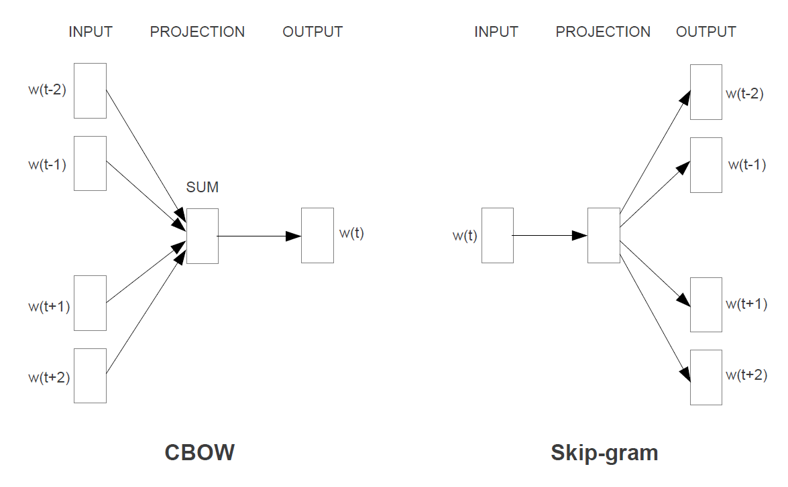

*Figure 4.8: The new model architecture for the CBOW and Skip-gram method, provided by

---

<!-- Page 29 -->

of accuracy, one can take the embedding matrix from the trained network. The embedding matrix is of rank (vocab-size, embedding-size) and projects a sparse vector of rank vocab-size into a dense vector of rank embedding-size. The dense vector represents the position of the word in "word2vec" space. Because the word is squeezed into a smaller space based on training it against its context, words with similar context tend to cluster in this space.

The advantages of this method is that these word vectors now captured the context of surrounding words. Mikolov proved that by using basic algebra to find a word relation (i.e. $'king' - 'man' + 'woman' = 'queen'$). Now word vectors can be used for any classification model as previously done with bag of words, to classify the sentiment. Further this vectors are mapped into a much lower space while carrying more contextual information at the same time. By setting the context window size we can specify how many words before and after the given word are included to the context of the given word. This method captures the context for a word. To get a document or paragraph representation the vectors will be averaged.

These word-vectors can be visualized by projecting them down to two dimensions using for instance the t-SNE dimension reduction technique. Mikolov discovered that certain directions in the induced vector space specialize towards certain semantic relationships. e.g. male-female, verb tense and even country-capital relationships between words. The following figure from Mikolov Mikolov u. a. [2013b] illustrates the relations.

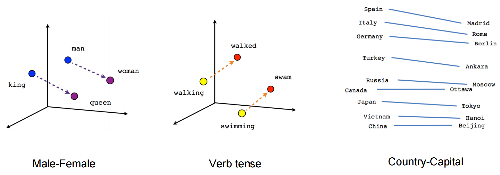
**Figure 4.9:** Linear semantic relationship for word vectors, provided by Mikolov u. a. [2013b]

**Doc2Vec**

Q. Le and T. Mikolov proposed the paragraph vector as solution to the disadvantage of simple word averaging to get a document or paragraph based representation of a document. Training word vectors occured as normal, except that an additional

---

<!-- Page 30 -->

# 4 Base and definition of sentiment analysis

vector representing the paragraph is added to the task whenever the sampled window comes from that paragraph. Thus, as more samples are taken over time from the paragraph, errors are backpropagated into the vector. This works for the CBOW and Skip-gram architectures. It has been shown that this representation works better than just averaging the word vectors together. Le und Mikolov [2014]

The disadvantage of this method is that one has to retrain the Doc2vec model for every new document. This leads to very long inference steps which is normally not acceptable for customers.

### 4.2.3 Classification

When we talk about the classification step within the supervised machine learning area we usually mean an algorithm that learned on given labelled datasets how to predict the correct class of new unseen and unlabelled data.

#### Naive Bayes

The mathematical description of this classifier is well defined by Jurafsky und Martin [2016] and looks like that: "Naive Bayes is a probabilistic classifier, meaning that for a document $d$, out of all classes $c \in C$ the classifier returns the class $\hat{c}$ which has the maximum posterior probability given the document." According to Jurafsky und Martin [2016] this section will use the hat notation $\hat{}$ in Eq. 4.6 to mean the estimate of the correct class.

$$\hat{c} = argmax_{c \in C} P(c|d) \quad (4.6)$$

#### Naive Bayes Theorem

The Naive Bayes' Theorem is the idea behind the Bayesian inference. It is known since Bayes u. a. [1763] This rule (Eq. 4.7) allows us to calculate the probability of $P(x|y)$ by three other possibilities. For text classification we can substitute Eq. 4.6 in Eq. 4.7, which leads to Eq. 4.8.

$$P(x|y) = \frac{P(y|x) \cdot P(x)}{P(y)} \quad (4.7)$$

---

<!-- Page 31 -->

$$ \hat{c} = argmax_{c \in C} P(c|d) = argmax_{c \in C} \frac{P(c|d) \cdot P(c)}{P(d)} \quad (4.8) $$

### Naive Bayes simplifications

Due to the point that we will divide every possible class by the fix dominator $P(d)$, we can simplify the eq to $\hat{c} = argmax_{c \in C} P(c|d) \cdot P(c)$ where $P(c|d)$ is the likelihood and $P(c)$ is the prior probability. For simplification we can also express the document $d$ as a set of features $f_1, f_2, ...f_n$.

### Naive Bayes Assumption

The Naive Bayes classifier makes two simplifying assumptions to reach a state where it is computable without a huge numbers of parameters for each feature and an impossible large training set. Jurafsky und Martin [2016]

The first assumption is the usage of BOW, where the position of a word in a document does not matter. The second assumption is called the naive Bayes assumption. Which says that every probability $P(f_i|c)$ is independent for a given class $c$ and can be multiplied by $P(f_1, f_2, ...f_n|c) = P(f_1|c) \cdot P(f_2|c) \cdot ... \cdot P(f_n|c)$. Finally we replace the feature $f$ with the indexed words $w_i$ and transfer the calculation in the log space to avoid underflow and increase the speed. These steps leads to our final Eq. 4.9 for text classification:

$$ c_{NB} = argmax_{c \in C} log(P(c)) + \sum_{i \in positions} log(P(w_i|c)) \quad (4.9) $$

### Support Vector Machines

Vapnik introduced 1995 the support vector networks for two group classification problems. Cortes und Vapnik [1995] He described this networks with the following words:

Input vectors are non-linearly mapped to a very high- dimension feature space. In this feature space a linear decision surface is constructed. Special properties of the decision surface ensures high generalization ability of the learning machine. The idea behind the support-vector network was previously implemented for the restricted case where the

---

<!-- Page 32 -->

training data can be separated without errors. [Cortes und Vapnik, 1995, p. 1]

The fine definition and derivation of the equations are well described by [Cortes und Vapnik, 1995]. In this section there will be just given an overview of the usage.

Assuming we have training data $\{x_1, x_2, \dots, x_n\}$, represented by vectors in a given space $X \subseteq \mathbb{R}^d$. Due to the point that we are in the area of supervised learning we also have their given labels $\{y_1, y_2, \dots, y_n\}$. For our binary classification problem y is defined with $y_i \in \{-1, 1\}$. Next we are searching for a $p - 1$ dimensional hyperplane which separates such training data according their labels. By this we are using a linear classifier.

Next we are searching for the hyperplane which maximizes the margin between the hyperplane and the nearest point $\vec{x}_i$ from each classification groups. With $\vec{w}$ = normal vector to the hyperplane and the bias $b$ which translates the hyperplane away from the origin. These hyperplanes can be written as: $\vec{w} \cdot \vec{x} - b = 0$

Figure 4.10 illustrates a linear classifier for 2-dimensional classification task. By this we defined two hyperplanes based on the support vectors, which are the nearest dots from each class. Between these data splitting hyperplane, there are no dots in between. $\vec{w} \cdot \vec{x} - b = 1$ and $\vec{w} \cdot \vec{x} - b = -1$ for our two classes.

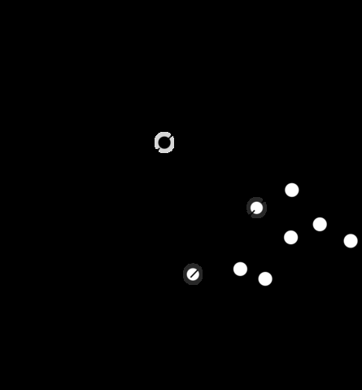
**Figure 4.10:** Maximum margin hyperplane 'By Cyc - Own work, Public Domain, https://commons.wikimedia.org/w/index.php?curid=3566688'

---

<!-- Page 33 -->

To maximize the margin, we use the distance of these two hyperplanes which is $\frac{2}{\|\vec{w}\|}$. By this we can minimize $\|\vec{w}\|$. This leads to the hard margin optimization problem, which is well explained and derived by Ben-Hur und Weston [2010].

$$
min(w, b) \quad \text{subject to:} \quad y_i(\vec{w} \cdot x_i - b) \geq 1, \quad \text{for} \quad i = 1, ..., n \quad (4.10)
$$

**Figure 4.11:** SVM - hard margin

Real world data is often not linearly separable. Even if it is, a greater margin can be achieved by allowing the classifier to misclassify some points. This part is also explained nicely by Ben-Hur und Weston [2010] and leads to a more general soft margin Eq. 4.11. Where $\epsilon_i \geq 0$ are slack variables to allow an data point to be in the margin. It is also called the margin error. Cortes und Vapnik [1995] introduced this equation. It could also be expressed using the Lagrange multiplier, but this is not part of this definition.

$$
\begin{aligned}
& min(w, b) & & \frac{1}{2}\|\vec{w}\|^2 \\
& \text{subject to:} & & y_i(\vec{w} \cdot x_i - b) \geq 1 - \epsilon_i, \quad \text{for} \quad i = 1, ..., n
\end{aligned}
\quad (4.11)
$$

### 4.2.4 Evaluation and visualization

Visualization of high-dimensional data is an important problem in many different domains, and deals with data of widely varying dimensionality. Over the last few decades, a variety of techniques for the visualization of such high-dimensional data has been proposed. Most of these techniques simply provide tools to display more than two data dimensions, and leave the interpretation of the data to the human observer. This severely limits the applicability of these techniques to real-world data sets that contain thousands of high-dimensional datapoints. Various techniques for this problem have been proposed that differ in the type of structure they preserve. Van Der Maaten und Hinton [2008]

This section describes the Principle Component Analysis (PCA) which represents classical dimensionality reduction methods. Afterwards the t-distributed stochastic neighbor embedding (t-SNE) method will be explained which was used mainly for the visualization part in section 6.

---

<!-- Page 34 -->

_Principle Component Analysis_
This technique comes from the statistical area. It uses orthogonal transformation to convert a observed dataset with correlated variables into a representation of linearly uncorrelated variables, which are called principal components. 

I.T. Jolliffe mentioned that the earliest descriptions of the technique now known as PCA was given by Pearson (1901) and Hotelling (1933). The following definition is an extraction of his book Principal Component Analysis, Second edition. Suppose that _x_ is a vector of _p_ random variables, and that the variances of the p random variables and the structure of the covariances or correlations between the _p_ variables are of interest. Unless p is small, or the structure is very simple, it will often not be very helpful to simply look at the p variances and all of the[1] 2 _[p]_[(] _[p][ −]_[1)][ correlations] or covariances. An alternative approach is to look for a few (p) derived variables that preserve most of the information given by these variances and correlations or covariances. Although PCA does not ignore covariances and correlations, it concentrates on variances. First Jolliffe looked for a linear function ´ _a_ 1 _x_ of the elements of _x_ having maximum variance, where _a_ 1 is a vector of _p_ constants _a_ 11 _, a_ 12 _, ·, a_ 1 _p_ , and´denotes transpose, and leads to Eq. 4.12. 

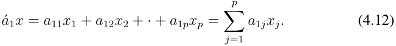

After that we need to look for a linear function _a_ ´2 _x_ uncorrelated with _a_ ´1 _x_ having maximum variance. We need to continue until the _k_ th stage with the linear function ´ _akx_ is found. The _k_ th variable is the _k_ th principal component. Generally it is hoped that most of the variation in x will be accounted by _m_ principal components, where _m < p_ . Fig 4.12 explains the idea of PCA geometrically. The x- and y-axis represents two feature dimensions, the small dots are concrete feature plots. The diagonal line maximizes the variance and is the principal component. 

---

<!-- Page 35 -->


**Figure 4.12:** PCA - pc with maximum variance source : liorpachter.files.wordpress.com

#### T-distributed stochastic neighbour embedding

For high-dimensional data that lies on or near a low-dimensional, non-linear manifold it is usually more important to keep the low-dimensional representations of very similar data points close together, which is typically not possible with a linear mapping. t-SNE is a non-linear dimensionality reduction technique used in the machine learning area to transform the embedding of high-dimensional data into a low dimensional space which is plot-able. This method reduces the dimensions with respect to the fact, that similar objects are modelled by nearby points and dissimilar objects are modelled by distant points. Geoffrey Hinton and Laurens van der Maaten introduced 2008 t-SNE as a new method to visualize high dimensional data. Van Der Maaten und Hinton [2008] t-SNE is very good in capturing much of the local structure of the high dimensional data. While it also revealing global structure such as the presence of clusters at several scales.

This technique builds on the SNE, Hinton and van der Maaten explained this method with two steps. First it constructs a probability distribution (Eq. 4.13) over paired objects from the high dimensional space in a way that similar feature objects have a high probability of being picked

---

<!-- Page 36 -->

# 4 Base and definition of sentiment analysis

gence between the to distributions. This is done with respect to the locations of the feature points in the map.

$$
P_{j|i} = \frac{\exp(-|x_i - x_j|^2 / 2\delta_i^2)}{\sum_{k \neq i} (-|x_i - x_k|^2 / 2\delta_i^2)} \quad (4.13)
$$

The similarity of datapoint $x_j$ to datapoint $x_i$ is the conditional probability $p_{j|i}$ that $x_i$ would pick $x_j$ as its neighbour if neighbours were picked in proportion to their probability density under a Gaussian centered at $x_i$. This leads to the required behavior that nearby datapoints $p_{j|i}$ have a relatively high probability of beeing choosen. While fore widely separated datapoints $p_{j|i}$ the probability gets very tiny. $\delta_i$ is the variance of the Gaussian centered on the datapoint $x_i$.

The conditional probability of the lower dimensional counterparts could be computed in a similar way. G. Hinton and L. van der Maaten denotes that probability with $q_{j|i}$, $y_i$ and $y_j$ representing the low dimensional counterparts of $x_i$ and $x_j$.

$$
q_{j|i} = \frac{\exp(-|x_i - x_j|^2)}{\sum_{k \neq i} (-|x_i - x_k|^2)} \quad (4.14)
$$

If the created points $y_i$ and $y_j$ correctly represents the high dimensional data points, the conditional probabilities $p_{j|i}$ and $q_{i|j}$ will be equal. By this SNE will find a low dimensional data representation that minimizes the Kullback-Leiber divergence between $p_{j|i}$ and $q_{i|j}$ using a gradient descent method. The cost function is defined with eq. 4.15.

$$
C = \sum KL(P_i || Q_i) = \sum \sum p_{j|i} \log \frac{p_{j|i}}{q_{j|i}} \quad (4.15)
$$

According to Van Der Maaten und Hinton [2008] this technique constructs reasonably good visualizations but it is hampered by a cost function that is difficult to optimize and it has the so called "crowded problem". The SNE technique has been improved in two ways by using a symmetrized version of the cost function with simpler gradients. And t-SNE uses a Student-t distribution rather than a Gaussian to compute the similarity between two points in the low-dimensional space.

---

<!-- Page 37 -->

### 4.2.5 Convolutional Networks

Convolutional Neuronal Networks are usually used for major breakthroughs in the area of image classification. 2012 was the first year that neural nets grew to prominence as Alex Krizhevsky used them to win that year’s ImageNet competition [ ? ]. In this year the classification error was dropped from 26% to 15%, which was an outstanding improvement. More recently they are also applied to NLP-problems and got some interesting results. 

Due to the page restrictions of this work, this section grants an very short overview about the base functionality of a CNN explained on the image classification task. Section 5.3 will map this technique to the task of NLP. 

_Overall functionality_
The input of a convolutional network is a matrix explaining the raw data. For an JPG-image with a resolution of 480 x 480 pixels this will be an matrix with 480 x 480 x 3 numbers (the "3" refers to the RGB values). Every number is in the range between 0 and 255 explaining the pixel intensity at that point. The output of this network is a class or a number describing the probability of the image being a certain class. 

**_Layers_**

CNNs are basically just several layers of convolutions each of them combined with a pooling layer and an nonlinear activation functions like rectified linear unit (ReLu) or hyperbolic tangent function (tanh) at the output layer to predict the class for the input (fig. 4.13). In a traditional feed-forward neural network every input neuron is connected to every output neuron which is called a fully connected layer. The basic idea for CNN is to use convolutions over the the input to compute the output. By this we get local connections where each region of the input source is connected to one output neuron. [Zhang u. a., 2015] 

---

<!-- Page 38 -->

# 4 Base and definition of sentiment analysis

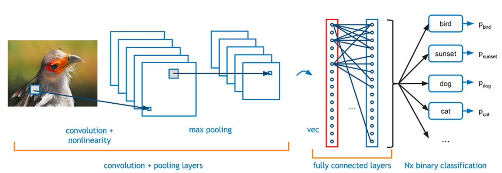
**Figure 4.13:** Constructional overview of an typical CNN source: Adit Deshpande

## Convolution layer

An easy way to understand convolutions is to think of a sliding window applied to the input matrix, which extract local features. This window can be interpreted as a kernel filter or feature detector with a fixed window size which strides over the input matrix. In the fig. 4.14 we use a 3x3 filter and multiply its values element-wise with the input matrix. The math behind this extraction is very simple: $(1 \cdot 1) + (1 \cdot 0) + (1 \cdot 1) + (0 \cdot 0) + (1 \cdot 1) + (0 \cdot 1) + (1 \cdot 0) + (0 \cdot 0) + (1 \cdot 1) = 4$. To get the full convolution, the filter slides over the whole input matrix. [Krizhevsky u. a., 2012]

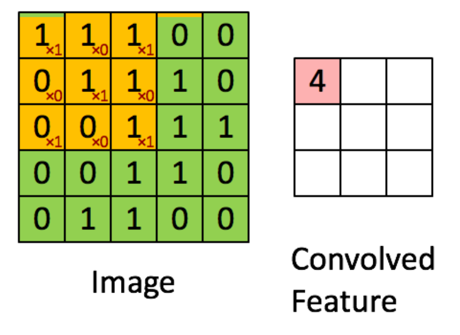
**Figure 4.14:** 3 x 3 convolution applied to an input matrix. The orange area describes the convolution, the orange numbers express the weighting within this filter-matrix. The right image shows one element-wise convolved feature. source: Denny Britz

Three hyperparameters control the size of the output volume of the convolution layer: the depth or window size which tells the size of the sliding window, stride which tells the step-size in which this filter will be slid over the input matrix and zero-padding which tells whether we pad the input with zeros along the borders.

---

<!-- Page 39 -->

A CNN usually consists of several convolution layers, each layer applies different filters. By this approach the first layers learns very high level features like edged and curves, the deeper convolution layers combine them to more complex features. This combination is done by pooling layers.

#### Pooling layer
Max-pooling is the most common non-linear down-sampling function which are applied to CNNs. These layers operates independently after every convolution layer and resizes the output by averaging the values within a given filter size. Fig. 4.15 illustrates the functionality of that layer very nice.

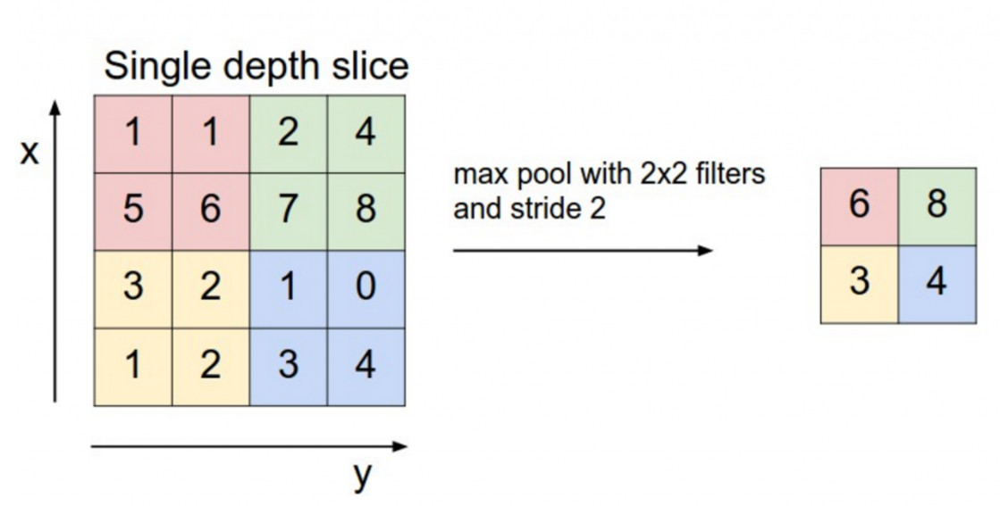
**Figure 4.15:** Max-pooling with 2x2 filters and stride 2
*A 2x2 max-pooling is applied to the left matrix, the output of a convolution layer. This pooling filter the biggest values within its area and slides with a stride of 2 over left matrix. By this the dimensionality could be reduced from 4x4 to 2x2, keeping only the most important features. source: wildml.com*

#### ReLu layer
Within this layer an activation function like ReLu, tanh or a sigmoid function is applied to the results to increase the the non-linear properties of the decision function. The ReLu function is nowadays preferred because it is much faster during the training epochs with a very low penalty to the generalization accuracy. [Krizhevsky u. a., 2012]

#### Loss layer
Usually the final layer, applying a softmax function to normalize the output vector to values between 0 and 1. The sum of this vector adds up to 1.

---

<!-- Page 40 -->

**_Training_**

This step is often called back propagation which is a method used for neuronal networks to calculate the error contribution of each neuron after a batch of labelled data is processed. It can be described by two main steps. First, the forward propagation step which generates the output values for each sample of the current batch followed by the error calculation and the delta calculation for all hidden and output neurons. Second, calculating the gradient or stochastic gradient by multiplying the weight’s output delta and the input activation. Next the weights are modified by subtracting the learning rate (a percentage value) multiplied with the gradient. There are several known problems and improvements within this step like local minima, symmetry breaking, flat plateaus, oscillation and leaving good minima which is not part of this work. 

---

<!-- Page 41 -->

# Chapter 5: Experimental setup

This chapter describes the different sentiment analysis approaches build up for this studies. The sections are chronologically ordered. It starts with the simplest approaches from the implementing point of view to get used with python and the frameworks. This leads to the following sequence. First the naive Bayes method is explored as a baseline. It is a well known probabilistic method based on the Naive Bayes' theorem 4.7 it is named after Thomas Bayes who introduced the bayesian theorem in Bayes u. a. [1763].

Later this chapter will pass over to the usage of a non-probabilistic linear classifier. It will focus on the the linear SVM as this classifier is mentioned in lots of papers with still state of the art results for text classification tasks. The current standard was published in 1995 by C. Cortes and V. Vapnik [Cortes und Vapnik, 1995].

Finally this chapter will describe a deep learning approach for Sentiment Analysis. This approach will be a small convolutional network with three layers. Originally the first CNN (leNet-5) was invented for an image classification task by LeCun u. a. [1998].

## 5.1 Naive Bayes

The experimental setup for this classifier is oriented on the proceeding from Jurafsky und Martin [2016].

Naive Bayes is a probabilistic classifier, meaning that for a document $d$, out of all classes $c \in C$ the classifier returns the class $c$ which has the maximum posterior

---

<!-- Page 42 -->

## 5 Experimental setup

probability given the document. Naive Bayes classifier belongs to the probabilistic classifiers based on the Bayes' theorem described in section 4.2.3.

### 5.1.1 Train the model

For the usage of the theorem (Eq. 4.7) we need the probabilities for every word $w_i$ for a given target class $C_j$ according to the Naive Bayes conditional independence assumption:

$$P(doc|C_j) = \prod_{i=1}^{|doc|} P(a_i = w_i|c_j)$$

which says that every word probability must be independent from the other words.

We assume that, $n$ is the number of words in all positive reviews, $n_k$ is the number of times word k occurs in one of these reviews. This is what we get by applying the bayes Theorem from section 4.2.3. This section described that

$$P(positive) = \frac{|positiveDocs|}{documents} \text{ ,and } P(negative) = \frac{|negativeDocs|}{documents}$$

are not necessary due to the point that they are constant through the whole process. The third one (Eq. 5.1) calculates the likelihood for a given $c$. To avoid returning a 0 for documents with unknown words we apply the so called Laplace smoothing to our likelihood calculation.

$$P(w_k|C_j) = \frac{n_k + 1}{n + |dict|} \quad (5.1)$$

For the sake of completeness we calculate the probability for each of the above formulas. $P(positive) = \frac{|positiveDocs|}{documents} = \frac{3}{5}$ and $P(negative) = \frac{|negativeDocs|}{documents} = \frac{2}{5}$ The likelihood has to be calculated for every word out of our positive and negative dictionary. Exemplary we will calculate it for the word "great":

$$P('great'|positive) = \frac{n_k+1}{n+|dict|} = \frac{2+1}{14+10} = 0.0833$$

### 5.1.2 Inference step

After all likelihoods are calculated in the training step, the most likely class for new unseen test documents can be predicted. Predicting the class of a test document will

---

<!-- Page 43 -->

be done by argmax the product of every word $W$ occurring in each target class $c_j$. By this we get eq. 4.9 with our specific index.

$$
c_{NB} = argmax_{c_j \in C} log(P(c_j)) + \sum_{i=0}^{|w \in c_j|} log(P(w_i|c_j)) \quad (5.2)
$$

The model will calculate the conditional probabilities for every occurring word within training time and store them for later inference.

The same probability has to be calculated for the test document "i hated the poor acting". There are only the binary target classes $C_+$ and $C_-$. Eq. 4.9 will be used to calculate the results for the inference step. By this we get a probability for each target class (sentiment). $1.22 \cdot 10^{-5}$ is smaller than $6.03 \cdot 10^{-7} \rightarrow C_{predicted} = negative$. In this case, our model would label this sentence as negative.

$$
\begin{aligned}
C_+ &= log(P(positive)) + \sum_{i=0}^{|w \in c_j|} log(P(w_i|c_+)) = 6.03 \cdot 10^{-7} \\
C_- &= log(P(negative)) + \sum_{i=0}^{|w \in c_j|} log(P(w_i|c_-)) = 1.22 \cdot 10^{-5}
\end{aligned} \quad (5.3)
$$

### 5.1.3 Optimization

As baseline for further comparison and due to the point that NLTK was used for the data cleaning and preparing step, this part starts with a very straight forward Naive Bayes classifier from NLTK. This classifier is also based on the Bayes rule to express $P(label|features)$ in terms of $P(label)$ and $P(features|label)$. Initially no special vectorizer was used. The classifier is trained by manual word-tokenized word-feats (shown in the listing below).

```python
def word_feats(self, words):
    return dict([(word, True) for word in words])
```

Listing 5.1: Initial, very naive and simple tokenizing method

---

<!-- Page 44 -->

Later this manual process was improved by a Regex-Tokenizer, stemming, lemmatization, stopword filtering, bigram-collections, high information feature selection and POS-tagging step by step according to Jurafsky und Martin [2016]. 

The overall process looks like that: 

1. Load negative and positive movie reviews. 

2. Split and shuffle the dataset into a training set, training labels (0.75%), testing set and testing labels (0.25%). 

3. Tokenize and do some minor preprocessing, data cleaning. 

4. Training the classifier with the algorithm described below. 

5. Predict the classes for the testing set. 

6. Calculate the accuracy, precision and recall. 

The following pseudo code gives a nice overview of the naive bayes based sentiment mechanism from Jurafsky and Martin and how it is implemented in most frameworks. 

Naive Bayes algorithm from Jurafsky und Martin [2016] , using add-1 smoothing. 

**function** TRAIN NAIVE BAYES(D,C) **returns** log P(c) and log P(w|c) **for all** class c ∈ C **do** # Calculate P(c) terms 

_Ndoc_ = number of documents in D 

_Nc_ = number of documents from D in class c _logprior_ [ _c_ ] ← log _NNdcoc_ V ← vocabulary of D _bigdoc_ [ _c_ ] ← **append** (d) **for** d ∈ D **with** class _c_ **for all** word _w_ in V **do** # Calculate P(w|c) terms _count_ (w,c) _gets_ # of occurrences of _w_ in bigdoc[c] _count_ ( _w,c_ )+1 _loglikelyhood_ [w,c] ← log � _w[′] inV_[(] _[count]_[(] _[w][′][,c]_[)+1)] **return** logprior, loglikelihood, V 

**function** TEST NAIVE BAYES( _testdoc, logprior, loglikelihood_ ,C,V) **returns** best c 

**for all** class c ∈ C **do** _sum_ [ _c_ ] _← logprior_ [ _c_ ] **for all** position _i_ in _testdoc_ **do** _word ← testdoc_ [ _i_ ] **if** _word ∈ V_ **then** _sum_ [ _c_ ] _← sum_ [ _c_ ] + _loglikelihood_ [ _word, c_ ] **return** _argmaxc_ sum[c] 

---

<!-- Page 45 -->

Secondly these results were compared with the Naive Bayes classifier from Scikit Learn. From Scikit learn a Multinomial Bayes classification model with a BOW-vectorizer was used. Later this pipeline was expanded by the usage of a tf-idf-Transformer and by hyper parameter tuning via grid search. Depending on the dataset chosen the Bernoulli-based Naive Bayes algorithm might perform better. The decision rule or likelihood calculation for this classifier looks like this:

$$P(X_i|y) = P(i|y)x_i + (1 - P(i|y)) \cdot (1 - x_i) \quad (5.4)$$

This rule differs from multinomial Naive Bayes rule that it explicitly penalizes the non-occurrence of a feature $i$ that is an indicator for class $y$, where the multinomial variant would simply ignore a non-occurring feature. This algorithm is designed for binary features. It could be applied if the occurrence of a word matters more than word frequency and weighting it’s multiplicity doesn’t improve the accuracy.

## 5.2 Support vector machines

After the initial Naive Bayes based approach the SVM-based classifier was implemented and applied to different hyperparameters and vectorizing methods. The advantages of support vector machines are:

They are effective in high dimensional space. Still effective in cases where number of dimensions are greater than the number of samples. Uses a subset of training points for the decision function, which is quite memory-efficient. Different Kernel function could be specified and applied during runtime.

An SVM is originally defined as support vector networks by C. Cortes and V. Vapnik Cortes und Vapnik [1995]. SVMs represents the training data in a high dimensional space. For the classification task SVMs creates a hyperplane and maximize the margin of this hyperplane to the given training data. SVMs have strong theoretical foundation and excellent empirical success.

This section provides an overview about the setting used for this work.

---

<!-- Page 46 -->

# 5 Experimental setup

### 5.2.1 Train the Model

In this section the feature extraction process done for the SVM classifier based pipelines will be explained. The experimental setup will be shown for unigrams and without the details of every hyper parameter.

The CountVectorizer which extracts a bag of words model explained in section 4 was used. Later a tf- and tf-idf-transformer was adopted to get weighted token-vectors. This time we tokenize and vectorize the test sentences used for the naive Bayes explanation with the CountVectorizer from scikit learn.

```python
test document = ['i loved the movie', 'i hated the movie', 'a great movie. good movie', 'poor acting', 'great acting. a good movie']
```

By this we extract the dictionary shown in the listing below. By default the Tokenizer extract words fitting to this pattern: `'( ?u)\b \w \w+ \b'`. This automatically filters non-informative words which are shorter than one char and all punctuations and special characters.

```python
dictionary = {'hated': 3, 'poor': 6, 'movie': 5, 'great': 2, 'good': 1, 'acting': 0, 'the': 7, 'loved': 4}
```

Now we transform our document to a sparse vectorized representation, which is shown in the first column of table 5.1. The sparse matrix consists of a dictionary. Every key describes the the position (row, column) of a non-zero value. The corresponding value shows the number of times this token occurs in this sentence. Later this value will be an boolean value. Next we transform the sparse BOW into a term frequency representation shown in the second column of fig 5.1. This tells us how often a word appears in the whole document. Next we apply the inverse document frequency from section 4 to measure the tf-idf. A high weight in tf-idf is reached by a high term frequency and a low document frequency of a term in the whole collection of documents.

In the next step we feed our classifier with this sparse feature matrix. By transforming our feature matrix into a tf-idf representation, the diversity of our values, rises which makes it more useful for the classification step. The process of feature extraction could be influenced by many parameters as shown in the section 4.2.2.

The SVM tries to find a combination of samples to build a plane maximizing the margin between the two classes. Regularization is set by the $C$-parameter: a small value for $C$ means the margin is calculated using many or all of the observations around the separating line (more regularization). A large value for $C$ means the mar-

---

<!-- Page 47 -->

|(row,column)|BOW|TF|TF-IDF|
|---|---|---|---|
|(0, 5)<br>(0, 7)<br>(0, 4)<br>(1, 3)<br>(1, 5)<br>(1, 7)<br>(2, 1)<br>(2, 2)<br>(2, 5)<br>(3, 0)<br>(3, 6)<br>(4, 0)<br>(4, 1)<br>(4, 2)<br>(4, 5)|1<br>1<br>1<br>1<br>1<br>1<br>1<br>1<br>2<br>1<br>1<br>1<br>1<br>1<br>1|0.57735026919<br>0.57735026919<br>0.57735026919<br>0.57735026919<br>0.57735026919<br>0.57735026919<br>0.453294655228<br>0.453294655228<br>0.767494567462<br>0.707106781187<br>0.707106781187<br>0.5<br>0.5<br>0.5<br>0.5|0.712775215773<br>0.575062556088<br>0.401565123442<br>0.575062556088<br>0.401565123442<br>0.712775215773<br>0.64140348737<br>0.542494961446<br>0.542494961446<br>0.778282922805<br>0.627913761651<br>0.373917935101<br>0.535470315956<br>0.535470315956<br>0.535470315956|

**Table 5.1:** Sparse BOW, tf and tf-idf weighted representation of our vectorized test sentences

gin is calculated on observations close to the separating line (less regularization). [Pedregosa u. a., 2011] 

For many estimators, including the SVMs, having datasets with unit standard deviation for each feature is important to get good prediction. Standardization of datasets is a common requirement for many machine learning estimators. For instance, many elements used in the objective function of a learning algorithm (such as the RBF kernel of Support Vector Machines or the l1 and l2 regularizers of linear models) assume that all features are centered around zero and have variance in the same order. To scale the trainings and testing data in the same way the StandardScaler instance from Pedregosa u. a. [2011] was used. 

### 5.2.2 Inference step

Standardization of datasets is a common requirement for many machine learning estimators implemented in scikit-learn. They might behave badly if the individual features do not more or less look like standard normally distributed data: Gaussian with zero mean and unit variance. 

For the inference step the test documents are preprocessed with the same vectorizer used for the training step. Which means doing the same preprocessing, data cleaning, tokenizing, stopword filtering etc. as it was applied to the training data. Next 

---

<!-- Page 48 -->

the sparse representation of the test document is hand over to the SVM. During the training part this classifier calculated a hyperplane to split the training data as good as possible. During the inference step the hyperplane assigns a feature set to a class. For this studies the ’one-vs-the-rest’ strategy from scikit was used. Due to the point that we have a binary classification problem only one model has to be trained. 

### 5.2.3 Optimization

Hyper-parameters are parameters that are not directly learnd within the estimator. In scikit-learn they are passed as arguments to the constructor of the estimator classes. It is possible and recommended to search the hyper-parameter space for the best estimator performance score. The hyper parameters for every Preprocessing, Tokenizing, cleaning , vectorizing and classifying step were tuned with grid search. The GridSearchCV-Instance from scikit-learn was used for this task. The GridSearchCV instance implements the usual estimator API: when “fitting” it on a dataset all the possible combinations of parameter values are evaluated and the best combination is retained. One search (fit) consists of: Multiple preprocessor steps like cleaning, scaling, tokenizing, filtering, weighting, an estimator, a parameter space for every possible parameter for every possible step, a method for searching or sampling candidates, a cross validation scheme and a score function. Pedregosa u. a. [2011] 

Within the first prototypes the accuracy and runtime of different SVM-Kernels were compared to preselect a kernel for the further investigations. The accuracy of these models were nearly the same but they differ a lot in the runtime. By this preselecting the decision was set to use a linear SVM. This kernel delivered the fastest and most accurate results even for very small datasets. Scikit Pedregosa u. a. [2011] provides an linear support vector classifier. It is similar to a standard support vector classifier with a linear kernel. But this class is implemented in terms of liblinear and has more flexibility in the choice of penalties, loss functions and should scale better to large numbers of samples. 

The simplest possible pipeline with Bag of Words as vectorizer followed by an linear SVM was build up at the beginning. This pipeline was later extended by various combinations, the best performing pipelines are listed in table 5.2. 

To achieve a better accuracyy lots of parameters were tested and tuned. Every pipeline step represented by a column in table 5.2 enabled to do parameter tuning. The data cleaning, stemming, tokenization, scaling, normalization steps has 

---

<!-- Page 49 -->

|Pipeline|Vectorizer|Transforming/weighting|Classifer|
|---|---|---|---|
|Pipe 1<br>Pipe 2<br>Pipe 3|CountVectorizer<br>CountVectorizer<br>Word2vec-Vectorizer|None<br>Tf-idf-Transformer<br>document level avg|linear SVM<br>linear SVM<br>linear SVM|

**Table 5.2:** Linear SVM - tested pipelines

to be done in every pipeline and is mostly be done within the vectorizing step to increase the performance. The cleaning, stemming and scaling was initially done by hand. Later these steps were done by applying predefined methods from NLTK which worked better. Some of the tested tokenizing methods are: Word-Tokenizer, Regex-Tokenizer, Feat-Tokenizer and multiple self written tokenizers as shown in listing 5.2. The tokenizers were preselected with the standard parameters for every pipeline. Later the best working parameter sets were tested again with all tokenizing methods to double check which works the best. 

Every Word2vec parameter value produces an own model which has to be trained. This leads to one pipeline per word2vec parameter to optimize the following parameters. For the sake of a lower complexity for the reader, only the best working pipeline will be explained within the results part. 

The most important parameters are listed in the following tables split by their occurring step. First the CountVectorizer parameters from table 5.3 were tuned. Besides that the parameters of our CBOW and skipgram word2vec networks should be tweaked. They are shown in table 5.4. For the transforming step the tf and tfidf transformer has to be improved (table 5.5). Last the parameters (table 5.6) of our classifier itself are optimized. According to [Pedregosa u. a., 2011] only the parameters affecting the accuracy of the model are chosen. There are some more parameters but their influence on the overall accuracy was not measurable. Every possible parameter combination was compared in an extensive grid search. 

The parameters chosen only for the Count-Vectorizer leads to more than 6000 fits. A full grid search inclusive 4-fold cross validation for the second pipeline would consists of 23,040,000 fits. One cross validation step, which represents 4 fits takes 100 sec if all jobs are parallelized. If one extrapolates the time for all possible fits only for this pipeline we came to 160,000 hours or 18 years non stop fits. 

To make this extensive grid search possible in a timely manner, two ideas are implemented. The first idea was to create accuracy heatmaps (one example is shown in fig. 5.1) for all numeric parameters isolated in tupled pairs. By this, better ten- 

---

<!-- Page 50 -->

|Parameter|Description|Values|
|---|---|---|
|analyzer<br>Whether the feature should be made of word or<br>character n-grams. Option ‘char wb’ creates char-<br>acter n-grams only from text inside word bound-<br>aries.<br>’word’, ’char’, ’char wb’<br>ngram-<br>range<br>The lower and upper boundary of the range of n-<br>values for different n-grams to be extracted. All<br>values of n such that_minn <_= _n <_= _maxn_ will<br>be used.<br>(1,1), (1,2), (1,3), (2,2),<br>(2,3)<br>stop words<br>If ’english’, a built-in stop word list for English<br>is used. If a list, that list is assumed to contain<br>stop words, all of which will be removed from the<br>resulting tokens.<br>’english’,<br>’NLTK-<br>stopword-list’<br>max df<br>When building the vocabulary ignore terms that<br>have a document frequency strictly higher than<br>the given threshold (corpus-specifc stop words).<br>If foat, the parameter represents a proportion of<br>documents, integer absolute counts. This parame-<br>ter is ignored if vocabulary is not None.<br>0.5, 0.6, 0.7, 0.8, 0.9<br>min df<br>When building the vocabulary ignore terms that<br>have a document frequency strictly lower than the<br>given threshold.<br>This value is also called cut-<br>off in the literature. If foat, the parameter repre-<br>sents a proportion of documents, integer absolute<br>counts. This parameter is ignored if vocabulary is<br>not None.<br>2,4,6,8,10<br>binary<br>If True, all non zero counts are set to 1. This is<br>useful for discrete probabilistic models that model<br>binary events rather than integer counts.<br>’True’, ’False’<br>max<br>fea-<br>tures<br>If not None, build a vocabulary that only consider<br>the top max features ordered by term frequency<br>across the corpus.<br>5000,<br>10000,<br>50000,<br>None<br>**Table 5.3:**Count Vectorizer - optimized parameters<br>Parameter<br>Description<br>Values|||
|sg<br>size<br>window<br>summary|Defnes the training algorithm. By default CBOW<br>is used. Otherwise skip-gram is employed.<br>Is the dimensionality of the feature vectors.<br>Is the maximum distance between the current and<br>predicted word within a sentence.<br>Manual implemented method to summarize all<br>word vectors of a review.|’CBOW’, ’skip-gram’<br>50, 100, 200, 300, 400<br>8, 10, 12<br>’avg’, ’max’, ’min’, ’avg<br>+ min + max’|

**Table 5.4:** Word2vec - optimized parameters

---

<!-- Page 51 -->

|Parameter|Description|Values|
|---|---|---|
|norm<br>use idf<br>smooth idf<br>sublinear tf|Norm used to normalize term vectors. None for<br>no normalization.<br>Enable inverse-document-frequency reweighting.<br>Smooth idf weights by adding one to document<br>frequencies, as if an extra document was seen con-<br>taining every term in the collection exactly once.<br>Prevents zero divisions.<br>Apply sublinear tf scaling, i.e. replace tf with1 +<br>_log(tf_).|’l1’, ’l2’, None<br>True, False<br>True, False<br>True, False|

**Table 5.5:** Tf-idf-Transformer - optimized parameters

|Parameter|Description|Values|
|---|---|---|
|C<br>tol<br>loss|Penalty parameter C of the error term.<br>Tolerance for stopping criteria<br>Specifes the loss function.|0.01, 1, 5, 10, 100<br>1e-1, 1e-2, 1e-3, 1e-4<br>’hinge’, ’squared hinge’|

**Table 5.6:** Linear SVM - optimized parameters

dencies and boundaries for the parameter values could be chosen which decreases the total amount of fits. The margin values for the heatmaps were taken from scikitlearn recommendations. The parameter values in between are represented evenly by log spaced numbers created with numpys logspace functionality. The brighter a casket, the better the accuracy for this parameter combination. The scores are encoded as colors with the hot colormap which variy from dark red to bright yellow. As the most interesting scores are all located in the 0.82, to 0.85 range a custom normalizer was used to set the mid-point to 0.82 so as to make it easier to visualize the small variations of score values in the interesting range while not brutally collapsing all the low score values to the same color. 

---

<!-- Page 52 -->

# 5 Experimental setup

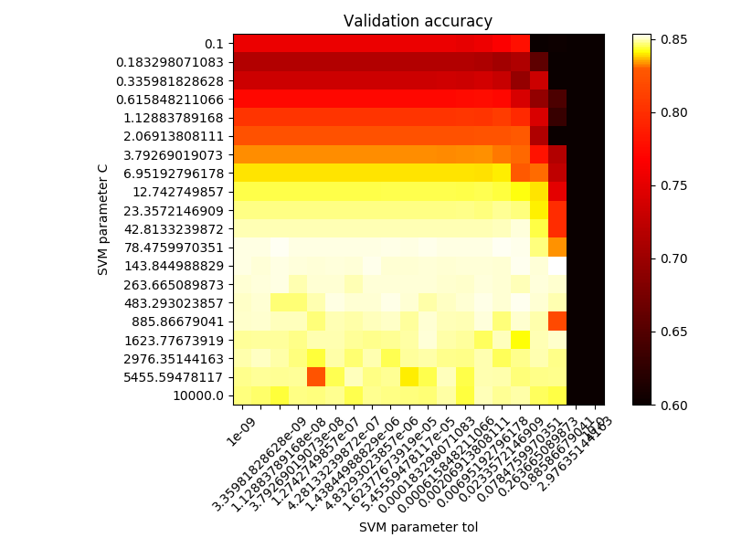
**Figure 5.1:** Numerical parameter pre-selection done with logspaced parameters - accuracy represented by a heatmap.

Second the parameters from table 5.3 were tested with 10% of the training-data separately for the vectorizing, transforming and classification step. To evaluate the vectorizing and transforming parameters a standard liblinear SVM from scikit-learn was used. Each grid search takes several hours depending on the parameters selected.

After this first comparing step the tendency of every parameter was transparent. Some of the parameters didn't behave different in their accuracy influence when they were combined with other parameter values. Some others didn't behave different for different amount of training data. With this knowledge it was possible to test some parameter separately. The other parameters were fixed during that grid searches. The best parameter combinations for each steps were then evaluated with a k-fold grid search across all sentiment SA steps and with the full dataset.

The word vector model was trained in a unsupised manner with the help of gensim [Řehůřek und Sojka, 2010], which offers an interface to train a word2vec model based on own data. The preprocessing was initially done by hand (cf. listing 5.2).

---

<!-- Page 53 -->

```
1  def review_to_words( raw_review ):
2  logging.info('cleaning data')
3  # Function to convert a raw review to a string of words
4  # The input is a single string (a raw movie review), and
5  # the output is a single string (a preprocessed movie review)
6  #
7  # 1. Remove HTML
8  review_text = BeautifulSoup(raw_review).get_text()
9  #
10 # 2. Remove non-letters
11 letters_only = re.sub("[^a-zA-Z]", " ", review_text)
12 #
13 # 3. Convert to lower case, split into individual words
14 words = letters_only.lower().split()
15 #
16 # 4. In Python, searching a set is much faster than searching
17 #
18 a list, so convert the stop words to a set
19 stops = set(stopwords.words("english"))
20 #
21 # 5. Remove stop words
22 meaningful_words = [w for w in words if not w in stops]
23 #
24 # 6. Join the words back into one string separated by space,
25 # and return the result.
26 logging.info('cleaning data - done')
27 return( " ".join( meaningful_words ))
```

**Listing 5.2:** Example code snippet for the manual cleaning step 

Later this method was changed to the better working NLTK-Regex-Tokenizer. The training steps have been done with different dimensions sizes, different Filter-sizes and multiple training epochs (shown in table 5.4). The high-dimensional word2vec vectors outperformed the vectors with a smaller dimensionality for every combination. By this knowledge all later tests and visualizations were done with the 300-dimensional word-vectors. The CBOW word2vec model also outperformed the skipgram-model in every tested scenario. Therefore the CBOW-model was used for all further tests. 

According to the disadvantage of paragraph-vectors during the inference step mentioned in section 4.2.2, the word-vectors were manually averaged for this comparison. J. Hong used this method in [Hong] to get a fast representation of new documents. This approach has the advantage of being simple and fast once the word embedding has been trained. The disadvantage of this approach is the loss of information about word ordering. 

Training a classifier and do the testing with the same data is a known methodological mistake which leads to over-fitting. Therefore the data is splitted into a training and 

---

<!-- Page 54 -->

a testing set. When tuning the hyper-parameters such as the $C$ or $\gamma$ values explained in [Ben-Hur und Weston, 2010, p.8] there is still a risk of over-fitting on the test set. Because the parameters can be tweaked until the estimator performs the best with the defined test set. To avoid that the movie reviews are splitted into a training (0.75%) and testing subset (0.25%), the training set again was splitted by a 4-fold cross validation method from Pedregosa u. a. [2011] to get a training and validation set for every fit. Fig 5.2 from S. Raschka visualizes this step very nice.

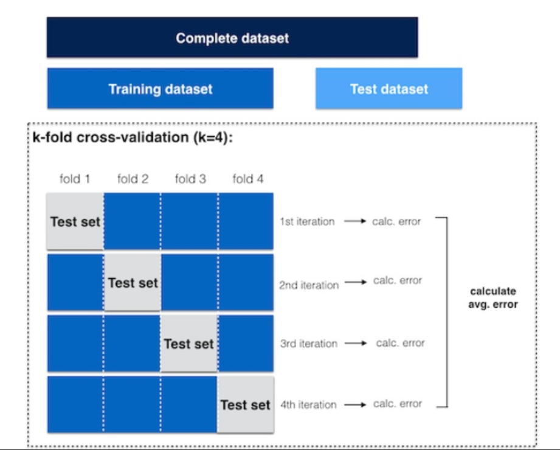
**Figure 5.2:** 4-fold cross validation for the grid searches

## 5.3 Convolutional network

Within this work a word-based CNN with nearly the same architecture as mentioned in Kim [2014] and Zhang u. a. [2015] was evaluated and tuned. Denny Britz's code was used as code base.

There are lots of different architectures applied to the task of text clasification like the very famous character-level-CNN from Y-LeCun and his collegues Zhang u. a. [2015] or less known architectures like the one introduced by M. Noga [Noga]

---

<!-- Page 55 -->

which probably are able to generalize better. The architecture of a simple CNN applied to a text classification task is shown in fig. 5.3.

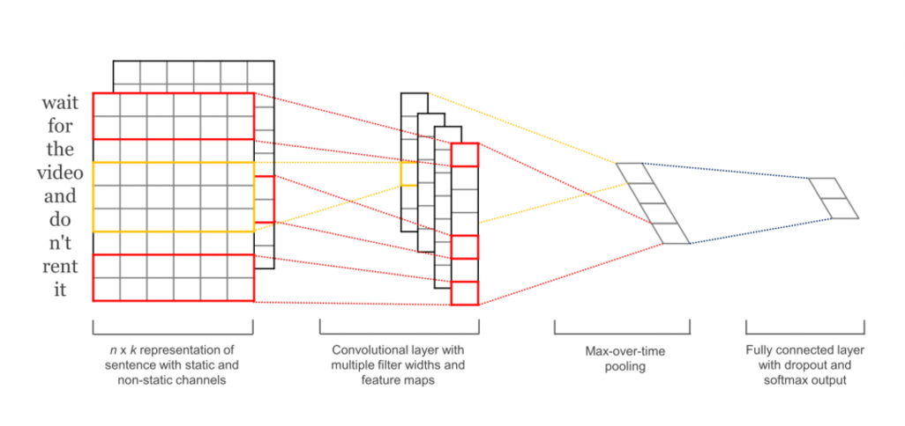
**Figure 5.3:** Overview of our applied CNN source: wildml.com

To reduce the training time of the network to an acceptable timely manner an simple CNN with only four layers is used. The architecture of Y. Kim is applied and implemented with tensorflow. The code base is only slightly changed to apply our dataset and to simplify the hyper-parameter search.

### 5.3.1 Train the model

The network was trained with different batch-sizes. Each batch consists of an even mixed subset of the whole dataset. Every batch is shuffled and cleaned before it is fed to the network. The preprocessing/cleaning step wasn't changed to reduce the complexity. All sentences are padded to the maximum length. The vocabulary size (113,472) wasn't changed.

The network has four layers, one embedding layer, followed by a convolution layer with different filters, a max-pooling layer and a softmax layer. For this architecture a self-learned word-embedding matrix is used as input to the convolution layer it is also possible to use a pre-trained Word2vec model. Each row of our input matrix corresponds to one token, in our case one word. Within this work multiple embedding dimensions in the range of 128 - 300 are compared. Different number of filters, filter sizes, batch-sizes, drop-out probabilities and numbers of training epochs are

---

<!-- Page 56 -->

evaluated. The initial networks applied to our sentiment analysis task is shown by fig. 5.4.

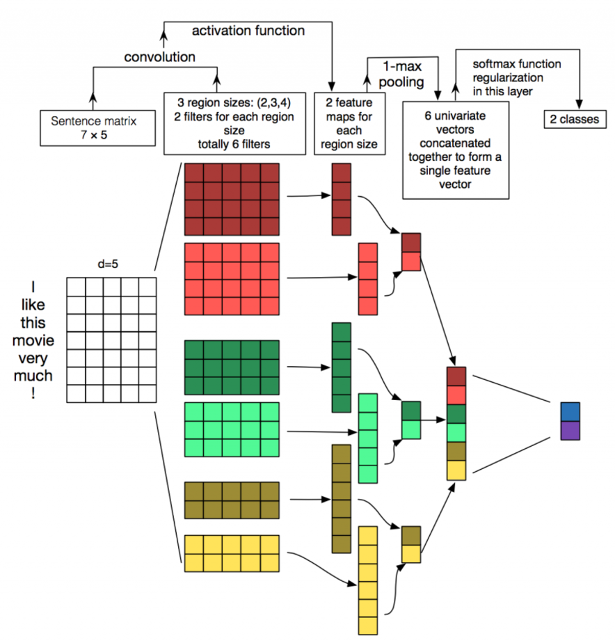
**Figure 5.4:** Initial architecture of our CNN source: wildml.com

The dimensionality of our batched input matrix was reduced by the embedding layer from "amount of tokens" · "vocabulary size" to "embedding size" · "vocabulary size". By this the convolution layer can work on a low-dimensional-vector representation of our words. The with of every region size (filter) has the same size as our embedding matrix, the filter region size defines the amount of words processed in one convolution. Since we used different filter sizes which results in different convolution shapes we are forced to use a max-pooling layer to concate-

---

<!-- Page 57 -->

nate them into one single feature vector. The loss function is optimized by an Adam optimizer [Kingma und Ba, 2014]. 

### 5.3.2 Inference step

We applied a dropout rate during the training. For the evaluation part this dropout is disabled. The loss function which is used within this network is based on the cross entropy loss function. The mean of the losses are then taken to make it comparable against the other batches during the training. 

### 5.3.3 Optimization

Each training of this network on a GPU-cluster still took several hours. By this only some few parameter optimization are done. Within this work the following parameters are tuned: embedding dimensionality, batch-size, number of epochs, filter sizes, number of filters, dropout-probability, l2 regularization lamda. The predefined values are used as baseline. Better working parameter combinations are chosen on suggestions from Y. Zhangs guide for convolutional neuronal networks [Zhang u. a., 2015]. 

---

<!-- Page 58 -->

*[Empty page — skipped]*

---

<!-- Page 59 -->

# Chapter 6: Results

In this chapter the results gained during the thesis are described in short. Only the best investigations will be mentioned. These results will then be summarized and interpreted in chapter 7. The first section is about the accuracy improvements for the supervised classification steps. All measurements are done with 30 tsd negative and positive movie reviews. The data source is created by mixing the Kaggle Movie review dataset with the movie reviews from aclimdb and polarity. Both are described in section 2 and are well known datasets for the task of sentiment classification. Four fold cross validation was used for accuracy measurements. During the prototyping step 0.75% of our data is used to train the classifier, the other 0.25% is used as testing data. 

## 6.1 Accuracy

In this section the accuracy results for the chosen classifiers and combined mlpipelines are listed. Since the classifiers work differently and provides different possibilities for further investigations, the result sections themselves are structured individually. 

### 6.1.1 Naive Bayes

This method is used as baseline for further improvements. Still Naive Bayes is a very good and very fast classifier for sentiment analysis. The baseline classification with boolean tokenized word features and without any preprocessing and stopword 

---

<!-- Page 60 -->

filtering results in a accuracy of 84%. The most significant features are shown in table 6.1. The first column points the features which are most effective for distinguishing the sentiment. The predicted column describes the orientation of the likelihood. By this the third column could be interpreted. This listing interpreted shows that reviews in the training set containing the word ’avoid’ are 100 times more often negative related than positive. 

|Features|Predicted|Likelihood|
|---|---|---|
|Avoid<br>AWESOME<br>SUCKED<br>Uwe<br>Boll<br>panting<br>Combining<br>retarted<br>hella<br>TERRIBLE|neg : pos<br>pos : neg<br>neg : pos<br>neg : pos<br>neg : pos<br>neg : pos<br>neg : pos<br>neg : pos<br>pos : neg<br>neg : pos|100.5 : 1.0<br>49.4 : 1.0<br>47.3 : 1.0<br>46.0 : 1.0<br>45.3 : 1.0<br>45.3 : 1.0<br>43.3 : 1.0<br>42.0 : 1.0<br>38.0 : 1.0<br>34.7 : 1.0|

**Table 6.1:** Naive Bayes - Most informative Features

To improve the accuracy, the precision and recall values are added to the measurements. This means 90% of our positive predicted reviews are true positive while only 79% of our negative predicted reviews are false positive. It seems that it is easier for our classifier to predict the negative reviews. At the same time our positive recall is only 76%. By shrinking the the amount of false negatives we could achieve a higher positive recall. Several points could cause these results. One might be that people uses positive words in negative reviews but they apply a negation in before. Another possibility is the lack of neutral words. Some words might appear in every kind of reviews and don’t carry any sentiment related information. But the classifier has to assign these words to either positive or negative. The first three features are probably comprehensibly clear sentiment related words. The fourth and fifth most important features are related to Uwe Boll, who is a German movie director. According to filmstarts.de and moviepilot.de "Uwe Boll is regarded as the worst director of the present". This statement coincides with the outcome of the training set. To avoid over-fitting the feature selection should be more general. 

The following extensions raised the accuracy: the usage of bigrams combined with unigrams and a bigram selection optimizer which selects only the most significant bigrams. This leads to an accuracy of 88% and the precision-recall table 6.3. 

---

<!-- Page 61 -->

||Precision|Recall|
|---|---|---|
|pos|90%|76%|
|neg|79%|91%|

**Table 6.2:** Naive Bayes - Precision and recall

||Precision|Recall|
|---|---|---|
|pos|91%|84%|
|neg|85%|91%|

**Table 6.3:** Naive Bayes optimized - Precision and recall

We are able to increase the positive recall and negative precision while the positive precision and neg recall doesn’t shrink. Furthermore the most informative features evolve to the listing 6.4. The features captured by the optimized Naive Bayes Classifier makes sense in most of the given examples. The ’potter series’ which probably comes from Harry Potter series is a little bit confusing. Obviously most of the reviews about the Harry Potter series are positive related. In fact this feature seems still not helpful predicting the sentiment of non-Harry Potter reviews. 

|Features|Predicted|Likelihood|
|---|---|---|
|(’terrible’, ’movie’)<br>Avoid<br>(’Potter’, ’series’)<br>(’this’, ’garbage’)<br>(’only’, ’redeeming’)<br>(’I’, ’wasted’)<br>(’1’, ’out’)<br>(’this’, ’crap’)<br>(’awful’, ’the’)<br>(’awful’, ’The’)|neg:pos<br>neg:pos<br>pos:neg<br>neg:pos<br>neg:pos<br>neg:pos<br>neg:pos<br>neg:pos<br>neg:pos<br>neg:pos|106.9 : 1.0<br>100.5 : 1.0<br>82.3 : 1.0<br>77.1 : 1.0<br>63.2 : 1.0<br>58.6 : 1.0<br>58.2 : 1.0<br>55.4 : 1.0<br>52.6 : 1.0<br>51.9 : 1.0|

**Table 6.4:** Naive Bayes optimized - Most informative Features

Extensions that doesn’t affect or even shrink the accuracy: stopword filtering, usage of only bigrams or n-grams without unigrams, usage of n-grams greater than two, POS-Tagging, Stemming, Lemmatization and other preprocessing and cleaning steps. This classifier has nearly no parameters and works really fast. The feature selection has the most significant influence to the accuracy. 

The Naive Bayes classifier from scikit-learn was tested with the usage of a parameter optimized Count-Vectorizer combined with a tf-idf transformer. The accuracy of this pipeline combinations could not exceed the NLTK-based pipeline. The simi- 

---

<!-- Page 62 -->

|SA-Step|Parameter|Value|
|---|---|---|
|Vectorizer<br>Vectorizer<br>Vectorizer<br>Vectorizer<br>Vectorizer<br>Vectorizer<br>Vectorizer<br>Linear SVM<br>Linear SVM<br>Linear SVM|analyzer<br>binary<br>max df<br>max features<br>min df<br>ngram range<br>stop words<br>C<br>tol<br>loss|’word’<br>True<br>0.8<br>None<br>2<br>(1,2)<br>None<br>0.8<br>0.001<br>’squared hinge’|

**Table 6.5:** SVM - pipeline 1

larity of these two results is not a real surprise, as both use the same algorithm. The positive precision was higher than the negative precision and the negative recall was higher than the positive recall for both implementations. 

### 6.1.2 SVM

After the strong baseline results from the Naive Bayes technique, the evaluation of the SVM-based pipelines started. Following the best performing parameters per pipeline are listed. The first pipeline consists of a Count-Vectorizer combined with a linear SVM. The best performing parameters for this pipeline are shown in table 6.5. 

The overall best accuracy of this pipeline with the unseen test data is 88%. The most informative features are listed in a small graph in Fig. 6.1. The blue features strongly indicates negative features. The model learned also the positive features which are shown on the right side of the graph (influence marked by the red bars). This model also found features like ’hate harry’ as mostly negative and ’like harry’ as positive related feature. 

For the first two pipelines building on the Count-Vectorizer the binary feature extraction works better than counting the occurrence of this features. Working with word-based features works better than working with character or character n-gramsbased features. Working with an individual word occurrence threshold works better than filtering out a predefined stopword list. In our cases words which occurs in more than 80% of all reviews are ignored. At the same time ignoring features with a document frequency smaller than two works best with the given dataset. Defining 

---

<!-- Page 63 -->

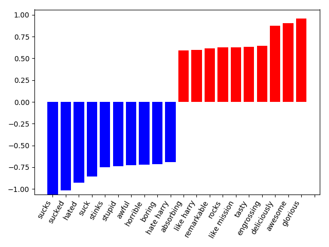
**Figure 6.1:** SVM Pipeline 1 - binary weighted most informative features. The x axis shows the 20 most informative n-grams, the y axis represents the normalized influence for each n-gram.

a max. limit for the feature extraction improved the needed time a bit, simultaneously it decreased the accuracy. Increasing the n-gram size doesn't improve the accuracy with a higher n than two. The best results could be achieved with the combination of of unigrams and bigrams. With this parameter settings 579,404 features are extracted for the k-fold cross validation.

The best working parameters for our vectorizer doesn't change if a tf-idf-transformation step is applied afterwards or not. The accuracy itself could be improved by this step.

Table 6.6 shows the optimized parameters for our second SVM pipeline. This pipeline used a Countvectorizer, a TF-IDF-Transformer and a linear SVM. The accuracy of this pipeline could be tweaked up to the best accuracy with 91%.

The most informative features shown in fig. 6.2 differ a little from the previous pipeline without tf-idf weighted features. Again the x-axis names the 10 most positive and 10 most negative related features from our reviews. The y-axis expresses the weighting of these features expressed by the tf-idf-values.

After the state of the art results with the second pipeline, the integrated word-based tokenizer from scikit-learn was changed to a self written NLTK based tokenizer method. To combine duplicate feature extractions like 'sucks' and 'suck'

---

<!-- Page 64 -->

|SA-Step|Parameter|Value|
|---|---|---|
|Vectorizer|analyzer|’word’|
|Vectorizer|binary|True|
|Vectorizer|max df|0.8|
|Vectorizer|max features|None|
|Vectorizer|min df|2|
|Vectorizer|ngram range|(1,2)|
|Vectorizer|stop words|None|
|Tf-idf-Transformer|use idf|True|
|Tf-idf-Transformer|smooth idf|False|
|Tf-idf-Transformer|sublinear tf|True|
|Linear SVM|C|0.9|
|Linear SVM|tol|0.001|
|Linear SVM|loss|’squared hinge’|

**Table 6.6:** SVM - pipeline 2

**Figure 6.2:** SVM Pipeline 2 -tf-idf weighted most informative features. The x axis shows the 20 most informative n-grams, the y axis represents the tf-idf influence for each n-gram.

---

<!-- Page 65 -->

a Portstemmer was applied. By applying this method this pipeline also achieves an outstanding accuracy of 91%. Several Tokenizers (Word-Tokenizer, Regex-Tokenizer and Tweet-Tokenizer) from NLTK are compared with and without stemming, lemmatization, POS-tagging and different cleaning approaches. There were no bigger differences recognized doing this. Worth mentioning is the word tokenizing step from NLTK combined with the Portstemmer. This method leads to less (534,800) features due to the stemming part. The most informative features has changed to fig. 6.3. In this figure most of the features doesn't change, they just evolve to their stemmed representation and are mapped on the same tokens now. Due to this stemming part the word 'suck' reunite the word types 'sucks', 'sucked' and 'suck'. By this it reappears under the top 10 negative features. This tokenizer doesn't filter out numbers, by this it has learned features like '4/10' which is the textual ranking for a negative related review. While features like '8/10' occures mostly in positive reviews. It even learned that '8/10' is more positive related than '7/10'. This classifier learned the textual ranking without explicit telling.

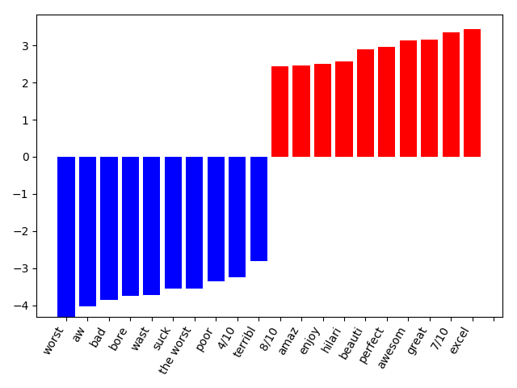
**Figure 6.3:** SVM Pipeline 2 - word tokenized and stemmed most informative features. The x axis shows the 20 most informative n-grams, the y axis represents the tf-idf influence for each n-gram.

The best performing parameters for pipeline 3 are listed in table 6.7.

---

<!-- Page 66 -->

|SA-Step|Parameter|Value|
|---|---|---|
|Vectorizer<br>Vectorizer<br>Vectorizer<br>Weighting<br>Linear SVM<br>Linear SVM<br>Linear SVM|sg<br>size<br>window<br>avg<br>C<br>tol<br>loss|’CBOW’<br>300<br>10<br>’avg’<br>0.2<br>1.5<br>’squared hinge’|

**Table 6.7:** SVM - pipeline 3

The highest accuracy achieved by this approach is 87%. Comparing the different parameters for this pipelines takes a lot of time. Every word2vec model has to be trained over several epochs which takes several hours. The influence of this epochs has been explored in the beginning of this evaluation. The accuracy does not increase with more than 50 training epochs. With less epochs the accuracy shrinks noticeable. After training all word2vec models with all specified parameter combinations, a heatmap cross validation for every model has been applied to figure out the best classifier parameters. The tested parameter values are set to values higher and lower than the recommended values from [ Reh˚uˇrek und Sojka, 2010] to[ˇ] prove both boarders weather the accuracy could be improved in one ore the other direction. The heatmaps (fig. 6.4) shows that the optimal parameters of our SVMclassifier is robust to parameter changes with the word2vec model. This means unfortunately that it was not possible to raise the accuracy of this model above this mark. 

Mikolov showed in [Mikolov u. a., 2013a] that the continous Skip-gram model should perform better for the sentiment classification step. In our experiments we achieved a lower accuracy (81%) with all skipgram-based doc2vec models. A few parameters were tested for this pipeline, but the accuracy was still below our averaged document vectors. In general a lower output size of our vectors reduced the accuracy always. Raising the output-size above 300 doesn’t increase the accuracy noticeable. Small changes to the window size doesn’t affect the accuracy much (<1%). While increasing or decreasing it above 15 or below 5 reduces the accuracy a lot (>5%). Training word2vec without some minimal manual cleaning or the usage of predefined tokenizing methods which automatically cleans the data results in a lower accuracy (<75%). In the area of data science this is called the ’gigo’-principle (garbage in garbage out). The tokenize and cleaning method must be the same for the the word2vec and the classifier training step . Different tokenizers, advanced 

---

<!-- Page 67 -->

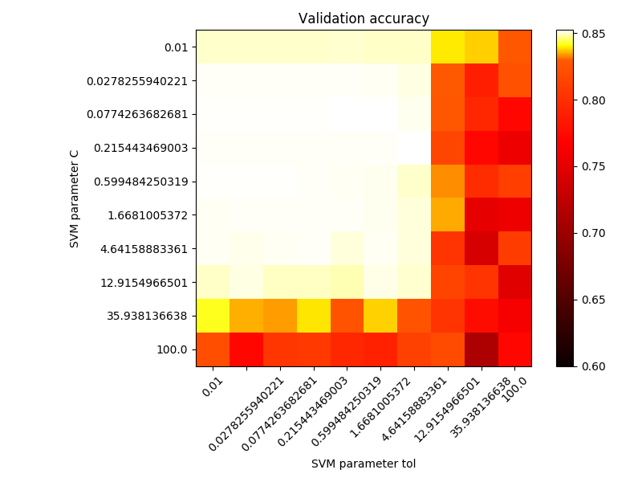
**Figure 6.4:** SVM parameter heatmap with word2vec as vectorizer. The white space shows the plateau with the best accuracy. This plotting is done with a smaller parameter range to show the plateau boarders. For this vectorizing method the SVM parameters are very robust as long as $0.01 < C < 10$. The tol parameter does not affect the accuracy.

cleaning steps, stemming and stopword filtering doesn't change the accuracy very much (<0.5%). Stopword filtering with the usage of predefined stopword lists always decreased the accuracy. Using the pretrained word2vec model from Google results in the same accuracy of 87%. This model is pre-trained on the Google News corpus (3 billion running words), it consists of 3 million 300-dimension English word vectors. This model is able to vectorize 9.3 million words from our corpus. By this it ignores 1.3 million words which are unknown to this model.

According to the idea from Hong different word2vec models with different architectures and the following parameters ($alpha = 0.05, min_{count} = 5, window = 10, size = 150, negative = 25$) were trained. The word vectors from differently trained word2vec models were then concatenated and used for the classification step. Before the classification step could be applied, cross validation heatmaps for the parameter tuning were produced for every model combination tested.

For the concatenated cbow- and skipgram based model the accuracy shrink to 77%.

---

<!-- Page 68 -->

### 6.1.3 CNN

The last approach turned out to be very time consuming. To avoid memory leaks the CNN was trained with batch iterations with 64 negative and positive feeds per batch run. We used the whole 66,000 feeds, split them during the test-phase into training and testing datasets with 10% testing data. This leads to 928 batches per epoch and 50 - 100 epochs. By this we got 46tsd - 92tsd batch runs per parameter combination. One training takes 4-5 hours on the graphics processing unit (GPU) cluster. The best runtime performance could be achieved with batch-size 64 and < 10 epochs. In most of the cases using bigger batch sizes, doesn't increase the training time much. Training more epochs than 10 always leads to over-fitting the model. The initial accuracy without any parameter tuning was 86%.

The best accuracy achieved on our test-set was 89% after 5200 batch-steps. Which is a 3% better result just by using better parameter combinations. The following parameter combination leads to this result: Dropout: 0.5, Embedding-dimensionality: 128, Filter sizes: [3;4;5] L2-regularization lambda: 0.5. The accuracy for our training-set accuracy was 93%.

It turned out that increasing the training-accuracy with hyper-parameter tuning above 92% shrinks the accuracy for our test-feeds. The drop-out ratio has the biggest impact on the overall accuracy because it prevented over-fitting and closes the gap between the training and testing-accuracy. Fig 6.5 shows the accuracy progress for our best parameter combination. The best accuracy was after 4 epochs.

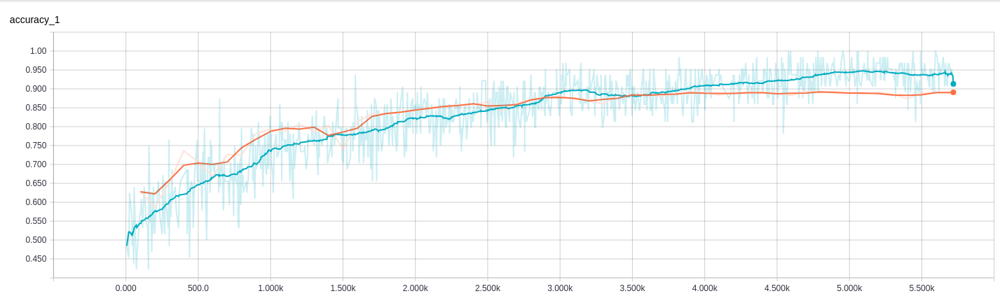
**Figure 6.5:** Accuracy progress for our best working parameter combinations. The red line describes the accuracy for the training dataset. The blue line describes the accuracy for the unseen test data set. Both lines describes the typical learning progress where initially the test accuracy is higher than the training accuracy. Both are raising nearly parallel for the first 3000 batch iterations. Above 3000 batch steps the training accuracy is further raising while the test-accuracy stagnates at 88% - 89%.

Shifting the filters sizes to smaller or bigger sizes and adding more filters impacted the accuracy with around 1-2%. Using bigger filters increased the training time a

---

<!-- Page 69 -->

lot. Our tests doesn’t confirm the results from [Zhang u. a., 2015]. He figured out that using filter sizes around seven worked best for him. For our dataset region sizes around three to four worked the best. 

## 6.2 Visualization and semi-supervised clustering

After improving the accuracy of our sentiment pipelines, the focus changed to the question weather it is possible to visualize the reviews used. The goal was to find a way of visualizing the sentiment captured by our vectorizers. This questions concentrated on the word2vec-model as vectorizer. As proved by Mikolov Mikolov u. a. [2013b] and shown in this fig. 4.9 this model captured semantic relations. Combined with the idea from chapter 4.2.2 that all informations required for a classification task are encoded in the data itself lead to the question, weather it is possible to extract these sentiment related informations and plot our reviews based on this data. 

Three ideas were pursued for this work. The results of this investigations are listed in the following sections. All three approaches works with the self-trained word2vec model from chapter 5. The question was if it is possible to reduce the dimensions with as less information loosing as possible. As an entry point the vectors were plotted with two well known dimension reduction techniques (PCA and t-SNE) and without any preparation before. The next approach tries to figure out which dimensions are the most significant sentiment related dimensions, afterwards these dimension were extracted and reduced for the plotting part. 

The approaches were initially applied to individual word vectors described in section 4 and later to entire document vectors. By this the level of abstractness rises with each step. 

Triggered by the accuracy results from section 5 with the averaged word2vec representations, two questions arose: First: "What does each dimension of the averaged and non averaged word vectors stands for?" Second: "Is it possible to define, extract and visualize the sentiment related dimensions?" 

This section already concludes the results of this investigations. 

---

<!-- Page 70 -->

### 6.2.1 Word vectors

For this approach the positive and negative word lists are slitted into a training and testing part. Afterwards a word2vec model was trained with the following parameters: _mincount_ = 5 _, windows_ = 10 _, size_ = 10 _, sample_ 1 _e −_ 4 _, negative_ = 5. Next the positive and negative words from our word lists were transformed by this model. To visualize the vector representation of these word lists, the dimensionality is shrink and normalized by PCA. fig. 6.6 shows the result of this plotting. Most of the words are placed around the center. No clear clustering is visible. 

**Figure 6.6:** Baseline plotting Sentiment related word lists, no filtering - dimensionality reduced with PCA. For this plotting the opinion word list from Hu and Bing Liu mentioned in section 2.2.4 is vectorized with the usage of our self trained CBOW-based word2vec model. To visualize the 300 dimensional word vectors the dimensionality was reduced by PCA. Without any filtering PCA wasn’t able to find the sentiment related clusters. It seems that the first principle component (x-axis)tried to split the positive and negative words in the center. Positive values on that component are more positive related and negative values on this axis seems to be more positive related.

Afterwards the dimensionality of these word lists are reduced with PCA and t-SNE (fig. 6.7 and fig 6.7). In both plottings there is no clear clustering visible. It seems that reducing the dimensionality does not capture the sentiment. 

After the baseline plotting with PCA and t-SNE does not show very good sentiment related clustering, a new way was introduced to filter the dimensionality before shrinking them. The idea came from the averaged document vectors which still reached an accuracy of 85%. By averaging all words in a review we loose a lot 

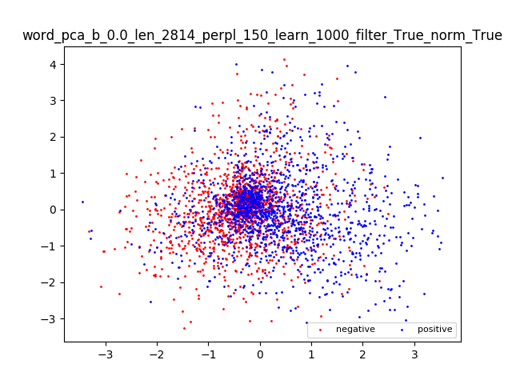

---

<!-- Page 71 -->

**Figure 6.7:** Baseline plotting Sentiment related word lists, no filtering - dimensionality reduced with t-SNE. This plotting shows the same data as fig. 6.6, this time the dimensionality was reduced with t-SNE (perplexity: 150, learning rate:1000. This dimensionality technique seems to works better for the unsupervised clustering challenge. Still there is no clear separation possible.

of the sense captured by the word vectors but the classifier was still able to predict the sentiment of this reviews. Maybe there are some sentiment related dimensions which keeps their informations even if we average them. For the next approach the sentiment ordered word lists from section 4 where used. 

Both word lists are vectorized with the word2vec model from section 4 to get negative and positive related word vectors. Next each vectorized word list was averaged to get a 300 dimensional representation of an average negative or positive word. The plan is to filter out all semantic and syntactic word informations captured within these dimensions by averaging them. If there are a few dimensions describing the mood, the tendency of these dimensions should be the same on the average word vectors. Other dimensions describing the tense, part of speech and semantic or syntactic related informations about this word should be washed out. 

Statistically both averaged vectors should be affected by the same amount of nonsentiment informations. This means that dimensions without sentiment related informations should converge to similar values in the negative and positive averaged word vectors for sufficiently large word lists. 

In order to get only the different dimension which might keep most of the sentiment related information we have formed the absolute difference between the two 

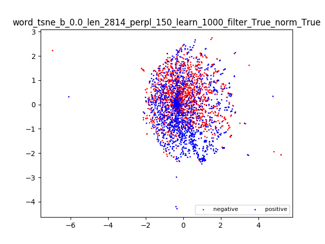

---

<!-- Page 72 -->

averaged word vectors. We tried it with relative difference, but the results were not that good. Difference relative to a _abs_ ( _a − b/a_ ) with seven extracted dimensions results in 62% accuracy. The difference relative to b with four feature dimensions extracted _abs_ ( _a−b/b_ ) leads to 52% accuracy. Both is only a little better than random guessing. 

After the absolute difference was calculated we get a visualization of the most significant differences between our average positive and negative words Fig. 6.8 shows that line for our word lists. The first two lines describe the value of each dimension for six random sample words. They differ in nearly every dimension, some more some not. Maybe its possible to detect nouns and verbs or the tense of the words by the course of that lines. But that is not part of this work. The third plot describes the curve of our sentiment based averaged words. The range of this plot shrinks to values between -0.5 and +0.5. Some dimensions seems to have similar tendencies. Some others differ a lot. The last plot shows the difference of both averaged vectors _abs_ ( _neg − pos_ ). We want to know in which dimension the averaged positive word vector differs the most from the averaged negative word vector, that’s why we use the absolute value of the difference. These results were compared against the clustering based on dimensions extracted by a relative difference. The absolute difference captures better dimensions. All peaks are marked with small red dots. 

---

<!-- Page 73 -->

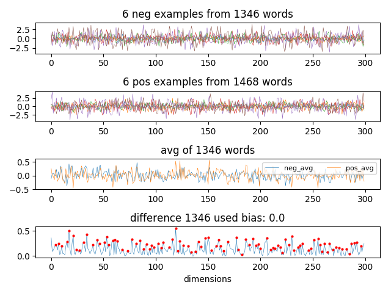
**Figure 6.8:** Word lists - absolute difference
The first two plottings describes each dimension of 6 positive and 6 negative related words. Vectorized with our self-trained CBOW word2vec model. The model was able to vectorize 1346 words out of 2000 random selected words. The third plotting shows each dimension when all positive and all negative related word vectors are averaged. The values of this dimensions are between -0.5 and 0.5. The fourth plotting shows the absolute difference between the avg. negative word vectors and the avg. positive word vectors. The values for the most important differences are nearly the same size as the biggest absolute values per dimension.

Unfortunately our both averaged word vectors differ in a lot dimensions. Due to the point that our word lists consist of only around 1,300 words known by our trained word2vec model, the curve describing the difference has a lot of noise. To work out the most significant differences and to filter the behaviour from the lack of a great representative word list, a threshold was introduced. By this we are able to name the four most significant sentiment related dimensions (fig. 6.9) based on a manually chosen threshold for noise reduction. For our word lists and this word2vec model the most significant dimensions are at index 17, 21, 34 and 119.

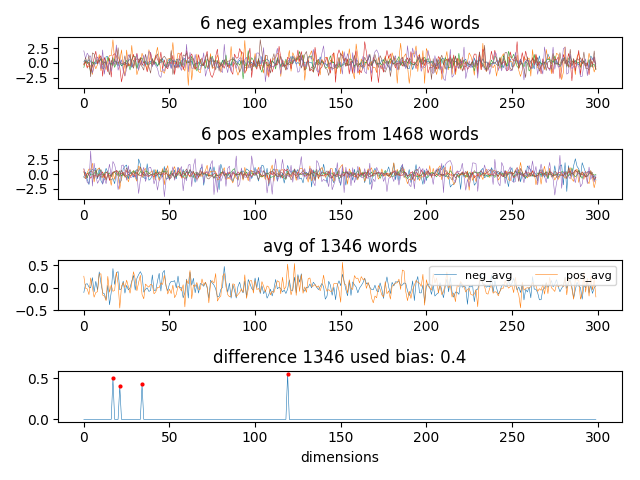
**Figure 6.9:** Word lists - absolute difference
The most significant dimensions are filtered out by a threshold bias of 0.4.

---

<!-- Page 74 -->

A classifier was applied to compare the guessed results. If we predict the sentiment for our 300-dimensional word vectors with a linear SVM (training set: 75%, testing set: 25%) we achieve 74% accuracy without any hyper parameter tuning. If we take only the four most significant dimensions for the classification step, which is a information reduction of nearly 99%, we still get a accuracy of 69%. Which is only 5% worse than with all 300 dimensions. By shrinking the filter threshold the filtered dimensions raises. With a filter threshold of 0.1 around 70 dimensions are extracted and the accuracy raises to 78% which is even better than the accuracy with all 300 dimensions. If we apply further dimensions to our classifier the accuracy again shrinks towards our 74%. 

Our filter mechanism seems to work and has obviously chosen the right dimensions. But still the two averaged word vectors contains a lot of noise. A clear statement which dimensions probably describes the sentiment the best is very difficult. By using the sentiment related word lists as data source we don’t get enough nonsentiment related words to extract the sentiment related dimensions. 

Fig 6.10 shows the 2-dimensional plotting after the most significant dimensions were extracted and afterwards shrink with PCA and t-SNE respectively. Both figures shows the beginning shape of two clusters when we reduce the dimensionality of our extracted word vectors. 

---

<!-- Page 75 -->

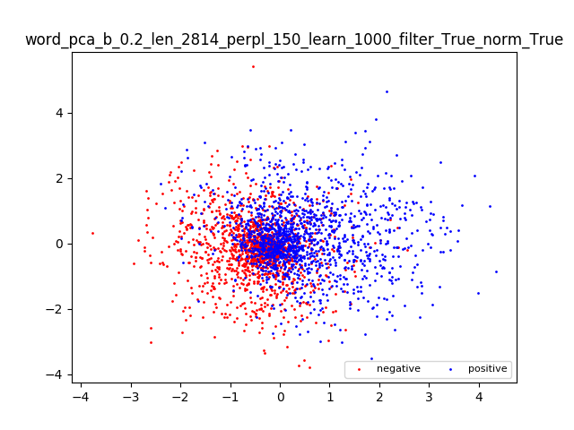
**Figure 6.10:** Sentiment related word lists, significant dimensions extracted - reduced with PCA.
After extracting the four most significant dimensions from each sentiment related word lists, the dimensionality of these vectors are reduced with PCA. When we use only the extracted dimensions, shrink and plot them the sentiment clustering works much better than the baseline plotting in fig 6.6. The first principle component captured the sentiment clustering much better.

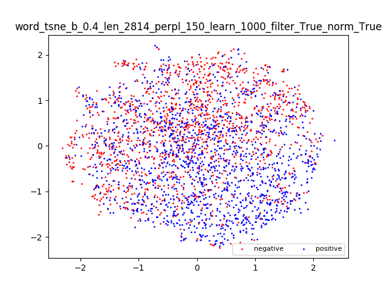
**Figure 6.11:** Sentiment related word lists, significant dimensions extracted - reduced with t-SNE.
After extracting the four most significant dimensions from each sentiment related word lists, the dimensionality of these vectors are reduced with Pt-SNE. When we use only the extracted dimensions, shrink and plot them the sentiment clustering works much better than the baseline plotting in fig 6.7. The upper part is mostly negative related and the lower dots (representing the shrink review vectors) are mostly positive related.

---

<!-- Page 76 -->

### 6.2.2 Document vectors

After the procedure seems to work with our small word lists we transferred the method to our movie reviews. All 60 tsd movie reviews were vectorized with our own word2vec model. Afterwards we averaged the word vectors of our reviews according to the step from section 4.2.2 to get one vector for each review. 

The baseline plotting for this dataset is shown with fig 6.12 and 6.13. For this plots 2,000 random positive and negative example review were taken, vectorized and normalized. The dimensionality is reduced with PCA and t-SNE according to the steps for the sentiment related word lists. For the baseline plotting no filtering is applied. 

Later all document vectors within one sentiment group were averaged to receive two sentiment vectors. One represents all negative and the other all positive movie reviews. After that the absolute difference between the averaged positive and negative sentiment vectors was calculated. Fig. 6.14 illustrates the results. The first two plots describes six random negative and positive review vectors to check whether the averaged review vectors are always the same. The third plotting shows the averaged review vectors, for each sentiment we receive one vector. We recognize that both averaged vectors have nearly the same values at most of the dimensions. It is very interesting that both vectors independently converged to nearly the same, nonzero values in every dimension. The fourth plotting shows the differences between our two averaged review vectors. From this line one can recognize that the averaged positive and negative review vectors differ in some dimensions more than in others. The dimensions which captures the biggest differences between our negative and positive reviews are the same dimensions we recognized with our sentiment related word lists. In the next step this dimensions will be extracted from each movie review to prove whether they are mostly inform on the sentiment of a movie review. 

According to our ideas from a pure sentiment related representation of our documents, all differences where filtered by a chosen threshold to find just the two most significant dimensions. This led to fig. 6.15. For this word2vec model the most significant sentiment related dimensions are vec[21] and vec[119]. 

These two most significant dimensions were extracted from each vectorized movie review. This results to only two dimensions hopefully describing the sentiment of a whole movie review. To check whether this dimensions are really useful for the sentiment classification task, this representation is fed into a linear SVM. This time 

---

<!-- Page 77 -->

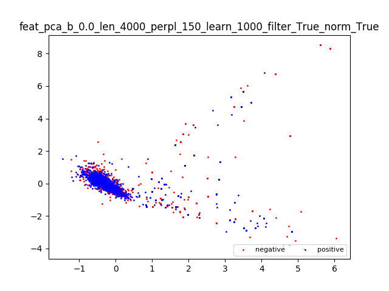
**Figure 6.12:** Averaged movie review word vectors, no filtering - dimensionality reduced with PCA. The PCA reduced plotting can't find any differences for our averaged movie reviews. It seems that some outliners dominate the first principle component.

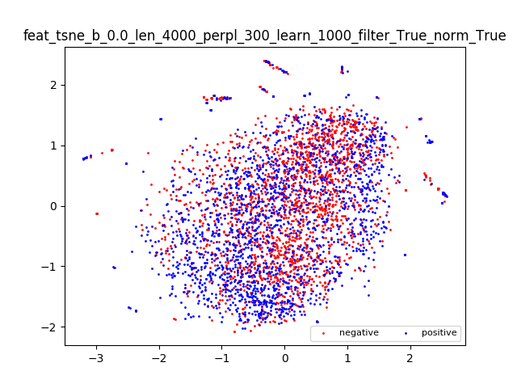
**Figure 6.13:** Averaged movie review word vectors, no filtering - dimensionality reduced with t-SNE. T-SNE was able to find some local clusters when we apply it to the averaged document vectors. Negative (red) reviews seems to cluster in the upper right corner. While most of the negative reviews are moved to the lower left part.
77

---

<!-- Page 78 -->

# 6 Results

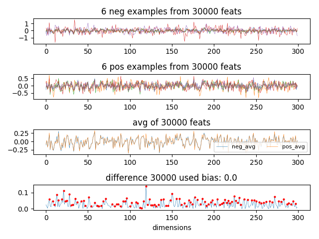
**Figure 6.14:** Movie reviews, values per dimension - absolute difference
The first two plotings describes each dimension of six positive and six negative related movie reviews. The reviews are vectorized with our self-trained CBOW word2vec model, later they are averaged to document reviews. The third plotting shows each dimension when all positive and all negative related movie review document vectors are averaged per sentiment. The values of this dimensions are between -0.25 and 0.25. The fourth plotting shows the absolute difference between the avg. negative document vectors and the avg. positive document vectors. The values for the most important differences are nearly half the size as the biggest absolute values per dimension. The most significant dimensions are the same then discovered for our sentiment word lists.

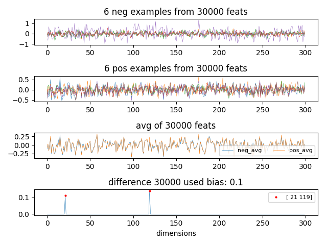
**Figure 6.15:** Movie reviews, values per dimension - absolute difference with threshold bias.
By setting the filter threshold to 0.1 we are able to find and extract the two most significant dimensions from our review vectors.

---

<!-- Page 79 -->

we reduced the amount of describing parameters per movie review two times. First each movie review consists of 180 word vectors on average. Which were averaged to one vector describing the whole review. A reduction of more than 99%. Second we reduced every movie review vector from 300 dimensions to two dimensions. By this we reduce the data expressing the sentiment of a movie review for more than 99%. 

The sentiment classification accuracy with all 300 dimensions is 85%. With our extracted two-dimensional review vectors we get an accuracy of 67%. With some small hyper parameter tuning this accuracy could be raised to 70%. Unfortunately the accuracy for our extracted two-dimensional review vectors could not be increased (as it was possible for our sentiment word lists). The accuracy for our extracted vectors is below the accuracy with our 300-dimensional review vectors (85%). Still the accuracy is very impressive if we consider that we extracted only two floating points per review in a unsupervised manner which still represents the sentiment of a whole movie review in general. The most significant dimensions from our document vectors are also the two most significant dimensions from our sentiment related word lists. This agreement gained by two completely different data sources confirms the assumption that the extracted dimensions are somehow responsible for the sentiment representation within our word vectors and our averaged document vectors. 

By changing the filter-threshold we are able to rise or shrink the amount of significant dimensions. The accuracy of our classifier can be increased by adding more significant dimensions to our review representation. To evaluate the correlation between filtered dimensions and gained accuracy, the progress was examined in fig. 6.16. At every point the threshold was reduced by 0.01. The plotting shows the threshold reduction within the range 0.002 to 0.01. 

To visualize how good these extracted dimensions describe the sentiment of our movie reviews, the two non-supervised methods from the beginning of this section were used. Fig. 6.17 shows the two-dimensional clustering plot when we extract the two most significant dimensions. This plotting looks like the scatter plot of the two most significant dimensions vec[21] and vec[119]. The plottings resulted by PCA doesn’t evolve much when the amount of extracted dimensions is raised. 

Next t-SNE is fed with the four most significant dimensions extracted from our review vectors. The plotting results from t-SNE vary a lot depending on the param- 

---

<!-- Page 80 -->

# 6 Results

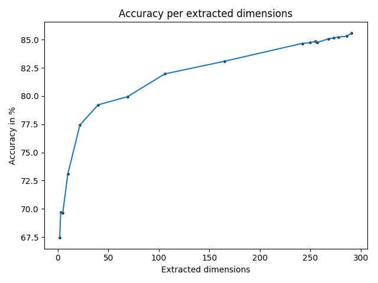
**Figure 6.16:** Correlation between filtered dimensions and accuracy
To show the correlation between the filtered dimensions and the accuracy, different filter thresholds were applied to change the amount of extracted dimensions. The extracted dataset was applied to a linear SVM. Due to timely restrictions no further parameter tuning was used. The accuracy jumps from pure guessing to 70% by applying only two dimensions. By adding further dimensions (sorted by their calculated sentiment influence) the accuracy climbs up to 80% with the usage of the 50 most significant dimensions. Adding more dimensions doesn't influence the accuracy much.

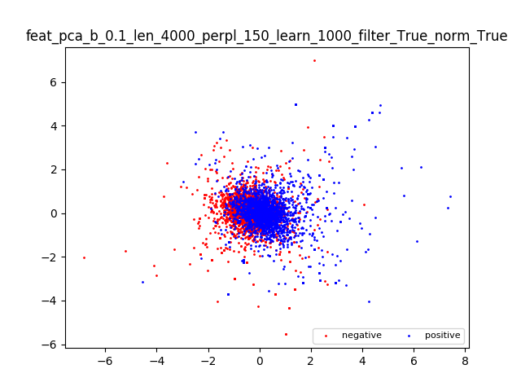
**Figure 6.17:** Averaged review vectors, significant dimensions filtered - reduced with PCA.
If we compare the PCA-based baseline plotting with the principle component in this plotting. The two classes moved apart. Still PCA is not able to separate the reviews by their sentiment.

---

<!-- Page 81 -->

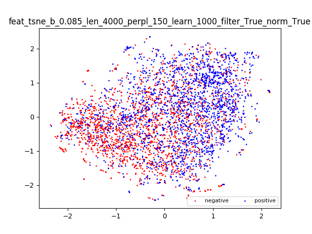
**Figure 6.18:** Averaged review vectors, significant dimensions filtered - reduced with t-SNE. Within this plot t-SNE was able to keep the nearest neighbours of our positive and negative related reviews. Most of the positive reviews are in the upper right corner while the upper left corner is dominated with negative reviews. T-SNE doesn't get any informations about the membership of these vectors it uses only the distance between each.

eters chosen. The higher the perplexity of t-SNE the more nearest neighbours are considered for the error back propagation. By this t-SNE is forced to merge some local clusters into one bigger further distributed cluster. Fig 6.18 shows the results for the best four dimensions. On the left side we have significant negative and on the right hand side we have mostly positive reviews. Both areas are mixed up with representations from the other sentiment.

It has turned out that finding and extracting the most significant differences between the document vectors of our two classes could increase the accuracy, decrease the amount of data, decrease the classification time and sometimes it even enables to cluster the data in a unsupervised way.

### 6.2.3 Improvements

Even if the other word2vec models trained for the accuracy part didn't improve the predicted accuracy of our movie reviews, for the completeness of the tests they were applied to the visualisation steps. The pre-trained model from Google didn't work well for the task to predict the accuracy. For the unsupervised clustering part in combination with t-SNE it shows really nice results. Initially this word2vec model

---

<!-- Page 82 -->

## 6 Results

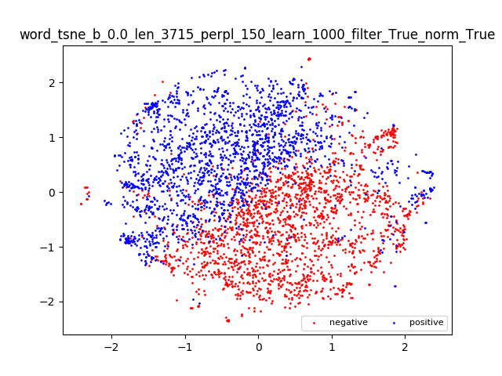
**Figure 6.19:** Word lists - pre-trained word2vec model from Google reduced by t-SNE for plotting - no filtering.

was used to vectorize 2,000 positive and negative related words from our word lists, no filter threshold was applied. The 300 dimensional word vectors were then shrink with t-SNE (perplexity:150, learningrate:1,000 . Fig 6.19 shows the two-dimensional word list representation. The accuracy for this vectorized word lists is 94% with a linear SVM. The clustering of this vectors is even better than the filtered variant of our own trained word2vec model.

Motivated by the good results the whole sentiment related filter mechanism and t-SNE parameter optimization were started again for the word vectors from the Google-model. All accuracy tests for the word2vec pipeline were started to double check if there are accuracy improvements possible. Unfortunately the predicted accuracy for our movie reviews could not be increased. And the acc. from our tf-idf-based pipeline still outperforms the word2vec based predictions.

What are the unsupervised steps to visualize the clustering of new data? The most significant word2vec dimensions changes with the usage of a different models. But these dimensions are fixed within one model. With this knowledge one could train a word2vec model in a unsupised manner. Next the most significant sentiment dimension could be named with the usage of a sentiment related dictionary. After the most significant dimensions are known new reviews or other sentiment related documents could be vectorized with word2vec and extracted afterwards. After the vectorizing step The most significant dimensions for the word lists and the movie re-

---

<!-- Page 83 -->

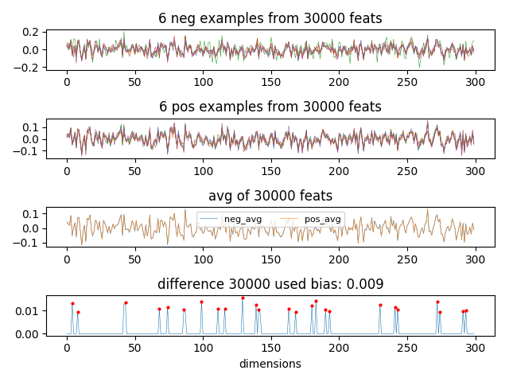
**Figure 6.20:** Movie reviews - 28 most significant dimensions
The differences between our averaged positive and averaged negative reviews are 10 times smaller than with our self trained word2vec model (cf. Fig 6.15).

views using the same word2vec model are always the same. Plotting 6.20 shows the averaged document vectors and the differences for the 30tsd positive and negative movie reviews. They are filtered by an bias of 0.009 and captures 28 dimensions. The most significant differences are 10 times smaller than the differences for our averaged word lists.

The clusters for our unfiltered movie reviews could not be enhanced by the usage of Googles word2vec model. To find the best working unsupervised clustering the filter threshold was raised from 0.001 to 0.013 (steps: 0.001). For every threshold step more feature dimensions are extracted. For every extracted feature set a linear classifier was applied and all hyper parameters for the t-SNE algorithm optimized. By this the clusters for our filtered movie reviews could be improved a little bit. It turned out that t-SNE could find the best clusters by extracting the 20 -30 most significant dimensions. Reducing less or more dimensions raised the noise in the plotting. Fig. 6.21 illustrates the plotting of 2000 random selected positive and negative movie reviews represented by an shrink two-dimensional-document vector.

The next chapter concludes the observations from chapter 6. Still there are lots of questions not answered within this work. Some of them will be summarized in section 7.2.

---

<!-- Page 84 -->

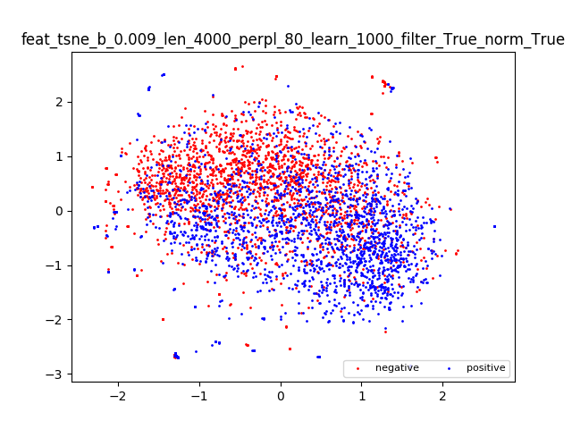
**Figure 6.21:** Averaged review vectors, significant dimensions filtered - reduced with t-SNE. Optically the best possible unsupervised clustering with the pre-trained word2vec model from Google. For this plotting the 28 most significant dimensions were extracted and shrink by t-SNE (perplexity: 80, learning rate:1,000).

---

<!-- Page 85 -->

# Chapter 7: Conclusion

The first goal of this thesis is to find the best working parameter combination for one of the chosen classifiers. The overall best accuracy could be achieved with a binary tf-idf-weighted BOW-model combined with a linear SVM. The whole process from the data cleaning over the tokenization, feature extraction, filtering, feature weighting, normalization and to the classification step is optimized in thousands of k-fold cross validated grid searches. This extensive investigations leads to an state of the art accuracy of 91%. Every optimized pipeline achieved accuracies above 87% which is quite good compared to the accuracy humans reach ( 80%). Numerous studies have shown that the rate of human concordance is between 70% and 80% [Denkor, 2013]. 

At this point the question arises: "Is it useful to achieve higher accuracies with machine learning approaches on a task related to human sentiment than humans do?" 

The second goal of this work is to extract and visualize the sentiment within our movie reviews in a unsupervised manner. This goal could be accomplished the best by vectorizing the reviews with Googles pre-trained Word2Vec-model. The most informative dimensions are then defined with the usage of a sentiment word list. Next this feature dimensions are extracted from our averaged review vectors. By shrinking these vectors into two dimensions with the help of t-SNE the local clustering within one sentiment could be preserved. These sentiment clusters are nearly linear separable and recognizable with a simple eye. 

Referring to the question 

---

<!-- Page 86 -->

## 7.1 Outcome

This section will shortly summarize the results per approach from section 6. 

### 7.1.1 Naive Bayes

They maximum accuracy achieved with Naive Bayes is 88%. The feature preprocessing part, especially the cleaning, tokenizing and feature selection steps have the biggest impact on the accuracy of this classifier. The best performing pipeline used a bag of unigrams and bigrams tokenized and cleaned with the Regex-Tokenizer from NLTK. The Chi-based bigram collection finder is used to filter the best features which increased the accuracy. The smoothed Bernoulli Naive Bayes approach works best with our sentiment classes. 

The advantages of this technique are: Easy to implement and understand, very fast to train, very few parameters to tune. 

The disadvantages of this approach are: Naive Bayes is based on the estimated likelihood of every feature, by this it will probably not able to predict completely new features or unknown words from a different domain. Dependencies among features cannot be modelled due to the naive assumption that two features are independent for a given class. 

### 7.1.2 SVM

The SVM-based pipeline showed the overall best accuracy of 91%. The usage of bigrams and tf-idf weighted features turned out to boost the accuracy the most. The data cleaning part should be done with a given tokenizing method from scikit-learn or NLTK. The _C_ -parameter of our linear SVM has also a big influence on the accuracy. The best performing pipeline used the Regex-Tokenizer from scikit-learn to extract the tokens and clean the data in one step. Tokens occurring in more than 80% of the corpus or in less than 2 documents are filtered out. The extracted bag of bigrams based sparse matrix is weighted with tf-idf and L2-normalized. In the classification step a parameter tuned SVM with linear kernel works the best. 

The advantages of this pipelines are: Best results even with small training data, C- parameter to avoid over-fitting, flexible due to the kernel-trick, very fast to train and very few parameters to tune. 

---

<!-- Page 87 -->

The disadvantages of this approach: SVMs doesn’t provide probabilities for the predicted class due to this there is a lack of transparency of the results. 

### 7.1.3 CNN

Our tests with the CNN for text classification had the worst accuracy results in relation to the computing time. Still the accuracy with 89% is very nice and comparable to human accuracy. For this work a simple CNN-architecture was used to boost the understanding of CNNs itself. Training with more filter combinations and a pre-trained word2vec models or more complex architectures could probably further increase the accuracy. 

The advantages of this method are: It is possible to capture and use local dependencies for our classification step which should represent the text in a better way than using any kind of BOW or CBOW. Second this network has only very few parameters compared to a simple neuronal network due to the point that all parameters are shared between neurons. 

The disadvantages of this approach: Without a good GPU CNNs are very slow to train and they do not work on small datasets. 

## 7.2 Further work

In this section we focused on the optimized pipeline for the three selected classifiers. Indeed new questions and research possibilities came up. This sections will summarize and name them. 

For this work the pipelines doesn’t handle ironic sarcastic or negated sentences. Furthermore our approaches doesn’t integrate emoticons which could also influence the sentiment of a document. 

Due to the limited computing power, it was not possible to evaluate the following idea for the full dataset: extracting the significant dimensions for the whole dataset for different given threshold biases. Reduce the dimensionality of the extracted word2vec dimensions for all reviews with t-SNE and other reduction methods. Finally apply different classifier and plot the 2-dimensional corpus. The t-SNE im- 

---

<!-- Page 88 -->

plementation from scikit-learn is not able to handle huge datasets. It will crash in a out of memory error. 

Maybe its possible create a ranking or even extend the sentiment related word list by calculating the nearest neighbours to our averaged negative word vectors. Maybe its possible to identify and vectorize by this step only sentiment related words while calculating the review vectors. Building on this one could try to calculate the sentiment opposite of a word by subtracting the differences captured between our averaged positive and negative vectors from a sentiment related word and search for the nearest neighbours of this representation 

The idea of extracting only the significant dimensions for a given task could be applied to other text classification tasks to check whether this could increase the accuracy, boost the speed or increase the dataset size. 

Every dimension of our averaged review vectors converged to a clear value. By this we got a averaged representation of a movie review. The averaged document vector calculated with vectorized scientific paper will probably converge to a different line. By this approach it could be possible to classify the type of a document. Furthermore this vector could be used to prove whether a corpus or document was changed. 

By applying the linear-SVM to the sentiment word list an accuracy of >92% was achieved. Build on the idea of dictionary based sentiment analysis techniques. Instead of adding up the values from the sentiment dictionaries, one could filter, vectorize and average only the words occurring in these sentiment dictionary when vectorizing a movie review. 

There are bigger and more complex CNN-architectures for text classification available. Using one of them would probably increase the predicted accuracy. 

According to Zhang u. a. [2015] it is possible to replace the embedding layer with a Word2Vec model. Section 6.2 showed that the pre-trained word2vec model from Google represents more semantic informations. Maybe this vectors would work better in our CNN. 

The tokenizing part replaced the cleaning step in our other approaches. Different word tokenizing methods could be applied to extract better features. 

---

<!-- Page 89 -->

Radford u. a. [2016] showed a very interesting attempt to find the sentiment related neurons within a byte-level recurrent language model. It would be very nice to discover whether this approach is also possible within a CNN. 

## 7.3 Own Opinion

This thesis is first related to the topic whether and how supervised machine learning algorithms are able to predict the sentiment of a text, or more accurate the sentiment of a movie review. The second topic of this thesis is about the question whether it is possible to extract, cluster and visualize the pure sentiment orientation of a movie review. 

In the introduction part of this thesis the question arises if one could summarize the sentiment direction of written text. Within this thesis three different approaches and multiple different variations are implemented. After achieving even better results than humans would do on the task of sentiment prediction of texts. One can say that it is possible to train a supervised model which is able to classify the sentiment of text. 

The statistically methods still delivers up-to-date accuracy results. They are very fast and extensible to different preprocessing and vectorizing steps. Doing the wrong preprocessing and tokenizing steps in before leads to really bad results even for the best classifiers. Using unclean or bad tokenized text leads also to very poor accuracies. On the other side it turns out that doing very simple data preprocessing combined with any kind of word-Tokenizing is often enough for good results. Second it shows that the vectorizing, weighting and usage of the right n-gram phrases affect the accuracy the most across all approaches. Often this steps could be used for different approaches which makes it really important to get a good understanding of how it works. 

Due to the exponentially increasing complexity of comparing all possible parameter and combination its often not practically important to find the best working combination. Often it is better to find a very good combination rather than finding the best combination. 

It was very interesting to implement and apply different techniques. By that I got a very good understanding of every text classification step and their influence on the 

---

<!-- Page 90 -->

overall task. It is not about one classifier, its always about the whole pipeline. This pipeline starts with getting or producing labelled data, which is the most important point for every supervised classification task. If there is less or bad labelled data, the whole following process will provide bad results. And ends with the evaluation and interpretation of our predicted classes. 

After working with the different approaches I recognized that there is always a gap between the raw text and the numerical representation of this text. Either the representation looses the order of the words, or the context and semantics or sometimes both. The results with these numerical representations are still really good and even better than humans can predict. So the next question arises: "Is it possible to compress this representations by reducing the dimensionality without loosing the necessary informations?". This brought me to the second topic of how to find and extract only the sentiment related informations and how to reduce the dimensionality of our data by keeping the most relevant informations. This idea is based on unsupervised Word2Vec models combined with an extraction step. Finally the extracted dimensions are further reduced in a unsupervised manner. 

Within this work I raised the hypothesis that it is possible to reduce the dimensionality of a Word2vec vectorized review and simultaneously keep the most significant sentiment related informations. It turned out that this idea works pretty well for the field of sentiment analysis and probably for other text classification tasks. 

This was the most fascinating part because I did not know whether this idea works. Several times I thought that I found a really nice way but after double checking the results and the path I recognized mistakes or misinterpretations. Sometimes there is only a little change with a huge effect on the overall process. 

Finally this work pushed me deeper into the field of sentiment analysis. I introduced myself to different approaches and frameworks from the field of supervised machine learning. All pipelines delivers very nice results and I opened a new door for feature compressing and extracting. 

---

<!-- Page vii -->

## List of Abbreviations

| Abbreviation | Definition |
|---|---|
| POS | Part of Speech |
| NLTK | Natural Language Tool Kit |
| NLP | Natural Language Processing |
| SA | Sentiment Analysis |
| OCR | Optical character recognition |
| BOW | Bag Of Word |
**tf-idf** Term frequency–inverse document frequency 

| Abbreviation | Definition |
|---|---|
| SVM | Support Vector Machine |
| CBOW | Continuous Bag of Words |
| PCA | Principle Component Analysis |
**t-SNE** t-distributed stochastic neighbor embedding 

| Abbreviation | Definition |
|---|---|
| IGGSA | Interest Group on German Sentiment Analysis |
| CNN | Convolutional Network |
| GPU | graphics processing unit |
| LSTM | Long Short Term Memory |
**ReLu** 

**tanh** hyperbolic tangent function 

---

<!-- Page viii -->

*[Empty page — skipped]*

---

<!-- Page ix -->

## List of Tables

|4.1| Example sentences<br> |25|
|---|---|---|
|4.2| Example sentences uni-gram vectorized |25|
|4.3| Example sentences bi-gram vectorized |26|
|5.1|Sparse BOW, tf and tf-idf weighted representation of our vectorized||
|| test sentences |47|
|5.2| Linear SVM - tested pipelines<br> |49|
|5.3| Count Vectorizer - optimized parameters |50|
|5.4| Word2vec - optimized parameters<br> |50|
|5.5| Tf-idf-Transformer - optimized parameters |51|
|5.6| Linear SVM - optimized parameters |51|
|6.1| Naive Bayes - Most informative Features |60|
|6.2| Naive Bayes - Precision and recall |61|
|6.3| Naive Bayes optimized - Precision and recall<br> |61|
|6.4| Naive Bayes optimized - Most informative Features |61|
|6.5| SVM - pipeline 1 |62|
|6.6| SVM - pipeline 2 |64|
|6.7| SVM - pipeline 3 |66|

---

<!-- Page x -->

*[Empty page — skipped]*

---

<!-- Page xi -->

## List of Figures

|1.1| What is this Thesis about?<br> |1|
|---|---|---|
|2.1|Number of publications on English sentiment analysis, per year||
|| Dashtipour u. a. [2016b]<br> |7|
|2.2|Number of publications on multilingual sentiment analysis, per year||
|| Dashtipour u. a. [2016b]<br> |7|
|4.1| Growth of global data - trend |21|
|4.2| Growth of global data - sources_source:practicalanalytics.co_<br> |22|
|4.3| Term frequency - binary count |27|
|4.4| Term frequency - raw count |27|
|4.5| Term frequency - document length adjusted |27|
|4.6| Term frequency - log normalized |28|
|4.7| Inverse document frequency - with adjusted denominator |28|
|4.8|The new model architecture for the CBOW and Skip-gram method,||
|| provided by Mikolov u. a. [2013a] |28|
|4.9|Linear semantic relationship for word vectors, provided by Mikolov||
|| u. a. [2013b] |29|
|4.10|Maximum margin hyperplane ’By Cyc - Own work, Public Do-||
||main, https://commons.wikimedia.org/w/index.php?curid=3566688’|32|
|4.11| SVM - hard margin |33|
|4.12|PCA - pc with maximum variance_source:liorpachter.files.wordpress.com_ 35||
|4.13|Constructional overview of an typical CNN source: Adit Deshpande|38|
|4.14|3 x 3 convolution applied to an input matrix. The orange area de-||
||scribes the convolution, the orange numbers express the weighting||
||within this flter-matrix. The right image shows one element-wise||
|| convolved feature. source: Denny Britz<br> |38|
|4.15|Max-pooling with 2x2 flters and stride 2 A 2x2 max-pooling is||
||applied to the left matrix, the output of a convolution layer. This||
||pooling flter the biggest values within its area and slides with a||
||stride of 2 over left matrix. By this the dimensionality could be||
||reduced from 4x4 to 2x2, keeping only the most important features.||
|| source: wildml.com |39|

---

<!-- Page xii -->

|5.1|Numerical parameter pre-selection done with logspaced parameters||
|---|---|---|
|| - accuracy represented by a heatmap |52|
|5.2| 4-fold cross validation for the grid searches<br> |54|
|5.3| Overview of our applied CNN source: wildml.com<br> |55|
|5.4| Initial architecture of our CNN source: wildml.com |56|
|6.1|SVM Pipeline 1 - binary weighted most informative features. The||
||x axis shows the 20 most informative n-grams, the y axis represents||
|| the normalized infuence for each n-gram |63|
|6.2|SVM Pipeline 2 -tf-idf weighted most informative features. The x||
||axis shows the 20 most informative n-grams, the y axis represents||
|| the tf-idf infuence for each n-gram.<br> |64|
|6.3|SVM Pipeline 2 - word tokenized and stemmed most informative||
||features. The x axis shows the 20 most informative n-grams, the y||
|| axis represents the tf-idf infuence for each n-gram |65|
|6.4|SVM parameter heatmap with word2vec as vectorizer. The white||
||space shows the plateau with the best accuracy. This plotting is||
||done with a smaller parameter range to show the plateau boarders.||
||For this vectorizing method the SVM parameters are very robust||
||as long as 0.01 _< C <_ 10. The tol parameter does not affect the||
|| accuracy.<br> |67|
|6.5|Accuracy progress for our best working parameter combinations.||
||The red line describes the accuracy for the training dataset. The blue||
||line describes the accuracy for the unseen test data set. Both lines||
||describes the typical learning progress where initially the test ac-||
||curacy is higher than the training accuracy. Both are raising nearly||
||parallel for the frst 3000 batch iterations. Above 3000 batch steps||
||the training accuracy is further raising while the test-accuracy stag-||
|| nates at 88% - 89% |68|
|6.6|Baseline plotting Sentiment related word lists, no fltering - dimen-||
||sionality reduced with PCA. For this plotting the opinion word list||
||from Hu and Bing Liu mentioned in section 2.2.4 is vectorized with||
||the usage of our self trained CBOW-based word2vec model. To vi-||
||sualize the 300 dimensional word vectors the dimensionality was||
||reduced by PCA. Without any fltering PCA wasn’t able to fnd the||
||sentiment related clusters. It seems that the frst principle compo-||
||nent (x-axis)tried to split the positive and negative words in the cen-||
||ter. Positive values on that component are more positive related and||
|| negative values on this axis seems to be more positive related.<br> |70|
|6.7|Baseline plotting Sentiment related word lists, no fltering - dimen-||
||sionality reduced with t-SNE. This plotting shows the same data||
||as fg. 6.6, this time the dimensionality was reduced with t-SNE||
||(perplexity: 150, learning rate:1000. This dimensionality technique||
||seems to works better for the unsupervised clustering challenge.||
|| Still there is no clear separation possible |71|

---

<!-- Page xiii -->

|6.8|Word lists - absolute difference The frst two plottings describes||
|---|---|---|
||each dimension of 6 positive and 6 negative related words. Vector-||
||ized with our self-trained CBOW word2vec model. The model was||
||able to vectorize 1346 words out of 2000 random selected words.||
||The third plotting shows each dimension when all positive and all||
||negative related word vectors are averaged. The values of this di-||
||mensions are between -0.5 and 0.5. The fourth plotting shows the||
||absolute difference between the avg. negative word vectors and the||
||avg. positive word vectors. The values for the most important dif-||
||ferences are nearly the same size as the biggest absolute values per||
|| dimension |73|
|6.9|Word lists - absolute difference The most signifcant dimensions are||
|| fltered out by a threshold bias of 0.4.<br> |73|
|6.10|Sentiment related word lists, signifcant dimensions extracted - re-||
||duced with PCA. After extracting the four most signifcant dimen-||
||sions from each sentiment related word lists, the dimensionality of||
||these vectors are reduced with PCA. When we use only the ex-||
||tracted dimensions, shrink and plot them the sentiment clustering||
||works much better than the baseline plotting in fg 6.6. The frst||
|| principle component captured the sentiment clustering much better |75|
|6.11|Sentiment related word lists, signifcant dimensions extracted - re-||
||duced with t-SNE. After extracting the four most signifcant dimen-||
||sions from each sentiment related word lists, the dimensionality of||
||these vectors are reduced with Pt-SNE. When we use only the ex-||
||tracted dimensions, shrink and plot them the sentiment clustering||
||works much better than the baseline plotting in fg 6.7. The upper||
||part is mostly negative related and the lower dots (representing the||
|| shrink review vectors) are mostly positive related.<br> |75|
|6.12|Averaged movie review word vectors, no fltering - dimensionality||
||reduced with PCA. The PCA reduced plotting can’t fnd any differ-||
||ences for our averaged movie reviews. It seems that some outliners||
|| dominate the frst principle component.<br> |77|
|6.13|Averaged movie review word vectors, no fltering - dimensionality||
||reduced with t-SNE. T-SNE was able to fnd some local clusters||
||when we apply it to the averaged document vectors. Negative (red)||
||reviews seems to cluster in the upper right corner. While most of||
|| the negative reviews are moved to the lower left part |77|

---

<!-- Page xiv -->

|6.14|Movie reviews, values per dimension - absolute difference The frst||
|---|---|---|
||two plottings describes each dimension of six positive and six neg-||
||ative related movie reviews. The reviews are vectorized with our||
||self-trained CBOW word2vec model, later they are averaged to doc-||
||ument reviews. The third plotting shows each dimension when all||
||positive and all negative related movie review document vectors are||
||averaged per sentiment. The values of this dimensions are between||
||-0.25 and 0.25. The fourth plotting shows the absolute difference||
||between the avg. negative document vectors and the avg. positive||
||document vectors. The values for the most important differences||
||are nearly half the size as the biggest absolute values per dimen-||
||sion. The most signifcant dimensions are the same then discovered||
|| for our sentiment word lists.<br> |78|
|6.15|Movie reviews, values per dimension - absolute difference with||
||threshold bias. By setting the flter threshold to 0.1 we are able||
||to fnd and extract the two most signifcant dimensions from our||
|| review vectors.<br> |78|
|6.16|Correlation between fltered dimensions and accuracy To show the||
||correlation between the fltered dimensions and the accuracy, dif-||
||ferent flter thresholds were applied to change the amount of ex-||
||tracted dimensions. The extracted dataset was applied to a linear||
||SVM. Due to timely restrictions no further parameter tuning was||
||used. The accuracy jumps from pure guessing to 70% by apply-||
||ing only two dimensions. By adding further dimensions (sorted by||
||their calculated sentiment infuence) the accuracy climbs up to 80%||
||with the usage of the 50 most signifcant dimensions. Adding more||
|| dimensions doesn’t infuence the accuracy much.<br> |80|
|6.17|Averaged review vectors, signifcant dimensions fltered - reduced||
||with PCA. If we compare the PCA-based baseline plotting with the||
||principle component in this plotting. The two classes moved apart.||
|| Still PCA is not able to separate the reviews by their sentiment |80|
|6.18|Averaged review vectors, signifcant dimensions fltered - reduced||
||with t-SNE. Within this plot t-SNE was able to keep the nearest||
||neighbours of our positive and negative related reviews. Most of||
||the positive reviews are in the upper right corner while the upper||
||left corner is dominated with negative reviews. T-SNE doesn’t get||
||any informations about the membership of these vectors it uses only||
|| the distance between each |81|
|6.19|Word lists - pre-trained word2vec model from Google reduced by||
|| t-SNE for plotting - no fltering.<br> |82|
|6.20|Movie reviews - 28 most signifcant dimensions The differences be-||
||tween our averaged positive and averaged negative reviews are 10||
||times smaller than with our self trained word2vec model (cf. Fig||
|| 6.15).<br> |83|

---

<!-- Page xv -->

- 6.21 Averaged review vectors, significant dimensions filtered - reduced with t-SNE. Optically the best possible unsupervised clustering with the pre-trained word2vec model from Google. For this plotting the 28 most significant dimensions were extracted and shrink by t-SNE (perplexity: 80, learning rate:1,000) 84

---

<!-- Page xvi -->

*[Empty page — skipped]*

---

<!-- Page xvii -->

## Bibliography

- [Abadi u. a. 2015a] ABADI, Martin ; AGARWAL, Ashish ; BARHAM, Paul ; BREVDO, Eugene ; CHEN, Zhifeng ; CITRO, Craig ; CORRADO, Greg ; DAVIS, Andy ; DEAN, Jeffrey ; DEVIN, Matthieu ; GHEMAWAT, Sanjay ; GOODFELLOW, Ian ; HARP, Andrew ; IRVING, Geoffrey ; ISARD, Michael ; JIA, Yangqing ; KAISER, Lukasz ; KUDLUR, Manjunath ; LEVENBERG, Josh ; MAN, Dan ; MONGA, Rajat ; MOORE, Sherry ; MURRAY, Derek ; SHLENS, Jon ; STEINER, Benoit ; SUTSKEVER, Ilya ; TUCKER, Paul ; VANHOUCKE, Vincent ; VASUDEVAN, Vijay ; VINYALS, Oriol ; WARDEN, Pete ; WICKE, Martin ; YU, Yuan ; ZHENG, Xiaoqiang: TensorFlow: Large-Scale Machine Learning on Heterogeneous Distributed Systems. In: _None_ 1 (2015), Nr. 212, S. 19. – URL http://download.tensorflow.org/paper/whitepaper2015.pdf 

- [Abadi u. a. 2015b] ABADI, Martín ; AGARWAL, Ashish ; BARHAM, Paul ; BREVDO, Eugene ; CHEN, Zhifeng ; CITRO, Craig ; CORRADO, Greg S. ; DAVIS, Andy ; DEAN, Jeffrey ; DEVIN, Matthieu ; GHEMAWAT, Sanjay ; GOODFELLOW, Ian ; HARP, Andrew ; IRVING, Geoffrey ; ISARD, Michael ; JIA, Yangqing ; JOZEFOWICZ, Rafal ; KAISER, Lukasz ; KUDLUR, Manjunath ; LEVENBERG, Josh ; MANÉ, Dan ; MONGA, Rajat ; MOORE, Sherry ; MURRAY, Derek ; OLAH, Chris ; SCHUSTER, Mike ; SHLENS, Jonathon ; STEINER, Benoit ; SUTSKEVER, Ilya ; TALWAR, Kunal ; TUCKER, Paul ; VANHOUCKE, Vincent ; VASUDEVAN, Vijay ; VIÉGAS, Fernanda ; VINYALS, Oriol ; WARDEN, Pete ; WATTENBERG, Martin ; WICKE, Martin ; YU, Yuan ; ZHENG, Xiaoqiang: _TensorFlow: Large-Scale Machine Learning on Heterogeneous Systems_ . 2015. – URL http://tensorflow.org/. – Software available from tensorflow.org 

- [Baccianella u. a. 2010] BACCIANELLA, Stefano ; ESULI, Andrea ; SEBASTIANI, Fabrizio: SentiWordNet 3 . 0 : An Enhanced Lexical Resource for Sentiment Analysis and Opinion Mining SentiWordNet. In: _Analysis_ 0 (2010), S. 1–12. – URL http://nmis.isti.cnr.it/sebastiani/Publications/LREC10.pdf. – ISBN 2-9517408-6-7 

- [Bayes u. a. 1763] BAYES, Thomas ; PRICE, Richard ; CANTON, John: _An essay towards solving a problem in the doctrine of chances_ . C. Davis, Printer to the Royal Society of London, 1763 

---

<!-- Page xviii -->

- [Ben-Hur und Weston 2010] BEN-HUR, Asa ; WESTON, Jason: A user’s guide to support vector machines. In: _Methods in molecular biology (Clifton, N.J.)_ 609 (2010), S. 223–239. – ISBN 978-1-60327-240-7 

- [Bergstra JAMESBERGSTRA und Yoshua Bengio YOSHUABENGIO 2012] BERGSTRA JAMESBERGSTRA, James ; YOSHUA BENGIO YOSHUABENGIO, Umontrealca: Random Search for Hyper-Parameter Optimization. In: _Journal of Machine Learning Research_ 13 (2012), S. 281–305. – ISBN 1532-4435 

- [Cao und Rei 2016] CAO, Kris ; REI, Marek: A Joint Model for Word Embedding and Word Morphology. (2016), S. 18–26. – URL http://arxiv.org/abs/1606.02601 

- [Chapelle u. a. 2002] CHAPELLE, Olivier ; VAPNIK, Vladimir ; BOUSQUET, Olivier ; MUKHERJEE, Sayan: Choosing multiple parameters for support vector machines. In: _Machine Learning_ 46 (2002), Nr. 1-3, S. 131–159. – ISBN 0885-6125 

- [Copestack 2004] COPESTACK, Ann: Natural Language Processing. In: _Natural Language Processing_ (2004), S. 2003–2004. – URL http://www.cl.cam.ac.uk/users/aac/ 

- [Cortes und Vapnik 1995] CORTES, Corinna ; VAPNIK, Vladimir: Support-Vector Networks. In: _Machine Learning_ 20 (1995), Nr. 3, S. 273–297. – ISBN 0885-6125 

- [Das und Balabantaray 2014] DAS, Oaindrila ; BALABANTARAY, Rakesh C.: Sentiment Analysis of Movie Reviews using POS tags and Term Frequencies. In: _International Journal of ..._ 96 (2014), Nr. 25, S. 36–41. – URL http://adsabs.harvard.edu/abs/2014IJCA...96y..36D 

- [Dashtipour u. a. 2016a] DASHTIPOUR, Kia ; PORIA, Soujanya ; HUSSAIN, Amir ; CAMBRIA, Erik ; HAWALAH, Ahmad Y. A. ; GELBUKH, Alexander ; ZHOU, Qiang: Erratum to: Multilingual Sentiment Analysis: State of the Art and Independent Comparison of Techniques. In: _Cognitive Computation_ 8 (2016), Nr. 4, S. 772–775. – URL 

   - http://link.springer.com/10.1007/s12559-016-9421-9. – ISSN 1866-9956 

- [Dashtipour u. a. 2016b] DASHTIPOUR, Kia ; PORIA, Soujanya ; HUSSAIN, Amir ; CAMBRIA, Erik ; HAWALAH, Ahmad Y A. ; GELBUKH, Alexander ; ZHOU, Qiang: Multilingual Sentiment Analysis: State of the Art and Independent Comparison of Techniques. In: _Cognitive Computation_ 8 (2016), Nr. 4, S. 757–771. – ISSN 18669964 

- [Denkor 2013] DENKOR, Ben: _221f5700ef4592ec471fd39ba0a6045ca7737494 @ brnrd.me_ . 2013. – URL http://brnrd.me/social-sentiment-sentiment-analysis/ 

---

<!-- Page xix -->

- [Ghag 2014] GHAG, Kranti: SentiTFIDF – Sentiment Classification using Relative Term Frequency Inverse Document Frequency. In: _International Journal of Advanced Computer Science ..._ 5 (2014), Nr. 2, S. 36–43. – URL http://citeseerx.ist.psu.edu/viewdoc/download?doi=10.1.1.429.2162{&}rep= rep1{&}type=pdf 

- [Haddi u. a. 2013] HADDI, Emma ; LIU, Xiaohui ; SHI, Yong: The role of text pre-processing in sentiment analysis. In: _Procedia Computer Science_ 17 (2013), S. 26–32. – URL http://dx.doi.org/10.1016/j.procs.2013.05.005. – ISBN 1877-0509 

- [Harris 1954] HARRIS, Zellig S.: Distributional structure. In: _Word_ 10 (1954), Nr. 2-3, S. 146–162 

- [Hong ] HONG, James: Sentiment Analysis with Deeply Learned Distributed Representations of Variable Length Texts. . – URL https://cs224d.stanford.edu/reports/HongJames.pdf 

- [Hu u. a. 2004] HU, Minqing ; LIU, Bing ; STREET, South M.: Mining and Summarizing Customer Reviews. (2004). ISBN 1581138881 

- [Jurafsky und Martin 2016] JURAFSKY, Daniel ; MARTIN, James H.: Naive Bayes and Sentiment Classification. In: _Speech and Language Processing_ (2016). – URL https://web.stanford.edu/{~}jurafsky/slp3/ 

- [Kim 2014] KIM, Yoon: Convolutional Neural Networks for Sentence Classification. In: _Proceedings of the 2014 Conference on Empirical Methods in Natural Language Processing (EMNLP 2014)_ (2014), S. 1746–1751. – URL http://emnlp2014.org/papers/pdf/EMNLP2014181.pdf. – ISBN 9781937284961 

- [Kingma und Ba 2014] KINGMA, Diederik P. ; BA, Jimmy: Adam: A Method for Stochastic Optimization. In: _CoRR_ abs/1412.6980 (2014). – URL http://arxiv.org/abs/1412.6980 

- [Kotsiantis u. a. 2006] KOTSIANTIS, S B. ; KANELLOPOULOS, D ; PINTELAS, P E.: Data preprocessing for supervised learning. In: _International Journal of Computer Science_ 1 (2006), Nr. 2, S. 111–117. – URL http://citeseerx.ist.psu. edu/viewdoc/download?doi=10.1.1.132.5127{&}rep=rep1{&}type=pdf. – ISBN 1307-6892 

- [Krizhevsky u. a. 2012] KRIZHEVSKY, Alex ; SUTSKEVER, Ilya ; HINTON, Geoffrey E.: ImageNet Classification with Deep Convolutional Neural Networks. In: _Advances In Neural Information Processing Systems_ (2012), S. 1–9. – ISBN 9781627480031 

- [Le und Mikolov 2014] LE, Quoc V. ; MIKOLOV, Tomas: Distributed Representations of Sentences and Documents. 32 (2014). – URL http://arxiv.org/abs/1405.4053. – ISBN 9781634393973 

---

<!-- Page xx -->

- [LeCun u. a. 1998] LECUN, Yann ; BOTTOU, L??on ; BENGIO, Yoshua ; HAFFNER, Patrick: Gradient-based learning applied to document recognition. In: _Proceedings of the IEEE_ 86 (1998), Nr. 11, S. 2278–2323. – ISBN 0018-9219 

- [Liu 2012] LIU, Bing: Sentiment analysis and opinion mining. In: _Morgan & Claypool Publishers_ (2012) 

- [Loper und Bird ] LOPER, Edward ; BIRD, Steven: NLTK: The Natural Language Toolkit. 

- [Loughran und McDonald 2011] LOUGHRAN, Tim ; MCDONALD, Bill: When is a liability not a liability? Textual analysis, dictionaries, and 10-Ks. In: _The Journal of Finance_ 66 (2011), Nr. 1, S. 35–65 

- [Maas u. a. 2011] MAAS, Andrew L. ; DALY, Raymond E. ; PHAM, Peter T. ; HUANG, Dan ; NG, Andrew Y. ; POTTS, Christopher: Learning Word Vectors for Sentiment Analysis. In: _Proceedings of the 49th Annual Meeting of the Association for Computational Linguistics: Human Language Technologies_ . Portland, Oregon, USA : Association for Computational Linguistics, June 2011, S. 142–150. – URL http://www.aclweb.org/anthology/P11-1015 

- [Manning u. a. 2009a] MANNING, Christopher D. ; RAGAHVAN, Prabhakar ; SCHUTZE, Hinrich: An Introduction to Information Retrieval. In: _Information Retrieval_ (2009), Nr. c, S. 1–18. – ISBN 0521865719 

- [Manning u. a. 2009b] MANNING, Christopher D. ; RAGHAVAN, Prabhakar ; SCHÜTZE, Hinrich: Scoring, term weighting, and the vector space model. In: _Introduction to Information Retrieval_ (2009), Nr. c, S. 118–132. – URL http://nlp.stanford.edu/IR-book/pdf/06vect.pdf. ISBN 978-0-521-86571-5 

- [McCallum und Nigam 1998] MCCALLUM, Andres ; NIGAM, Kamal: A Comparison of Event Models for Naive Bayes Text Classification. In: _AAAI/ICML-98 Workshop on Learning for Text Categorization_ (1998), S. 41–48. – URL http://citeseerx.ist.psu.edu/viewdoc/download?doi=10.1.1.65. 9324{&}rep=rep1{&}type=pdf. – ISBN 0897915240 

- [Mikolov u. a. 2013a] MIKOLOV, Tomas ; CORRADO, Greg ; CHEN, Kai ; DEAN, Jeffrey: Efficient Estimation of Word Representations in Vector Space. In: _Proceedings of the International Conference on Learning Representations (ICLR 2013)_ (2013), S. 1–12. – URL http://arxiv.org/pdf/1301.3781v3.pdf. – ISBN 1532-4435 

- [Mikolov u. a. 2013b] MIKOLOV, Tomas ; SUTSKEVER, Ilya ; CHEN, Kai ; CORRADO, Greg ; DEAN, Jeffrey: Distributed Representations of Words and Phrases and their Compositionality. (2013), S. 1–9. – URL http://arxiv.org/abs/1310.4546. – ISBN 2150-8097 

---

<!-- Page xxi -->

[Noga ] NOGA, Markus: Deeper convolutions for text classification ( DRAFT ). 

- [Pang und Lee 2004] PANG, Bo ; LEE, Lillian: A Sentimental Education: Sentiment Analysis Using Subjectivity Summarization Based on Minimum Cuts. In: _Proceedings of the ACL_ , 2004 

- [Pang und Lee 2005] PANG, Bo ; LEE, Lillian: Seeing stars. In: _Proceedings of the 43rd Annual Meeting on Association for Computational Linguistics - ACL ’05_ (2005), Nr. 1, S. 115–124. – URL 

http://arxiv.org/abs/cs/0506075{%}5Cnhttp: 

   - //portal.acm.org/citation.cfm?doid=1219840.1219855. ISBN 1932432515 

- [Pedregosa u. a. 2011] PEDREGOSA, F. ; VAROQUAUX, G. ; GRAMFORT, A. ; MICHEL, V. ; THIRION, B. ; GRISEL, O. ; BLONDEL, M. ; PRETTENHOFER, P. ; WEISS, R. ; DUBOURG, V. ; VANDERPLAS, J. ; PASSOS, A. ; COURNAPEAU, D. ; BRUCHER, M. ; PERROT, M. ; DUCHESNAY, E.: Scikit-learn: Machine Learning in Python. In: _Journal of Machine Learning Research_ 12 (2011), S. 2825–2830 

- [Radford u. a. 2016] RADFORD, Alec ; JOZEFOWICZ, Rafal ; SUTSKEVER, Ilya: Learning to Generate Reviews and Discovering Sentiment. (2016). – URL https://arxiv.org/pdf/1704.01444.pdf 

- [Rajaraman und Ullman 2011] RAJARAMAN, Anand ; ULLMAN, Jeffrey D.: Mining of massive datasets. 2012. In: _Cited on_ (2011), S. 139 

- [ Reh˚uˇrek und Sojka 2010][ˇ] ˇREH ˚U ˇREK, Radim ; SOJKA, Petr: Software Framework for Topic Modelling with Large Corpora. In: _Proceedings of the LREC 2010 Workshop on New Challenges for NLP Frameworks_ . Valletta, Malta : ELRA, Mai 2010, S. 45–50. – http://is.muni.cz/publication/884893/en 

- [Rothfels und Tibshirani 2010] ROTHFELS, John ; TIBSHIRANI, Julie: Unsupervised sentiment classification of English movie reviews using automatic selection of positive and negative sentiment items. In: _CS224N-Final Project_ 43 (2010), Nr. 2, S. 52–56 

- [Sivic und Zisserman 2009] SIVIC, Josef ; ZISSERMAN, Andrew: Efficient visual search of videos cast as text retrieval. In: _IEEE transactions on pattern analysis and machine intelligence_ 31 (2009), Nr. 4, S. 591–606 

- [Snoek u. a. 2012] SNOEK, Jasper ; LAROCHELLE, Hugo ; ADAMS, Rp Ryan P.: Practical Bayesian Optimization of Machine Learning Algorithms. In: _Nips_ (2012), S. 1–9. – URL https://papers.nips.cc/paper/ 4522-practical-bayesian-optimization-of-machine-learning-algorithms.pdf. – ISBN 9781627480031 

- [Srivastava u. a. 2014] SRIVASTAVA, Nitish ; HINTON, Geoffrey ; KRIZHEVSKY, Alex ; SUTSKEVER, Ilya ; SALAKHUTDINOV, Ruslan: Dropout: 

---

<!-- Page xxii -->

A Simple Way to Prevent Neural Networks from Overfitting. In: _Journal of Machine Learning Research_ 15 (2014), S. 1929–1958. – ISBN 1532-4435 

- [Szegedy u. a. 2016a] SZEGEDY, Christian ; IOFFE, Sergey ; VANHOUCKE, Vincent: Inception-v4, Inception-ResNet and the Impact of Residual Connections on Learning. In: _Arxiv_ (2016), S. 12 

- [Szegedy u. a. 2016b] SZEGEDY, Christian ; VANHOUCKE, Vincent ; IOFFE, Sergey ; SHLENS, Jonathon ; WOJNA, Zbigniew: Rethinking the Inception Architecture for Computer Vision. In: _Proceedings of the IEEE Computer Society Conference on Computer Vision and Pattern Recognition (CVPR)_ (2016), S. 2818–2826. – URL http://arxiv.org/abs/1512.00567{%}5Cnhttp: //www.cv-foundation.org/openaccess/content{_}cvpr{_}2016/html/ Szegedy{_}Rethinking{_}the{_}Inception{_}CVPR{_}2016{_}paper.html. – ISBN 9781617796029 

- [Turney 2002] TURNEY, Peter D.: Thumbs up or thumbs down?: semantic orientation applied to unsupervised classification of reviews. In: _Proceedings of the 40th annual meeting on association for computational linguistics_ Association for Computational Linguistics (Veranst.), 2002, S. 417–424 

- [Van Der Maaten und Hinton 2008] VAN DER MAATEN, L J P. ; HINTON, G E.: Visualizing high-dimensional data using t-sne. In: _Journal of Machine Learning Research_ 9 (2008), S. 2579–2605. – URL http://www.ncbi.nlm.nih.gov/entrez/query.fcgi?db=pubmed{&}cmd= Retrieve{&}dopt=AbstractPlus{&}list{_}uids=7911431479148734548related: VOiAgwMNy20J. – ISBN 1532-4435 

- [Zagibalov u. a. 2008] ZAGIBALOV, Taras ; CARROLL, John ; BN, Brighton ; ZAGIBALOV, T ; CARROLL, J A.: Automatic Seed Word Selection for Unsupervised Sentiment Classification of Chinese Text. (2008), Nr. August, S. 1073–1080 

- [Zhang u. a. 2015] ZHANG, Xiang ; ZHAO, Junbo ; LECUN, Yann: Character-level Convolutional Networks for Text Classification. In: _Proceedings of the Annual Conference of the International Speech Communication Association, INTERSPEECH_ (2015), S. 3057–3061. – URL http://arxiv.org/abs/1509.01626. – ISBN 0123456789 

- [Zhou und Feng ] ZHOU, Zhi-Hua ; FENG, Ji: Deep Forest: Towards An Alternative to Deep Neural Networks. 

xxii
