<!-- Page i -->


Technische Hochschule
mannheim

# Recursive Backwards Q-Learning
# am Beispiel eines Ping-Pong-Spiels

Stephan Halder

Bachelor-Thesis
zur Erlangung des akademischen Grades Bachelor of Science (B.Sc.)
Studiengang Informatik

Fakultät für Informatik
Technische Hochschule Mannheim

14.08.2025

**Betreuer**
Prof. Dr. Jörn Fischer, Technische Hochschule Mannheim
Prof. Dr. Thomas Ihme, Technische Hochschule Mannheim

---

<!-- Page ii -->

**Halder, Stephan :**

Recursive Backwards Q-Learning am Beispiel eines Ping-Pong-Spiels / Stephan Halder. Bachelor-Thesis, Mannheim: Technische Hochschule Mannheim, 2025. 55 Seiten. 

**Halder, Stephan :**

Recursive Backwards Q-Learning on the Example of a Ping-Pong Game / Stephan Halder. Bachelor Thesis, Mannheim: University of Applied Sciences Mannheim, 2025. 55 pages.

---

<!-- Page iii -->

# Erklärung

Hiermit erkläre ich, dass ich die vorliegende Arbeit selbstständig verfasst und keine anderen als die angegebenen Quellen und Hilfsmittel benutzt habe.

Mannheim, 14.08.2025

Stephan Halder

Ich bin damit einverstanden, dass meine Arbeit veröffentlicht wird, d. h. dass die Arbeit elektronisch gespeichert, in andere Formate konvertiert, auf den Servern der Technische Hochschule Mannheim öffentlich zugänglich gemacht und über das Internet verbreitet werden darf.

Dieses Werk ist lizenziert unter einer Creative Commons „Namensnennung – Weitergabe unter gleichen Bedingungen 4.0 International“ Lizenz.

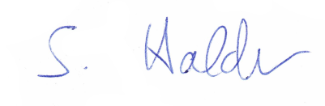

---

<!-- Page iv -->

## Abstrakt

_Recursive Backwards Q-Learning am Beispiel eines Ping-Pong-Spiels_
In dieser Arbeit wird Recursive Backwards Q-Learning (RBQL) untersucht, ein Q-Learning Algorithmus für deterministische Umgebungen, der alle besuchten Zustände am Ende einer Episode bewertet und somit schneller konvergieren soll. Ziel ist es Trainingsprozesse effizienter zu gestalten, insbesondere bei großen Zustandsräumen, wie sie in modernen Lernumgebungen häufig auftreten. Als Anwendungsszenario dient ein Ping Pong Spiel, bei dem der Agent lernen soll mit einem Schläger einen Ball möglichst lange in der Luft zu halten. Im Vergleich zum klassischen Q-Learning und Experience Replay benötigt RBQL weniger Episoden, um das Spiel zu erlernen und es treten dabei auch weniger Fehler auf. Darüber hinaus wird gezeigt, dass ein einfaches neuronales Netz mit RBQL effektiv trainiert werden kann. Beim Trainieren eines neuronalen Netzes gibt es nur wenig Performance Unterschiede zwischen Experience Replay und RBQL. Die Ergebnisse verdeutlichen das Potential von RBQL in deterministischen Umgebungen und bildet eine Grundlage für zukünftige Untersuchungen in komplexeren, auch nicht deterministischen Szenarien. 

## Abstract

_Recursive Backwards Q-Learning on the Example of a Ping-Pong Game_
This thesis investigates Recursive Backwards Q-Learning (RBQL), a Q-learning algorithm for deterministic environments that evaluates all visited states at the end of an episode to achieve faster convergence. The goal is to make training processes more efficient, especially in large state spaces common in modern learning environments. A ping pong game serves as the application scenario, where an agent learns to keep a ball in the air using a paddle. Compared to classical Q-learning and Experience Replay, RBQL requires fewer episodes to learn the game and results in fewer errors. It was also shown that a simple neural network can be effectively trained with RBQL. Only minor performance differences were observed between Experience Replay and RBQL when training neural networks. The results highlight RBQL’s potential in deterministic environments and provide a basis for future studies in more complex, including non-deterministic, scenarios.

---

<!-- Page v -->

## Contents

- **Einleitung** 1
  - Motivation und Hintergrund 1
  - Zielsetzung der Arbeit 2
- **Theoretische Grundlagen** 3
  - Reinforcement Learning 3
  - Q-Learning 3
  - Neuronale Netze 4
- **Verwandte Arbeiten** 7
  - Markow Entscheidungsprozess 7
  - Experience Replay 7
  - Recursive Backwards Q-Learning 9
  - Einsatz neuronaler Q-Learning-Verfahren in realen Anwendungen 10
- **Problemstellung und Lösungsansatz** 12
  - Lernproblem im Kontext eines Ping-Pong-Spiels 12
  - Architektur des neuronalen Netzwerks 12
  - Trainieren des neuronalen Netzwerks mit RBQL 13
- **Implementierung** 15
  - Experience Replay 16
  - Q-Learning 16
  - Recursive Backwards Q-Learning 17
  - Vergrößerung des Zustandraums 18
  - Mögliche Optimierung des rbql 18
  - rbql in einer nicht deterministischen Umgebung 20
  - Integration des neuronalen Netzwerks 22
- **Evaluation und Ergebnisse** 26
  - Ergebnisse der Q-Learning Agenten im Vergleich 26
  - Ergebnisse nach Vergrößerung des Zustandsraums 27
  - Verbesserung der Performance des RBQL 29
  - Ergebnisse des Trainings mittels rbql in einer nicht deterministischen Umgebung 32
  - Ergebnisse des Trainings des neuronalen Netzes mit rbql 32
    - Aktivierungsfunktionen: relu vs. Leaky relu 36
    - Einfluss unterschiedlicher Größen der versteckten Schicht auf das Lernergebnis 38
    - Einfluss von Epsilon auf das Lernergebnis 40
    - Einfluss der Lernrate auf das Lernergebnis 43
    - Mögliche Optimierung - Aktionsauswahl durch den rbql-Agenten in den ersten Episoden 49
    - Zusammenführung optimaler Parameter: Lernrate, Netzwerkgröße und Epsilon 50
    - Training des neuronalen Netztes bei großem Spielfeld 52
- **Fazit und Ausblick** 54
  - Zusammenfassung der Erkenntnisse 54
  - Ausblick 55
- **Abkürzungsverzeichnis** 56
- **Abbildungsverzeichnis** 57
- **Tabellenverzeichnis** 60
- **Quellcodeverzeichnis** 62
- **Literatur** 63

---

<!-- Page vi -->

---

<!-- Page 1 -->

# Kapitel 1: Einleitung

## 1.1 Motivation und Hintergrund

Neuronale Netze gewinnen in der heutigen Zeit immer mehr an Relevanz. Es gibt vielfältige Einsatzmöglichkeiten. Sie werden zum Beispiel in der Bilderkennung, bei Sprachmodellen oder bei der Schrifterkennung eingesetzt. [1] [2] 

Die Idee, neuronale Netze zum Erlernen von Anwendungsaufgaben zu benutzen, entstammt aus der Biologie. In unserem Gehirn gibt es etwa 100 Milliarden Neuronen. Ein Neuron ist mit 1000 bis 10 000 anderen Neuronen über Axone verbunden. Über diese Verbindungen werden Signale in Form von elektrischen Impulsen gesendet, wodurch Informationen weitergeleitet werden und das menschliche Gehirn in der Lage ist zu lernen. [3] 

Diese Funktion unseres Gehirns versucht man künstlich nachzubauen. Neben dem Aufbau des künstlichen Netzes ist dabei das Training ein wichtiger Aspekt. Komplexe Anwendungsfälle benötigen oft ein langes und aufwendiges Trainieren des neuronalen Netzes. Diesen Trainingsaufwand zu optimieren, ohne Genauigkeit zu verlieren, ist eine wichtige Aufgabe, um neuronale Netze effizienter zu erstellen und Anwendungsbereiche zu erweitern. Diese Arbeit beschäftigt sich mit dem Training von neuronalen Netzen mittels RBQL in deterministischen Umgebungen. RBQL ist dabei ein optimierter Q-Learning Algorithmus, welcher im Vergleich zum klassischen Q-Learning weniger Episoden benötigt um eine Problemstellung zu erlernen. [4] Dies ist besonders interessant, da sich viele Bereiche unseres Lebens deterministisch annähern lassen. 

Vor allem Large Language Models (LLMs), wie GPT, benötigen ein aufwendiges Training des neuronalen Netzes. Das hat zur Folge, dass mehr elektrische Energie benötigt wird um die Computer zu betreiben, auf denen das neuronale Netz trainiert wird. Um die Kosten und die Belastung für die Umwelt zu reduzieren, sollten die LLMs möglichst effizient trainiert werden. [5] 

Obwohl Sprachmodelle in der Regel nicht deterministisch sind, können sie dennoch deterministische Ausgaben erzeugen, sofern die Temperatur gleich null gesetzt wird. Dadurch 

---

<!-- Page 2 -->

könnten solche Sprachmodelle mit RBQL trainiert werden, wodurch das Training optimiert werden könnte. 

## 1.2 Zielsetzung der Arbeit

Diese Arbeit, welche im Rahmen einer Abschlussarbeit des Bachelorstudiengangs Informatik an der Technischen Hochschule Mannheim entstanden ist, beschäftigt sich damit, ob in deterministischen Umgebungen mit dem RBQL neuronale Netzwerke effizient trainiert werden können. 

Dies wird am Anwendungsfall eines Ping-Pong-Spiels getestet. Dabei soll ein neuronales Netz lernen, den Ball mit einem Schläger in der Luft zu halten, ohne dass der Ball herunterfällt. Das neuronale Netz wird hierbei durch das RBQL trainiert. 

Die Algorithmen RBQL, Experience Replay Q-Learning und das klassische Q-Learning werden zunächst ohne neuronale Netze zum Trainieren des Ping-Pong-Agenten eingesetzt und die Ergebnisse analysiert. Anschließend soll noch gezeigt werden, wie effizient ein einfaches neuronales Netz mit dem RBQL trainiert werden kann und das Ergebnis mit dem verbreiteten Experience Replay Q-Learning verglichen werden. Daraus sollen dann Schlüsse gezogen werden, ob RBQL das Training neuronaler Netze verbessern kann. Kann das Training von neuronalen Netzen in deterministischen Umgebungen durch RBQL effizienter gestaltet werden als mit dem bisher verbreiteten Experience Replay Q- Learning? 

---

<!-- Page 3 -->

# Kapitel 2: Theoretische Grundlagen

## 2.1 Reinforcement Learning

Beim Reinforcement Learning lernt der Agent durch Belohnung und Bestrafung. Der Agent befindet sich in einer Umgebung, welche er erlernen soll. Er hat dabei eine Auswahl an Aktionen, die er ausführen kann. Der Agent wählt die Aktion mit der besten Wahrscheinlichkeit, eine Belohnung zu bekommen, aus. Durch diese Aktion ändert sich der Zustand, in dem sich der Agent befindet. Er kann für diesen neuen Zustand eine Belohnung oder eine Bestrafung bekommen. Durch eine Belohnung lernt er, diesen Zustand zu wählen und durch eine Bestrafung diesen Zustand zu meiden. [6, 7] Um die korrekte Berechnung der zu erwartenden Belohnung sicherzustellen, muss die Umgebung die Markoweigenschaft erfüllen. Die Markoweigenschaft ist erfüllt, wenn die Wahrscheinlichkeit, in einen Folgezustand _st_ +1 zu gelangen, nur von dem Zustand s und der Aktion a abhängt. [8, S. 274] Auf Basis des Reinforcement Learning, wie von Sutton und Barto beschrieben, werden seitdem verschiedene Algorithmen entwickelt, die nach dem Prinzip des Reinforcement Learning arbeiten und versuchen, das Lernen möglichst effizient zu gestalten. Darunter fallen unter anderem der von Watkins und Dayan vorgestellte Q-Learning-Algorithmus oder der RBQL-Algorithmus [4]. 

## 2.2 Q-Learning

Das Q-Learning ist ein Algorithmus, der zum Reinforcement Learning zählt. Dabei wird die Aktion, welche ein Agent ausführt, auf Basis einer Bewertungsfunktion Q*(s,a) bestimmt. Diese Funktion soll in jedem Zustand die Aktion auswählen, die am wahrscheinlichsten zu einer Belohnung führt. [9] Dabei ist Q* die Summe der zukünftigen Belohnungen. Die zukünftigen Belohnungen werden über einen Discount-Faktor $\gamma$ , dessen Wert zwischen 0 und 1 liegt, nach der folgenden Funktion (2.1) gewichtet. [8, 9] 

---

<!-- Page 4 -->

$$Q_t^*(s, a) = \sum_{i=0}^{\infty} \gamma^i \cdot r_{t+i} \tag{2.1}$$

Über die optimale Belohnungsfunktion Q*(s,a) lässt sich dann für jeden Zustand die Aktion auswählen, bei der die höchste Belohnung erwartet wird.

Die Bewertungsfunktion Q wird in der Regel mit zufälligen Werten oder mit null initialisiert. Um die Q-Funktion für die entsprechende Umgebung zu approximieren, muss der Agent zu allen Zuständen die jeweiligen Aktionen ausprobieren. Das Ausprobieren neuer Aktionen nennt man Exploration. Es gibt verschiedene Ansätze, um zu entscheiden, ob ein Agent eine Exploration durchführen soll oder die Aktion mit der höchsten Wahrscheinlichkeit wählen soll. Ein häufig verwendeter Ansatz ist die Aktionsauswahl mit „Epsilon-Greedy“. Dabei wird mit einer Wahrscheinlichkeit $\varepsilon$ eine zufällige Aktion ausgewählt. Nach jeder Aktion wird der Q-Wert der Bewertungsfunktion für den Zustand $s_t$ und die Aktion $a_t$ angepasst. Dabei wird der entsprechende Q-Wert, nach der in Gleichung (2.2) dargestellten Vorgehensweise, angepasst. [8, 9]

$$Q_t \leftarrow Q_t + \alpha \left[ r_t + \gamma \cdot \max_{a_{t+1}}(Q_{t+1}) - Q_t \right] \tag{2.2}$$

## 2.3 Neuronale Netze

Neuronale Netzwerke im Bereich des maschinellen Lernen basieren auf biologischen Neuronen, wie sie auch in unserem Körper vorkommen. Neuronen sind über Synapsen miteinander verbunden. Erreichen die Eingangsimpulse eines Neurons einen Schwellwert, wird das Neuron aktiviert. Diese Verhaltensweise wird durch ein künstliches Neuron simuliert. Die Aktivität eines Neurons wird durch die Summe der gewichteten Eingänge beschrieben. Die Summe der gewichteten Eingänge wird durch Gleichung (2.3) beschrieben. [8]

$$\varphi_j = \sum_{i} o_i w_{ji} \tag{2.3}$$

Über die Transferfunktion wird die Ausgabe eines künstlichen Neurons beschrieben. Es gibt verschiedene Transferfunktionen, die in neuronalen Netzwerken eingesetzt werden.

---

<!-- Page 5 -->

Neben der Sigmoidfunktion (2.4) [8] werden häufig auch die ReLU-Funktion (2.5)[8, 10] oder eine lineare Transferfunktion (2.6)[8] eingesetzt, da diese durch ihre einfache Abbildung und Ableitung effizient sind. Neben den hier aufgeführten Transferfunktionen gibt es noch viele weitere, mit denen die Ausgabe eines künstlichen Neurons beschrieben werden kann. Die Leaky ReLU-Funktion (2.7) bietet gegenüber ReLU den Vorteil, dass absterbende Neuronen verhindert werden. [11]

$$
\text{Sigmoidfunktion: } o_j = F(\varphi_j) = \frac{1}{1 + e^{-x}} \quad (2.4)
$$

$$
\text{ReLU-Funktion: } o_j = F(\varphi_j) = \begin{cases} 0 & \text{if } \varphi \le 0 \\ \varphi & \text{if } \varphi > 0 \end{cases} \quad (2.5)
$$

$$
\text{lineare Funktion: } o_j = F(\varphi_j) = \varphi \quad (2.6)
$$

$$
\text{Leaky ReLU-Funktion: } o_j = F(\varphi_j) = \begin{cases} \alpha \varphi_j & \text{if } \varphi_j \le 0 \\ \varphi_j & \text{if } \varphi_j > 0 \end{cases} \quad (2.7)
$$

Zum Trainieren eines neuronalen Netzes wird häufig Backpropagation verwendet. Bei dieser Lernmethode wird das neuronale Netz zunächst normal vorwärts aktiviert. Über die Ausgabe und die erwartete Ausgabe wird ein Fehler berechnet. Ziel ist es diesen Fehler zu minimieren. Dieser Fehler wird daraufhin rückwärts durch das neuronale Netz geleitet und die Gewichte entsprechend angepasst.

Häufig wird der quadratische Fehler nach Gleichung 2.8 berechnet. Um die Gewichtsänderung zu berechnen, benötigt man noch die Ableitung der genutzten Transferfunktion. Die Ableitungen der oben vorgestellten Transferfunktionen sind in (2.9) bis (2.12) zu sehen. [8, 12]

$$
\text{Fehlerberechnung: } E_k = \frac{1}{2}(o_k - t_k)^2 \quad (2.8)
$$

$$
\text{Ableitung der Sigmoidfunktion: } \frac{dF}{d\varphi} = \sigma(\varphi) \cdot (1 - \sigma(\varphi)), \quad \sigma(\varphi) = \frac{1}{1 + e^{-\varphi}} \quad (2.9)
$$

$$
\text{Ableitung der ReLU-Funktion: } \frac{dF}{d\varphi} = \begin{cases} 0 & \text{falls } \varphi < 0 \\ 1 & \text{falls } \varphi > 0 \end{cases} \quad (2.10)
$$

---

<!-- Page 6 -->

Ableitung der linearen Funktion: $\frac{dF}{d\varphi} = 1$ (2.11)

Ableitung der Leaky ReLU-Funktion: $\frac{dF}{d\varphi} = \begin{cases} \alpha & \text{falls } \varphi < 0 \\ 1 & \text{falls } \varphi > 0 \end{cases}$ (2.12)

Damit kann man nun anhand der entsprechenden Lernregel die Gewichtsänderung berechnen. Dies wird so lange gemacht, bis das neuronale Netz ein zufriedenstellendes Ergebnis liefert. [8, 12]

---

<!-- Page 7 -->

# Kapitel 3: Verwandte Arbeiten

## 3.1 Markow Entscheidungsprozess

Die heutigen Ansätze des verstärkenden Lernens bauen auf dem Markow Entscheidungsprozess auf. Eine erste Beschreibung findet sich bereits 1957 bei BELLMAN in „A Markovian Decision Process“. BELLMAN untersuchte ein Entscheidungsproblem, bei dem eine Folge von Entscheidungen in einem stochastischen Umfeld getroffen werden muss, wobei der zukünftige Zustand des Systems nur vom aktuellen Zustand und der gewählten Aktion abhängt. Dieses Prinzip der _Markov-Eigenschaft_ bildet die Grundlage für seine Analyse. Er formuliert eine nichtlineare Rekursionsgleichung, mit der der optimale Erwartungswert einer Entscheidungsstrategie beschrieben werden kann. Anhand eines konkreten Anwendungsbeispiels, dem sogenannten Maschinenersatzproblem, zeigt Bellman, dass unter bestimmten Bedingungen das asymptotische Verhalten dieser Rekursionsgleichung durch lineares Wachstum gekennzeichnet ist und dass sich die zugehörige Wachstumsrate als Lösung eines weiteren Optimierungsproblems bestimmen lässt. Obwohl die heute gebräuchliche Formulierung des Markow-Entscheidungsprozesses mit expliziten Zustandsund Aktionsmengen erst später entwickelt wurde, legt Bellmans Arbeit den Grundstein für zahlreiche Folgearbeiten und stellt eine der theoretischen Grundlagen des verstärkenden Lernens dar. [13] 

## 3.2 Experience Replay

Bereits 1992 führte Lin in „Self-improving reactive agents based on reinforcement learning, planning and teaching“ [14] das Konzept des _Experience Replay_ ein, um die Effizienz von verstärkendem Lernen zu verbessern. Ausgangspunkt seiner Arbeit ist die Beobachtung, dass Verfahren wie Q-Learning [9] und Adaptive Heuristic Critic (AHC) Learning zwar gut theoretisch fundiert, in der Praxis jedoch häufig sehr langsam konvergieren und daher für komplexe, dynamische Umgebungen schwer anwendbar sind. Lin verfolgte daher zwei Hauptziele: erstens die Untersuchung von Reinforcement Learning in einer deutlich 

---

<!-- Page 8 -->

komplexeren Umgebung als bis dahin üblich, und zweitens die Entwicklung von Verfahren zur Beschleunigung des Lernprozesses. 

Als eine dieser Beschleunigungsmaßnahmen schlug Lin _Experience Replay_ vor, ein Konzept, bei dem der Agent Übergänge der Form ( _st, at, rt, st_ +1) speichert und später mehrfach für Updates seiner Wertfunktionen verwendet. Dieses Vorgehen adressiert zwei Schwächen klassischer Reinforcement Learning Algorithmen: Zum einen gehen seltene, aber für den Lernprozess besonders wichtige Erfahrungen in klassischen Online-Verfahren oft schnell wieder „verloren“, weil sie nur einmal verarbeitet werden. Zum anderen erlaubt Experience Replay eine effizientere Nutzung von Trainingsdaten, was insbesondere dann hilfreich ist, wenn das Sammeln neuer Erfahrungen teuer oder gefährlich ist. Lin formuliert diese Idee explizit und schlägt vor, die gespeicherten Übergänge nicht einfach in chronologischer Reihenfolge wiederzugeben, sondern durch sogenanntes _Backward Replay_ gezielt von Endzuständen zurückzugehen, um die Kreditzuweisung ( _credit assignment_ ) über lange Zeithorizonte hinweg zu beschleunigen. 

In seinen Experimenten vergleicht Lin acht verschiedene Frameworks, darunter Varianten von Q-Learning und AHC mit und ohne Experience Replay, sowie weitere Techniken wie die Nutzung von Aktionsmodellen für Planung und „Teaching“, d.h. Lernen durch das Nachspielen von Beispielen eines Experten. Getestet werden diese Ansätze in einer simulierten, dynamischen Umgebung, in der ein Agent überleben musste, indem er Nahrung sucht und gleichzeitig feindlichen Objekten ausweicht. Die Umgebung ist nicht trivial: Sie ist stochastisch, teilweise beobachtbar und erforderte vom Agenten die Koordination mehrerer Ziele unter Unsicherheit. 

Die Ergebnisse zeigen deutlich, dass Experience Replay die Lernrate erheblich steigern konnte, insbesondere in den frühen Lernphasen. Lin weist zudem darauf hin, dass Experience Replay nur dann effektiv ist, wenn die zugrunde liegenden Umweltgesetze über die Zeit konstant bleiben, da ansonsten gespeicherte Erfahrungen an Aussagekraft verlieren oder sogar schädlich sein könnten. Eine weitere wichtige Erkenntnis ist, dass bei stochastischen Entscheidungsstrategien nicht jede gespeicherte Erfahrung in gleichem Maße wiederverwendet werden sollte: Erfahrungen, die unter der aktuellen Strategie nur mit sehr geringer Wahrscheinlichkeit auftreten würden, können den Lernprozess sogar negativ beeinflussen. [14] 

Diese Arbeit von Lin gilt als die erste systematische Darstellung des Experience Replay und wird daher als Ursprung dieses Konzepts angesehen. Sie hat die theoretische Grundlage für spätere Arbeiten gelegt, insbesondere für den Deep Q-Network (DQN) Algorithmus von Mnih u. a. [15], der Experience Replay als zentrale Technik nutzt, um neuronale Netze für Q-Learning effizient und stabil zu trainieren. Mnih u. a. kombinieren die von Lin eingeführte Idee des Replay-Buffers mit tiefen neuronalen Netzen und adressieren damit 

---

<!-- Page 9 -->

erfolgreich Probleme wie Korrelationen zwischen aufeinanderfolgenden Trainingsbeispielen und nicht stationäre Verteilungen der Eingaben.
Somit bildet die Arbeit von Lin (1992) einen entscheidenden historischen Meilenstein und die theoretische Basis für die modernen Ansätze im Deep Reinforcement Learning, die Experience Replay als Standardkomponente verwenden.
Darum soll auch in dieser Abschlussarbeit untersucht werden, wie effektiv Experience Replay gegenüber RBQL ist.

## 3.3 Recursive Backwards Q-Learning

Das Paper *Recursive Backwards Q-Learning in Deterministic Environments* beschreibt die Idee des RBQL. In diesem Paper wird bemängelt, dass Q-Learning Agenten häufig verfügbare Informationen ignorieren und es mehrere Episoden dauert, bis ein Fehler zum Ausgangszustand zurück propagiert ist, selbst wenn der Agent dem „optimalen Pfad“ folgt. Es schlägt als Verbesserung den RBQL Agenten vor, welcher nach Erreichen eines Endzustandes rekursiv die bereits erkundeten Zustände bewertet. Das Paper gibt als Lernfunktion Gleichung 3.1 an. Dadurch hänge der Q-Wert nur noch von der Belohnung und dem besten Nachbarn ab. [4]

$$Q(S_t, A_t) = R_{t+1} + \gamma \max_a Q(S_{t+1}, a) \tag{3.1}$$

Angewandt wird der RBQL-Agent in dieser Arbeit an einer zweidimensionalen Gitterwelt. Diese Gitterwelt ist ein Labyrinth, aus dem der Agent herausfinden soll. Für jede Richtung, in die sich der Agent bewegen kann, gibt es eine Aktion. Dies macht vier mögliche Aktionen, zwischen denen der Agent wählen kann. Wenn der Agent durch eine Aktion eine Wand berühren würde, wird die Aktion nicht ausgeführt. Es gibt drei unterschiedliche Belohnungen, die dem Agenten helfen sollen, zu lernen. Negative Belohnungen gibt es für jede normale Kachel und für das Berühren einer Wand. Dabei ist die Belohnung für das Berühren einer Wand niedriger als die für eine normale Kachel, damit der Agent lernt, keine Wände zu berühren. Die negative Belohnung für eine normale Kachel existiert, „um den Agenten von unnötigen Schritten abzuhalten“. [4] Wenn der Agent den Endzustand erreicht, erhält er eine Belohnung von 10.

Das Besondere im Vergleich zu einem klassischen Q-Learning Agenten ist, dass beim RBQL jeder Schritt, der erkundet wird, auch gespeichert wird. Hier geschieht dies in einem zweidimensionalen Array. Als Indizes werden der vorherige Zustand und die ausgewählte Aktion genommen. An dieser Stelle wird dann der durch die Aktion erreichte Folgezustand gespeichert. Außerdem gibt es noch ein zweites zweidimensionales Array, welches die gleichen Indizes verwendet, aber die jeweiligen zugehörigen Belohnungen speichert. Um

---

<!-- Page 10 -->

die erkundeten Schritte nach Abschluss einer Episode rückwärts zu durchlaufen, wird auch noch eine invertierte Kopie des Arrays mit den ausgeführten Schritten erstellt. 

Beim Erreichen eines Terminalzustandes wird eine Episode beendet und alle bereits erkundeten Zustände werden rückwärts durchlaufen, um sie zu bewerten. Dadurch soll der Agent deutlich weniger Episoden benötigen, um ein deterministisches Problem zu erlernen, als das klassische Q-Learning. Neben dem RBQL Agenten wird in diesem Paper auch ein normaler Q-Learning Agent umgesetzt, um die Ergebnisse beider Agenten miteinander zu vergleichen. 

Die aufgezeigten Ergebnisse zeigen deutlich, dass bei einer 10 x 10 großen Gitterwelt bereits nach vier bis sechs Episoden der RBQL Agent den optimalen Pfad erlernt hat. Das klassische Q-Learning hingegen hat selbst nach 24 Episoden noch nicht den optimalen Weg gefunden. Dabei benötigt der RBQL Agent auch deutlich weniger Schritte, um die Problemstellung zu lösen. Die Arbeit vergleicht die Ergebnisse von drei verschieden großen Gitterwelten. Dabei wird deutlich, dass je größer die Gitterwelt ist, desto deutlicher ist der Unterschied zwischen Q-Learning und RBQL. Dies zeigt den Vorteil von RBQL gegenüber Q-Learning bei großen, komplexen Zustandsräumen. So benötigt das klassische Q-Learning bei einer 15 x 15 Gitterwelt im Schnitt in der ersten Episode durchschnittlich 7000 Schritte, um zu einem Terminalzustand zu gelangen, während der RBQL Agent nur etwa 2000 Schritte benötigte. [4] 

Dies zeigt schon deutlich das Potential, welches im RBQL Agenten steckt. In dieser Abschlussarbeit soll deswegen der RBQL Algorithmus nun auf ein anderes Szenario angewandt werden und auch mit dem bisher sehr verbreiteten Experience Replay Q-Learning verglichen werden. Des Weiteren soll in dieser Arbeit untersucht werden, ob sich mit dem RBQL Agent ein neuronales Netz effektiv trainieren lässt. 

## 3.4 Einsatz neuronaler Q-Learning-Verfahren in realen Anwendungen

Auch wenn in dieser Arbeit vor allem tabellarische und einfach neuronale Umsetzungen des Q-Learning-Verfahrens betrachtet werden, existieren in der aktuellen Forschung verschiedene Ansätze, die komplexere Architekturen in realen Szenarien erproben. Besonders hervorzuheben ist dabei der Bereich des autonomen Fahrens. Kiran u. a. geben in ihrer umfangreichen Übersichtsarbeit „Deep Reinforcement Learning for Autonomous Driving: A Survey“ [16] einen systematischen Überblick darüber, wie Verstärkungslernen mit tiefen neuronalen Netzen zur Entscheidungsfindung autonomer Agenten eingesetzt wird. 

In der Literatur wird in solchen Fällen häufig von Deep Reinforcement Learning (DRL) gesprochen, also der Kombination klassischer Reinforcement-Learning-Algorithmen mit 

---

<!-- Page 11 -->

tiefen neuronalen Netzwerken, um in hochdimensionalen oder dynamischen Umgebungen zu lernen. In den von Kiran u. a. beschriebenen Anwendungen kommen unter anderem Varianten des Q-Learning wie DQN oder DDPG zum Einsatz, um Navigationsentscheidungen auf Basis von Sensordaten, Kameraeingaben oder simulierten Umgebungen zu treffen. 

Dabei zeigen sich viele der auch in dieser Arbeit behandelten Herausforderungen, etwa hinsichtlich der Wahl geeigneter Lernraten, stabiler Netzwerkarchitekturen oder explorativer Strategien. Die Arbeit von Kiran u. a. [16] verdeutlicht somit, dass viele Überlegungen aus kontrollierten Umgebungen, wie sie im Rahmen dieser Arbeit untersucht werden, auch für Systeme in unserer realen Welt eine zentrale Rolle spielen. 

---

<!-- Page 12 -->

# Kapitel 4: Problemstellung und Lösungsansatz

## 4.1 Lernproblem im Kontext eines Ping-Pong-Spiels

In dieser Arbeit wird ein Ping-Pong Spiel verwendet, bei dem der Agent den Ball mit einem Schläger so lange wie möglich in der Luft halten muss. Als Vorlage für das Spiel wird, der Python Code aus _Maschinelles Lernen für Dummies®: Maschinelles Lernen richtig verstehen : GPT-Sprachmodell, Deep Learning, neuronales Q-Learning - alles selbst programmieren : viele Code-Beispiele zu allen behandelten Themen_ , S. 283–285 [8, S. 283– 285] verwendet und angepasst. Dabei hat der Agent in jedem der Zustände zwei mögliche Aktionen, die er ausführen kann. Entweder er bewegt den Schläger einen Schritt nach links oder einen Schritt nach rechts. Der Zustand, in dem sich der Agent befindet, wird dabei anhand von fünf Parametern definiert: den X- und Y-Positionen des Balls, seinen Geschwindigkeiten entlang der X- und Y-Achse sowie der X-Position des Schlägers. Der Ball prallt auf dem Schläger, den seitlichen und der oberen Wand ab. Wenn der Ball aus dem Spielfeld nach unten herausfällt, beginnt das Spiel von vorne. Dabei wird es aufwendiger für einen Q-Learning Agenten, das Spiel zu lernen, je größer das Spielfeld wird. Dies hängt damit zusammen, dass je größer das Spielfeld wird, der Zustandsraum auch immer größer wird. Damit der klassische Q-Learning Agent das Spiel optimal erlernt, muss er in jeden Zustand einmal gelangen, um den entsprechenden Q-Wert für diesen Zustand und eine bestimmte Aktion erlernt wird. 

## 4.2 Architektur des neuronalen Netzwerks

Getestet wird das Trainieren eines einfachen neuronalen Netzes. Dazu wird ein neuronales Netz mit einer Eingabeschicht, einer versteckten Schicht und einer Ausgabeschicht verwendet. Dabei hat die Eingabeschicht eine Größe von 5 Neuronen und die Ausgabeschicht eine Größe von 2 Neuronen. Die Ausgabe des neuronalen Netzes soll dabei mit der Ausgabe der Q-Funktion übereinstimmen. Ein Ausgabeneuron steht dabei für eine Bewegung nach rechts und das andere für eine Bewegung nach links. Je nachdem, welches Neuron die größere Ausgabe liefert, wird die entsprechende Aktion ausgeführt. Ziel soll 

---

<!-- Page 13 -->

es sein, zu zeigen, dass ein neuronales Netz mit RBQL trainiert werden kann. Außerdem soll verglichen werden, wie effektiv das mit RBQL trainierte Netz im Vergleich zu einem mit Experience Replay trainierten Netz abschneidet. 

## 4.3 Trainieren des neuronalen Netzwerks mit RBQL

Das Training des neuronalen Netzes erfolgt mithilfe des RBQL-Algorithmus. Dabei übernimmt das neuronale Netz die Funktion der klassischen tabellarischen Q-Funktion. Es erhält die Zustandsinformationen als Eingabe und gibt für jede mögliche Aktion einen geschätzten Q-Wert zurück. 

**Eingabe und Zielwerte** Die Eingabe des neuronalen Netzes besteht aus fünf normalisierten Werten: 

- _x_ Ball: horizontale Position des Balls 

- _y_ Ball: vertikale Position des Balls 

- _vx_ : horizontale Geschwindigkeit des Balls 

- _vy_ : vertikale Geschwindigkeit des Balls 

- _x_ Schläger: horizontale Position des Schlägers 

Diese Werte werden jeweils auf den Bereich [0 , 1] normiert, um zu große Gewichte zu verhindern. Die Ausgabe des neuronalen Netzes besteht aus zwei Werten, die den Q-Werten für die beiden möglichen Aktionen (Bewegung nach links oder rechts) entsprechen sollen. 

**Trainingsablauf** Nach jeder abgeschlossenen Episode, also wenn der Ball den unteren Spielfeldrand berührt oder erfolgreich abgewehrt wird, wird der RBQL-Algorithmus verwendet, um die Q-Werte rückwirkend zu aktualisieren. Diese berechneten Q-Werte dienen anschließend als Zielwerte für das Training des neuronalen Netzes. Das Netz wird mithilfe des Backpropagation-Verfahrens trainiert. Ziel ist es, dass die Ausgabe des Netzes möglichst genau mit den vom RBQL-Algorithmus berechneten Q-Werten übereinstimmt. 

**Aktionsauswahl während des Trainings** Um eine ausgewogene Exploration zu gewährleisten, kommt die _Epsilon-Greedy_ -Strategie zum Einsatz. Dabei wird mit einer Wahrscheinlichkeit $\varepsilon$ eine zufällige Aktion gewählt, ansonsten die Aktion mit dem höchsten 

---

<!-- Page 14 -->

durch das neuronale Netz geschätzten Q-Wert. [6] Der Wert von $\varepsilon$ wird im Laufe des Trainings schrittweise reduziert, um anfänglich eine breite Exploration und später eine stärkere Ausnutzung des Gelernten zu ermöglichen. 

**Herausforderungen** Ein zentrales Problem beim Training besteht darin, dass die Q-Werte, insbesondere zu Beginn des Lernprozesses, noch instabil sein können. Das neuronale Netz kann dadurch fehlerhafte Zielwerte lernen, was wiederum die Q-Funktion negativ beeinflussen kann. Dieses Problem wird durch ein schrittweises Absenken von $\varepsilon$ sowie durch eine Begrenzung der Lernrate beim Training des Netzes abgemildert. Dennoch bleibt das gleichzeitige Optimieren von Q-Funktion und Netzparametern ein sensibler Teil des Verfahrens. 

---

<!-- Page 15 -->

# Kapitel 5: Implementierung

Die Q-Learning Agenten werden in der Programmiersprache Python implementiert. Als Vorlage für das Ping-Pong Spiel wird das Beispiel aus _Maschinelles Lernen für Dummies®: Maschinelles Lernen richtig verstehen : GPT-Sprachmodell, Deep Learning, neuronales Q-Learning - alles selbst programmieren : viele Code-Beispiele zu allen behandelten Themen_ genommen. [8, S. 283–285] Der in diesem Buch bereits umgesetzte Experience Replay Q-Learning Agent wird später auch benutzt, um die Lernergebnisse mit den anderen Algorithmen zu vergleichen. 

Der Zustand der Umgebung setzt sich in diesem Beispiel aus der x- und y-Koordinate des Balles, der Geschwindigkeit des Balles in x- und y-Richtung, und der Position des Schlägers in x-Richtung zusammen. 

```
1 def getState(x_ball, y_ball, vx_ball, vy_ball, x_racket):
2 return (((x_ball*13 +y_ball)*2 +(vx_ball+1)/2)*2 +(vy_ball+1)/2)*12 +
3 x_racket
```

**Quellcode 5.1:** Methode getState [8, S. 284] 

In Quellcode 5.1 ist dargestellt, wie aus den 5 Koordinaten „x_ball“, „y_ball“, „vx_ball“, „vy_ball“ und „x_racket“ eine Zahl berechnet wird, die den Zustand eindeutig beschreibt. Wichtig ist hierbei die Eindeutigkeit der Abbildung, damit zwei Zustände nicht auf denselben Wert abgebildet werden. 

```
1 def getAction(state): # gibt -1 für Schläger links oder +1 für rechts zurück
2 global epsilon, Q
3 if np.random.rand() <= epsilon:
4 return np.random.choice([-1, 1])
5 return (np.argmax(Q[int(state)]) * 2) - 1
```

**Quellcode 5.2:** Methode getAction [8, S. 283] 

Quellcode 5.2 zeigt die Funktion, welche genutzt wird, um eine Aktion auszuwählen. Dabei wird mit einer Wahrscheinlichkeit Epsilon eine zufällige Aktion ausgewählt. Dadurch werden auch Aktionen mit einem niedrigeren Q-Wert ausprobiert, um eventuell bessere Aktionen zu finden. Epsilon wird jede Runde schrittweise um einen festen Betrag reduziert, bis Epsilon null erreicht. Wenn keine zufällige Aktion ausgewählt wird, wird die 

---

<!-- Page 16 -->

Aktion mit dem höchsten Q-Wert ausgewählt. Die Aktion mit dem höchsten Q-Wert verspricht die größte Belohnung. 

Jeder der untersuchten Q-Learning Agenten besitzt eine eigene Update-Funktion zur Aktualisierung der Q-Werte. 

## 5.1 Experience Replay

Der Quellcode für das Experience Replay stammt aus dem oben genannten Buch [8, S. 283– 285]. Quellcode 5.3 zeigt die Funktion zum Aktualisieren der Q-Werte unter Zuhilfenahme von Experience Replay. Dabei werden zuerst die Replay-Buffer befüllt und anschließend die Q-Werte von X zufälligen Zuständen aus dem Replay Buffer aktualisiert. X ist dabei die sogenannte Batch Size. Das Betrachten bereits gemachter Erfahrungen reduziert die Anzahl der Episoden, bis der Agent das Spiel gelernt hat. 

```
1  def updateQ(reward, state, action, nextState):
2  global er_re, er_s, er_a, er_ns, tick, Q, alpha, gamma
3  # Replay-Buffer füllen
4  er_re[tick%400]= reward # experience replay Belohnung
5  er_s[tick%400] = state # experience replay Zustand
6  er_a[tick%400] = action # experience replay Aktion
7  er_ns[tick%400]= nextState# experience replay nächster Zustand
8  for i in range(batch_size):
9  r = random.randint(0,399)
10 # Q[s][a]+=r+alpha*(gamma * max_a' Q(s',a')-Q(s,a))
11 Q[int(er_s[r])][int(er_a[r])] += er_re[r] + alpha*(gamma * np.max(Q[int
12 (er_ns[r])]) - Q[int(er_s[r])][int(er_a[r])])
```

**Quellcode 5.3:** Methode updateQ bei Q-Learning mit Experience Replay [8, S. 283] 

## 5.2 Q-Learning

Beim Q-Learning wird die Q-Funktion, wie in Gleichung (2.2) zu sehen, nach jeder Episode aktualisiert. Dies ist in Quellcode 5.4 in Python umgesetzt. Dabei wird die Erfahrung, die über die Runde gemacht wird, allerdings nicht betrachtet und nur der letzte Q-Wert aktualisiert. Dadurch benötigt Q-Learning ohne Experience Replay deutlich länger, um eine optimierte Q-Funktion zu approximieren. 

```
1 def updateQ(reward, state, action, nextState):
2 Q[int(state)][int(action)] += alpha * (reward + gamma * np.max(Q[int(
3 nextState)]) - Q[int(state)][int(action)])
```

**Quellcode 5.4:** Methode updateQ bei Q-Learning ohne Experience Replay 

---

<!-- Page 17 -->

## 5.3 Recursive Backwards Q-Learning

Zur Umsetzung des RBQL müssen alle besuchten Zustände _st_ mit der jeweiligen ausgeführten Aktion _at_ und dem entsprechenden Folgezustand _s_ ( _t_ + 1) gespeichert werden. Dies wird über ein Set „seen_steps“ realisiert. Außerdem müssen die gesammelten Belohnungen oder Bestrafungen der jeweiligen Zustände und Aktionen gespeichert werden, um jeden Zustand bewerten zu können. Dabei muss beachtet werden, dass die gleichen Zustände nicht doppelt bewertet werden. 

Bei Erreichen eines Terminalzustands, etwa durch das Verlassen des Spielfelds oder die Berührung des Schlägers durch den Ball, werden die zuvor besuchten Zustände rekursiv in umgekehrter Reihenfolge durchlaufen. Für jeden dieser Zustände wird der Q-Wert entsprechend seiner Beteiligung am Erreichen des Endzustands aktualisiert. Um das zu erreichen, müssen für jeden Zustand _s_ ( _t_ +1) die Zustände _st_ aus „seen_steps“ herausgesucht werden, die _s_ ( _t_ + 1) als Folgezustand haben. [8] 

Ein iteratives Durchsuchen aller Einträge in einer Liste zur Identifikation von Vorgängerzuständen eines Folgezustands _s_ ( _t_ +1) entspricht einer Laufzeit von O(n). Vor allem wenn das Set „seen_steps“ groß wird, dauert die Suche länger. Um das zu optimieren, werden die Schritte nicht nur in „seen_steps“ gespeichert, sondern noch in einem Dictionary „reverse_steps“ gespeichert. Zu jedem im Spiel erreichten Zustand wird gespeichert, welche Vorgängerzustände zu dessen Entstehung geführt haben. Dadurch verbessert sich die Laufzeit erheblich. 

In dem zweidimensionalen Array „rewards“ werden alle Bewertungen gespeichert, die ein besuchter Zustand für eine der beiden Aktionen bekommen hat. 

Quellcode 5.5 zeigt die Update-Funktion des RBQL-Agenten. Die Funktion nimmt als Eingabeparameter den Terminalzustand „final_state“ und benutzt die globalen Variablen Q, gamma und reverse_steps. Von dem Terminalzustand aus werden alle Zustände gesucht, über die man in diesen Endzustand gelangt und in einer Warteschlange „queue“ gespeichert. Die Warteschlange wird der Reihenfolge nach abgearbeitet und zu jedem aktuellen Zustand werden die entsprechenden vorherigen Zustände herausgesucht. Diese Vorgängerzustände werden wieder in der Warteschlange gespeichert. Dabei werden in der Variable „visited“, die Zustände gespeichert, die schon bewertet sind. Dadurch wird vermieden, dass ein Schritt mehrfach mit verschieden Bewertungen in der Variable „seen_steps“ gespeichert wird. Eine Vermeidung von doppelt gespeicherten Schritten ist wichtig, da sonst ein längerer, eventuell nicht optimaler Schritt ausgewählt wird, als der kurze optimale Weg. Die Bewertung wird so lange durchgeführt, bis in der Warteschlange kein Zustand mehr ist, welcher noch nicht bewertet ist. 

---

<!-- Page 18 -->

```
1  def rbql_update(final_state):
2  global Q, gamma, reverse_steps, rewards
3  visited = set()
4  queue = [final_state]
5  while len(queue) > 0:
6  current_state = queue.pop()
7  if current_state in visited:
8  continue
9  visited.add(current_state)
10 for step in reverse_steps.get(current_state, []):
11 if step[2] == current_state:
12 Q[step[0]][step[1]] = rewards[step[0]][step[1]] + gamma * np.max
13 (Q[step[2]])
14 queue.insert(0, step[0])
```

**Quellcode 5.5:** Methode rbql_update 

## 5.4 Vergrößerung des Zustandraums

Um den Agenten das Lernen zu erschweren und so die Unterschiede zwischen den Agenten besser hervorzuheben, wird der Zustandsraum vergrößert. Dies wird durch eine Vergrößerung des Spielfeldes umgesetzt. So hat sich der Zustandsraum von 7.488 Zuständen auf 59.904 Zustände erweitert, was die Komplexität des Lernprozesses deutlich erhöht. Quellcode 5.6 Dies macht einen erheblichen Unterschied, da die Q-Funktion nun für deutlich mehr Zustände approximiert werden muss. 

Quellcode 5.7 zeigt die angepasste Methode getState, welche die fünf Vektoren x_ball, y_ball, vx_ball, vy_ball und x_racket auf eine eindeutige Zahl abbildet. Weiterhin muss noch die Logik angepasst werden, wann der Ball auf eine Wand trifft. 

```
1 num_of_states = 26*24*2*2*24
```

**Quellcode 5.6:** Berechnung der Anzahl der States bei Verdopplung der Größe des Spielfeldes 

```
1 def getState(x_ball, y_ball, vx_ball, vy_ball, x_racket):
2 return ((((x_ball * 26 + y_ball) * 2 + (vx_ball + 1)//2) * 2 + (vy_ball +
3 1)//2) * 24 + x_racket)
```

**Quellcode 5.7:** Methode getState nach Verdopplung der Spielfeldgröße 

## 5.5 Mögliche Optimierung des RBQL

Beim RBQL werden beim Erreichen eines Endzustands standardmäßig alle Zustände, die zu dem aktuellen Endzustand führen, bewertet. Dabei wird nicht beachtet, ob ein Zustand 

---

<!-- Page 19 -->

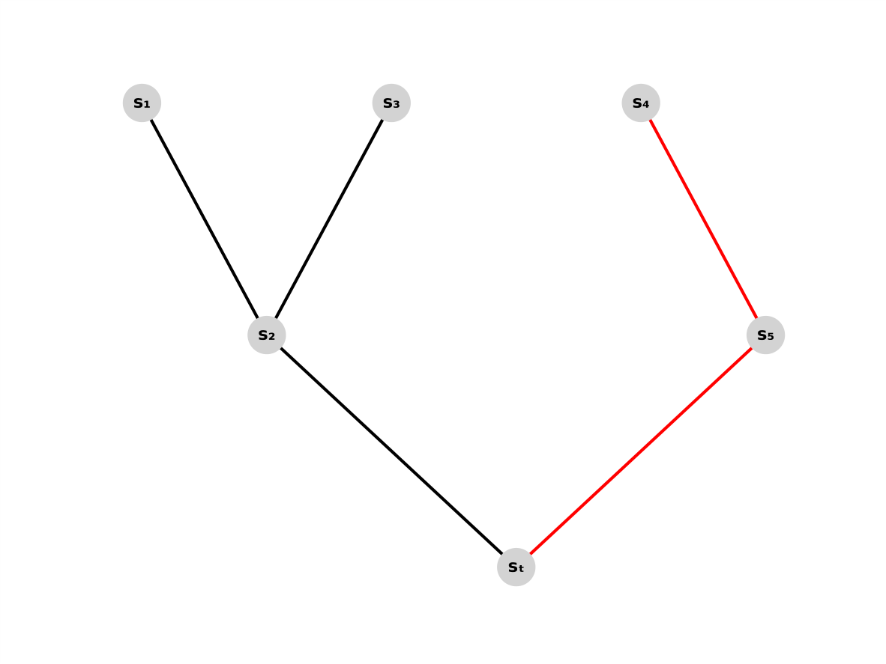
**Abbildung 5.1:** Beispielhafter Zustandsbaum des RBQL-Algorithmus. Jeder Knoten stellt einen möglichen Zustand des Agenten dar, Kanten zeigen die möglichen Aktionen und die daraus resultierenden Zustände. Die rote Farbmarkierung kennzeichnet in einer Episode neu erkundete Bereiche des Baums.

in einer vorherigen Episode schon einmal besucht wurde und schon bewertet ist. Abbildung 5.1 zeigt beispielhaft, über welche Zustände in einen Endzustand $s_t$ gelangt werden kann. Dabei stellt der rechte rote Teil des Baumes einen neuen Weg dar, um in den Endzustand $s_t$ zu gelangen.

Eine Möglichkeit zur Reduzierung des Lernaufwandes besteht darin, nur noch die neuen Zustände zu bewerten. Im Beispiel von Abbildung 5.1 müsste dadurch nur der rote Teil des Baumes bewertet werden.

Dazu wird von $s_5$ ausgehend alle vorherigen Zustände bewertet.

Um nur die bisher nicht bewerteten Zustände bei der Bewertung zu betrachten, müssen im Quellcode einige Anpassungen vorgenommen werden. Quellcode 5.8 zeigt diese Anpassungen.

Der Warteschlange „queue“ wird nun nicht mehr standardmäßig der Endzustand als Ausgangspunkt angefügt. Stattdessen wird eine Unterscheidung gemacht, welcher Zustand der Warteschlange angefügt wird. Wenn die Anzahl aller bisher ausgeführten Schritte mit der

---

<!-- Page 20 -->

Anzahl der Schritte übereinstimmt, die bereits bewertet sind, bleibt die Warteschlange leer und es wird keine neue Bewertung durchgeführt. Wenn der Folgezustand des letzten neuen Schrittes mit dem Endzustand übereinstimmt, werden alle Zustände, die in diesen Endzustand führen, neu bewertet. In allen anderen Fällen wird der Folgezustand des letzten noch nicht bewerteten Schrittes der Warteschlange angefügt. Dadurch werden nur noch Teile des Baumes bewertet, die neu hinzugekommen sind. 

```
1  def rbql_update(final_state):
2  global Q, gamma, reverse_steps, last_step_updated, last_step,
3  cnt_steps_taken
4  visited = set()
5  queue = []
6  #no update without new steps
7  if cnt_steps_taken == last_step_updated:
8  queue = []
9  #update all
10 elif (last_step[2] == final_state) or last_step_updated == 0:
11 queue.append(final_state)
12 #update shortend
13 else:
14 queue.append(last_step[2])
15 while queue:
16 current_state = queue.pop()
17 if current_state in visited:
18 continue
19 visited.add(current_state)
20 for step in reverse_steps.get(current_state, []):
21 if step[2] == current_state:
22 Q[step[0]][step[1]] = rewards[step[0]][step[1]] + gamma * np.max
23 (Q[step[2]])
24 queue.insert(0, step[0])
25 last_step_updated = cnt_steps_taken
```

**Quellcode 5.8:** Optimierte RBQL update Methode 

## 5.6 RBQL in einer nicht deterministischen Umgebung

In dem Paper _Recursive Backwards Q-Learning in Deterministic Environments_ wird als mögliche Richtung für weiterführende Forschung vorgeschlagen, zu untersuchen, wie RBQL in einer teils nicht-deterministischen Umgebung lernt. Dies soll hier nun betrachtet werden. Dazu wird in dem Ping-Pong Spiel mit einer kleiner Wahrscheinlichkeit die Geschwindigkeit des Balles in X- und Y-Richtung verändert. Die Geschwindigkeit kann da- 

---

<!-- Page 21 -->

durch in einem Bereich zwischen minus zwei und zwei liegen. In Quellcode 5.9 ist die Geschwindigkeitsanpassung dargestellt. Dazu wird zunächst ein Zufallswert „rand“ erzeugt. Wenn dieser Zufallswert kleiner als 0,02 ist, wird die Geschwindigkeit des Balles verändert. Dabei wird zunächst die Geschwindigkeit in X-Richtung verändert, indem zur aktuellen Geschwindigkeit zufällig entweder eins addiert oder subtrahiert wird. Anschließend wird der resultierende Wert auf den Bereich [ − 2 , 2] begrenzt. Danach erfolgt eine Anpassung der Geschwindigkeit in Y-Richtung auf die gleiche Weise. Abschließend muss noch dafür gesorgt werden, dass der Ball bei einer höheren Geschwindigkeit das Spielfeld nicht ungewollt verlässt. Bisher wird das dadurch gelöst, dass wenn eine Koordinate des Balles über den Spielfeldrand hinausgeht, die Geschwindigkeit invertiert wird. Wenn der Ball aber eine Geschwindigkeit von zwei hat und schon genau ein Feld vor dem Spielfeldrand ist, kann es vorkommen, dass der Ball in einer Episode einen Schritt über den Spielfeldrand hinausgeht. Da dies aber kein legaler Zustand ist, wird die maximalen X- und Y-Koordinaten des Balles nun noch fest limitiert. Wenn der Ball den Rand dann erreicht, wird die Geschwindigkeit der jeweiligen Achse trotzdem, wie bisher auch, noch mit minus eins multipliziert, um die Geschwindigkeit zu invertieren. 

```
1 rand = random.random()
2 # Geschwindigkeitsanpassung
3 if rand < 0.02:
4 vx_ball += random.choice([-1, 1])
5 vx_ball = max(min(vx_ball, 2), -2) # Begrenzung auf [-2, 2]
6 vy_ball += random.choice([-1, 1])
7 vy_ball = max(min(vy_ball, 2), -2) # Begrenzung auf [-2, 2]
8 x_ball = max(0, min(x_ball, 12)) # 0-12
9 y_ball = max(0, min(y_ball, 12)) # 0-11
```

**Quellcode 5.9:** Geschwindigkeitsanpassung für die nicht deterministische Umgebung 

Die Geschwindigkeit des Balles kann nun in jede Richtung vier unterschiedliche Werte annehmen. Durch diese Anpassung hat sich der Zustandsraum leicht erhöht. Damit die getState Funktion trotzdem noch für jeden Zustand einen eindeutigen Wert zurückgibt, muss diese entsprechend angepasst werden. Diese Anpassung ist in Quellcode 5.10 zu sehen. Um die vier Werte [ − 2 _, −_ 1 , 1 , 2], die von der Geschwindigkeit angenommen werden können, nur durch positive Werte darzustellen, wird ein Dictionary verwendet, welches jedem Wert einen positiven Wert zuordnet. So ist die Geschwindigkeit für die Berechnung des Zustandes im Bereich von null bis drei. In den bisherigen Versionen kann die Geschwindigkeit nur die Werte minus eins und eins annehmen. Um diese Werte auf positive Zahlen abzubilden, wird zu der Geschwindigkeit eins addiert und durch zwei geteilt. So bekommt man für die Geschwindigkeit minus eins das Ergebnis null und für die Ge- 

---

<!-- Page 22 -->

schwindigkeit eins das Ergebnis eins. Diese angepasste Geschwindigkeit wird in „vx_idx“ und „vy_idx“ gespeichert. Anschließend wird die Berechnung des Zustandes wie bisher auch fortgeführt. 

```
1 def getState(x_ball, y_ball, vx_ball, vy_ball, x_racket):
2 vx_idx = {-2: 0, -1: 1, 1: 2, 2: 3}[vx_ball]
3 vy_idx = {-2: 0, -1: 1, 1: 2, 2: 3}[vy_ball]
4 return (((x_ball * 13 + y_ball) * 2 + vx_idx) * 2 + vy_idx ) * 12 +
5 x_racket
```

**Quellcode 5.10:** Für nicht deterministische Umgebung angepasste getState Funktion 

## 5.7 Integration des neuronalen Netzwerks

Zur Umsetzung des neuronalen Netzes wird eine Klasse angelegt, mit der ein einfaches neuronales Netz mit Eingabeschicht, versteckter Schicht und Ausgabeschicht erzeugt werden kann. Quellcode 5.11 zeigt den Konstruktor zur Erstellung des neuronalen Netzes. Die benötigten Eingabeparameter sind dabei die Größe der Eingabeschicht, die Größe der versteckten Sicht und die Größe der Ausgabeschicht. Die Gewichte und Biases werden zufällig zwischen -1 und 1 initialisiert. 

```
1 def __init__(self, input_size, hidden_size, output_size):
2 # Initialisierung der Gewichte und Biases
3 self.W1 = np.random.uniform(-1, 1, (hidden_size, input_size))
4 self.b1 = np.random.uniform(-1, 1, (hidden_size,))
5 self.W2 = np.random.uniform(-1, 1, (output_size, hidden_size))
6 self.b2 = np.random.uniform(-1, 1, (output_size,))
```

**Quellcode 5.11:** Konstruktor zur Erzeugung des neuronalen Netzes 

In einem ersten Ansatz wird die ReLU-Funktion als Aktivierungsfunktion eingesetzt. Diese ist mit ihrer Ableitung in Quellcode 5.12 dargestellt. 

```
1 def relu(x):
2 return np.where(x>=0,x,0)
3 def relu_derivative(x):
4 return np.where(x>=0,1,0)
```

**Quellcode 5.12:** Aktivierungsfunktion und Ableitung der Aktivierungsfunktion 

Die ReLU-Funktion ist weit verbreitet und aufgrund ihrer Einfachheit effizient implementierbar. Allerdings zeigt sich, dass das neuronale Netz mit dieser Aktivierungsfunktion nicht lernt. Erste Vermutungen deuten auf ein Problem mit absterbenden Neuronen hin. Die Wahl geeigneter Aktivierungsfunktionen ist entscheidend für den Lernerfolg neuronaler Netze. ReLU ist aufgrund ihrer Einfachheit und Effizienz weit verbreitet, bringt 

---

<!-- Page 23 -->

jedoch das Risiko sogenannter „Dead Neurons“ mit sich, insbesondere bei tieferen Netzen. He u. a.[17] zeigten, dass durch eine angepasste Initialisierung und die Verwendung von Varianten wie Parametric ReLU (PReLU) signifikante Verbesserungen bei der Konvergenz erzielt werden können, vor allem bei tiefen Architekturen. Auch in dieser Arbeit zeigte sich, dass klassische ReLU-Funktionen zu instabilen Lernergebnissen führten, während Leaky ReLU diese Problematik abmildern konnte. In Unterabschnitt 6.5.1 wird das Problem der absterbenden Neuronen weiter untersucht. Als weitere Aktivierungsfunktion wird die Leaky ReLU-Funktion getestet. Diese ist in Quellcode 5.13 mit Ihrer Ableitung dargestellt. Im Gegensatz zur klassischen ReLu-Funktion gibt die Leaky-ReLu-Funktion selbst auch bei negativen Werten einen Wert zurück. Dadurch besteht nicht die Gefahr, dass Neuronen bei häufigen negativen Werten absterben. [11] 

Quellcode 5.13 wird mittels der Bibliothek Numpy direkt auf eine ganze Schicht des Netzes angewandt. 

```
1 def leaky_relu(x):
2 return np.where(x >= 0, x, a * x)
3 def leaky_relu_derivative(x):
4 return np.where(x >= 0, 1, a)
```

**Quellcode 5.13:** Aktivierungsfunktion und Ableitung der Aktivierungsfunktion 

In Quellcode 5.14 ist die Methode „foreward“ zu sehen, welche für die Aktivierung des neuronalen Netzes genutzt wird. Die Variable „x“ steht für die Eingabevektoren. „ _z_ 1“ ist dabei die Summe der gewichteten Eingänge des neuronalen Netzes. Diese werden benutzt, um die Ausgabe der versteckten Schicht zu berechnen. Die Ausgabe der versteckten Schicht wird in „ _a_ 1“ gespeichert. 

Mit der Ausgabe der versteckten Schicht wird die gewichtete Eingabe der Ausgabeschicht berechnet. Diese wird in „ _z_ 2“ gespeichert. Abschließend wird aus „ _z_ 2“ mittels der Funktion leaky_relu() nochmal die Ausgabe der letzten Schicht berechnet. Diese wird als „ _a_ 2“ zurückgegeben. 

```
1 def forward(self, x):
2 self.input = np.array(x)
3 self.z1 = np.dot(self.W1, self.input) + self.b1
4 self.a1 = leaky_relu(self.z1)
5 self.z2 = np.dot(self.W2, self.a1) + self.b2
6 self.a2 = leaky_relu(self.z2)
7 return self.a2
```

**Quellcode 5.14:** Methode foreward zur Aktivierung des neuronalen Netzes 

---

<!-- Page 24 -->

Quellcode 5.15 zeigt die Methode zum Trainieren des neuronalen Netzes. In diesem Netz wird Backpropagation verwendet, um das Netz zu trainieren. Die Funktion benötigt als Eingabeparameter die Eingabewerte „x“ des neuronalen Netzes, die gewünschte Ausgabe „target“ und eine Lernrate „learning_rate“, welche standardmäßig auf 0,01 gesetzt ist. Zunächst wird das Netz vorwärts aktiviert, indem die Funktion foreward() aufgerufen wird. Das Ergebnis der Vorwärtsaktivierung wird in „output“ gespeichert. Anschließend wird der Fehler berechnet. Dazu wird von der tatsächlichen Ausgabe des neuronalen Netzes die erwartete Ausgabe abgezogen. Falls beide Werte übereinstimmen, ist der Fehler gleich null. Nun wird der Fehler zurück durch das neuronale Netz propagiert und der Fehler für jede Schicht berechnet. Abschließend wird für jede Schicht das Gewicht im Gradientenabstieg angepasst. 

```
1  def train(self, x, target, learning_rate=0.01):
2  output = self.forward(x)
3  error = output - target
4  # Backpropagation
5  delta2 = error * leaky_relu_derivative(self.z2)
6  delta1 = np.dot(self.W2.T, delta2) * leaky_relu_derivative(self.z1)
7  # Update output layer weights
8  self.W2 -= learning_rate * np.outer(delta2, self.a1)
9  self.b2 -= learning_rate * delta2
10 # Update hidden layer weights
11 self.W1 -= learning_rate * np.outer(delta1, self.input)
12 self.b1 -= learning_rate * delta1
```

**Quellcode 5.15:** Methode train zum Trainieren des neuronalen Netzes 

Diese Klasse dient als Grundlage, ein einfaches neuronales Netz aufzubauen. Über den Konstruktor der Klasse kann die Größe der drei Schichten variabel eingestellt werden. Im Falle des Trainings mittels RBQL wird ein neuronales Netz mit einer Eingabeschicht von 5 Neuronen, einer versteckten Schicht von 128 Neuronen und einer Ausgabeschicht mit 2 Neuronen erstellt. Quellcode 5.16 zeigt, wie eine Instanz der Klasse und somit das neuronale Netz erstellt wird. 

```
1 neural = NeuralNet.NeuralNet(5,128,2)
```

**Quellcode 5.16:** Erstellung einer Instanz der Klasse NeuralNet 

Um das neuronale Netz mittels RBQL trainieren zu können, muss gleichzeitig auch die Q- Funktion des RBQL optimiert werden. Die Aktionsauswahl erfolgt durch das neuronale Netz, mit einer Wahrscheinlichkeit Epsilon wird jedoch eine zufällige Aktion ausgewählt. Epsilon wird mit jeder Episode um einen festen Betrag reduziert. Dadurch wird zu Beginn 

---

<!-- Page 25 -->

des Trainings sichergestellt, dass neue Aktionen ausprobiert werden. Nach einer gewissen Zeit werden dann nur noch die Aktionen durchgeführt, die das neuronale Netz vorhergesagt hat. Als Eingabewerte für das neuronale Netz werden die fünf Vektoren „x_ball“, „y_ball“, „vx_ball“, „vy_ball“, „x_schläger“. Die Eingabevektoren werden dazu, wie in Quellcode 5.17 zu sehen, in einem Array „inputs“ gespeichert und die Werte durch Teilen durch den jeweiligen maximalen Wert auf den Bereich zwischen null und eins begrenzt. 

```
1 inputs = [x_ball/12,y_ball/13,(vx_ball+1)/2,(vy_ball+1)/2,x_racket/12]
```

**Quellcode 5.17:** Verkleinerung der Eingabewerte auf Bereich zwischen null und eins 

Anschließend wird die Funktion zur Vorwärtsaktivierung des neuronalen Netzes aufgerufen und das Array „inputs“ als Parameter übergeben. Die Werte der beiden Ausgabeneuronen werden in „output“ gespeichert. 

```
1 output = neural.forward(inputs)
```

**Quellcode 5.18:** Vorwärtsaktivierung des neuronalen Netzes 

Quellcode 5.19 zeigt das Auswahlverfahren, um eine Aktion und die zugehörige Zielaktion zu bestimmen. Die Variable „output“ ist ein Array mit zwei Elementen. Das Element an der Stelle null ist die Ausgabe für das Neuron, welches für eine Schlägerbewegung nach links steht. Das Neuron an der Stelle eins steht für eine Schlägerbewegung nach rechts. Die Werte der Ausgabeneuronen des neuronalen Netzes sollen bei einem trainierten Netz mit den Werten der optimierten Q-Funktion übereinstimmen. Die Ausgaben der beiden Neuronen werden verglichen und die Aktion des Neurons mit dem größeren Wert wird ausgeführt. Mit einer Wahrscheinlichkeit Epsilon wird diese Aktion allerdings durch eine zufällige Aktion ersetzt. Epsilon wird jede Episode um einen festen Betrag verkleinert. 

```
1 action = -1 if output[0] > output[1] else 1
2 if np.random.rand() <= epsilon:
3 action = np.random.choice([-1, 1])
```

**Quellcode 5.19:** Auswahl von Aktion und Zielaktion 

Nach jeder Episode wird das neuronale Netz trainiert, indem die Methode „train“ aufgerufen wird, wie in Quellcode 5.20 zu sehen. Als Parameter werden die Eingabewerte „inputs“ und die erwarteten Q-Werte für den aktuellen Zustand übergeben. Neben dem Training des neuronalen Netzes wird auch der RBQL-Algorithmus nach jeder Episode trainiert. Durch die Eigenschaft des RBQL schnell eine optimierte Q-Funktion zu erlernen, wird auch das neuronale Netz relativ schnell mit den richtigen Werten trainiert. 

**Quellcode 5.20:** Trainieren des neuronalen Netz mit der Methode train 

---

<!-- Page 26 -->

# Kapitel 6: Evaluation und Ergebnisse

## 6.1 Ergebnisse der Q-Learning Agenten im Vergleich

Alle untersuchten Agenten, der klassische Q-Learning-Agent, der Experience Replay-Agent und der RBQL-Agent, konnten das Ping Pong Spiel erlernen. Allerdings benötigen die Algorithmen unterschiedlich viele Episoden, um eine optimierte Q-Funktion zu entwickeln, was sich in der Anzahl der gemachten Fehler und in den benötigten Schritten bis zur Fehlerfreiheit zeigt. Ein Agent macht einen Fehler, wenn er den Ball nach unten aus dem Spielfeld fallen lässt und ist fehlerfrei, sobald er den Ball nicht mehr fallen lässt. Bei 100 Durchläufen erzielt der RBQL-Agent, wie Tabelle 6.1 zeigt, mit 29 Fehlern und 82 Schritten bis zum letzten Fehler über 4000 Episoden das beste Ergebnis. Dabei macht er die wenigsten Fehler und optimiert auch die Q-Funktion am schnellsten. Experience Replay benötigt hingegen im Durchschnitt 139 Schritte, bis der Agent das Spiel fehlerfrei spielt und begeht dabei 48 Fehler. Dabei ist der RBQL-Agent in diesem Beispiel bei den durchschnittlichen Fehlern und auch bei den Schritten bis zum letzten Fehler um ca. 40 Prozent effektiver als der Experience Replay-Agent. 

Das klassische Q-Learning ohne Experience Replay benötigt sogar 1874 Schritte bis zum letzten Fehler und machte dabei 281 Fehler. 

|**Algorithmus|Durchschnittliche Fehler|Schritte bis zum letzten Fehler**|
|---|---|---|
|RBQL|29|82|
|Experience Replay Q-Learning|48|139|
|Q-Learning|281|1874|

**Tabelle 6.1:** Vergleich von RBQL, Experience Replay und Q-Learning hinsichtlich durchschnittlicher Fehler und Lernschritte bis zur Fehlerfreiheit über 4000 Episoden gerundet auf die nächste volle Zahl

Abbildung 6.1 zeigt die durchschnittlichen Lernkurven von RBQL, Experience Replay Q-Learning und Q-Learning im Vergleich über 100 Durchläufe. Der Score wird über den zeitlichen Verlauf der Episoden dargestellt. Bei diesem Ping Pong Spiel erhöht sich der Score um eins, wenn der Agent den Ball erfolgreich mit dem Schläger abwehrt. Fällt der 

---

<!-- Page 27 -->

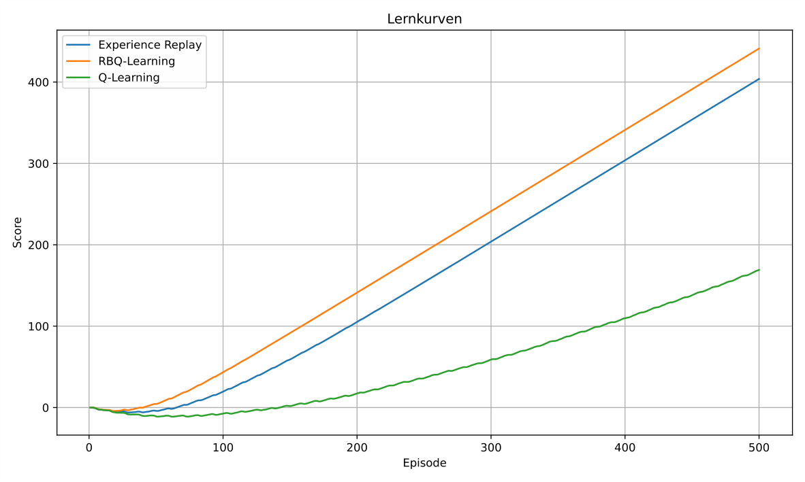
**Abbildung 6.1:** Vergleich der durchschnittlichen Lernkurven von Q-Learning, Experience Replay Q-Learning und RBQL über 100 Durchläufe mit jeweils 500 Episoden. Die x-Achse zeigt die Episodenanzahl, die y-Achse den durchschnittlichen Score. RBQL erreicht deutlich höhere Werte in kürzerer Zeit.

Ball nach unten aus dem Spielfeld, verringert sich der Score um eins. Die optimale Lernkurve hat eine Steigung von eins, da in jeder Episode der Ball erfolgreich abgewehrt wird und sich die Episode um eins erhöht.

Die Lernkurven zeigen, dass die drei Algorithmen in den ersten etwa 30 Episoden zunächst eine negative Lernkurve haben. Nach etwa 20 bis 50 Episoden beginnen die Lernkurven von RBQL und Experience Replay Q-Learning zu steigen, während die Lernkurve vom klassischen Q-Learning noch bis zur etwa 90. Episode braucht, bis sie zu steigen beginnt. Die optimale Steigung erreicht das RBQL am schnellsten nach etwa 30 bis 40 Episoden. Experience Replay benötigt länger bis etwa zur 140. Episode, um die optimale Steigung zu erreichen. Q-Learning hat selbst nach 500 Episoden noch nicht die optimale Steigung erreicht.

## 6.2 Ergebnisse nach Vergrößerung des Zustandsraums

Die Vergrößerung des Zustandsraums durch Verdopplung der Spielfläche verdeutlicht die Unterschiede zwischen den Q-Learning-Algorithmen. Tabelle 6.2 zeigt die durchschnittlichen Fehler und Schritte bis zum letzten Fehler des RBQL, Experience Replay Q-Learning und des klassischen Q-Learning über 10000 Episoden. RBQL begeht dabei die wenigsten

---

<!-- Page 28 -->

Fehler und benötigt auch die geringste Anzahl an Schritten, bis die Q-Funktion optimiert ist und keine Fehler mehr begangen werden. Mit 194 Fehlern und 527 Schritten bis zum letzten Fehler ist der RBQL-Agent am effektivsten. Experience Replay Q-Learning begeht mit 463 Fehlern mehr als doppelt so viele Fehler wie RBQL und benötigt mit 1199 Schritten auch mehr als doppelt so viele Schritte bis zur Fehlerfreiheit. Damit ist RBQL in diesem Beispiel etwa 58 Prozent effektiver als Experience Replay Q-Learning. Das klassische Q- Learning begeht über die 10000 Episoden durchschnittlich 4097 Fehler und benötigt 9992 Schritte bis zum letzten Fehler. Da die Anzahl der Schritte bis zum letzten Fehler sehr nahe an den 10000 durchgeführten Episoden liegt, deutet es darauf hin, dass der klassische Q-Learning Algorithmus nach Ablauf der 10000 Episoden immer noch nicht ausgelernt hat. 

|**Algorithmus|Durchschnittliche Fehler|Schritte bis zum letzten Fehler**|
|---|---|---|
|RBQL|194|527|
|Experience Replay Q-Learning|463|1199|
|Q-Learning|4097|9992|

**Tabelle 6.2:** Vergleich von RBQL, Experience Replay und Q-Learning hinsichtlich durchschnittlicher Fehler und Lernschritte bis zur Fehlerfreiheit über 10000 Episoden gerundet auf die nächste volle Zahl

Abbildung 6.2 zeigt die durchschnittliche Lernkurve des RBQL und den Bereich, in dem die Lernkurve über 100 Durchläufe schwankt, mit dem jeweiligen minimalen und maximalen Score. Dabei ist zu erkennen, dass die Lernkurve des RBQL-Algorithmus zu Beginn nur leicht ins Negative fällt und schon nach etwa 250 Episoden wieder anfängt zu steigen. Der Bereich, in dem die Lernkurve schwankt, ist dabei gering im Vergleich zu Experience Replay Q-Learning und dem klassischen Q-Learning. Bereits nach etwa 500 Schritten ist zu sehen, dass die Lernkurve die optimale Steigung erreicht hat. Das bedeutet, dass sich der Score in jeder Episode um den Wert 1 erhöht. 

Abbildung 6.3 hingegen zeigt die Lernkurve von Experience Replay. Diese ist ebenfalls eine durchschnittliche Lernkurve über 100 Durchläufe. Hier ist deutlich zu erkennen, dass die Lernkurve zu Beginn stärker und länger fällt als die Lernkurve des RBQL. Auch die Schwankung zwischen den minimalen und maximalen Werten des Scores ist bei Experience Replay Q-Learning deutlich größer. Experience Replay benötigt etwa 500 Schritte, bis die Lernkurve eine positive Steigung erreicht und die optimale Steigung wird erst nach über 1000 Schritten erreicht. 

In Abbildung 6.4 ist die durchschnittliche Lernkurve des klassischen Q-Learnings über 100 Durchläufe zu sehen. Dabei ist zu erkennen, dass das klassische Q-Learning selbst nach 2000 Episoden noch eine negative Steigung besitzt. Im optimalen Fall kann Q-Learning, 

---

<!-- Page 29 -->

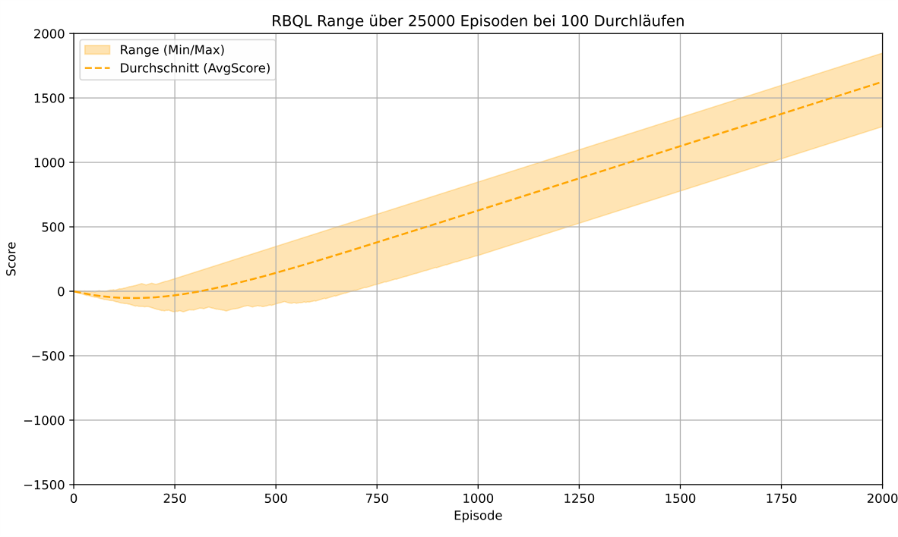
**Abbildung 6.2:** Durchschnittlicher Lernverlauf des RBQL über 100 Durchläufe mit jeweils 2000 Episoden. X-Achse: Episodenanzahl; Y-Achse: durchschnittlicher Score. Der Score steigt stetig an und stabilisiert sich nach ca. 1500 Episoden.

wie in der Abbildung zu sehen, auch schon nach etwa 1000 Schritten eine leichte positive Steigung haben. Dies bleibt aber, wie an der durchschnittlichen Lernkurve zu sehen, eine Ausnahme. Im schlimmsten Fall hat der klassische Q-Learning Algorithmus nach 2000 Episoden über 1200 Fehler begangen. In Abbildung 6.5 ist erkennbar, dass die Lernkurve des klassischen Q-Learning erst nach etwa 3000 Episoden zu steigen beginnt. Nach etwa 20000 Episoden ist erst die optimale Steigung der Lernkurve erreicht. Das klassische Q-Learning benötigt also etwa 10-mal so viele Episoden, um eine optimierte Q-Funktion zu erreichen.

## 6.3 Verbesserung der Performance des RBQL

Die Optimierung des RBQL durch Vermeidung doppelter Bewertung bereits besuchter Zustände war erfolgreich. Tabelle 6.3 zeigt den RBQL-Algorithmus im Vergleich zur optimierten Variante im Durchschnitt über 100 Durchläufe und 2000 Episoden. Dabei wird auch die Zeit gemessen, die benötigt wird bis alle 100 Durchläufe abgeschlossen sind. Von den 100 Durchläufen werden immer 10 parallelisiert ausgeführt. Wie zu erkennen, sind beide Varianten in der Anzahl der Fehler und der Schritte bis zum letzten Fehler fast identisch. Der kleine Unterschied lässt sich möglicherweise dadurch erklären, dass bei

---

<!-- Page 30 -->


**Abbildung 6.3:** Durchschnittlicher Lernverlauf des Experience Replay Q-Learning über 100 Durchläufe mit jeweils 2000 Episoden. Im Vergleich zu RBQL zeigt sich ein langsamerer Anstieg und eine geringere Endleistung.

**Abbildung 6.4:** Durchschnittlicher Lernverlauf des klassischen Q-Learning über 100 Durchläufe mit jeweils 2000 Episoden. Die Lernkurve bleibt deutlich unter den Werten der anderen beiden Ansätze.

---

<!-- Page 31 -->

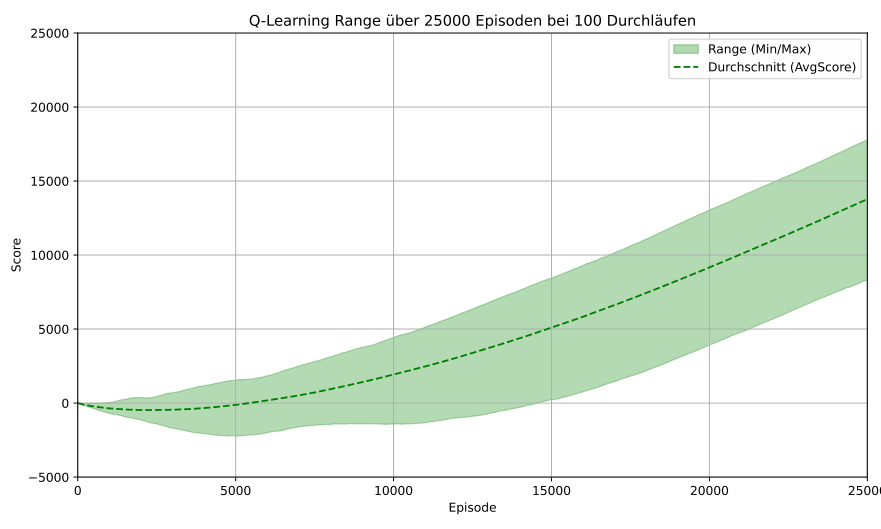
**Abbildung 6.5:** Durchschnittlicher Lernverlauf des klassischen Q-Learning über 100 Durchläufe mit jeweils 2500 Episoden. Die Lernkurve beginnt erst deutlich später zu steigen, als die der anderen beiden Ansätze.

der optimierten Version durch die zufällige Auswahl mit der Wahrscheinlichkeit Epsilon häufiger die richtige Aktion getroffen wird und dadurch eine Belohnung erzielt wird. Interessant zu betrachten ist allerdings die Zeit die benötigt wird, um die optimierte Variante auszuführen. Die optimierte Variante benötigt für 100 Durchläufe, wovon 10 Durchläufe immer parallel laufen, etwa 16 Sekunden. Der RBQL-Algorithmus ohne Optimierung hingegen benötigt 73 Sekunden. Dieser Zeitunterschied ist darauf zurückzuführen, dass bei der optimierten Variante nur die neuen Zustände bewertet werden. Wenn keine neuen Zustände mehr betreten werden, werden gar keine Updates mehr durchgeführt. Vor allem bei extrem großen Zustandsräumen kann diese Verbesserung eine ausschlaggebende Wirkung auf die benötigte Rechenzeit haben. 

|**Algorithmus|Fehler|Schritte bis zum letzten Fehler|Benötigte Zeit in Sekunden**|
|---|---|---|---|
|RBQL|194|527|73|
|RBQL optimiert|190|502|16|

**Tabelle 6.3:** Vergleich von RBQL und der optimierten Version des RBQL hinsichtlich durchschnittlicher Fehler und Lernschritte bis zur Fehlerfreiheit über 2000 Episoden und der benötigten Zeit für 100 Durchläufe gerundet auf die nächste volle Zahl

---

<!-- Page 32 -->

## 6.4 Ergebnisse des Trainings mittels RBQL in einer nicht deterministischen Umgebung

Dass der RBQL-Algorithmus in deterministischen Umgebungen eine effektive Variante ist, einen Agenten zu trainieren, wird mit den bisherigen Ergebnissen schon deutlich gezeigt. Allerdings gibt es auch einige Umgebungen, die nicht deterministisch sind und die auch nicht durch eine deterministische Umgebung angenähert werden können. Deswegen wird auch untersucht, wie sich der RBQL Agent in einer nichtdeterministischen Umgebung verhält. Abbildung 6.6 zeigt den Lernverlauf des RBQL Agenten in der nichtdeterministischen Umgebung auf dem kleinen Spielfeld, wie unter Abschnitt 5.6 beschrieben. Wie zu erkennen ist, sinkt die Lernkurve nicht stark ins Negative. Allerdings steigt sie trotzdem nur sehr langsam an. Nach den 1000 Episoden wird nur ein Score von etwa 124 erreicht. Selbst nach 10000 Episoden hat die Lernkurve, wie in Abbildung 6.7 zu sehen, bei weitem noch nicht die optimale Steigung erreicht. Da sich die optimalen Zustände auch durch die zufällige Geschwindigkeitsanpassung permanent ändern, wird die Lernkurve sehr wahrscheinlich auch nicht die optimale Steigung wie in einer deterministischen Umgebung erreichen können. 

In Tabelle 6.4 zeigt sich, wie eine Erhöhung der Wahrscheinlichkeit der Geschwindigkeitsänderung sich auf das Lernverhalten des RBQL auswirkt. Wenn die zufällige Geschwindigkeitsänderung nur sehr selten stattfindet, mit einer Wahrscheinlichkeit von 1 %, kann der Agent das Spiel noch lernen. Allerdings werden immer noch sehr viele Fehler vom Agenten begangen und die Lernkurve ist sehr flach. Bei einer Wahrscheinlichkeit von 5 % beträgt der Score nach 150000 Schritten im Durchschnitt nur 284. Im Gegensatz dazu hat RBQL ohne Geschwindigkeitsänderung einen Score von 14939. Das zeigt deutlich, dass der Agent bei einer hohen Wahrscheinlichkeit der Geschwindigkeitsänderung zumindest mit der klassischen Lernregel nicht effizient lernen kann. Um die Ergebnisse zu verbessern, müsste man die Wahrscheinlichkeit zur Geschwindigkeitsänderung mit in die Lernregel einbeziehen. [4] Wenn allerdings die folgende Aktion nur noch von einem Zufall abhängig ist, wird es nicht möglich sein, so effektiv zu lernen, wie in einer deterministischen Umgebung, da mit einer gewissen Wahrscheinlichkeit dennoch ein andere Zustand auftreten kann als der erwartete Zustand. 

## 6.5 Ergebnisse des Trainings des neuronalen Netzes mit RBQL

Trainiert wird ein neuronales Netz mit drei Schichten. Die Größe der Eingabeschicht ist dabei fünf Neuronen und die Größe der Ausgabeschicht zwei Neuronen. Das neuronale 

---

<!-- Page 33 -->


**Abbildung 6.6:** Durchschnittlicher Lernverlauf des RBQL-Agenten in einer nichtdeterministischen Umgebung (kleines Spielfeld) über 100 Durchläufe mit jeweils 1000 Episoden. Die x-Achse zeigt die Episodenanzahl, die y-Achse den durchschnittlich erzielten Score. Trotz schwankender Umweltbedingungen sinkt die Lernkurve nicht stark ins Negative, steigt jedoch nur langsam an und erreicht am Ende etwa 124 Punkte.

---

<!-- Page 34 -->


**Abbildung 6.7:** Durchschnittlicher Lernverlauf des RBQL-Agenten in einer nichtdeterministischen Umgebung (kleines Spielfeld) über 100 Durchläufe mit jeweils 10000 Episoden. Aufgrund der sich ständig verändernden optimalen Zustände durch Wind erreicht die Lernkurve auch nach langer Trainingszeit nicht die Steigung einer deterministischen Umgebung und bleibt unter dem theoretisch möglichen Maximum.

---

<!-- Page 35 -->

|**Wahrscheinlichkeit|1000 Schritte|5000 Schritte|10000 Schritte|15000 Schritte**|
|---|---|---|---|---|
|0 %|939|4939|9939|14939|
|1 %|114|701|1496|2343|
|5 %|-68|-12|131|284|
|15 %|-175|-545|-913|-1212|

**Tabelle 6.4:** Score nach unterschiedlicher Anzahl an Schritten bei verschiedenen verschiedenen Wahrscheinlichkeiten zur Geschwindigkeitsänderung

Netz soll dabei lernen, das Ping Pong Spiel zu spielen. Dazu wird das kleine Spielfeld benutzt, um Rechenzeit zu sparen. 

Abbildung 6.8 zeigt den Trainingsverlauf eines neuronalen Netzes mit drei Schichten, wobei die versteckte Schicht aus 128 Neuronen besteht. Das neuronale Netz wird mit drei unterschiedlichen Algorithmen trainiert: dem RBQL (blaue Linie), einer optimierten Variante des RBQL (orange Linie) sowie dem Experience Replay Q-Learning (grüne Linie). Zu Beginn des Trainings, in den ersten 100 bis 200 Episoden, fällt die Lernkurve bei allen drei Ansätzen zunächst ab. Dies ist auf die anfängliche zufällige Aktionsauswahl und die damit verbundenen Fehler zurückzuführen, die negative Belohnungen zur Folge haben. Anschließend beginnen die Lernkurven jedoch allmählich zu steigen, zuerst die des mit Experience Replay trainierten Netzes, dicht gefolgt von der des mit RBQL trainierten Netzes. Die Lernkurve der optimierten RBQL-Variante beginnt etwas später zu steigen, zeigt dann jedoch eine deutlich steilere Steigung. 

Bereits nach etwa 1500 Episoden überholt die optimierte Variante des RBQL zunächst die klassische RBQL-Version und kurze Zeit später, bei etwa 1700 Episoden, auch die Experience Replay-Methode. Dieses Verhalten lässt darauf schließen, dass die anfängliche Verzögerung im Lernanstieg der optimierten RBQL-Variante durch eine effizientere Langzeitwirkung kompensiert wird. 

Auch der direkte Vergleich zwischen RBQL und Experience Replay zeigt einen klaren Vorteil zugunsten des RBQL. Obwohl die Lernkurve des Experience Replay-Netzes zu Beginn einen früheren Anstieg aufweist, ist dessen Steigung insgesamt flacher. Die Lernkurve des RBQL-Netzes steigt konstanter und überholt die Experience Replay-Kurve schließlich nach etwa 2400 Episoden. 

Zusammenfassend zeigen die Lernkurven, dass sowohl der RBQL als auch insbesondere dessen optimierte Variante eine effektivere Trainingsmethode für neuronale Netze darstellen als das klassische Experience Replay Q-Learning. Die Rückwärtsbewertung im RBQL ermöglicht eine gezielte, zeitnahe Verteilung von Belohnungen auf relevante Zustände, wodurch das Netz schneller zu korrekten Bewertungen gelangt. Die zusätzliche Optimierung reduziert überflüssige Bewertungen und verbessert so die Trainingseffizienz weiter. 

---

<!-- Page 36 -->

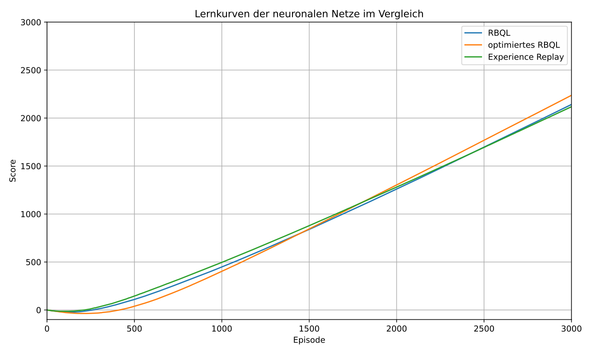
**Abbildung 6.8:** Durchschnittlicher Lernverlauf eines neuronalen Netzes mit drei Schichten (versteckte Schicht: 128 Neuronen) über 100 Durchläufe mit jeweils 3000 Episoden. Verglichen werden drei Trainingsmethoden: RBQL (blau), optimiertes RBQL (orange) und Experience Replay Q-Learning (grün).

Gerade bei größeren Zustandsräumen kann dies einen entscheidenden Vorteil gegenüber Experience Replay darstellen, das stärker von der Anzahl der gespeicherten Erfahrungen und deren zufälliger Auswahl abhängt.

Im weiteren Verlauf dieser Arbeit wird noch der Einfluss verschiedener Parameter, wie der Größe der versteckten Schicht, der Epsilon-Greedy-Strategie sowie der Lernrate auf den Lernverlauf des neuronalen Netzes, untersucht.

### 6.5.1 Aktivierungsfunktionen: ReLU vs. Leaky ReLU

Das Training des neuronalen Netzes mit der ReLU-Funktion führt dazu, dass das neuronale Netz nicht lernt. Der Schläger steckt dabei nach wenigen Episoden dauerhaft in der rechten Ecke des Spielfeldes fest.

Abbildung 6.9 zeigt die Lernkurven des neuronalen Netzwerkes mit den Aktivierungsfunktionen ReLU und Leaky ReLU. Wie zu erkennen, steigt die Lernkurve des neuronalen Netzes, welches die Leaky ReLU als Aktivierungsfunktion benutzt. Die Lernkurve des neuronalen Netzes mit ReLU sinkt hingegen fast mit einer Steigung von minus eins.

Bei der Untersuchung des Netzwerkes, welches ReLU als Aktivierungsfunktion benutzt, fällt auf, dass die Ausgabeneuronen nach wenigen Episoden dauerhaft einen Wert von null

---

<!-- Page 37 -->

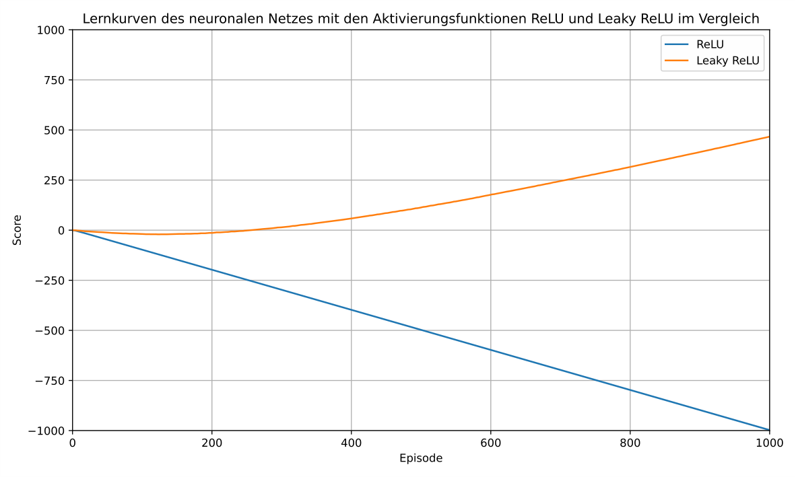
**Abbildung 6.9:** Durchschnittlicher Lernverlauf des neuronalen Netzes mit RBQL bei Verwendung unterschiedlicher Aktivierungsfunktionen (ReLU - blau, Leaky ReLU - orange). Gezeigt sind die Ergebnisse über 100 Durchläufe mit jeweils 1000 Episoden.

ausgeben. Dadurch lässt sich auch erklären, warum der Schläger in der rechten Spielfeldecke feststeckt. Da beide Ausgabeneuronen dauerhaft den Wert null liefern, wird stets die Aktion „nach rechts“ gewählt. Dies liegt daran, dass die Aktionsauswahl so definiert ist, dass „rechts“ ausgewählt wird, wenn die Ausgabe des entsprechenden Neurons größer oder gleich der des Neurons für „links“ ist.

Ein näherer Blick auf die versteckte Schicht zeigt auch, dass auch ein Großteil der Neuronen in der versteckten Schicht den Wert null ausgeben. Nur etwa die Hälfte der Neuronen haben einen Ausgabewert größer als null. Dies deutet darauf hin, dass dieses Netzwerk ein Problem mit „absterbenden“ Neuronen hat. Das bedeutet, die Neuronen geben unabhängig vom Eingabewert den Wert null als Ausgabe heraus. Dieses Problem tritt oft bei der ReLU-Aktivierungsfunktion auf, da sie negative Eingabewerte auf null setzt. Wenn ein Neuron während des Trainings dauerhaft nur negative Eingaben erhält, wird es inaktiv („stirbt“) und gibt konstant null aus. Dies kann durch eine ungünstige Gewichtsinitialisierung, eine zu hohe Lernrate oder einen dauerhaft negativen Bias verursacht werden. [11]

Aus diesem Grund wird in diesem Netz die Leaky ReLU-Funktion eingesetzt. Sie gibt auch für negative Eingaben einen kleinen, proportionalen Wert aus, wodurch das Risiko inaktiver („abgestorbener“) Neuronen verringert wird.

---

<!-- Page 38 -->

Beim Untersuchen des Netzwerkes mit Leaky ReLU als Aktivierungsfunktion, konnten keine „absterbenden“ Neuronen festgestellt werden. Sowohl in der versteckten Schicht, als auch in der Ausgabeschicht, gibt es keine Neuronen mehr, die dauerhaft null ausgeben. Aus diesem Grund wird im weiteren Verlauf dieser Arbeit Leaky ReLU als Aktivierungsfunktion für das neuronale Netz eingesetzt. 

### 6.5.2 Einfluss unterschiedlicher Größen der versteckten Schicht auf das Lernergebnis

Um den Einfluss unterschiedlicher Größen der versteckten Schicht auf das Lernergebnis zu analysieren, werden vier verschiedene Größen der versteckten Schicht von 64 Neuronen bis 512 Neuronen getestet. In Tabelle 6.5 werden die durchschnittlich aufgetretenen Fehler der drei verschiedenen Agenten RBQL, die optimierte Version des RBQL und Experience Replay Q-Learning bei vier unterschiedlich großen versteckten Schichten miteinander verglichen. Es ist erkennbar, dass bei allen Agenten eine 64 Neuronen große versteckte Schicht für das vorliegende Problem des Ping Pong Spiels zu klein ist. Besonders bei den beiden RBQL-Agenten ist zu erkennen, dass bei 256 Neuronen ein Minimum erreicht wird: In diesem Fall macht der Agent mit etwa 380 Ballverlusten die wenigsten Fehler. Bei Experience Replay wird sogar erst bei 512 Neuronen die wenigsten Fehler begangen. Es deutet sich aus Tabelle 6.5 auch schon ab, dass die RBQL Agenten besser abschneiden als der Experience Replay Q-Learning Agent. 

Obwohl das Training des neuronalen Netzes mit 256 und 512 Neuronen in der versteckten Schicht zu weniger Fehlern führt als mit 128 Neuronen, wird im weiteren Verlauf der Arbeit dennoch eine versteckte Schicht mit 128 Neuronen verwendet. Der Grund dafür liegt in der deutlich kürzeren Trainingszeit: Während das Training mit 128 Neuronen etwa zwei Minuten beanspruchte, dauerte es bei 512 Neuronen mehr als fünf Minuten. 

|**Algorithmus|64 Neuronen|128 Neuronen|256 Neuronen|512 Neuronen**|
|---|---|---|---|---|
|RBQL|898|518|388|421|
|RBQL optimiert|948|545|379|424|
|Experience Replay|813|709|718|482|

**Tabelle 6.5:** Vergleich von RBQL und der optimierten Version des RBQL hinsichtlich der begangen Fehler beim Trainieren eines neuronalen Netzes mit einer Größe der versteckten Schicht von 64, 128, 256 und 512 Neuronen über 10000 Episoden

In Abbildung 6.10 ist der Lernverlauf des neuronalen Netzes bei unterschiedlichen Größen der versteckten Schicht, nämlich mit 64, 128, 256 und 512 Neuronen, dargestellt. Alle Lernkurven zeigen zunächst einen deutlichen Abfall, was auf eine erste Phase der Instabilität oder Anpassung hinweist. Besonders flach fällt dieser Rückgang bei 64 und 128 

---

<!-- Page 39 -->


**Abbildung 6.10:** Durchschnittlicher Lernverlauf des neuronalen Netzes mit RBQL bei unterschiedlichen Größen der versteckten Schicht. Gezeigt werden Ergebnisse über 100 Durchläufe mit jeweils 3000 Episoden. Größere Schichten ermöglichen eine höhere Modellkapazität und führen tendenziell zu schnelleren und stabileren Lernverläufen, erfordern jedoch mehr Zeit für die Ausführung des Trainings.

Neuronen aus, während bei größeren Netzwerken mit 256 und 512 Neuronen ein tieferer Einbruch zu beobachten ist. Nach dieser Anfangsphase beginnen die Lernkurven wieder zu steigen, wobei sich die Netze mit größeren versteckten Schichten tendenziell schneller und steiler erholen. Die Lernkurve mit 512 Neuronen zeigt dabei die deutlichste Steigung und erreicht nach etwa 3000 Episoden das höchste Leistungsniveau. Im Gegensatz dazu bleibt die Lernkurve bei 64 Neuronen über den gesamten Zeitraum hinweg relativ flach: Zwar setzt hier die Erholung früher ein, jedoch ist die Steigung deutlich geringer. Auch nach 3000 Episoden liegt die Lernleistung dieses Netzwerks unter der der anderen Architekturen, was auf eine eingeschränkte Modellkapazität hinweist. Insgesamt lässt sich beobachten, dass mit zunehmender Anzahl an Neuronen in der versteckten Schicht sowohl größere Schwankungen in der frühen Lernphase als auch ein höheres Leistungsniveau am Ende der Trainingszeit einhergehen. Dies legt nahe, dass komplexere Netzarchitekturen zwar anfälliger für instabiles Verhalten zu Beginn des Trainings sind, langfristig jedoch eine bessere Approximation des Zielverhaltens ermöglichen.

---

<!-- Page 40 -->

### 6.5.3 Einfluss von Epsilon auf das Lernergebnis

Tabelle 6.6 zeigt die durchschnittlichen Fehler und Schritte bis zum letzten Fehler beim Trainieren eines neuronalen Netzes mit RBQL, der optimierten Version von RBQL und Experience Replay Q-Learning bei 100 Durchläufen und 10000 Episoden. Dafür wird ein Netz mit einer 5 Neuronen großen Eingabeschicht, 128 Neuronen große versteckte Schicht und 2 Neuronen große Ausgabeschicht verwendet. Das neuronale Netz und der entsprechende Q-Learning Algorithmus werden dabei parallel trainiert und die Aktionsauswahl durch das neuronale Netz ausgeführt. Wie zu erkennen, treten bei RBQL und der optimierten Version des RBQL mit 518 Fehlern und 545 Fehlern in etwa die gleiche Anzahl an Fehlern auf. Dabei benötigt RBQL 8710 Schritte bis zum letzten Fehler bei 10000 Episoden und die optimierte Version 8243 Schritte. Experience Replay hat mit 709 Fehlern, die meisten Fehler begangen, benötigte allerdings nur 6824 Schritte bis zum letzten Fehler. Allerdings zeigten Durchläufe bis zur 100000. Episode, dass die Algorithmen selbst nach 80000 Episoden noch Fehler begingen. Daran ist zu erkennen, dass die neuronalen Netze nach den hier 10000 ausgeführten Episoden noch lange nicht ausgelernt haben. Allerdings geben die Anzahl der bis dahin aufgetreten Fehler dennoch einen Hinweis darauf, wie gut das neuronale Netz trainiert wird. 

Bei allen Algorithmen startet Epsilon bei eins und wird jede Episode um 1 / 400 reduziert. Wie zu erkennen ist, hat RBQL Vorteile gegenüber Experience Replay Q-Learning bei der Anzahl der begangenen Fehler. 

Tabelle 6.6, Tabelle 6.7, Tabelle 6.8, Tabelle 6.9 und Tabelle 6.10 zeigen den Einfluss verschiedener Verkleinerungsraten von Epsilon auf die Ergebnisse des Trainings. Tabelle 6.7 zeigt die Ergebnisse des Trainings bei einer Verkleinerung von Epsilon um 1 / 800 jede Episode. Die Anzahl der begangenen Fehler ist bei allen Algorithmen bei dieser Verkleinerungsrate in etwa gleich, wie bei einer Verkleinerung von Epsilon um 1 / 400. Auch bei einer Verkleinerungsrate von 1 / 1600 verändern sich die Anzahl der Fehler bei RBQL und der optimierten Version des RBQL nicht wirklich. In Tabelle 6.9 sind die Ergebnisse des Trainings bei einer Verkleinerungsrate Epsilons von 1 / 3200 . Wie zu sehen haben sich die Fehler bei RBQL und der optimierten Version des RBQL um etwa 150 Fehler verringert. Bei einer Verkleinerung Epsilons von Epsilon um 1 / 10000 werden nach 10000 Episoden bei allen Agenten die wenigsten Fehler begangen. Dabei werden von RBQL und Experience Replay etwa 300 Fehler begangen. Die optimierte Version des RBQL begeht mit 350 verfehlten Bällen etwas mehr Fehler. 

Die Erhöhung der Exploration durch langsameres Verkleinern von Epsilon hilft dabei, dass öfter neue Zustände ausprobiert werden. Bei der Aktionsauswahl durch das neuronale Netz scheint das RBQL nicht alle Zustände in der gleichen kurzen Zeit zu erlernen wie bei 

---

<!-- Page 41 -->

der Aktionsauswahl durch RBQL. Dies wird vor allem bei der Betrachtung der einzelnen Schritte klar, die das neuronale Netz begeht. 

|**Algorithmus|Durchschnittliche Fehler|Schritte bis zum letzten Fehler**|
|---|---|---|
|RBQL|518|8710|
|RBQL optimiert|545|8243|
|Experience Replay|709|6824|

**Tabelle 6.6:** Vergleich von RBQL und der optimierten Version des RBQL und Experience Replay Q-Learning beim Trainieren eines neuronalen Netzes mit einer Größe der Versteckten Schicht von 128 Neuronen und Verkleinerung von Epsilon um 1 / 400 über 10000 Episoden.

|**Algorithmus|Durchschnittliche Fehler**|
|---|---|
|RBQL|539|
|RBQL optimiert|498|
|Experience Replay|693|

**Tabelle 6.7:** Vergleich von RBQL und der optimierten Version des RBQL und Experience Replay Q-Learning beim Trainieren eines neuronalen Netzes mit einer Größe der Versteckten Schicht von 128 Neuronen und Verkleinerung von Epsilon um 1 / 800 über 10000 Episoden.

|**Algorithmus|Durchschnittliche Fehler**|
|---|---|
|RBQL|462|
|RBQL optimiert|534|
|Experience Replay|528|

**Tabelle 6.8:** Vergleich von RBQL und der optimierten Version des RBQL und Experience Replay Q-Learning beim Trainieren eines neuronalen Netzes mit einer Größe der Versteckten Schicht von 128 Neuronen und Verkleinerung von Epsilon um 1 / 1600 über 10000 Episoden.

Abbildung 6.11 zeigt den Lernverlauf eines mit Recursive Backwards Q-Learning (RBQL) trainierten neuronalen Netzes bei verschiedenen Verkleinerungsraten des Epsilon-Werts in der Epsilon-Greedy-Strategie. Zu Beginn des Trainings wird $\varepsilon$ auf 1 , 0 gesetzt und in jeder Episode um einen konstanten Wert reduziert. Untersucht werden die Reduktionsraten 1 / 400, 1 / 800, 1 / 1600, 1 / 3200 und 1 / 10000. 

Die Lernkurven zeigen insgesamt ähnliche Verläufe, wobei sich leichte Unterschiede im Anstieg und in der finalen Performance erkennen lassen. Eine schnelle Verkleinerung, wie bei 1 / 400 oder 1 / 800, führt zu einem zügigen Anstieg der Lernkurve in den ersten 

---

<!-- Page 42 -->

|**Algorithmus|Durchschnittliche Fehler**|
|---|---|
|RBQL|394|
|RBQL optimiert|369|
|Experience Replay|530|

**Tabelle 6.9:** Vergleich von RBQL und der optimierten Version des RBQL und Experience Replay Q-Learning beim Trainieren eines neuronalen Netzes mit einer Größe der Versteckten Schicht von 128 Neuronen und Verkleinerung von Epsilon um 1 / 3200 über 10000 Episoden.

|**Algorithmus|Durchschnittliche Fehler**|
|---|---|
|RBQL|304|
|RBQL optimiert|350|
|Experience Replay|301|

**Tabelle 6.10:** Vergleich von RBQL und der optimierten Version des RBQL und Experience Replay Q-Learning beim Trainieren eines neuronalen Netzes mit einer Größe der Versteckten Schicht von 128 Neuronen und Verkleinerung von Epsilon um 1 / 10000 über 10000 Episoden.

Episoden, flacht jedoch vergleichsweise früh ab. Dies deutet darauf hin, dass der Agent relativ schnell in eine ausnutzende Strategie übergeht, wodurch mögliche Verbesserungen durch spätere Exploration ungenutzt bleiben. 

Bei moderateren Reduktionsraten wie 1 / 1600 oder 1 / 3200 verläuft der Lernprozess ausgeglichener. Der Anstieg erfolgt langsamer, aber stetiger, und es werden insgesamt höhere Scores erreicht. Dies spricht dafür, dass durch die verlängerte Explorationsphase mehr Zustände berücksichtigt und bessere Strategien gefunden werden. 

Die beste Endleistung zeigt sich bei der langsamsten getesteten Reduktionsrate von 1 / 10000. Obwohl der Anstieg in der frühen Trainingsphase flacher verläuft als bei den anderen Varianten, resultiert die insgesamt längere Phase zufälliger Aktionen in einem deutlich höheren finalen Score. Der Agent profitiert dabei offenbar von der längeren Zeitspanne zur Erkundung des Zustandsraums, bevor sich die Strategie zunehmend auf die Ausnutzung des Gelernten verlagert. 

Zusammenfassend lässt sich feststellen, dass die Wahl der Epsilon-Verkleinerungsrate einen spürbaren Einfluss auf das Lernverhalten hat. Während zu schnelle Reduktionen eine frühe Stabilisierung begünstigen, kann eine langsamere Reduktion insbesondere in längeren Trainingsphasen zu robusteren und leistungsfähigeren Strategien führen. 

Abbildung 6.12 zeigt den Lernverlauf eines mit der optimierten Variante des Recursive Backwards Q-Learning (RBQL) trainierten neuronalen Netzes bei verschiedenen Verkleinerungsraten des Epsilon-Wertes. Analog zur vorherigen Auswertung wird $\varepsilon$ zu Beginn 

---

<!-- Page 43 -->

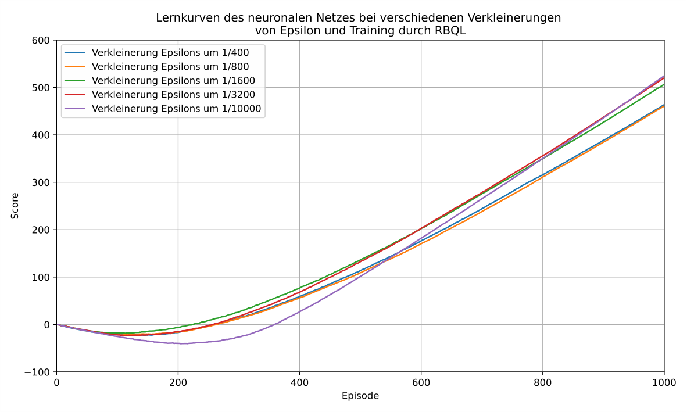
**Abbildung 6.11:** Durchschnittlicher Lernverlauf des nueronalen Netzes mit RBQL bei verschiedenen Verkleinerungsraten von Epsilon über 100 Durchläufe und je 500 Episoden

auf 1,0 gesetzt und in jeder Episode schrittweise reduziert. Betrachtet werden wieder die Reduktionsraten 1/400, 1/800, 1/1600, 1/3200 und 1/10000.

Auch bei der optimierten Variante zeigt sich, dass eine langsamere Reduktion von $\varepsilon$ tendenziell mit einem stabileren und höheren Lernerfolg einhergeht. Die Lernkurven bei 1/1600, 1/3200 und insbesondere 1/10000 erreichen nach längerer Explorationsphase die höchsten Scores. Frühzeitige Reduktionen wie bei 1/400 führen zu einem schnellen Anstieg in den ersten Episoden, bleiben jedoch in ihrer Endperformance hinter den langsameren Varianten zurück.

Insgesamt bestätigen die Ergebnisse, dass die langsame Reduktion von $\varepsilon$ auch bei der optimierten RBQL-Variante vorteilhaft ist, wenngleich die Unterschiede zwischen den getesteten Raten vergleichsweise gering bleiben.

### 6.5.4 Einfluss der Lernrate auf das Lernergebnis

In diesem Kapitel wird der Einfluss der Lernrate auf das Trainingsergebnis untersucht. Wie auch François-Lavet u. a. [18] in ihrer umfassenden Einführung zu Deep Reinforcement Learning betonen, spielt die Wahl der Lernrate eine zentrale Rolle für die Stabilität und Effizienz beim Training von Q-basierten Lernverfahren mit neuronaler Approximation, selbst bei einfacheren Netzarchitekturen wie in dieser Arbeit. Dabei wird der Einfluss für jeden Trainingsalgorithmus - RBQL, die optimierte Version des RBQL und Experi-

---

<!-- Page 44 -->

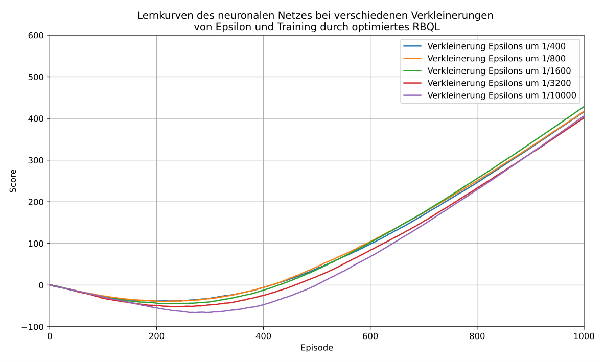
**Abbildung 6.12:** Durchschnittlicher Lernverlauf des neuronalen Netzes mit der optimierten Variante des RBQL bei verschiedenen Verkleinerungsraten von Epsilon über 100 Durchläufe und je 500 Episoden

ence Replay - separat analysiert. Wenn die Lernrate zu hoch angesetzt wird, werden die Gewichte sehr schnell sehr groß, sodass beim Berechnen der neuen Gewichte schnell ein Überlauf entsteht. Jeder Algorithmus hat dabei einen eigenen Wert, ab dem die Lernrate zu groß wird. Bei RBQL ist dies der Fall, wenn die Lernrate größer als 0,2 ist. Bei der optimierten Version des RBQL tritt dieser Effekt bereits bei Lernraten größer als 0,07 auf, bei Experience Replay sogar schon ab Werten über 0,04.

In Tabelle 6.11, Tabelle 6.12 und Tabelle 6.13 kann man die Auswirkung verschiedener Lernraten auf das Training des neuronalen Netzes bei dem jeweiligen Algorithmus sehen. In Tabelle 6.11 ist zu erkennen, dass beim einfachen RBQL die Fehleranzahl mit sinkender Lernrate deutlich zunimmt. Während bei einer Lernrate von 0,001 noch 2450 Fehler auftreten, reduziert sich diese Anzahl bei einer Lernrate von 0,05 auf nur 332 Fehler. Dies deutet darauf hin, dass eine moderate Lernrate in diesem Fall die beste Konvergenz ermöglicht, während zu kleine Lernraten das Lernen stark verlangsamen und damit zu einem schlechteren Ergebnis führen.

Das optimierte RBQL in Tabelle 6.12 zeigt insgesamt geringere Fehlerzahlen als das einfache RBQL, was auf eine effektivere Trainingsdynamik schließen lässt. Die geringste Fehleranzahl wird hier bei einer Lernrate von 0,05 erreicht (263 Fehler). Ab einer Lern-

---

<!-- Page 45 -->

rate von 0,1 zeigt sich jedoch, dass das Training instabil wird. In diesen Fällen war die Lernrate offenbar zu hoch, um noch eine sinnvolle Fehlerauswertung zu ermöglichen. Tabelle 6.13 zeigt die Ergebnisse beim Einsatz von Experience Replay. Auch hier führt eine zu hohe Lernrate (ab 0,05) zu instabilem Training. Interessant ist, dass bereits bei sehr kleinen Lernraten (z. B. 0,005 und 0,0075) deutlich niedrigere Fehlerzahlen erreicht werden als bei RBQL. Insbesondere 399 Fehler bei einer Lernrate von 0,0075 deuten darauf hin, dass Experience Replay schon mit kleinen Lernraten gut lernen kann, während das ursprüngliche RBQL eher mittlere Werte bevorzugt. 

Insgesamt lässt sich feststellen, dass alle Algorithmen eine optimale Lernrate besitzen, außerhalb derer die Fehlerzahl deutlich ansteigt. Während RBQL im Bereich von 0,05 bis 0,1 stabil arbeitet, profitiert Experience Replay stärker von kleineren Lernraten. Zudem zeigt das optimierte RBQL die insgesamt besten Fehlerwerte, solange die Lernrate nicht zu hoch gewählt ist. 

|**Algorithmus|Lernrate**|
|---|---|
||**0,001**<br>**0,01**<br>**0,05**<br>**0,07**<br>**0,1**<br>**0,2**|
|RBQL|2450<br>583<br>332<br>376<br>406<br>415|

**Tabelle 6.11:** Fehleranzahl eines neuronalen Netzes beim Training mit RBQL bei verschiedenen Lernraten über 10000 Episoden

|**Algorithmus|Lernrate**|
|---|---|
||**0,001**<br>**0,01**<br>**0,05**<br>**0,07**<br>**0,1**<br>**0,2**|
|Optimiertes RBQL|664<br>353<br>263<br>393<br>Lernrate zu hoch|

**Tabelle 6.12:** Fehleranzahl beim Training mit optimiertem RBQL bei verschiedenen Lernraten über 10000 Episoden

|**Algorithmus|Lernrate**|
|---|---|
||**0,001**<br>**0,005**<br>**0,0075**<br>**0,01**<br>**0,02**<br>**0,04**<br>**0,05**<br>**0,1**<br>**0,2**|
|Experience Replay|1333<br>450<br>399<br>471<br>788<br>1359<br>Lernrate zu hoch|

**Tabelle 6.13:** Fehleranzahl beim Training mit Experience Replay bei verschiedenen Lernraten über 10000 Episoden

Abbildung 6.13 zeigt den durchschnittlichen Lernverlauf des neuronalen Netzes beim Training mit dem RBQL-Algorithmus bei unterschiedlichen Lernraten über 600 Episoden. Dargestellt sind die Lernverläufe für die Lernraten 0,001, 0,01, 0,05, 0,07, 0,1 und 0,2. 

---

<!-- Page 46 -->

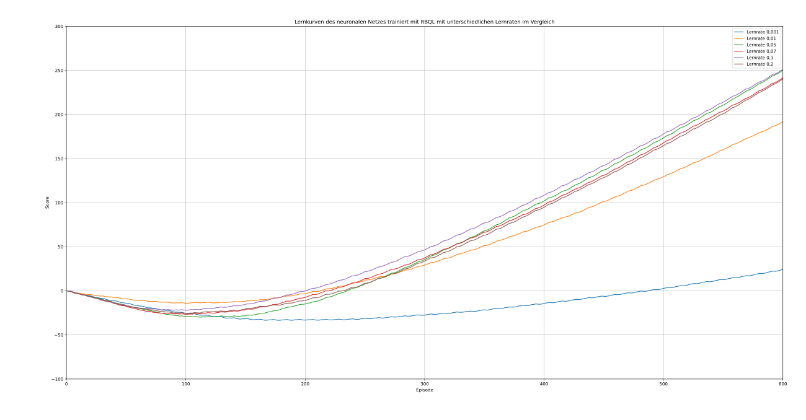
**Abbildung 6.13:** Durchschnittlicher Lernverlauf des neuronalen Netzes trainiert mit RBQL bei verschiedenen Lernraten über 100 Durchläufe und je 600 Episoden

Bei einer Lernrate von 0,001 sinkt die Lernkurve bis zur etwa 210. Episode. Danach beginnt die Lernkurve nur langsam zu steigen und ist nach 600 Episoden deutlich niedriger als die anderen getesteten Lernraten. Bei einer Lernrate von 0,01 sinkt die Lernrate am wenigsten ins Negative, steigt dann aber mit einer deutlich geringeren Steigung als die größeren Lernraten. Die Verläufe der Lernraten 0,05, 0,07, 0,1 und 0,2 unterscheiden sich auf den ersten 600 Episoden nur leicht. Bei einer Lernrate von 0,05 sinkt die Lernkurve zwar am meisten ins Negative, hat aber nach 600 Episoden die größte Steigung und ist auch nur noch knapp von der Lernkurve mit der Lernrate 0,1 entfernt. Im Hinblick auf das Lernen über eine größere Zahl an Episoden ist die Lernrate 0,05 besser geeignet als die Lernrate 0,1. Dies wird auch durch die Anzahl der Fehler nach 10000 Episoden belegt. Die Lernkurven der Lernraten 0,07 und 0,2 sind nach 600 Episoden nur leicht schlechter als die Lernraten 0,05 und 0,1. Die Steigung dieser beiden Lernkurven ist in etwa gleich, wie die Steigung der Lernkurve mit der Lernrate 0,1.

Wie zu erkennen führen, zu kleine Lernraten zu einem nicht optimalen Lernerfolg. Der Lernerfolg wird durch zu geringe Lernraten gehindert und herausgezögert. Große Lernraten zeigen bei RBQL zwar ein stabiles Lernerfolg, allerdings sind mittlere Lernraten wie 0,05 noch etwas effektiver und begehen weniger Fehler.

Im Vergleich dazu zeigt Abbildung 6.14 die Lernkurven für verschiedene Lernraten unter Verwendung der optimierten Variante des RBQL-Algorithmus, bei der doppelte Bewertungen bereits besuchter Zustände vermieden werden. Auch hier zeigt sich, dass eine

---

<!-- Page 47 -->

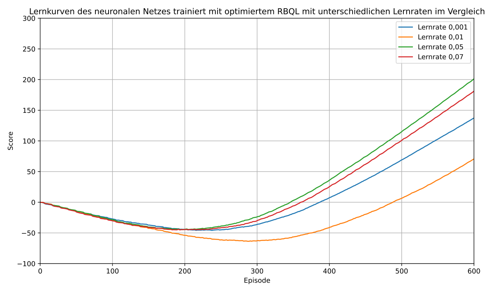
**Abbildung 6.14:** Durchschnittlicher Lernverlauf des neuronalen Netzes trainiert mit der optimierten Variante des RBQL bei verschiedenen Lernraten über 100 Durchläufe und je 600 Episoden

Lernrate von 0,001 zu gering ist und die entsprechende Lernkurve zwar steigt, aber mit einer relativen geringen Steigung. Wird die Steigung auf 0,01 erhöht, lässt sich beobachten, dass die Lernkurve noch weiter ins Negative fällt und erst später beginnt zu steigen. Nach etwa 600 Episoden hat die Lernkurve in etwa die gleiche Steigung, wie die Lernkurve der Lernrate 0,001 erreicht. Den optimalen Verlauf über die 600 Episoden erreicht die Lernkurve der optimierten Variante des RBQL bei einer Lernrate von 0,05. Sie führt zu einem relativ schnellen Anstieg und hat dabei die größte Steigung. Die Lernrate 0,07 ist nur geringfügig schlechter. Sie beginnt etwa gleich schnell zu steigen, erreicht aber eine geringere maximale Steigung. Deshalb hat sie auch nach 600 Episoden einen geringeren Score als die Lernrate 0,05.

Auch hier zeigt sich, dass zu hohe Lernraten dazu führen, dass der Verlauf der Lernkurve nicht mehr optimal verläuft. In diesem Fall schneidet die Lernrate von 0,05 am besten ab. Abschließend zeigt Abbildung 6.15 die Lernverläufe des neuronalen Netzes beim Training mit dem Experience Replay Q-Learning-Ansatz mit verschiedenen Lernraten über 600 Episoden. Bei einer Lernrate von 0,001 steigt die Lernkurve am frühesten an, hat jedoch nur eine moderate Steigung. Am Ende der 600 Episoden hat diese Lernrate den zweitniedrigsten Score. Wenn die Lernrate auf 0,005 erhöht wird, benötigt die Lernkurve minimal länger, um mit dem Steigen zu beginnen. Allerdings steigt die Lernkurve steiler

---

<!-- Page 48 -->

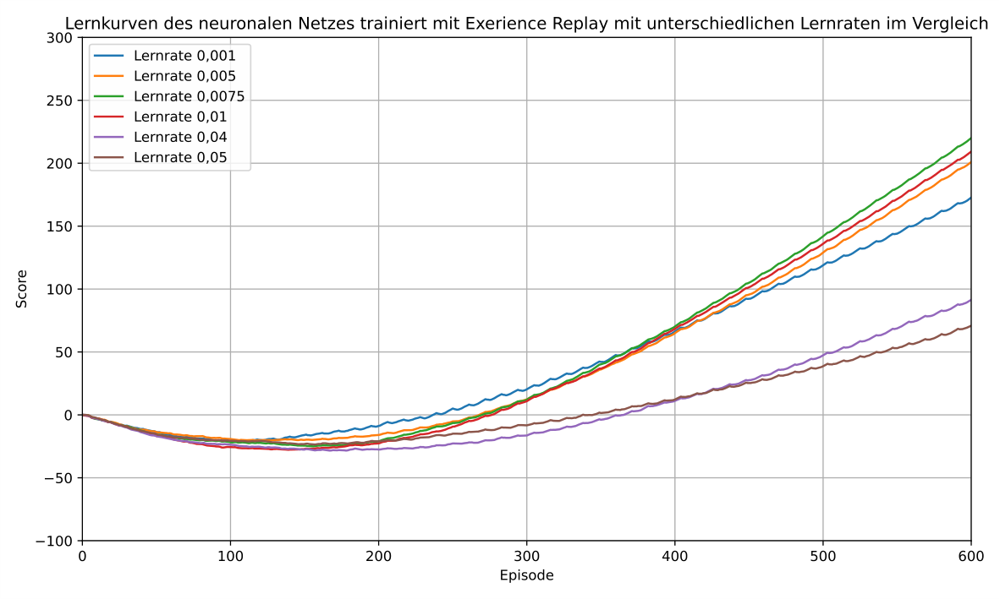
**Abbildung 6.15:** Durchschnittlicher Lernverlauf des neuronalen Netzes trainiert mit Experience Replay bei verschiedenen Lernraten über 100 Durchläufe und je 600 Episoden

an und schließt die 600 Episoden mit einem Score von etwa 200 ab. Die beste Lernkurve zeigt sich bei einer Lernrate von 0,0075. Sie beginnt relativ schnell zu steigen und erreicht schnell die beste Steigung der getesteten Lernraten. Nach Abschluss der 600 Episoden erzielt diese Lernrate auch den höchsten Score. Bei größeren Lernraten wie 0,01, 0,02 oder 0,04 beginnt die Steigung der Lernkurven wieder abzunehmen. Während die Lernrate 0,01 nur eine geringfügig kleinere Steigung als die Lernrate 0,0075 aufweist, ist die Lernkurve bei einer Steigung von 0,04 deutlich geringer und beginnt auch erst deutlich später ins Positive zu steigen.

Insgesamt zeigt sich bei Experience Replay, dass mittlere Lernraten zu einem besseren Lernerlebnis führen als zu große oder zu kleine Lernraten. Eine Lernrate von 0,0075 funktioniert am besten für Experience Replay beim Training dieses neuronalen Netzes. Zusammenfassend lässt sich festhalten, dass die Wahl der Lernrate einen signifikanten Einfluss auf den Lernfortschritt aller untersuchten Verfahren hat. Während sehr kleine Lernraten in allen Fällen zu einem langsamen und ineffizienten Lernen führen, zeigen mittlere Lernraten den besten Anstieg der Lernkurven und die wenigsten Fehler. Große Lernraten führen hingegen wieder zu einem langsamen Anstieg der Lernkurve und mehr Fehlern.

---

<!-- Page 49 -->

### 6.5.5 Mögliche Optimierung - Aktionsauswahl durch den RBQL-Agenten in den ersten Episoden

Eine Möglichkeit, sicherzustellen, dass die Q-Tabelle möglichst schnell optimale Werte ausgibt, ist, dass die Aktion, welche der Agent ausführt, bis zu einer gewissen Episode durch den Q-Learning Algorithmus ausgewählt wird. Es bietet sich dabei an, die Aktion so lange durch den Q-Learning Agenten auswählen zu lassen, bis der reine RBQL-Agent den letzten Fehler begangen hat und die Q-Funktion damit optimal ist. Wann dies geschieht, wird für das kleine Spielfeld bereits in Tabelle 6.1 gezeigt. Beim RBQL werden bei den in Tabelle 6.14 dargestellten Trainingsergebnissen während der ersten 100 Episoden die Aktion durch die Q-Funktion ausgewählt und bei der optimierten Version des RBQL während der ersten 80 Episoden. Im Vergleich zu Tabelle 6.6 ist zu sehen, dass die Anzahl der Fehler bei der Aktionsauswahl durch die Q-Funktion während der ersten Episoden bei beiden Algorithmen zu einer Reduzierung der Fehler führt. Zum Vergleich ist in Tabelle 6.15 die gleiche Optimierung bei einer Größe der versteckten Schicht von 256 Neuronen dargestellt. Auch bei 256 Neuronen in der versteckten Schicht bewirkt die Aktionsauswahl während der ersten Episoden eine leichte Reduzierung der Gesamtanzahl an Fehlern. Allerdings ist der Unterschied im Vergleich zur 128 Neuronen großen versteckten Schicht nicht genauso deutlich. 

|**Algorithmus|Durchschnittliche Fehler**|
|---|---|
|RBQL|321|
|RBQL optimiert|307|

**Tabelle 6.14:** Vergleich von RBQL und der optimierten Version des RBQL beim Trainieren eines neuronalen Netzes mit einer Größe der Versteckten Schicht von 128 Neuronen und Verkleinerung von Epsilon um 1 / 400 mit einer Aktionsauswahl durch RBQL während der ersten Episoden über 10000 Episoden

|**Algorithmus|Durchschnittliche Fehler**|
|---|---|
|RBQL|305|
|RBQL optimiert|302|

**Tabelle 6.15:** Vergleich von RBQL und der optimierten Version des RBQL beim Trainieren eines neuronalen Netzes mit einer Größe der Versteckten Schicht von 256 Neuronen und Verkleinerung von Epsilon um 1 / 400 mit einer Aktionsauswahl durch RBQL während der ersten Episoden über 10000 Episoden

---

<!-- Page 50 -->

### 6.5.6 Zusammenführung optimaler Parameter: Lernrate, Netzwerkgröße und Epsilon

Im abschließenden Schritt der Untersuchung wird das Training des neuronalen Netzes unter Verwendung der jeweils optimalen Parameter Lernrate, Größe der versteckten Schicht und Epsilon für jeden der drei Ansätze RBQL, die optimierte RBQL-Variante und Experience Replay durchgeführt. Ziel ist es, die resultierenden Lernergebnisse direkt miteinander zu vergleichen. 

Tabelle 6.16 zeigt die besten in dieser Arbeit getesteten Werte für das Training des neuronalen Netzes, getrennt nach Algorithmus, mit dem das neuronale Netz trainiert wird. Bei RBQL und der optimierten Version des RBQL sind die besten Werte identisch. Das neuronale Netz hat eine versteckte Schicht mit der Größe von 256 Neuronen. Die Lernrate ist bei beiden Algorithmen bei 0,05 am besten. Bei Experience Replay hat das neuronale Netz das beste Trainingsergebnis bei einer versteckten Schicht mit 128 Neuronen geliefert. Die beste Lernrate für Experience Replay ist 0,0075. Bei allen Algorithmen wird das beste Ergebnis bei einem Epsilon von 1/10000 erzielt. 

|**Algorithmus|Neuronen|Lernrate|Epsilon**|
|---|---|---|---|
|RBQL|256|0,05|1/10000|
|optimiertes RBQL|256|0,05|1/10000|
|Experience Replay|128|0,0075|1/10000|

**Tabelle 6.16:** Optimale Parameter für das Training des neuronalen Netzes mit RBQL, optimiertem RBQL und Experience Replay

|**Algorithmus|Fehler**|
|---|---|
|RBQL|278|
|optimiertes RBQL|218|
|Experience Replay|273|

**Tabelle 6.17:** Durchschnittliche Anzahl Fehler des neuronalen Netztes beim Training mit den jeweiligen optimalen Parametern über 100 Durchläufe und je 10000 Episoden

Tabelle 6.17 zeigt die durchschnittliche Anzahl an Fehlern, die über 10000 Episoden von den jeweiligen Algorithmen begangen werden. Mit 218 Fehlern begeht das neuronale Netz, welches mittels der optimierten Version des RBQL trainiert wird, am wenigsten Fehler. Beim Training mit Experience Replay und RBQL werden mit 273 und 278 Fehlern in etwa gleich viele Fehler begangen. Dies zeigt schon, dass sich die Optimierung des RBQL lohnt und auch bei neuronalen Netzen effektiv zum Trainieren genutzt werden kann. 

---

<!-- Page 51 -->

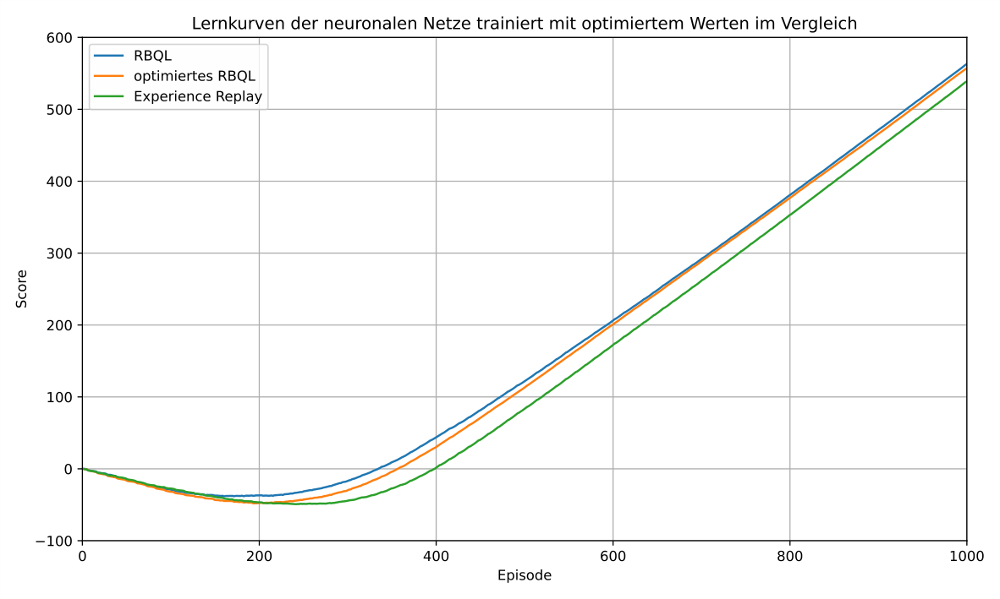
**Abbildung 6.16:** Durchschnittlicher Lernverlauf des neuronalen Netzes mit optimalen Werten trainiert über 100 Durchläufe und je 1000 Episoden

In Abbildung 6.16 sind die Lernkurven der neuronalen Netze, trainiert mit RBQL, optimiertem RBQL und Experience Replay, zu sehen. Dabei fällt auf, dass sowohl RBQL als auch die optimierte Version des RBQL etwas früher zu steigen beginnen als Experience Replay Q-Learning. Dabei steigt zuerst die Lernkurve des mit RBQL trainierten neuronalen Netzes. Die Lernkurve mit dem optimierten RBQL trainierten neuronalen Netz sinkt etwas mehr ins Negative und beginnt etwas später erst zu steigen, steigt dann aber mit einer steileren Steigung, als das mit RBQL trainierte Netz. Nach 1000 Episoden hat dennoch die Lernkurve des mit RBQL trainierten Netzes einen höheren Score als die des optimierten RBQL. Die Lernkurve des mit Experience Replay trainierten neuronalen Netzes sinkt am längsten ins Negative, steigt dann aber relativ steil. Nach 1000 Episoden ist die Lernkurve dennoch unterhalb der anderen beiden Kurven.

Daraus lässt sich schließen, dass RBQL und das optimierte RBQL vor allem in den ersten Episoden effektiver als Experience Replay im Training eines neuronalen Netzes sind. Das optimierte RBQL ist, wie auch anhand der Fehler insgesamt über 10000 Episoden zu sehen, auch über eine größere Anzahl an Episoden effektiv im Training eines neuronalen Netzes und begeht weniger Fehler als ein mit Experience Replay trainiertes Netz.

Das Ergebnis dieses Vergleiches zeigt, dass RBQL etwa genauso effektiv ist, wie Experience Replay im Training eines neuronalen Netzes. Mit der optimierten Variante des RBQL erhält man sogar noch bessere Ergebnisse mit weniger Fehlern über 10000 Episoden.

---

<!-- Page 52 -->

### 6.5.7 Training des neuronalen Netztes bei großem Spielfeld

Das Training des neuronalen Netzes bei Benutzung des großen Spielfeldes benötigt deutlich mehr Zeit als bei der Nutzung des kleinen Spielfeldes. Dennoch soll hier ein Blick darauf geworfen werden, wie sich eine Vergrößerung des Zustandsraumes auf das Lernergebnis auswirkt. 

Tabelle 6.18 zeigt die Anzahl der Fehler, die das neuronale Netz beim Training mit den verschiedenen Algorithmen begeht. Beim Training des neuronalen Netzes kamen die in Tabelle 6.16 dargestellten Parameter zum Einsatz. Wie zu erkennen, begehen alle Algorithmen durch den größeren Zustandsraum mehr Fehler als bei einem kleinen Spielfeld. Das liegt daran, dass das neuronale Netz für deutlich mehr Zustände lernen muss, welche Aktion optimal ist, um den Ball in der Luft zu halten. 

Mit 3873 Fehlern tritt bei RBQL über 10000 Episoden am meisten Fehler auf. Bei Experience Replay treten über 10000 Episoden hingegen nur 2821 Fehler auf. Der Agent hat den Ball also in diesem Zeitraum etwa 1000-mal öfter getroffen als bei RBQL. Am besten schneidet die optimierte Variante des RBQL ab. Über 10000 Episoden treten dabei 2436 Fehler auf. Die im Vergleich schlechtere Leistung von RBQL im größeren Spielfeld könnte auf eine suboptimale Wahl der Lernrate, Netzarchitektur oder Epsilonverkleinerung zurückzuführen sein, was darauf hindeutet, dass die für das kleinere Spielfeld abgestimmten Parameter nicht ohne Anpassung auf das größere übertragbar sind. 

|**Algorithmus|Fehler**|
|---|---|
|RBQL|3873|
|optimiertes RBQL|2436|
|Experience Replay|2821|

**Tabelle 6.18:** Durchschnittliche Anzahl Fehler des neuronalen Netztes bei großem Spielfeld über 100 Durchläufe und je 10000 Episoden

In Abbildung 6.17 sind die Lernkurven der drei Agenten dargestellt. Die Lernkurve des mit der optimierten Variante des RBQL trainierten Netzes beginnt am schnellsten zu steigen und hat nach 10000 Episoden den höchsten Score. Schon nach etwa 1000 Episoden hat die Lernkurve das Minimum erreicht. Der Lernverlauf des Netzes mit Experience Replay Training sinkt noch etwas weiter ins Negative und beginnt erst nach knapp 2000 Episoden zu steigen. Mit RBQL steigt die in den ersten 2000 Episoden ähnlich schnell an, wie mit der optimierten Variante des RBQL. Allerdings flacht die Steigung im weiteren Verlauf sogar ab. Das könnte darauf hindeuten, dass das neuronale Netz eventuell nicht groß genug ist, um das Ping Pong Spiel auf dem großen Spielfeld zu erlernen. Auch die Lernrate und 

---

<!-- Page 53 -->

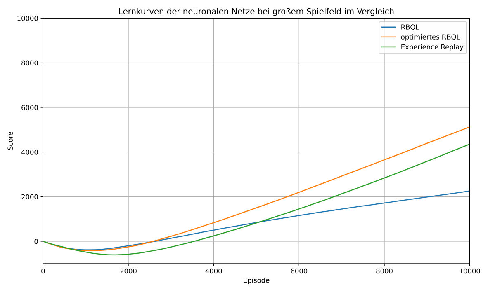
**Abbildung 6.17:** Durchschnittlicher Lernverlauf des neuronalen Netzes bei großem Spielfeld über 100 Durchläufe und je 10000 Episoden

die Verkleinerungsrate von Epsilon können auf den Lernverlauf einen erheblichen Einfluss haben.

---

<!-- Page 54 -->

# Kapitel 7: Fazit und Ausblick

## 7.1 Zusammenfassung der Erkenntnisse

Ziel der Arbeit ist es, RBQL im Kontext eines deterministischen Ping Pong Spiels einzusetzen, mit anderen bestehenden Q-Learning Algorithmen zu vergleichen und damit ein neuronales Netz zu trainieren. Gezeigt werden soll dabei auch, ob RBQL effizienter ist als klassische Q-Learning Agenten, vor allem auch im Hinblick auf das Trainieren eines neuronalen Netzes. 

Die zuerst getesteten Q-Learning Agenten auf einem kleinen Spielfeld zeigen schon, dass RBQL weniger Fehler begeht und eine steilere Lernkurve hat als Experience Replay oder das klassische Q-Learning. Weitere Tests bei vergrößertem Spielfeld bestätigen dieses erste Ergebnis und es wird dabei auch gezeigt, dass RBQL weniger Schwankungen zwischen guten und schlechten Durchläufen hat als Experience Replay oder das klassische Q-Learning. Anschließend wird eine mögliche Verbesserung des RBQL getestet, wodurch doppelte Bewertungen von Zuständen vermieden werden. Dies reduziert zwar die Fehler minimal, der wesentliche Vorteil der optimierten Version liegt aber darin, dass sie deutlich weniger Zeit benötigt, um ausgeführt zu werden. Somit benötigt die optimierte Version auch deutlich weniger Rechenleistung. Daraufhin wurde noch getestet, ob RBQL auch in einer nichtdeterministischen Umgebung lernen kann. Dazu wird die Geschwindigkeit des Balles zufällig mit einer geringen Wahrscheinlichkeit verändert. Allerdings hat sich dabei herausgestellt, dass RBQL abhängig von der Höhe der Wahrscheinlichkeit der Geschwindigkeitsänderung entweder nur sehr schlecht oder nicht lernt. Abschließend wurden die Agenten RBQL, die optimierte Variante des RBQL und Experience Replay genutzt, um ein einfaches neuronales Netz zu trainieren. Dazu wurden die Auswirkungen der Aktivierungsfunktion, verschiedener Größen der versteckten Schicht, verschiedener Verringerungsraten Epsilons und der Lernrate auf das Lernergebnis untersucht. Dabei stellt sich heraus, dass dieses neuronale Netz mit ReLU als Aktivierungsfunktion nicht lernt und ein Großteil der Neuronen „absterben“. Bei der Untersuchung der einzelnen Parameter, wie Größe der versteckten Schicht, Lernrate und Verringerung von Epsilon, wird für jeden 

---

<!-- Page 55 -->

Agenten ein Wert gefunden, bei dem das Netz am besten trainiert wurde. Bei der abschließenden Zusammenführung dieser Parameter zeigt sich, dass die optimierte Version des RBQL am besten abschneidet und die wenigsten Fehler begeht. Experience Replay und RBQL scheiden bei den Fehlern in etwa gleich ab. Das zeigt auch, dass RBQL durchaus effektiv zum Trainieren eines neuronalen Netzes genutzt werden kann. Auch auf dem großen Spielfeld lässt sich das neuronale Netz mit der optimierten Variante von RBQL erfolgreich trainieren. Die ursprüngliche RBQL-Variante hingegen kann das Netz unter denselben Bedingungen nicht effektiv trainieren. Die Ursache scheint dabei weniger im Trainingsalgorithmus zu liegen, sondern vielmehr in den gewählten Parametern. 

Zusammenfassend kann festgestellt werden, dass RBQL effektiv zum Trainieren eines neuronalen Netzes genutzt werden kann. Die optimierte Variante des RBQL, welche im Laufe dieser Arbeit vorgestellt wird, zeigt die besten Ergebnisse. RBQL ist in etwa genauso effektiv und begeht in etwa gleich viele Fehler wie Experience Replay. 

## 7.2 Ausblick

Zukünftige Arbeiten könnten untersuchen, wie für RBQL die Parameter des neuronalen Netzes angepasst werden können, damit ein neuronales Netz auch einen großen Zustandsraum effektiv erlernen kann. Denkbar wäre auch ein Vergleich mit weiteren Trainingsmethoden eines neuronalen Netzes, wie Deep Q-Learning für tiefe neuronale Netze. Darüber hinaus könnten zukünftige Arbeiten die Effizienz im Hinblick auf die Trainingszeit, die Rechenleistung und den Speicherverbrauch analysieren und mit anderen Verfahren wie Experience Replay vergleichen. 

Eine weiterer möglicher Ansatz wäre, RBQL noch weiter in nichtdeterministischen Umgebungen zu untersuchen und die in dem _Recursive Backwards Q-Learning in Deterministic Environments_ vorgeschlagene Anpassung an die Lernfunktion vorzunehmen. 

Langfristig könnte auch der Einsatz von RBQL im Kontext großer Sprachmodelle untersucht werden. Da sich Sprachmodelle bei einer Temperatur von null deterministisch verhalten, ist eine Anwendung von RBQL denkbar. Dies könnte in Zusammenhang mit nichtdeterministischen Umgebungen untersucht werden, wenn die Temperatur des Sprachmodells nicht auf null festgesetzt ist. 

Auch ein Einsatz von RBQL in komplexeren Umgebungen scheint vielversprechend. Zum Beispiel könnte RBQL in der Robotik eingesetzt werden, beispielsweise bei Navigationsaufgaben, wie bei einem Roboter, der ein Labyrinth verlassen muss oder sich selbstständig in industriellen Umgebungen bewegen muss. 

---

<!-- Page 56 -->

**Abkürzungsverzeichnis**

| Abbreviation | Definition |
|---|---|
| AHC | Adaptive Heuristic Critic |
| DQN | Deep Q-Network |
| DRL | Deep Reinforcement Learning |
| LLM | Large Language Model |
| RBQL | Recursive Backwards Q-Learning |

---

<!-- Page 57 -->

**Abbildungsverzeichnis**

| 5.1 | Beispielhafter Zustandsbaum des RBQL-Algorithmus. Jeder Knoten stellt einen möglichen Zustand des Agenten dar, Kanten zeigen die möglichen Aktionen und die daraus resultierenden Zustände. Die rote Farbmarkierung kennzeichnet in einer Episode neu erkundete Bereiche des Baums | 19 |
| 6.1 | Vergleich der durchschnittlichen Lernkurven von Q-Learning, Experience Replay Q-Learning und RBQL über 100 Durchläufe mit jeweils 500 Episoden. Die x-Achse zeigt die Episodenanzahl, die y-Achse den durchschnittlichen Score. RBQL erreicht deutlich höhere Werte in kürzerer Zeit | 27 |
| 6.2 | Durchschnittlicher Lernverlauf des RBQL über 100 Durchläufe mit jeweils 2000 Episoden. X-Achse: Episodenanzahl; Y-Achse: durchschnittlicher Score. Der Score steigt stetig an und stabilisiert sich nach ca. 1500 Episoden | 29 |
| 6.3 | Durchschnittlicher Lernverlauf des Experience Replay Q-Learning über 100 Durchläufe mit jeweils 2000 Episoden. Im Vergleich zu RBQL zeigt sich ein langsamerer Anstieg und eine geringere Endleistung | 30 |
| 6.4 | Durchschnittlicher Lernverlauf des klassischen Q-Learning über 100 Durchläufe mit jeweils 2000 Episoden. Die Lernkurve bleibt deutlich unter den Werten der anderen beiden Ansätze | 30 |
| 6.5 | Durchschnittlicher Lernverlauf des klassischen Q-Learning über 100 Durchläufe mit jeweils 2500 Episoden. Die Lernkurve beginnt erst deutlich später zu steigen, als die der anderen beiden Ansätze | 31 |
| 6.6 | Durchschnittlicher Lernverlauf des RBQL-Agenten in einer nichtdeterministischen Umgebung (kleines Spielfeld) über 100 Durchläufe mit jeweils 1000 Episoden. Die x-Achse zeigt die Episodenanzahl, die y-Achse den durchschnittlich erzielten Score. Trotz schwankender Umweltbedingungen sinkt die Lernkurve nicht stark ins Negative, steigt jedoch nur langsam an und erreicht am Ende etwa 124 Punkte | 33 |

---

<!-- Page 58 -->

| 6.7 | Durchschnittlicher Lernverlauf des RBQL-Agenten in einer nichtdeterministischen Umgebung (kleines Spielfeld) über 100 Durchläufe mit jeweils 10000 Episoden. Aufgrund der sich ständig verändernden optimalen Zustände durch Wind erreicht die Lernkurve auch nach langer Trainingszeit nicht die Steigung einer deterministischen Umgebung und bleibt unter dem theoretisch möglichen Maximum | 34 |
| 6.8 | Durchschnittlicher Lernverlauf eines neuronalen Netzes mit drei Schichten (versteckte Schicht: 128 Neuronen) über 100 Durchläufe mit jeweils 3000 Episoden. Verglichen werden drei Trainingsmethoden: RBQL (blau), optimiertes RBQL (orange) und Experience Replay Q-Learning (grün) | 36 |
| 6.9 | Durchschnittlicher Lernverlauf des neuronalen Netzes mit RBQL bei Verwendung unterschiedlicher Aktivierungsfunktionen (ReLU - blau, Leaky ReLU - orange). Gezeigt sind die Ergebnisse über 100 Durchläufe mit jeweils 1000 Episoden | 37 |
| 6.10 | Durchschnittlicher Lernverlauf des neuronalen Netzes mit RBQL bei unterschiedlichen Größen der versteckten Schicht. Gezeigt werden Ergebnisse über 100 Durchläufe mit jeweils 3000 Episoden. Größere Schichten ermöglichen eine höhere Modellkapazität und führen tendenziell zu schnelleren und stabileren Lernverläufen, erfordern jedoch mehr Zeit für die Ausführung des Trainings | 39 |
| 6.11 | Durchschnittlicher Lernverlauf des nueronalen Netzes mit RBQL bei verschiedenen Verkleinerungsraten von Epsilon über 100 Durchläufe und je 500 Episoden | 43 |
| 6.12 | Durchschnittlicher Lernverlauf des neuronalen Netzes mit der optimierten Variante des RBQL bei verschiedenen Verkleinerungsraten von Epsilon über 100 Durchläufe und je 500 Episoden | 44 |
| 6.13 | Durchschnittlicher Lernverlauf des neuronalen Netzes trainiert mit RBQL bei verschiedenen Lernraten über 100 Durchläufe und je 600 Episoden | 46 |
| 6.14 | Durchschnittlicher Lernverlauf des neuronalen Netzes trainiert mit der optimierten Variante des RBQL bei verschiedenen Lernraten über 100 Durchläufe und je 600 Episoden | 47 |
| 6.15 | Durchschnittlicher Lernverlauf des neuronalen Netzes trainiert mit Experience Replay bei verschiedenen Lernraten über 100 Durchläufe und je 600 Episoden | 48 |
| 6.16 | Durchschnittlicher Lernverlauf des neuronalen Netzes mit optimalen Werten trainiert über 100 Durchläufe und je 1000 Episoden | 51 |

---

<!-- Page 59 -->

| 6.17 | Durchschnittlicher Lernverlauf des neuronalen Netzes bei großem Spielfeld über 100 Durchläufe und je 10000 Episoden | 53 |

---

<!-- Page 60 -->

**Tabellenverzeichnis**

| 6.1 | Vergleich von RBQL, Experience Replay und Q-Learning hinsichtlich durchschnittlicher Fehler und Lernschritte bis zur Fehlerfreiheit über 4000 Episoden gerundet auf die nächste volle Zahl | 26 |
| 6.2 | Vergleich von RBQL, Experience Replay und Q-Learning hinsichtlich durchschnittlicher Fehler und Lernschritte bis zur Fehlerfreiheit über 10000 Episoden gerundet auf die nächste volle Zahl | 28 |
| 6.3 | Vergleich von RBQL und der optimierten Version des RBQL hinsichtlich durchschnittlicher Fehler und Lernschritte bis zur Fehlerfreiheit über 2000 Episoden und der benötigten Zeit für 100 Durchläufe gerundet auf die nächste volle Zahl | 31 |
| 6.4 | Score nach unterschiedlicher Anzahl an Schritten bei verschiedenen verschiedenen Wahrscheinlichkeiten zur Geschwindigkeitsänderung | 35 |
| 6.5 | Vergleich von RBQL und der optimierten Version des RBQL hinsichtlich der begangen Fehler beim Trainieren eines neuronalen Netzes mit einer Größe der versteckten Schicht von 64, 128, 256 und 512 Neuronen über 10000 Episoden | 38 |
| 6.6 | Vergleich von RBQL und der optimierten Version des RBQL und Experience Replay Q-Learning beim Trainieren eines neuronalen Netzes mit einer Größe der Versteckten Schicht von 128 Neuronen und Verkleinerung von Epsilon um 1 / 400 über 10000 Episoden | 41 |
| 6.7 | Vergleich von RBQL und der optimierten Version des RBQL und Experience Replay Q-Learning beim Trainieren eines neuronalen Netzes mit einer Größe der Versteckten Schicht von 128 Neuronen und Verkleinerung von Epsilon um 1 / 800 über 10000 Episoden | 41 |
| 6.8 | Vergleich von RBQL und der optimierten Version des RBQL und Experience Replay Q-Learning beim Trainieren eines neuronalen Netzes mit einer Größe der Versteckten Schicht von 128 Neuronen und Verkleinerung von Epsilon um 1 / 1600 über 10000 Episoden | 41 |

---

<!-- Page 61 -->

| 6.9 | Vergleich von RBQL und der optimierten Version des RBQL und Experience Replay Q-Learning beim Trainieren eines neuronalen Netzes mit einer Größe der Versteckten Schicht von 128 Neuronen und Verkleinerung von Epsilon um1/3200über 10000 Episoden | 42 |
|---|---|---|
| 6.10 | Vergleich von RBQL und der optimierten Version des RBQL und Experience Replay Q-Learning beim Trainieren eines neuronalen Netzes mit einer Größe der Versteckten Schicht von 128 Neuronen und Verkleinerung von Epsilon um1/10000über 10000 Episoden | 42 |
| 6.11 | Fehleranzahl eines neuronalen Netzes beim Training mit RBQL bei verschiedenen Lernraten über 10000 Episoden<br> | 45 |
| 6.12 | Fehleranzahl beim Training mit optimiertem RBQL bei verschiedenen Lernraten über 10000 Episoden | 45 |
| 6.13 | Fehleranzahl beim Training mit Experience Replay bei verschiedenen Lernraten über 10000 Episoden | 45 |
| 6.14 | Vergleich von RBQL und der optimierten Version des RBQL beim Trainieren eines neuronalen Netzes mit einer Größe der Versteckten Schicht von 128 Neuronen und Verkleinerung von Epsilon um 1/400 mit einer Aktionsauswahl durch RBQL während der ersten Episoden über 10000 Episoden<br> | 49 |
| 6.15 | Vergleich von RBQL und der optimierten Version des RBQL beim Trainieren eines neuronalen Netzes mit einer Größe der Versteckten Schicht von 256 Neuronen und Verkleinerung von Epsilon um 1/400 mit einer Aktionsauswahl durch RBQL während der ersten Episoden über 10000 Episoden<br> | 49 |
| 6.16 | Optimale Parameter für das Training des neuronalen Netzes mit RBQL, optimiertem RBQL und Experience Replay<br> | 50 |
| 6.17 | Durchschnittliche Anzahl Fehler des neuronalen Netztes beim Training mit den jeweiligen optimalen Parametern über 100 Durchläufe und je 10000 Episoden<br> | 50 |
| 6.18 | Durchschnittliche Anzahl Fehler des neuronalen Netztes bei großem Spielfeld über 100 Durchläufe und je 10000 Episoden | 52 |

---

<!-- Page 62 -->

**Quellcodeverzeichnis**

|5.1| Methode getState [8, S. 284] |15|
|---|---|---|
|5.2| Methode getAction [8, S. 283] |15|
|5.3| Methode updateQ bei Q-Learning mit Experience Replay [8, S. 283] |16|
|5.4| Methode updateQ bei Q-Learning ohne Experience Replay |16|
|5.5| Methode rbql_update |18|
| 5.6 | Berechnung der Anzahl der States bei Verdopplung der Größe des Spielfeldes<br> | 18 |
|5.7| Methode getState nach Verdopplung der Spielfeldgröße |18|
|5.8| Optimierte RBQL update Methode |20|
|5.9| Geschwindigkeitsanpassung für die nicht deterministische Umgebung<br> |21|
|5.10| Für nicht deterministische Umgebung angepasste getState Funktion |22|
|5.11| Konstruktor zur Erzeugung des neuronalen Netzes |22|
|5.12| Aktivierungsfunktion und Ableitung der Aktivierungsfunktion |22|
|5.13| Aktivierungsfunktion und Ableitung der Aktivierungsfunktion |23|
|5.14| Methode foreward zur Aktivierung des neuronalen Netzes |23|
|5.15| Methode train zum Trainieren des neuronalen Netzes |24|
|5.16| Erstellung einer Instanz der Klasse NeuralNet |24|
|5.17| Verkleinerung der Eingabewerte auf Bereich zwischen null und eins |25|
|5.18| Vorwärtsaktivierung des neuronalen Netzes |25|
|5.19| Auswahl von Aktion und Zielaktion<br> |25|
|5.20| Trainieren des neuronalen Netz mit der Methode train |25|

---

<!-- Page 63 -->

## Literatur

- [1] A.E. Karnga. „Neural networks“. In: _IJCNN’99. International Joint Conference on Neural Networks. Proceedings (Cat. No.99CH36339)_ . Bd. 6. 1999, 4419–4421 vol.6. doi: 10.1109/IJCNN.1999.830881 . 

- [2] W.T. Illingworth. „Beginner’s guide to neural networks“. In: _IEEE Aerospace and Electronic Systems Magazine_ 4.9 (1989), S. 44–49. doi: 10.1109/62.35668 . 

- [3] Wolfgang Ertel. „Neuronale Netze“. In: _Grundkurs Künstliche Intelligenz: Eine praxisorientierte Einführung_ . Wiesbaden: Springer Fachmedien Wiesbaden, 2025, S. 287–365. isbn: 978-3-658-44955-1. doi: 10.1007/978-3-658-44955-1_9 . url: https://doi.org/10.1007/978-3-658-44955-1_9 . 

- [4] Jan Diekhoff und Jörn Fischer. _Recursive Backwards Q-Learning in Deterministic Environments_ . 2024. arXiv: 2404.15822 [cs.AI] . url: https://arxiv.org/ abs/2404.15822 . 

- [5] Emma Strubell, Ananya Ganesh und Andrew McCallum. „Energy and Policy Considerations for Deep Learning in NLP“. In: _Proceedings of the 57th Annual Meeting of the Association for Computational Linguistics_ . Association for Computational Linguistics, 2019, S. 3645–3650. doi: 10.18653/v1/P19-1355 . url: https: //arxiv.org/abs/1906.02243 . 

- [6] R.S. Sutton und A.G. Barto. „Reinforcement Learning: An Introduction“. In: _IEEE Transactions on Neural Networks_ 9.5 (1998), S. 1054–1054. doi: 10.1109/TNN.1 998.712192 . 

- [7] Jingkai Jia und Wenlin Wang. „Review of reinforcement learning research“. In: _2020 35th Youth Academic Annual Conference of Chinese Association of Automation (YAC)_ . 2020, S. 186–191. doi: 10.1109/YAC51587.2020.9337653 . 

- [8] Jörn Fischer. _Maschinelles Lernen für Dummies®: Maschinelles Lernen richtig verstehen : GPT-Sprachmodell, Deep Learning, neuronales Q-Learning - alles selbst programmieren : viele Code-Beispiele zu allen behandelten Themen_ . 1. Aufl. Fachkorrektur von Prof. Dr. Kai Eckert und Prof. Dr. Ivo Wolf. Weinheim: Wiley-VCH, 2024. isbn: 9783527720552. url: http://www.wiley-vch.de/publish/dt/ books/ISBN978-3-527-72055-2/ . 

---

<!-- Page 64 -->

- [9] Christopher J. C. H. Watkins und Peter Dayan. „Q-learning“. In: _Machine Learning_ 8.3 (1. Mai 1992), S. 279–292. issn: 1573-0565. doi: 10.1007/BF00992698 . url: https://doi.org/10.1007/BF00992698 . 

- [10] D. Lee. „Comparison of Reinforcement Learning Activation Functions to Improve the Performance of the Racing Game Learning Agent“. In: _Journal of Information Processing Systems_ 16.5 (2020), S. 1074–1082. doi: 10.3745/JIPS.02.0141 . 

- [11] Lu Lu Lu Lu, Yeonjong Shin Yeonjong Shin, Yanhui Su Yanhui Su und George Em Karniadakis George Em Karniadakis. „Dying ReLU and Initialization: Theory and Numerical Examples“. In: _Communications in Computational Physics_ 28.5 (Jan. 2020), S. 1671–1706. issn: 1815-2406. doi: 10.4208/cicp.oa-2020-0165 . url: http://dx.doi.org/10.4208/cicp.OA-2020-0165 . 

- [12] David E. Rumelhart, Geoffrey E. Hinton und Ronald J. Williams. „Learning representations by back-propagating errors“. In: _Nature_ 323.6088 (1986), S. 533–536. issn: 1476-4687. doi: 10.1038/323533a0 . url: https://doi.org/10.1038/3 23533a0 . 

- [13] RICHARD BELLMAN. „A Markovian Decision Process“. In: _Journal of Mathematics and Mechanics_ 6.5 (1957), S. 679–684. issn: 00959057, 19435274. url: http://www.jstor.org/stable/24900506 (besucht am 22. 07. 2025). 

- [14] Long-Ji Lin. „Self-improving reactive agents based on reinforcement learning, planning and teaching“. In: _Machine Learning_ 8 (1992), S. 293–321. doi: 10.1007/BF0 0992699 . 

- [15] Volodymyr Mnih, Koray Kavukcuoglu, David Silver, Andrei A. Rusu, Joel Veness, Marc G. Bellemare, Alex Graves, Martin Riedmiller, Andreas K. Fidjeland, Georg Ostrovski, Stig Petersen, Charles Beattie, Amir Sadik, Ioannis Antonoglou, Helen King, Dharshan Kumaran, Daan Wierstra, Shane Legg und Demis Hassabis. „Human-level control through deep reinforcement learning“. In: _Nature_ 518.7540 (2015), S. 529–533. doi: 10.1038/nature14236 . 

- [16] B Ravi Kiran, Ibrahim Sobh, Victor Talpaert, Patrick Mannion, Ahmad A. Al Sallab, Senthil Yogamani und Patrick Pérez. „Deep Reinforcement Learning for Autonomous Driving: A Survey“. In: _IEEE Transactions on Intelligent Transportation Systems_ 23.6 (2022), S. 4909–4926. doi: 10.1109/TITS.2021.3054625 . 

- [17] Kaiming He, Xiangyu Zhang, Shaoqing Ren und Jian Sun. „Delving Deep into Rectifiers: Surpassing Human-Level Performance on ImageNet Classification“. In: _2015 IEEE International Conference on Computer Vision (ICCV)_ . 2015, S. 1026– 1034. doi: 10.1109/ICCV.2015.123 . 

---

<!-- Page 65 -->

- [18] Vincent François-Lavet, Peter Henderson, Riashat Islam, Marc G. Bellemare und Joelle Pineau. „An Introduction to Deep Reinforcement Learning“. In: _Foundations and Trends® in Machine Learning_ 11.3–4 (2018), S. 219–354. issn: 1935-8245. doi: 10.1561/2200000071 . url: http://dx.doi.org/10.1561/2200000071 .
